# 免责声明

**鉴于ALSA框架代码量实在是太大和受限于本人个人精力和实力，本文所讲内容需要以辩证的眼光来看（可以保证绝大部分内容或思路是正确），如有问题请后续人员指出并指正。**

**本文旨在以内核研发的角度详细介绍一下ALSA框架并不是写音频驱动，个人觉得内容还是蛮详细的且对新手异常的友好，就算跳着读也应该能看懂。**

**由于本人不喜欢画图，所有的图片皆是来自文档或者书上，或者是用文字组成的流程图**。

**所有代码均来自uos-4.19、uos-6.6内核，参考文章有：内核文档、Linux设备驱动开发、51CTO、CSDN、HDA规范、USB中文网-UAC规范以及Chatgpt（狗头）**

# 一、前言

ALSA表示高级Linux声音体系结构(Advanced Linux Sound Architecture)。它由一系列内核驱动，应用程序编译接口(API)以及支持Linux下声音的实用程序组成。

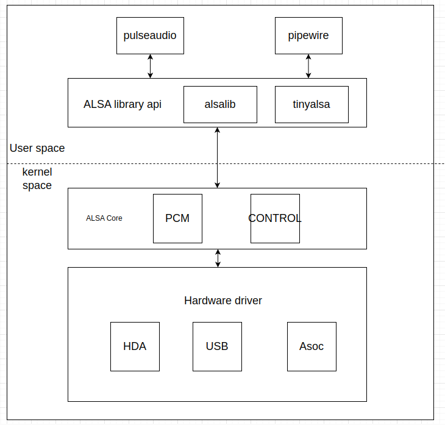

从上图可以看出ALSA分三层，按照调用关系一次是application、alsa-lib、kernel-driver。

​    **ALSA Library API：**

​        alsa 用户库接口，常见有 tinyalsa、alsa-lib。

​    **ALSA CORE：**

​        Alsa核心层，向上提供逻辑设备（PCM、CTL、MIDI、TIMER…）系统调用，向下驱动硬件设备。

​    **Hardware driver：**

​        主要分为三大类，标准HDA、USB Audio、Asoc

## 1.1 ALSA设备文件结构

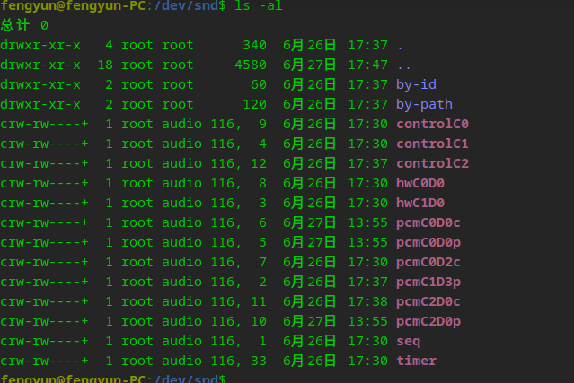

```
controCX ------>             用于声卡的控制，例如通道选择，混音，麦克风的控制等。
pcmCXDXc ------>              用于录音的pcm设备
pcmCXDXp ------>              用于播放的pcm设备
seq ------>                   音序器
timer ------>                 定时器
```

其中，C0D0代表的是声卡0中的设备0，pcmC0D0c最后一个c代表capture，pcmC0D0p最后一个p代表playback，这些都是alsa-driver中的命名规则。根据声卡的实际能力，驱动实际上可以挂上更多种类的设备，在include/sound/core.h中，定义了以下设备类型：

```
enum snd_device_type {
	SNDRV_DEV_LOWLEVEL,
	SNDRV_DEV_INFO,
	SNDRV_DEV_BUS,
	SNDRV_DEV_CODEC,
	SNDRV_DEV_PCM,
	SNDRV_DEV_COMPRESS,
	SNDRV_DEV_RAWMIDI,
	SNDRV_DEV_TIMER,
	SNDRV_DEV_SEQUENCER,
	SNDRV_DEV_HWDEP,
	SNDRV_DEV_JACK,
	SNDRV_DEV_CONTROL,	/* NOTE: this must be the last one */
};
```

​    通常，我们更关心的是pcm和control这两种设备。

# 二、pcm 和 control

**pcm和control是ALSA框架中的核心层，相关代码在`sound/core/`目录下**

## 2.1 pcm

PCM是英文Pulse-code modulation的缩写，中文译名是脉冲编码调制。我们知道在现实生活中，人耳听到的声音是模拟信号，PCM就是要把声音从模拟转换成数字信号的一种技术，他的原理简单地说就是利用一个固定的频率对模拟信号进行采样，采样后的信号在波形上看就像一串连续的幅值不一的脉冲，把这些脉冲的幅值按一定的精度进行量化，这些量化后的数值被连续地输出、传输、处理或记录到存储介质中，所有这些组成了数字音频的产生过程。

PCM信号的两个重要指标是采样频率和量化精度，目前，CD音频的采样频率通常为44100Hz，量化精度是16bit。通常，播放音乐时，应用程序从存储介质中读取音频数据（MP3、WMA、AAC......），经过解码后，最终送到音频驱动程序中的就是PCM数据，反过来，在录音时，音频驱动不停地把采样所得的PCM数据送回给应用程序，由应用程序完成压缩、存储等任务。所以，音频驱动的两大核心任务就是：

- playback    如何把用户空间的应用程序发过来的PCM数据，转化为人耳可以辨别的模拟音频
- capture     把mic拾取到得模拟信号，经过采样、量化，转换为PCM信号送回给用户空间的应用程序

一个声卡最多可以有多少个pcm实例呢？

```
#if defined(CONFIG_SND_DYNAMIC_MINORS)
#define SNDRV_PCM_DEVICES	(SNDRV_OS_MINORS-2)          //SNDRV_OS_MINORS=256
#else
#define SNDRV_PCM_DEVICES	8
#endif
```

每个pcm实例对应一个pcm设备文件。一个pcm实例最多由一个**playback stream**和一个**capture stream**组成(可以只存在一个)，这两个stream又分别有一个或多个**substreams**组成。

对于大多数声卡来说，即使有多个pcm实例，一般也就一个被使用。一个**playback stream**或**capture stream**只有一个**substream**。

首先介绍一下必须要知道的参数以及相关关系

- **sample**

​		样本长度，音频数据的基本单位

- **bit_width**

​		位宽，存储一个样本所用的二进制位数

- **channel**

  声道数，mono代表单声道，立体声是双声道

- **frame**

  帧，frame = sample*channel

- **rate**

  sample rate,采样率，每秒采样次数

- **interleaved**

交错模式，数据的排列方式，左声道右声道交错排列。一般都是用这种排列方式。

- **period_size**

周期，每次硬件中断处理音频数据的帧数

- **buffer_size**

  数据缓冲区大小，在**pcm**中特指**runtime**总的**buffer_size**

  **buffer是一个环形buffer，大小一般来说比一个period size大，一般设做 2 \* period size，但是一些硬件可以支持到8个周期大小的buffer，也可以设为非整数倍的period的大小。**

**相互转换关系**

```
bsp_rate = rate * sample * channel                        //数据速率

buffer_size = period_size * periods                       //periods是周期数

period_bytes = period_size * bytes_per_frame               

bytes_per_frame = channels * bytes_per_sample
```

> 假设我们将要使用一个立体声 16位 44.1k的音频流，播放流，那么我们就有:
>
> 立体声 = 2通道
> 1个样本长度 16bits = 2bytes
>  1帧 = （通道数） * （样本大小bytes） = 2 * 2 = 4bytes
> 为了能支持2 * 44.1k的采样率（一秒钟的采样frams），系统必须支持如下的速度
>
> bsp_rate =  2 * 2 * 44.1k = 176400bytes/s
> 现在 ALSA每秒都中断。那么我们每秒都需要176400byte数据准备好，才能供上一个 双通道 16 位 44.1k的音频流。
>
> 如果半秒中断一次，那么每次中断就是 176400 / 2 = 88200 bytes
> 如果100ms中断一次，那么我们就需要 176400 * 0.1 = 17640 bytes

我们可以通过设置period size 来控制pcm中断的产生。 如果我们设置一个16位双通道44.1k的音频流 并且每次都有44100帧数据 => 4 byte * 44100 frames = 176400字节 => 一次中断会需要176400字节的数据 => 那么他就是100ms中断一次。

ALSA会自己根据runtime时的信息定义实际的buffer_size 和period_size，这取决于：channel数、速率和采样分辨率以及**struct snd_pcm_hardware**中设置的参数。

### 2.1.1 内存管理

#### 2.1.1.1 预分配内存流程

预分配内存是指在音频设备第一次被访问之前（比如设备加载时或系统初始化时）预先分配内存。提前分配好可用的 DMA 区，可以在真正开始 `hw_params()` 设置或 `prepare()` 前就把内存准备好，从而减少启动播放的延迟。

**实际上UOS默认是不预分配内存的，在日常使用中也并没有感觉到有什么不好的。**


在标准**HDA**中，**snd_hda_attach_pcm_stream**为指定的编解码器（codec）初始化和附加一个 PCM音频流，并预分配一段内存。下面以6.6内核代码作为例子(4.19内核函数跳来跳去，没有6.6直观)

```
#define MAX_PREALLOC_SIZE	(32 * 1024 * 1024)                 //最大预分配内存

int snd_hda_attach_pcm_stream(struct hda_bus *_bus, struct hda_codec *codec,
			      struct hda_pcm *cpcm)
{
	......................
	......................
	int type = SNDRV_DMA_TYPE_DEV_SG;                        //类型

	......................
	......................
	......................
	err = snd_pcm_new(chip->card, cpcm->name, pcm_dev,
			  cpcm->stream[SNDRV_PCM_STREAM_PLAYBACK].substreams,
			  cpcm->stream[SNDRV_PCM_STREAM_CAPTURE].substreams,
			  &pcm);                                          //创建PCM实例
	if (err < 0)
		return err;
	strscpy(pcm->name, cpcm->name, sizeof(pcm->name));
	apcm = kzalloc(sizeof(*apcm), GFP_KERNEL);
	if (apcm == NULL) {
		snd_device_free(chip->card, pcm);
		return -ENOMEM;
	}
	..................
	..................
	..................
	/* buffer pre-allocation */
	size = CONFIG_SND_HDA_PREALLOC_SIZE * 1024;                            //CONFIG_SND_HDA_PREALLOC_SIZE在uos上为0
	if (size > MAX_PREALLOC_SIZE)
		size = MAX_PREALLOC_SIZE;
	if (chip->uc_buffer)
		type = SNDRV_DMA_TYPE_DEV_WC_SG;
	snd_pcm_set_managed_buffer_all(pcm, type, chip->card->dev,                  //托管缓冲区分配模式，在HDA中最大为32*1024*1024字节
				       size, MAX_PREALLOC_SIZE);								
	return 0;
}
```

**snd_pcm_set_managed_buffer_all**函数直接调用**preallocate_pages_for_all**函数。该函数取代了4.19中`snd_pcm_lib_preallocate_pages_for_all`函数增加了托管模式（在hw_params操作前自动分配缓冲区，在hw_free操作后自动释放缓冲区，驱动程序无需显式处理缓冲区的分配和释放）。

```
int snd_pcm_set_managed_buffer_all(struct snd_pcm *pcm, int type,
				   struct device *data,
				   size_t size, size_t max)
{
	return preallocate_pages_for_all(pcm, type, data, size, max, true);
}
```

```
static int preallocate_pages_for_all(struct snd_pcm *pcm, int type,
				      void *data, size_t size, size_t max,
				      bool managed)
{
	struct snd_pcm_substream *substream;
	int stream, err;

	for_each_pcm_substream(pcm, stream, substream) {                           //遍历所有子流，预分配内存
		err = preallocate_pages(substream, type, data, size, max, managed);    //预分配内存
		if (err < 0)
			return err;
	}
	return 0;
}
```

`preallocate_pages`函数是ALSA框架中用于预分配PCM子流(substream)DMA缓冲区的函数，它提供了灵活的预分配策略，包括固定大小和可变大小的缓冲区分配。支持不同分配策略：

- 固定大小分配(当max=0时)
- 可变大小分配(当max>0时)
- 可管理的内存分配(当managed=true时)

```
static int preallocate_pages(struct snd_pcm_substream *substream,
			      int type, struct device *data,
			      size_t size, size_t max, bool managed)
{
	int err;

	if (snd_BUG_ON(substream->dma_buffer.dev.type))
		return -EINVAL;

	substream->dma_buffer.dev.type = type;
	substream->dma_buffer.dev.dev = data;              //记录DMA设备类型和关联的设备指针

	if (size > 0) {
		if (!max) {
			/* no fallback, only also inform -ENOMEM */
			err = preallocate_pcm_pages(substream, size, true);            // 固定大小分配 - 失败直接返回错误 
			if (err < 0)
				return err;
		} else if (preallocate_dma &&                               //preallocate_dma是模块参数是否启用预分配
			   substream->number < maximum_substreams) {
			err = preallocate_pcm_pages(substream, size, false);      // 变大小分配 - 允许失败(但不包括ENOMEM)
			if (err < 0 && err != -ENOMEM)
				return err;
		}
	}

	if (substream->dma_buffer.bytes > 0)
		substream->buffer_bytes_max = substream->dma_buffer.bytes;             //更新子流的最大缓冲区大小
	substream->dma_max = max;                      //记录最大可分配大小限制
	if (max > 0)
		preallocate_info_init(substream);
	if (managed)
		substream->managed_buffer_alloc = 1;
	return 0;
}
```

`preallocate_pcm_pages` 函数是用于`preallocate_pages`实际分配PCM子流DMA缓冲区的核心函数，实现了带降级回退机制的缓冲区分配策略。

为PCM子流分配指定大小的DMA缓冲区，如果分配失败且允许回退，则尝试分配更小的缓冲区(每次减半)，直到达到系统最小缓冲区要求。

```
static int preallocate_pcm_pages(struct snd_pcm_substream *substream,
				 size_t size, bool no_fallback)
{
	struct snd_dma_buffer *dmab = &substream->dma_buffer;
	struct snd_card *card = substream->pcm->card;
	size_t orig_size = size;
	int err;

	do {
		err = do_alloc_pages(card, dmab->dev.type, dmab->dev.dev,
				     substream->stream, size, dmab);              //执行内存分配
		if (err != -ENOMEM)
			return err;
		if (no_fallback)
			break; 
		size >>= 1                     //回退，将请求大小减半
	} while (size >= snd_minimum_buffer);        //模块参数snd_minimum_buffer
	dmab->bytes = 0; /* tell error */
	pr_warn("ALSA pcmC%dD%d%c,%d:%s: cannot preallocate for size %zu\n",
		substream->pcm->card->number, substream->pcm->device,
		substream->stream ? 'c' : 'p', substream->number,
		substream->pcm->name, orig_size);
	return -ENOMEM;
}
```

#### 2.1.1.2 运行时缓冲区分配

**snd_pcm_lib_malloc_pages**函数是用于远行时分配 DMA缓冲区的函数 它的主要职责是：

1. 为PCM子流分配指定大小的DMA缓冲区
2. 智能重用现有缓冲区以减少分配开销
3. 管理缓冲区的生命周期和内存配额

将会在第三章和第四章介绍数据流向时介绍使用示例

```
int snd_pcm_lib_malloc_pages(struct snd_pcm_substream *substream, size_t size)
{
	struct snd_card *card;
	struct snd_pcm_runtime *runtime;
	struct snd_dma_buffer *dmab = NULL;

	if (PCM_RUNTIME_CHECK(substream))
		return -EINVAL;
	if (snd_BUG_ON(substream->dma_buffer.dev.type ==
		       SNDRV_DMA_TYPE_UNKNOWN))
		return -EINVAL;
	runtime = substream->runtime;
	card = substream->pcm->card;

	if (runtime->dma_buffer_p) {                    // 检查是否已有有效的运行时 DMA 缓冲区
		/* perphaps, we might free the large DMA memory region
		   to save some space here, but the actual solution
		   costs us less time */
		if (runtime->dma_buffer_p->bytes >= size) {
			runtime->dma_bytes = size;
			return 0;	/* ok, do not change */
		}
		snd_pcm_lib_free_pages(substream);
	}
	if (substream->dma_buffer.area != NULL &&                        //判断是否可以使用预分配的 DMA 缓冲区
	    substream->dma_buffer.bytes >= size) {
		dmab = &substream->dma_buffer; /* use the pre-allocated buffer */
	} else {
		/* dma_max=0 means the fixed size preallocation */           //动态分配新的 DMA 缓冲区
		if (substream->dma_buffer.area && !substream->dma_max)
			return -ENOMEM;
		dmab = kzalloc(sizeof(*dmab), GFP_KERNEL);
		if (! dmab)
			return -ENOMEM;
		dmab->dev = substream->dma_buffer.dev;
		if (do_alloc_pages(card,                                    //调用 do_alloc_pages 分配真正的缓冲区
				   substream->dma_buffer.dev.type,
				   substream->dma_buffer.dev.dev,
				   substream->stream,
				   size, dmab) < 0) {
			kfree(dmab);
			pr_debug("ALSA pcmC%dD%d%c,%d:%s: cannot preallocate for size %zu\n",
				 substream->pcm->card->number, substream->pcm->device,
				 substream->stream ? 'c' : 'p', substream->number,
				 substream->pcm->name, size);
			return -ENOMEM;
		}
	}
	snd_pcm_set_runtime_buffer(substream, dmab);
	runtime->dma_bytes = size;
	return 1;			/* area was changed */
}
```

#### 2.1.1.3 内存分配

下面来单独介绍一下真正执行内存内存分配的函数

无论是预分配内存还是运行时分配内存，都是调用**do_alloc_pages**函数

```
static int do_alloc_pages(struct snd_card *card, int type, struct device *dev,
			  int str, size_t size, struct snd_dma_buffer *dmab)
{
	...................
	...................
	if (str == SNDRV_PCM_STREAM_PLAYBACK)            //设置DMA方向
		dir = DMA_TO_DEVICE;
	else
		dir = DMA_FROM_DEVICE;
	err = snd_dma_alloc_dir_pages(type, dev, dir, size, dmab);        
	...................
	...................
	return err;
}
```

```
int snd_dma_alloc_dir_pages(int type, struct device *device,
			    enum dma_data_direction dir, size_t size,
			    struct snd_dma_buffer *dmab)
{
	if (WARN_ON(!size))
		return -ENXIO;
	if (WARN_ON(!dmab))
		return -ENXIO;

	size = PAGE_ALIGN(size);
	dmab->dev.type = type;
	dmab->dev.dev = device;
	dmab->dev.dir = dir;
	dmab->bytes = 0;
	dmab->addr = 0;
	dmab->private_data = NULL;
	dmab->area = __snd_dma_alloc_pages(dmab, size);    //根据指定的类型和方向分配内存区域，并初始化DMA缓冲区
	if (!dmab->area)     
		return -ENOMEM;
	dmab->bytes = size;
	return 0;
}
```

- 执行ops->alloc回调分配buffer

```
static void *__snd_dma_alloc_pages(struct snd_dma_buffer *dmab, size_t size)
{
	const struct snd_malloc_ops *ops = snd_dma_get_ops(dmab);

	if (WARN_ON_ONCE(!ops || !ops->alloc))
		return NULL;
	return ops->alloc(dmab, size);
}
```

- 根据type得到**dma ops**，在上一小节开始可知为**SNDRV_DMA_TYPE_DEV_SG**

```

static const struct snd_malloc_ops *snd_dma_get_ops(struct snd_dma_buffer *dmab)
{
	if (WARN_ON_ONCE(!dmab))
		return NULL;
	if (WARN_ON_ONCE(dmab->dev.type <= SNDRV_DMA_TYPE_UNKNOWN ||
			 dmab->dev.type >= ARRAY_SIZE(snd_dma_ops)))
		return NULL;
	return snd_dma_ops[dmab->dev.type];
}

```

下面这些宏定义了buffer types,可根据内核配置决定实际的types.

```
/*
 * buffer types
 */
#define SNDRV_DMA_TYPE_UNKNOWN		0	/* not defined */
#define SNDRV_DMA_TYPE_CONTINUOUS	1	/* continuous no-DMA memory */
#define SNDRV_DMA_TYPE_DEV		2	/* generic device continuous */
#define SNDRV_DMA_TYPE_DEV_WC		5	/* continuous write-combined */
#ifdef CONFIG_GENERIC_ALLOCATOR
#define SNDRV_DMA_TYPE_DEV_IRAM		4	/* generic device iram-buffer */
#else
#define SNDRV_DMA_TYPE_DEV_IRAM	SNDRV_DMA_TYPE_DEV
#endif
#define SNDRV_DMA_TYPE_VMALLOC		7	/* vmalloc'ed buffer */
#define SNDRV_DMA_TYPE_NONCONTIG	8	/* non-coherent SG buffer */
#define SNDRV_DMA_TYPE_NONCOHERENT	9	/* non-coherent buffer */
#ifdef CONFIG_SND_DMA_SGBUF
#define SNDRV_DMA_TYPE_DEV_SG		SNDRV_DMA_TYPE_NONCONTIG
#define SNDRV_DMA_TYPE_DEV_WC_SG	6	/* SG write-combined */
#else
#define SNDRV_DMA_TYPE_DEV_SG	SNDRV_DMA_TYPE_DEV /* no SG-buf support */
#define SNDRV_DMA_TYPE_DEV_WC_SG	SNDRV_DMA_TYPE_DEV_WC
#endif
/* fallback types, don't use those directly */
#ifdef CONFIG_SND_DMA_SGBUF
#define SNDRV_DMA_TYPE_DEV_SG_FALLBACK		10
#define SNDRV_DMA_TYPE_DEV_WC_SG_FALLBACK	11
#endif

static const struct snd_malloc_ops *snd_dma_ops[] = {                         //找到对应的ops
	[SNDRV_DMA_TYPE_CONTINUOUS] = &snd_dma_continuous_ops,
	[SNDRV_DMA_TYPE_VMALLOC] = &snd_dma_vmalloc_ops,
#ifdef CONFIG_HAS_DMA
	[SNDRV_DMA_TYPE_DEV] = &snd_dma_dev_ops,
	[SNDRV_DMA_TYPE_DEV_WC] = &snd_dma_wc_ops,
	[SNDRV_DMA_TYPE_NONCONTIG] = &snd_dma_noncontig_ops,
	[SNDRV_DMA_TYPE_NONCOHERENT] = &snd_dma_noncoherent_ops,
#ifdef CONFIG_SND_DMA_SGBUF
	[SNDRV_DMA_TYPE_DEV_WC_SG] = &snd_dma_sg_wc_ops,
#endif
#ifdef CONFIG_GENERIC_ALLOCATOR
	[SNDRV_DMA_TYPE_DEV_IRAM] = &snd_dma_iram_ops,
#endif /* CONFIG_GENERIC_ALLOCATOR */
#ifdef CONFIG_SND_DMA_SGBUF
	[SNDRV_DMA_TYPE_DEV_SG_FALLBACK] = &snd_dma_sg_fallback_ops,
	[SNDRV_DMA_TYPE_DEV_WC_SG_FALLBACK] = &snd_dma_sg_fallback_ops,
#endif
#endif /* CONFIG_HAS_DMA */
};

```

### 2.1. 2 音频数据流向及处理

**本小节主要研究非mmap调用的方式，因为不经过系统层，更加简洁一点。**

strace跟踪播放音频，使用aplay指定硬件播放wav文件。

```
strace aplay -D plughw:0,0 test.wav
```

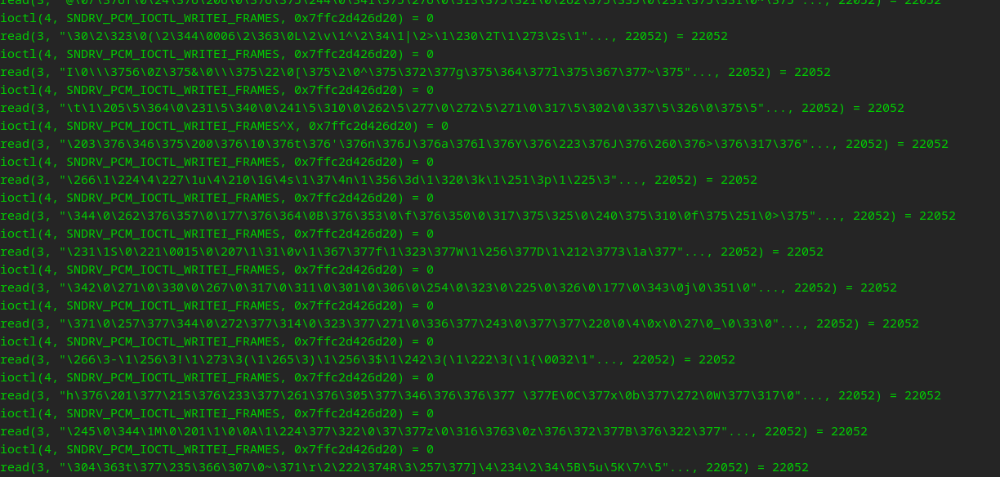

可以看到在播放数据时一直有一个**SNDRV_PCM_IOCTL_WRITEI_FRAMES**的**ioctl**。

```
	case SNDRV_PCM_IOCTL_PAUSE:
		return snd_pcm_action_lock_irq(&snd_pcm_action_pause,
					       substream,
					       (int)(unsigned long)arg);
	case SNDRV_PCM_IOCTL_WRITEI_FRAMES:
	case SNDRV_PCM_IOCTL_READI_FRAMES:
		return snd_pcm_xferi_frames_ioctl(substream, arg);                 //对应内核的ioctl
	case SNDRV_PCM_IOCTL_WRITEN_FRAMES:
	case SNDRV_PCM_IOCTL_READN_FRAMES:
		return snd_pcm_xfern_frames_ioctl(substream, arg);
```

对应`snd_pcm_common_ioctl`中的`snd_pcm_xferi_frames_ioctl`函数

```
static int snd_pcm_xferi_frames_ioctl(struct snd_pcm_substream *substream,
				      struct snd_xferi __user *_xferi)
{
	struct snd_xferi xferi;
	struct snd_pcm_runtime *runtime = substream->runtime;
	snd_pcm_sframes_t result;

	if (runtime->status->state == SNDRV_PCM_STATE_OPEN)
		return -EBADFD;
	if (put_user(0, &_xferi->result))
		return -EFAULT;
	if (copy_from_user(&xferi, _xferi, sizeof(xferi)))
		return -EFAULT;
	if (substream->stream == SNDRV_PCM_STREAM_PLAYBACK)           
		result = snd_pcm_lib_write(substream, xferi.buf, xferi.frames);            //播放音频，将数据写入PCM设备
	else
		result = snd_pcm_lib_read(substream, xferi.buf, xferi.frames);
	__put_user(result, &_xferi->result);
	return result < 0 ? result : 0;
}
```

可以看到如果是播放音频的话，就会调用一个内联函数`snd_pcm_lib_write`，最后发现之后核心是调用`__snd_pcm_lib_xfer`函数处理接下来的流程。

```
static inline snd_pcm_sframes_t
snd_pcm_lib_write(struct snd_pcm_substream *substream,
		  const void __user *buf, snd_pcm_uframes_t frames)
{
	return __snd_pcm_lib_xfer(substream, (void __force *)buf, true, frames, false);
}
```

#### 2.1.2.1 __snd_pcm_lib_xfer函数

一个实现 PCM 数据传输的核心函数，负责从用户空间或内核空间读取数据或写入数据到 PCM 缓冲区。它根据 PCM 的访问类型（交错或非交错）选择适当的数据拷贝方法，并处理数据传输的各种情况（如阻塞、非阻塞、静音填充等）。

- 由于主要只用左右声道交错排列的方式，这里只介绍交错复制。

```
	if (interleaved) {
		if (runtime->access != SNDRV_PCM_ACCESS_RW_INTERLEAVED &&
		    runtime->channels > 1)
			return -EINVAL;
		writer = interleaved_copy;
	} else {
		if (runtime->access != SNDRV_PCM_ACCESS_RW_NONINTERLEAVED)
			return -EINVAL;
		writer = noninterleaved_copy;
	}
```

interleaved_copy函数实现了 PCM 数据的拷贝操作，通常在处理音频流时用于多通道或交错格式的数据传输。它将 `hwoff`、`off` 和 `frames` 从帧数转换为字节数，然后调用一个传输函数（`transfer`）来执行实际的数据拷贝。

```
static int interleaved_copy(struct snd_pcm_substream *substream,
			    snd_pcm_uframes_t hwoff, void *data,
			    snd_pcm_uframes_t off,
			    snd_pcm_uframes_t frames,
			    pcm_transfer_f transfer)
{
	struct snd_pcm_runtime *runtime = substream->runtime;

	/* convert to bytes */
	hwoff = frames_to_bytes(runtime, hwoff);
	off = frames_to_bytes(runtime, off);
	frames = frames_to_bytes(runtime, frames);
	return transfer(substream, 0, hwoff, data + off, frames);
}
```

这个函数里的transfer是一个传输函数指针，用于执行数据拷贝操作。它将执行实际的拷贝任务。

- writer被赋值为interleaved_copy后，该函数的传入参数transfer也即将被赋值。(in_kernel是__snd_pcm_lib_xfer的形参，标记数据是否位于内核空间)

首先介绍一下音频数据从用户空间流向内核空间，以播放音频为例。

在标准hda中，azx_pcm_ops并没有定义.copy_kernel函数，所以使用default_write_copy函数

```
static const struct snd_pcm_ops azx_pcm_ops = {
	.open = azx_pcm_open,
	.close = azx_pcm_close,
	.ioctl = snd_pcm_lib_ioctl,
	.hw_params = azx_pcm_hw_params,
	.hw_free = azx_pcm_hw_free,
	.prepare = azx_pcm_prepare,
	.trigger = azx_pcm_trigger,
	.pointer = azx_pcm_pointer,
	.get_time_info =  azx_get_time_info,
	.mmap = azx_pcm_mmap,
	.page = snd_pcm_sgbuf_ops_page,
};
```

default_write_copy数的作用是将数据从内核空间的缓冲区复制到 PCM  缓冲区。

```
static int default_write_copy(struct snd_pcm_substream *substream,
			      int channel, unsigned long hwoff,
			      void *buf, unsigned long bytes)
{
	if (copy_from_user(get_dma_ptr(substream->runtime, channel, hwoff),
			   (void __user *)buf, bytes))
		return -EFAULT;
	return 0;
}
```

get_dma_ptr函数用于根据指定的音频流通道和硬件偏移量（`hwoff`）来计算并返回对应的 DMA内存区域指针。

```
static void *get_dma_ptr(struct snd_pcm_runtime *runtime,
			   int channel, unsigned long hwoff)
{
	return runtime->dma_area + hwoff +
		channel * (runtime->dma_bytes / runtime->channels);
}
```

相反default_read_copy是从数据内核空间流向用户空间

- 如果是录音流（`!is_playback`），并且 PCM 流的状态是 `PREPARED` 且传输大小大于或等于 `start_threshold`，则启动 PCM 流。

```
	if (!is_playback &&
	    runtime->status->state == SNDRV_PCM_STATE_PREPARED &&
	    size >= runtime->start_threshold) {
		err = snd_pcm_start(substream);
		if (err < 0)
			goto _end_unlock;
	}
```


- 如果 PCM 流的状态是 `RUNNING`，调用 `snd_pcm_update_hw_ptr` 更新硬件指针。获取当前可用的帧数（即可以读取或写入的帧数）。

```
	if (runtime->status->state == SNDRV_PCM_STATE_RUNNING)
		snd_pcm_update_hw_ptr(substream);
	avail = snd_pcm_avail(substream);
```


- 计算本次传输的帧数 `frames`，确保它不会超过可用数据 `avail` 和缓冲区剩余空间 `cont`。

```
frames = size > avail ? avail : size;
appl_ptr = READ_ONCE(runtime->control->appl_ptr);
appl_ofs = appl_ptr % runtime->buffer_size;
cont = runtime->buffer_size - appl_ofs;
if (frames > cont)
    frames = cont;
```


- 解锁 PCM 流，调用 前面赋值好的`writer` （interleaved_copy）函数进行数据拷贝。

```
snd_pcm_stream_unlock_irq(substream);
err = writer(substream, appl_ofs, data, offset, frames, transfer);
```


- 更新应用程序指针 `appl_ptr`，确保它在缓冲区边界内。调用 `pcm_lib_apply_appl_ptr` 更新应用程序指针。

```
appl_ptr += frames;
if (appl_ptr >= runtime->boundary)
    appl_ptr -= runtime->boundary;
err = pcm_lib_apply_appl_ptr(substream, appl_ptr);
if (err < 0)
    goto _end_unlock;
```


- 如果是播放流，并且 PCM 流状态为 `PREPARED` 且硬件可用帧数大于 `start_threshold`，启动播放。

		if (is_playback &&
		    runtime->status->state == SNDRV_PCM_STATE_PREPARED &&
		    snd_pcm_playback_hw_avail(runtime) >= (snd_pcm_sframes_t)runtime->start_threshold) {
			err = snd_pcm_start(substream);
			if (err < 0)
				goto _end_unlock;
		}


snd_pcm_start函数执行一系列组函数，关键是调用snd_pcm_do_start，调用该子流的 `trigger` 操作来开始处理音频流

```
static int snd_pcm_do_start(struct snd_pcm_substream *substream, int state)
{
	if (substream->runtime->trigger_master != substream)
		return 0;
	return substream->ops->trigger(substream, SNDRV_PCM_TRIGGER_START);
}
```

#### 2.1.2.2 硬件状态更新

这里的状态更新指的是更新硬件指针的位置。也就是声卡已经播放/录制完一个 period，需要更新 PCM 状态并通知用户空间。

`snd_pcm_period_elapsed`就用于在产生DMA中断后，更新硬件状态。

```
void snd_pcm_period_elapsed(struct snd_pcm_substream *substream)
{
	struct snd_pcm_runtime *runtime;
	unsigned long flags;

	if (snd_BUG_ON(!substream))
		return;

	snd_pcm_stream_lock_irqsave(substream, flags);
	if (PCM_RUNTIME_CHECK(substream))
		goto _unlock;
	runtime = substream->runtime;

	if (!snd_pcm_running(substream) ||
	    snd_pcm_update_hw_ptr0(substream, 1) < 0)            //更新硬件指针
		goto _end;

#ifdef CONFIG_SND_PCM_TIMER
	if (substream->timer_running)
		snd_timer_interrupt(substream->timer, 1);
#endif
 _end:
	kill_fasync(&runtime->fasync, SIGIO, POLL_IN);
 _unlock:
	snd_pcm_stream_unlock_irqrestore(substream, flags);
}
```

>该函数主要就是检查 PCM 是否在运行，更新硬件指针、更新 ALSA timer、向用户空间发送异步信号

真正更新硬件指针的函数是`snd_pcm_update_hw_ptr0`，该函数非常重要，可用在多个场景，即可用于中断中，也可以用于非中断中比如查询硬件状态。

```
static int snd_pcm_update_hw_ptr0(struct snd_pcm_substream *substream,
				  unsigned int in_interrupt)
{
	struct snd_pcm_runtime *runtime = substream->runtime;
	snd_pcm_uframes_t pos;
	snd_pcm_uframes_t old_hw_ptr, new_hw_ptr, hw_base;
	snd_pcm_sframes_t hdelta, delta;
	unsigned long jdelta;
	unsigned long curr_jiffies;
	struct timespec curr_tstamp;
	struct timespec audio_tstamp;
	int crossed_boundary = 0;

	old_hw_ptr = runtime->status->hw_ptr;

	/*
	 * group pointer, time and jiffies reads to allow for more
	 * accurate correlations/corrections.
	 * The values are stored at the end of this routine after
	 * corrections for hw_ptr position
	 */
	pos = substream->ops->pointer(substream);                  //读取硬件 DMA 指针
	curr_jiffies = jiffies;
	if (runtime->tstamp_mode == SNDRV_PCM_TSTAMP_ENABLE) {
		if ((substream->ops->get_time_info) &&
			(runtime->audio_tstamp_config.type_requested != SNDRV_PCM_AUDIO_TSTAMP_TYPE_DEFAULT)) {
			substream->ops->get_time_info(substream, &curr_tstamp,
						&audio_tstamp,
						&runtime->audio_tstamp_config,
						&runtime->audio_tstamp_report);

			/* re-test in case tstamp type is not supported in hardware and was demoted to DEFAULT */
			if (runtime->audio_tstamp_report.actual_type == SNDRV_PCM_AUDIO_TSTAMP_TYPE_DEFAULT)
				snd_pcm_gettime(runtime, (struct timespec *)&curr_tstamp);
		} else
			snd_pcm_gettime(runtime, (struct timespec *)&curr_tstamp);
	}

	if (pos == SNDRV_PCM_POS_XRUN) {
		__snd_pcm_xrun(substream);
		return -EPIPE;
	}
	if (pos >= runtime->buffer_size) {
		if (printk_ratelimit()) {
			char name[16];
			snd_pcm_debug_name(substream, name, sizeof(name));
			pcm_err(substream->pcm,
				"invalid position: %s, pos = %ld, buffer size = %ld, period size = %ld\n",
				name, pos, runtime->buffer_size,
				runtime->period_size);
		}
		pos = 0;
	}
	pos -= pos % runtime->min_align;
	trace_hwptr(substream, pos, in_interrupt);
	hw_base = runtime->hw_ptr_base;
	new_hw_ptr = hw_base + pos;
	if (in_interrupt) {
		/* we know that one period was processed */
		/* delta = "expected next hw_ptr" for in_interrupt != 0 */
		delta = runtime->hw_ptr_interrupt + runtime->period_size;
		if (delta > new_hw_ptr) {
			/* check for double acknowledged interrupts */
			hdelta = curr_jiffies - runtime->hw_ptr_jiffies;
			if (hdelta > runtime->hw_ptr_buffer_jiffies/2 + 1) {
				hw_base += runtime->buffer_size;
				if (hw_base >= runtime->boundary) {
					hw_base = 0;
					crossed_boundary++;
				}
				new_hw_ptr = hw_base + pos;
				goto __delta;
			}
		}
	}
	/* new_hw_ptr might be lower than old_hw_ptr in case when */
	/* pointer crosses the end of the ring buffer */
	if (new_hw_ptr < old_hw_ptr) {
		hw_base += runtime->buffer_size;
		if (hw_base >= runtime->boundary) {
			hw_base = 0;
			crossed_boundary++;
		}
		new_hw_ptr = hw_base + pos;
	}
      __delta:
	delta = new_hw_ptr - old_hw_ptr;
	if (delta < 0)
		delta += runtime->boundary;

	if (runtime->no_period_wakeup) {
		snd_pcm_sframes_t xrun_threshold;
		/*
		 * Without regular period interrupts, we have to check
		 * the elapsed time to detect xruns.
		 */
		jdelta = curr_jiffies - runtime->hw_ptr_jiffies;
		if (jdelta < runtime->hw_ptr_buffer_jiffies / 2)
			goto no_delta_check;
		hdelta = jdelta - delta * HZ / runtime->rate;
		xrun_threshold = runtime->hw_ptr_buffer_jiffies / 2 + 1;
		while (hdelta > xrun_threshold) {
			delta += runtime->buffer_size;
			hw_base += runtime->buffer_size;
			if (hw_base >= runtime->boundary) {
				hw_base = 0;
				crossed_boundary++;
			}
			new_hw_ptr = hw_base + pos;
			hdelta -= runtime->hw_ptr_buffer_jiffies;
		}
		goto no_delta_check;
	}

	/* something must be really wrong */
	if (delta >= runtime->buffer_size + runtime->period_size) {
		hw_ptr_error(substream, in_interrupt, "Unexpected hw_ptr",
			     "(stream=%i, pos=%ld, new_hw_ptr=%ld, old_hw_ptr=%ld)\n",
			     substream->stream, (long)pos,
			     (long)new_hw_ptr, (long)old_hw_ptr);
		return 0;
	}

	/* Do jiffies check only in xrun_debug mode */
	if (!xrun_debug(substream, XRUN_DEBUG_JIFFIESCHECK))
		goto no_jiffies_check;

	/* Skip the jiffies check for hardwares with BATCH flag.
	 * Such hardware usually just increases the position at each IRQ,
	 * thus it can't give any strange position.
	 */
	if (runtime->hw.info & SNDRV_PCM_INFO_BATCH)
		goto no_jiffies_check;
	hdelta = delta;
	if (hdelta < runtime->delay)
		goto no_jiffies_check;
	hdelta -= runtime->delay;
	jdelta = curr_jiffies - runtime->hw_ptr_jiffies;
	if (((hdelta * HZ) / runtime->rate) > jdelta + HZ/100) {
		delta = jdelta /
			(((runtime->period_size * HZ) / runtime->rate)
								+ HZ/100);
		/* move new_hw_ptr according jiffies not pos variable */
		new_hw_ptr = old_hw_ptr;
		hw_base = delta;
		/* use loop to avoid checks for delta overflows */
		/* the delta value is small or zero in most cases */
		while (delta > 0) {
			new_hw_ptr += runtime->period_size;
			if (new_hw_ptr >= runtime->boundary) {
				new_hw_ptr -= runtime->boundary;
				crossed_boundary--;
			}
			delta--;
		}
		/* align hw_base to buffer_size */
		hw_ptr_error(substream, in_interrupt, "hw_ptr skipping",
			     "(pos=%ld, delta=%ld, period=%ld, jdelta=%lu/%lu/%lu, hw_ptr=%ld/%ld)\n",
			     (long)pos, (long)hdelta,
			     (long)runtime->period_size, jdelta,
			     ((hdelta * HZ) / runtime->rate), hw_base,
			     (unsigned long)old_hw_ptr,
			     (unsigned long)new_hw_ptr);
		/* reset values to proper state */
		delta = 0;
		hw_base = new_hw_ptr - (new_hw_ptr % runtime->buffer_size);
	}
 no_jiffies_check:
	if (delta > runtime->period_size + runtime->period_size / 2) {
		hw_ptr_error(substream, in_interrupt,
			     "Lost interrupts?",
			     "(stream=%i, delta=%ld, new_hw_ptr=%ld, old_hw_ptr=%ld)\n",
			     substream->stream, (long)delta,
			     (long)new_hw_ptr,
			     (long)old_hw_ptr);
	}

 no_delta_check:
	if (runtime->status->hw_ptr == new_hw_ptr) {
		update_audio_tstamp(substream, &curr_tstamp, &audio_tstamp);
		return 0;
	}

	if (substream->stream == SNDRV_PCM_STREAM_PLAYBACK &&
	    runtime->silence_size > 0)
		snd_pcm_playback_silence(substream, new_hw_ptr);

	if (in_interrupt) {
		delta = new_hw_ptr - runtime->hw_ptr_interrupt;
		if (delta < 0)
			delta += runtime->boundary;
		delta -= (snd_pcm_uframes_t)delta % runtime->period_size;
		runtime->hw_ptr_interrupt += delta;
		if (runtime->hw_ptr_interrupt >= runtime->boundary)
			runtime->hw_ptr_interrupt -= runtime->boundary;
	}
	runtime->hw_ptr_base = hw_base;
	runtime->status->hw_ptr = new_hw_ptr;
	runtime->hw_ptr_jiffies = curr_jiffies;
	if (crossed_boundary) {
		snd_BUG_ON(crossed_boundary != 1);
		runtime->hw_ptr_wrap += runtime->boundary;
	}

	update_audio_tstamp(substream, &curr_tstamp, &audio_tstamp);

	return snd_pcm_update_state(substream, runtime);
}
```

整体流程可以简化为：

```
读取硬件 DMA pointer
        ↓
计算 new_hw_ptr
        ↓
检测 ring buffer wrap
        ↓
计算 delta (本次前进多少)
        ↓
检测异常 (XRUN / 丢中断)
        ↓
更新 runtime->hw_ptr
```

整个函数只需要关注`pos = substream->ops->pointer(substream); `即可，也就是不同声卡驱动要实现的回调，用于获取硬件DMA指针。

### 2.1.3 pcm proc

所有声卡的**proc**信息都在**/proc/asound/**目录下

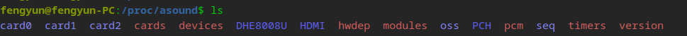

可以看到有本机目前有三个声卡(card0、card1、card2)，

>PCH其实就是card0，是本机的ALC897声卡
>
>HDMI其实就是card1,是本机的AMD R6xx 显卡audio
>
>DHE8008U其实就是card2,是本机外置的一个usb 耳机
>
>seq是时序器、timers是定时器，不用过于关心

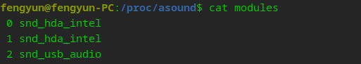

可以关注一下**modules**信息(有时没有这个文件)，可以看到card0、card1都是**snd_hda_intel**驱动也就是标准hda驱动(有时可以看到phytium或者loongson，也是标准hda驱动，只是这两个厂商自己仿照**snd_hda_intel**写的)；card2是**snd_usb_audio**驱动，**完全不用于hda驱动**。

以我本机**ALC897**声卡为例解释一下pcm proc信息

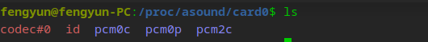

>code#0是 codec proc file,这里不做介绍，将在第三章介绍。codec是hda规范要求有的，对于Asoc或者usb audio驱动都是没有的，甚至某些国产显卡驱动都不会有codec.
>
>pcm0p、pcm0c组成一个pcm实例，pcm2c是一个pcm实例,最后一位是p代表playback,c代表capture

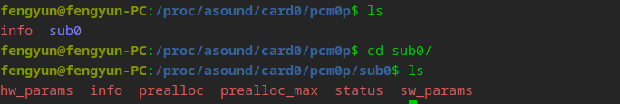

以**pcm0p**为例，**sub0**代表substream编号，这里只有一个。

- hw_params（播放状态）      ------------             硬件参数

```
access: MMAP_INTERLEAVED                      //MMAP交错模式
format: S16_LE                                //有符号16位小端格式（CD音质标准）
subformat: STD                                //标准子格式
channels: 2                                    //双声道立体声
rate: 44100 (44100/1)                         //采样率,（CD标准）
period_size: 44100                            //周期大小,每个周期包含的帧数
buffer_size: 88200                            //流的buffer size,环形缓冲区总大小
```

可以通过access判断是指定硬件（不通过系统层）还是通过系统层

- info

```
card: 0                                        //声卡0
device: 0                                      //PCM设备编号（本声卡上的第0个PCM设备）
subdevice: 0                                   //子设备编号（第一个子流）
stream: PLAYBACK                               //数据流方向为播放
id: ALC887-VD Analog                           
name: ALC887-VD Analog
subname: subdevice #0                          
class: 0                     
subclass: 0
subdevices_count: 1						       //该设备仅有1个子流（subdevice）
subdevices_avail: 0                            //当前无可用子流（所有子流已被占用，可能因资源独占或驱动错误）
```


- prealloc

```
0                      //预分配内存缓冲区的大小，可写的。
```


- premalloc_max

```
32768                  //预分配内存缓冲区的最大大小，实际上很难用这么多
```


- status  （播放状态，动态变化）      -----------状态

```
state: RUNNING                                              //子流处于运行状态
owner_pid   : 21516                                         //占用该子流的进程ID
trigger_time: 518.568181912                                 //最后一次状态触发的时间戳
tstamp      : 573.719422139                                 //最后一次硬件时间戳
delay       : 149											//音频设备的延迟
avail       : 88084											//表示当前可用的数据量
avail_max   : 88084                                         //表示可以使用的最大可用数据量。
-----
hw_ptr      : 2432680                                       //表示硬件当前指向的数据位置
appl_ptr    : 2432796                                       //表示应用程序读取或写入的数据位置
```

这里最需要关心的是state和hw_ptr

- sw_params  （播放状态)          ----------软件参数

```
tstamp_mode: ENABLE                                         //时间戳模式
period_step: 1                                              //表示每个周期的增量
avail_min: 88091                                            //最小可用样本数，控制 PCM 流的最小数据准备量。
start_threshold: 18446744073709551615                       //输出起始阈值，当缓冲区填充到这个阈值时，可能会触发某些操作。
stop_threshold: 6206523236469964800                         //输出停止阈值，当缓冲区达到这个阈值时，可能会触发停止操作。
silence_threshold: 0                                        //静音阈值，用于检测静音的条件。
silence_size: 0                                             //静音数据的大小
boundary: 6206523236469964800                               //内存边界
```


## 2.2 kcontrol

Control接口主要让用户空间的应用程序（alsa-lib）可以访问和控制音频codec芯片中的多路开关，滑动控件等。对于Mixer（混音）来说，Control接口显得尤为重要，所有的mixer工作都是通过control接口的API来实现的。

### 2.2.1 snd_kcontrol

Linux 音频子系统中用于表示音频控制的结构体。它管理与音频控制元素相关的各种信息和功能，例如音量、增益和静音等。

```
struct snd_ctl_elem_id {
	unsigned int numid;		                  //**数字标识符**：这是一个唯一的数字 ID，用于标识控制元素。
	snd_ctl_elem_iface_t iface;	               //控制元素所对应的接口类型，如 PCM、MIXER、RAW 等
	unsigned int device;		               
	unsigned int subdevice;		/* subdevice (substream) number */
	unsigned char name[SNDRV_CTL_ELEM_ID_NAME_MAXLEN];		//控制元素名称
	unsigned int index;		                  //此字段用于区分同一类型的多个控制元素，比如有两个前置mic
};

struct snd_kcontrol {
	struct list_head list;		
	struct snd_ctl_elem_id id;                        //用于唯一标识音频控制元素
	unsigned int count;		
	snd_kcontrol_info_t *info;                       //
	snd_kcontrol_get_t *get;                        //该函数用于获取控制元素的当前值
	snd_kcontrol_put_t *put;                        //该函数用于设置控制元素的值
	union {
		snd_kcontrol_tlv_rw_t *c;
		const unsigned int *p;
	} tlv;
	unsigned long private_value;                      //控件的值,根据不同控件有对应类型的值
	void *private_data;                               
	void (*private_free)(struct snd_kcontrol *kcontrol);
	struct snd_kcontrol_volatile vd[0];	/* volatile data */
};
```

对于每个控件，我们需要定义一个与之对应的**snd_kcontrol_new**结构，这个结构可以看作是snd_kcontrol的**模板**. 这些snd_kcontrol_new结构会在声卡的初始化阶段，通过**snd_ctl_new1**函数注册到系统中，用户空间就可以通过amixer或alsamixer等工具查看和设定这些控件的状态。

**kcontrol的具体作用在介绍amixer工具中**

### 2.2.2 ctjack

这小节主要是介绍一下所有插孔的**jack report,** 无论是对于暴露在外面的3.5mm耳机插孔还是内置的扬声器，更或是HDMI/DP的Audio，只要系统中存在，就有相应的jack。

在实际处理bug时，我们更关注jack 的report事件，下面介绍一下ALSA框架下的负责report的函数

```
void snd_jack_report(struct snd_jack *jack, int status)
{
	struct snd_jack_kctl *jack_kctl;
#ifdef CONFIG_SND_JACK_INPUT_DEV
	int i;
#endif

	if (!jack)
		return;

	list_for_each_entry(jack_kctl, &jack->kctl_list, list)                   //遍历 Jack 控件列表并报告状态
		snd_kctl_jack_report(jack->card, jack_kctl->kctl,
					    status & jack_kctl->mask_bits);

#ifdef CONFIG_SND_JACK_INPUT_DEV
	if (!jack->input_dev)
		return;

	for (i = 0; i < ARRAY_SIZE(jack->key); i++) {
		int testbit = SND_JACK_BTN_0 >> i;

		if (jack->type & testbit)
			input_report_key(jack->input_dev, jack->key[i],                   //上报耳机按钮的状态
					 status & testbit);
	}

	for (i = 0; i < ARRAY_SIZE(jack_switch_types); i++) {
		int testbit = 1 << i;
		if (jack->type & testbit)
			input_report_switch(jack->input_dev,
					    jack_switch_types[i],
					    status & testbit);
	}

	input_sync(jack->input_dev);
#endif /* CONFIG_SND_JACK_INPUT_DEV */
}
```

在找到对用**jack**控件后，就调用**snd_kctl_jack_report**。

```
void snd_kctl_jack_report(struct snd_card *card,
			  struct snd_kcontrol *kctl, bool status)
{
	if (kctl->private_value == status)
		return;
	kctl->private_value = status;                       //用户空间读的jack状态
	snd_ctl_notify(card, SNDRV_CTL_EVENT_MASK_VALUE, &kctl->id);      //通知订阅该插孔的进程状态已改变，比如alsactl monitor/pulseaudio
}
```

## 2.3 xrun

在音频处理中，**XRUN** 是指 **缓冲区欠载（Underrun）或过载（Overrun）** 导致的音频流中断现象，是实时音频系统中的常见问题。**1. XRUN 的类型**

| 类型         | 方向         | 发生场景                                                     |
| :----------- | :----------- | :----------------------------------------------------------- |
| **Underrun** | 播放(Output) | 应用程序未能及时填充音频缓冲区，硬件无数据可播（如CPU过载导致写入太慢） |
| **Overrun**  | 输入(Input)  | 应用程序未能及时读取捕获的数据，新数据覆盖未处理的旧数据（如磁盘I/O阻塞） |

------

**2. 根本原因**

**(1) 系统资源不足**

- CPU过载（其他进程占用资源）
- 内存带宽瓶颈

**(2) 实时性不足**

- 音频线程优先级不够

**(3) 缓冲区配置不当**

- `period_size`或 `buffer_size`设置不合理

  ```
  cat /proc/asound/card0/pcm0p/sub0/hw_params
  ```

播放音频时，系统层会传入一个较为合理的硬件参数设置，内核会进一步约束。不过据我观察，经过**pulseaudio**或者**pipewire**计算出的硬件参数设置，通常是在内核硬件支持范围内的。内核一般不会修改**period_size**或者**buffer_size**,直接使用的是用户空间传来的设置。也就是说，设置的**buffer_size**的主动权在用户空间，如果在内核强行修改**buffer_size**,用户空间也不一定知道。修改不合理的话还会导致**pulseaudio**或者**pipewire**崩溃。

不过如果实在想改buffer_size的大小，也有另外一种方法，**应该还有更好的方法，不过还需要研究研究**：

在**HDA**和**USB Audio**驱动中都会有一个**snd_pcm_hardware**结构体，定义了硬件参数的范围。

```
static struct snd_pcm_hardware azx_pcm_hw = {
	.info =			(SNDRV_PCM_INFO_MMAP |
				 SNDRV_PCM_INFO_INTERLEAVED |
				 SNDRV_PCM_INFO_BLOCK_TRANSFER |
				 SNDRV_PCM_INFO_MMAP_VALID |
				 /* No full-resume yet implemented */
				 /* SNDRV_PCM_INFO_RESUME |*/
				 SNDRV_PCM_INFO_PAUSE |
				 SNDRV_PCM_INFO_SYNC_START |
				 SNDRV_PCM_INFO_HAS_WALL_CLOCK | /* legacy */
				 SNDRV_PCM_INFO_HAS_LINK_ATIME |
				 SNDRV_PCM_INFO_NO_PERIOD_WAKEUP),
	.formats =		SNDRV_PCM_FMTBIT_S16_LE,
	.rates =		SNDRV_PCM_RATE_48000,
	.rate_min =		48000,
	.rate_max =		48000,
	.channels_min =		2,
	.channels_max =		2,
	.buffer_bytes_max =	AZX_MAX_BUF_SIZE,
	.period_bytes_min =	128,
	.period_bytes_max =	AZX_MAX_BUF_SIZE / 2,
	.periods_min =		2,
	.periods_max =		AZX_MAX_FRAG,
	.fifo_size =		0,
};

```

根据**buffer_size**和**period_size**的关系，我们可以通过修改**period_bytes**的范围和**periods**的范围，来强行约束**buffer_size**。

这种方法对于Asoc的驱动来说不可取，还需要研究一下。

**(4) 硬件问题**

## 2.4 alsa-utils

### 2.4.1 aplay

- `aplay -l `                   查看可用声卡和播放设备

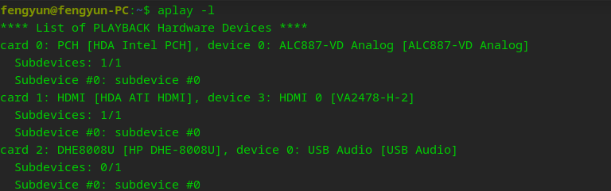

**可用音频输出设备及其物理对应关系，设备编号（用于精确指定播放目标）**

- `aplay -D plughw:0,0 -vv test.wav`                        指定硬件播放音频，**0,0代表card0,device 0**

-D 指定硬件设备 ; plughw和hw的区别是经过alsa插件层，可以自动识别音频流的格式；-vv 显示播放详细信息;

**如果不指定硬件设备，那么会声音会自动路由到系统层(pulseaudio、pipewire等)**

- `aplay -D hw:0,0  --dump-hw-params   /dev/zero`                          查看指定硬件所支持的硬件信息，包括采样率、声道、周期大小、缓冲区大小等

### 2.4.2 arecord

- arecord -l                             查看可用声卡和录音设备

-  `arecord -D hw:0,0 -f cd -vv -d 30 test.wav `                                 指定硬件播放录音

-f cd是使用cd音质，即采样率44100,声道2,位宽16 ；-d 录音时间

### 2.4.3 amixer

- `amixer -c 0 contents`                            查看card0的所有控件及内容

```
numid=35,iface=CARD,name='Front Headphone Jack'                           //iface=CARD,全局控制（声卡级别的设置)，只读
  ; type=BOOLEAN,access=r-------,values=1
  : values=on                                                             //代表Front Headphone Jack已经插入
numid=31,iface=CARD,name='Front Mic Jack'
  ; type=BOOLEAN,access=r-------,values=1
  : values=off                                                            //Front Mic Jack未插入
  
............
............
............
............

numid=11,iface=MIXER,name='Headphone Playback Switch'                       //iface=MIXER,混音器控制，代表headphone的播放开关
  ; type=BOOLEAN,access=rw------,values=2
  : values=on,on                                                            //左右声道都是打开的
numid=10,iface=MIXER,name='Headphone Playback Volume'                       //headphone的音量控制
  ; type=INTEGER,access=rw---R--,values=2,min=0,max=64,step=0               //value=2,代表双声道，min最小音量，max最大音量
  : values=64,64                                                            //当前音量
  | dBscale-min=-64.00dB,step=1.00dB,mute=0
  
............
............
............
............

numid=12,iface=MIXER,name='Loopback Mixing'                    //硬件loopback回环，使line out可以直接听到line in，需要硬件支持
  ; type=ENUMERATED,access=rw------,values=1,items=2           //枚举控件，有两项
  ; Item #0 'Disabled'                        
  ; Item #1 'Enabled'
  : values=0                                                   //代表当前设置为disabled
numid=19,iface=MIXER,name='Auto-Mute Mode'                     //自动静音控件，即插入3.5mm插孔，会不会静音扬声器等
  ; type=ENUMERATED,access=rw------,values=1,items=2
  ; Item #0 'Disabled'                                          //这个声卡较为简单，有些会是line out+speaker
  ; Item #1 'Enabled'                                           //有些会是speaker only
  : values=0  
numid=1,iface=MIXER,name='Channel Mode'                         //声道模式控件
  ; type=ENUMERATED,access=rw------,values=1,items=3
  ; Item #0 '2ch'
  ; Item #1 '4ch'
  ; Item #2 '6ch'
  : values=0
  
............
............
............
............

numid=20,iface=MIXER,name='Input Source'                        //mux控件，多路输入选择
  ; type=ENUMERATED,access=rw------,values=1,items=3
  ; Item #0 'Front Mic'  
  ; Item #1 'Rear Mic'
  ; Item #2 'Line'
  : values=0                                                      //当前选择为前置mic输入
 
............
............
............
............

numid=37,iface=PCM,name='Capture Channel Map'                    //iface=PCM,PCM控件（采样率/格式等流参数配置，这里是声道映射
  ; type=INTEGER,access=r----R--,values=2,min=0,max=36,step=0
  : values=0,0                                              //当前映射为标准立体声（FL=左, FR=右）
  | container
    | chmap-fixed=FL,FR                                     //硬件固定为双声道布局，不可修改


............
............
............
............
```

>该命令非常实用，在调试时可以快速定位问题原因。
>
>比如控制中心中没有某个输出选项时，首先可以查看iface是否有该控件，如果没有则代表硬件就不支持该输出的**插拔检测**，控制中心就不显示。如果该控件值是off，则代表是内核的问题；控件值为on,则代表是系统层的问题。
>
>在某些场景，输出没有声音，可以观察对应volume控件和switch值是否正常。
>
>另外声道映射控件也会能反应驱动是否正常

- amixer -c 0   cset  numid=xx value                                                设置指定numid控件的值

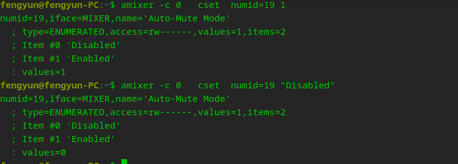

- `amixer -c 0 events`                                 监听card0上混音器所有事件，与alsactl monitor类似     


### 2.4.4 alsamxier

图形版amixer,功能和amixer一模一样,操作起来更便捷一点。

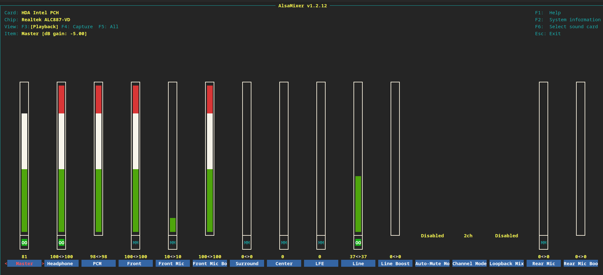

### 2.4.5 speaker-test / alsabat-test

- `speaker-test -D  hw:0,0 -t sine -f 440 -c 2 `                      测试指定硬件是否能发声

-t sine 输出正弦波；-f 频率；-c 声道数

**speaker-test**与**aplay**一样都可以测试硬件和驱动是否正常，不同的是**speaker-test**不需要wav文件，更加方便

alsabat-test可以测试播放和录音，使用参数和**speaker-test**类似，这里不介绍了。

### 2.4.6 alsactl

- alsactl monitor                                   监控插拔事件和调节音量

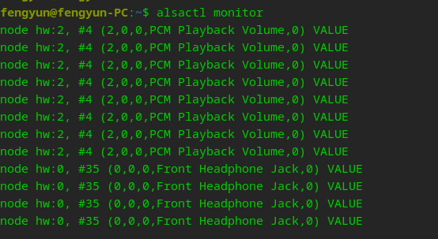

主要用于判断是否有插拔事件。

- alsactl store/restore                          保存和恢复所有控件的状态


# 三、标准HDA

HDA作为信创机器最常使用的声卡也是本文最多篇幅描述的。

HDA core代码在`sound/hda/ `目录下， HDA 驱动（snd-hda-intel）在`sound/pci/hda/`目录下又可分为四部分：Controller driver、Codec framework、Generic codec、Vendor codec drivers

```
Controller driver
    hda_intel.c
    hda_controller.c

Codec framework
    hda_codec.c
    hda_jack.c
    hda_bind.c

Generic codec
    hda_generic.c
    hda_auto_parser.c

Vendor codec drivers
    patch_realtek.c
    patch_conexant.c
    patch_cirrus.c
    patch_hdmi.c
```

## 3.1  硬件基础

HDA 硬件主要由两部分组成：**控制器芯片（controller chip）** 和 **HDA 总线上的解码器芯片（codec chips）**。Linux 内核驱动程序通过一个 `snd-hda-intel` 驱动来支持所有 HDA 控制器。此外，对于不同的解码器，`snd-hda-intel` 提供了一个通用解析器作为备用。但通常不同的解码器会使用各自的解码器（编码在 `patch_*.c` 文件中），我们常说的声卡就是指的codec型号。

先通过硬件框图来从整体上认识一下HDA内核架构以及HDA在整个系统中的位置  

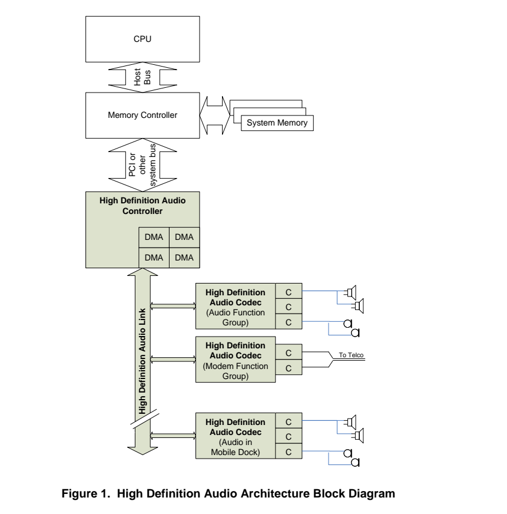  

1.  Controler: 高清音频控制器是一个总线主控 I/O 外设，通过 PCI 或其他典型的 PC 外设连接主机接口连接到系统内存。它包含一个或多个 DMA 引擎，每个引擎都可以设置为将单个音频“流”从编解码器传输到内存或从内存传输到编解码器，具体取决于 DMA 类型。控制器实现了构成编程接口的所有内存映射寄存器
2.  Link: 控制器通过高清音频链接物理连接到一个或多个编解码器。该链接在控制器和编解码器之间传输串行数据
3.  Codec: 一个或多个编解码器连接到链路。编解码器通过时分复用方式提取一个或多个音频流（stream)，并通过一个或多个音频转换器（convert）将它们转换为输出流。转换器通常将数字流转换为模拟信号（或反之亦然）。

下面来介绍一下上面提到的stream概念。  

HDA引入了流和通道的概念，用于组织要通过高清晰度音频链路传输的数据。流是在系统内存缓冲区和渲染该数据的编解码器之间创建的逻辑或虚拟连接，由通过链路的单个 DMA 通道驱动。流包含一个或多个相关的数据组件或通道，每个组件或通道都动态绑定到编解码器中的单个转换器进行渲染。例如，一个简单的立体声流将包含两个通道：左声道和右声道。该流中的每个采样点将包含两个样本：L 和 R。这些样本在内存缓冲区中表示或通过链路传输时被打包在一起，但每个样本都绑定到编解码器中单独的数模转换器。作为一般规则，流中的所有通道必须具有相同的采样率和相同的采样大小。 
  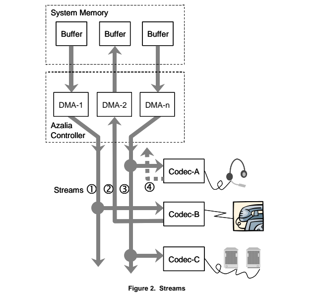
上图描述了上面提到的各个概念之间的关系。每个活动的流必须连接到一个DMA引擎上，上面的stream 1,2,3都是活动的流,其中1,3是output方向的 stream 2是input方向的流.stream 4没有连接到DMA引擎，所以是个非活动的流。

### 3.1.1 hda controller

`struct azx` , `azx` = **Azalia controller**（Intel HD Audio 控制器）。是 **Linux ALSA HDA 控制器驱动 (`snd-hda-intel`) 的核心控制器结构体**，用于表示一个 **Intel HD Audio Controller** 设备实例。
 它管理 **PCI设备、codec总线、PCM流、寄存器操作、DMA流、状态等**。

```
struct azx {
	struct hda_bus bus;

	struct snd_card *card;
	struct pci_dev *pci;
	int dev_index;

	/* chip type specific */
	int driver_type;
	unsigned int driver_caps;
	int playback_streams;
	int playback_index_offset;
	int capture_streams;
	int capture_index_offset;
	int num_streams;
	const int *jackpoll_ms; /* per-card jack poll interval */

	/* Register interaction. */
	const struct hda_controller_ops *ops;

	/* position adjustment callbacks */
	azx_get_pos_callback_t get_position[2];
	azx_get_delay_callback_t get_delay[2];

	/* locks */
	struct mutex open_mutex; /* Prevents concurrent open/close operations */

	/* PCM */
	struct list_head pcm_list; /* azx_pcm list */

	/* HD codec */
	int  codec_probe_mask; /* copied from probe_mask option */
	unsigned int beep_mode;

#ifdef CONFIG_SND_HDA_PATCH_LOADER
	const struct firmware *fw;
#endif

	/* flags */
	int bdl_pos_adj;
	int poll_count;
	unsigned int running:1;
	unsigned int fallback_to_single_cmd:1;
	unsigned int single_cmd:1;
	unsigned int polling_mode:1;
	unsigned int msi:1;
	unsigned int probing:1; /* codec probing phase */
	unsigned int snoop:1;
	unsigned int uc_buffer:1; /* non-cached pages for stream buffers */
	unsigned int align_buffer_size:1;
	unsigned int region_requested:1;
	unsigned int disabled:1; /* disabled by vga_switcheroo */

	/* GTS present */
	unsigned int gts_present:1;

#ifdef CONFIG_SND_HDA_DSP_LOADER
	struct azx_dev saved_azx_dev;
#endif
};
```

- struct hda_bus bus：这是 **HD Audio bus对象**。

  作用：

  - 管理 codec
  - 管理 command / response ring buffer
  - 发送 verb

  结构关系：

  ```
  azx
   └── hda_bus
         ├── codec0
         ├── codec1
         └── codec2
  ```

- struct snd_card *card: ALSA 声卡对象

- struct pci_dev *pci：对应

  ```
  lspci
  
  00:1f.3 Audio device: Intel Corporation HD Audio Controller
  ```

- int driver_type;
  unsigned int driver_caps ：表示不同HDA controller类型
- const int *jackpoll_ms: 控制 **耳机插拔检测轮询周期**, 如果硬件不支持 **unsol event**就需要轮询。
- const struct hda_controller_ops *ops: controller操作函数。**这个非常重要**
- azx_get_pos_callback_t get_position[2];
  azx_get_delay_callback_t get_delay[2]: 获取 **DMA 当前播放位置**

### 3.1.2 hda codec

`struct hda_codec` 是 **HD Audio 驱动中表示一个 codec 芯片的核心结构体**。
 如果说 `struct azx` 代表 **HDA controller（控制器）**，那么 `struct hda_codec` 就代表 **挂在 controller 上的一个音频 codec 芯片**（例如 Realtek ALC887）。

```
struct hda_codec {
	struct hdac_device core;
	struct hda_bus *bus;
	struct snd_card *card;
	unsigned int addr;	/* codec addr*/
	u32 probe_id; /* overridden id for probing */

	/* detected preset */
	const struct hda_device_id *preset;
	const char *modelname;	/* model name for preset */

	/* set by patch */
	struct hda_codec_ops patch_ops;

	/* PCM to create, set by patch_ops.build_pcms callback */
	struct list_head pcm_list_head;

	/* codec specific info */
	void *spec;

	/* beep device */
	struct hda_beep *beep;
	unsigned int beep_mode;

	/* widget capabilities cache */
	u32 *wcaps;

	struct snd_array mixers;	/* list of assigned mixer elements */
	struct snd_array nids;		/* list of mapped mixer elements */

	struct list_head conn_list;	/* linked-list of connection-list */

	struct mutex spdif_mutex;
	struct mutex control_mutex;
	struct snd_array spdif_out;
	unsigned int spdif_in_enable;	/* SPDIF input enable? */
	const hda_nid_t *slave_dig_outs; /* optional digital out slave widgets */
	struct snd_array init_pins;	/* initial (BIOS) pin configurations */
	struct snd_array driver_pins;	/* pin configs set by codec parser */
	struct snd_array cvt_setups;	/* audio convert setups */

	struct mutex user_mutex;
#ifdef CONFIG_SND_HDA_RECONFIG
	struct snd_array init_verbs;	/* additional init verbs */
	struct snd_array hints;		/* additional hints */
	struct snd_array user_pins;	/* default pin configs to override */
#endif

#ifdef CONFIG_SND_HDA_HWDEP
	struct snd_hwdep *hwdep;	/* assigned hwdep device */
#endif

	/* misc flags */
	unsigned int in_freeing:1; /* being released */
	unsigned int registered:1; /* codec was registered */
	unsigned int spdif_status_reset :1; /* needs to toggle SPDIF for each
					     * status change
					     * (e.g. Realtek codecs)
					     */
	unsigned int pin_amp_workaround:1; /* pin out-amp takes index
					    * (e.g. Conexant codecs)
					    */
	unsigned int single_adc_amp:1; /* adc in-amp takes no index
					* (e.g. CX20549 codec)
					*/
	unsigned int no_sticky_stream:1; /* no sticky-PCM stream assignment */
	unsigned int pins_shutup:1;	/* pins are shut up */
	unsigned int no_trigger_sense:1; /* don't trigger at pin-sensing */
	unsigned int no_jack_detect:1;	/* Machine has no jack-detection */
	unsigned int inv_eapd:1; /* broken h/w: inverted EAPD control */
	unsigned int inv_jack_detect:1;	/* broken h/w: inverted detection bit */
	unsigned int pcm_format_first:1; /* PCM format must be set first */
	unsigned int cached_write:1;	/* write only to caches */
	unsigned int dp_mst:1; /* support DP1.2 Multi-stream transport */
	unsigned int dump_coef:1; /* dump processing coefs in codec proc file */
	unsigned int power_save_node:1; /* advanced PM for each widget */
	unsigned int auto_runtime_pm:1; /* enable automatic codec runtime pm */
	unsigned int force_pin_prefix:1; /* Add location prefix */
	unsigned int link_down_at_suspend:1; /* link down at runtime suspend */
	unsigned int relaxed_resume:1;	/* don't resume forcibly for jack */

#ifdef CONFIG_PM
	unsigned long power_on_acct;
	unsigned long power_off_acct;
	unsigned long power_jiffies;
#endif

	/* filter the requested power state per nid */
	unsigned int (*power_filter)(struct hda_codec *codec, hda_nid_t nid,
				     unsigned int power_state);

	/* codec-specific additional proc output */
	void (*proc_widget_hook)(struct snd_info_buffer *buffer,
				 struct hda_codec *codec, hda_nid_t nid);

	/* jack detection */
	struct snd_array jacktbl;
	unsigned long jackpoll_interval; /* In jiffies. Zero means no poll, rely on unsol events */
	struct delayed_work jackpoll_work;

	/* jack detection */
	struct snd_array jacks;

	int depop_delay; /* depop delay in ms, -1 for default delay time */

	/* fix-up list */
	int fixup_id;
	const struct hda_fixup *fixup_list;
	const char *fixup_name;

	/* additional init verbs */
	struct snd_array verbs;
};
```

这个结构体需要了解的就很多了，但也不需要全部都了解

- struct hdac_device core;

这是 **HDA codec 的通用设备对象**，属于 HDA core 层。

- unsigned int addr：表示 **codec address**

  - 发送 verb 时：

    ```
    verb = (codec_addr << 28) | ...
    ```

- const struct hda_device_id *preset：表示 **匹配到的 codec driver patch中的hda_device_id表**

- struct hda_codec_ops patch_ops: 这是 **codec driver patch提供的操作函数**。非常重要

- struct list_head pcm_list_head：PCM列表，codec 可能有多个 PCM。

- void *spec：这是 **最重要的字段之一**。`spec` = **codec driver 私有结构**

- u32 *wcaps：缓存 **widget capability**

  - 例如：

    ```
    Node 0x12 → PIN widget
    Node 0x08 → DAC widget
    ```

    wcaps 包含：

    ```
    AMP
    PIN
    DAC
    ADC
    MIXER
    ```

- struct snd_array mixers：所有的控件
- struct snd_array nids：codec所有的引脚

- struct list_head conn_list：缓存 widget 连接关系。

- struct snd_array init_pins：来自BIOS的pin config
- struct snd_array driver_pins：来自驱动中设置的pin config，会覆盖init_pins

- struct snd_array cvt_setups:  音频 converter 配置：

- struct snd_array user_pins: 用户的配置，重启会清空

- struct snd_array jacktbl;
- struct snd_array jacks：保存 jack 信息。

- unsigned long jackpoll_interval：如果硬件不支持unsolicited event，就用 **poll方式检测插拔**。

- const struct hda_fixup *fixup_list：针对特定机器的修复

- struct snd_array verbs：初始化 codec 时发送的verb命令

## 3.2 HDA与codec之间的交互

当挂接在HDA总线上的codec被正常识别后，HDA控制器就可以向codec发送命令和获取反馈信息。这些控制信息的交互主要通过CORB(Command Outbound Ring Buffer) 和RIRB(Response Input Ring Buffer)这两个关键机制。

### 3.2.1 CORB和RIRB

#### 3.2.1.1 **hdac_rb**结构体

**hdac_rb**结构体用于管理 **CORB（Command Output Ring Buffer）** 和 **RIRB（Response Input Ring Buffer）**。它们是 **HDA** 控制器中用于管理与音频编解码器（codecs）之间命令和响应通信的缓冲区。具体来说，这个结构体封装了 CORB 和 RIRB 的一些关键属性和状态，用于在 HDA 驱动程序中处理命令和响应数据。1个 CORB entry 占4字节,1个 RIRB entry8字节。

```
struct hdac_rb {
	__le32 *buf;		
	dma_addr_t addr;	
	unsigned short rp, wp;	
	int cmds[HDA_MAX_CODECS];	
	u32 res[HDA_MAX_CODECS];	
};
```

**`__le32 *buf;`**

- 一个指向 **CORB 或 RIRB 缓冲区**的虚拟地址的指针。
- **CORB（Command Output Ring Buffer）**：这是一个环形缓冲区，用于将命令从主机发送到 HDA 编解码器。
- **RIRB（Response Input Ring Buffer）**：这是另一个环形缓冲区，用于接收 HDA 编解码器的响应。
- **功能**：`buf` 指向缓冲区的内存地址，用于存储待发送的命令（CORB）或接收的响应（RIRB）。

**`dma_addr_t addr;`**

- CORB/RIRB 缓冲区的**物理地址**。
- 这是系统中的 DMA（直接内存访问）地址，硬件通过这个地址直接访问缓冲区。
- **功能**：`addr` 存储缓冲区在物理内存中的地址，硬件通过该地址来读写命令和响应数据。

**`unsigned short rp, wp;`**

- **`rp`（read pointer）**：**读指针**，用于跟踪 RIRB 的读取位置。
- **`wp`（write pointer）**：**写指针**，用于跟踪 RIRB 的写入位置。
- **功能**：这两个指针用于管理环形缓冲区（RIRB）的读写操作。环形缓冲区通过这些指针确保数据按正确的顺序被读取和写入。

**`int cmds[HDA_MAX_CODECS];`**

- 一个数组，表示每个编解码器的**待处理命令数**。
- **HDA_MAX_CODECS** 是系统中可能存在的最大编解码器数（通常为 15 个）。
- **功能**：`cmds` 数组用于记录每个编解码器当前还未处理的命令数量。这有助于追踪命令的发送状态，确保主机不会在处理完先前的命令前发送新命令。

**`u32 res[HDA_MAX_CODECS];`**

- 一个数组，表示每个编解码器的**最后读取值**。
- **功能**：`res` 数组存储每个编解码器最后一次读取的响应结果。这可能是用于诊断、跟踪命令执行结果或处理音频配置的参数。

#### 3.2.1.2 CORB和RIRB

**CORB.buf** 用于存储发送给编解码器的命令。

**CORB.cmds** 用于跟踪每个节点 ID（codec）所发送命令的数量。

**RIRB.buf** 存储从编解码器返回的响应，包含最后结果和扩展结果

**RIRB.res** 存储各个节点 ID 的最终响应结果，即最后结果

**RIRB.cmds** 用于跟踪每个节点 ID（codec）所发送命令的数量。

**`rirb.cmds` 数组存储的是与 `corb` 中的 verb 命令一一对应的计数。每当向 `corb` 发送一个命令时，驱动程序会在 `rirb.cmds` 中对应的索引位置增加一个计数，表示该命令已发送并等待响应。当 RIRB 中接收到对应的响应时，驱动程序会减少 `rirb.cmds` 中的计数，以表示该命令的响应已被处理。这样，`rirb.cmds` 允许驱动程序跟踪哪些命令正在等待响应，以及是否有响应已被成功处理。**

#### 3.2.1.3 CORB和RIRB的初始化

```
void snd_hdac_bus_init_cmd_io(struct hdac_bus *bus)
{
	WARN_ON_ONCE(!bus->rb.area);

	spin_lock_irq(&bus->reg_lock);
	/* CORB set up */
	bus->corb.addr = bus->rb.addr;                  
	bus->corb.buf = (__le32 *)bus->rb.area;
	snd_hdac_chip_writel(bus, CORBLBASE, (u32)bus->corb.addr);
	snd_hdac_chip_writel(bus, CORBUBASE, upper_32_bits(bus->corb.addr));

	/* set the corb size to 256 entries (ULI requires explicitly) */
	snd_hdac_chip_writeb(bus, CORBSIZE, 0x02);              //将CORB的大小设置为256个entry
	/* set the corb write pointer to 0 */
	snd_hdac_chip_writew(bus, CORBWP, 0);              //将CORB写指针重置为0

	/* reset the corb hw read pointer */
	snd_hdac_chip_writew(bus, CORBRP, AZX_CORBRP_RST);               //重置硬件的CORB读指针
if (!bus->corbrp_self_clear)										//如果读指针不会自动清零，则手动清楚
		azx_clear_corbrp(bus);

	/* enable corb dma */
	snd_hdac_chip_writeb(bus, CORBCTL, AZX_CORBCTL_RUN);               //通过写入控制器，启动CORB的DMA传输

	/* RIRB set up */
	bus->rirb.addr = bus->rb.addr + 2048;
	bus->rirb.buf = (__le32 *)(bus->rb.area + 2048);
	bus->rirb.wp = bus->rirb.rp = 0;
	memset(bus->rirb.cmds, 0, sizeof(bus->rirb.cmds));             //重置RIRB读写指针，并清空命令数组
	snd_hdac_chip_writel(bus, RIRBLBASE, (u32)bus->rirb.addr);
	snd_hdac_chip_writel(bus, RIRBUBASE, upper_32_bits(bus->rirb.addr));

	/* set the rirb size to 256 entries (ULI requires explicitly) */
	snd_hdac_chip_writeb(bus, RIRBSIZE, 0x02);
	/* reset the rirb hw write pointer */
	snd_hdac_chip_writew(bus, RIRBWP, AZX_RIRBWP_RST);
	/* set N=1, get RIRB response interrupt for new entry */
	snd_hdac_chip_writew(bus, RINTCNT, 1);                       //设置响应计数。确保每收到一个新条目时触发中断
	/* enable rirb dma and response irq */
	snd_hdac_chip_writeb(bus, RIRBCTL, AZX_RBCTL_DMA_EN | AZX_RBCTL_IRQ_EN);  //启用RIRB的DMA传输，并打开中断
	spin_unlock_irq(&bus->reg_lock);
}
```

### 3.2.2 发送verb和响应结果

#### 3.2.2.1 verb结构

在 HD-Audio 的架构中，`verb`用于与音频编解码器的节点（widgets 或 function groups）进行通信。每个 `verb` 是一个命令，用于控制或查询编解码器中的某个节点，执行某些操作或获取状态。

`verb` 通常是一个 32 位的命令，由几个部分组成，每个部分都有特定的含义。通常结构如下：

```
| 31  28 | 27   20 | 19   8 | 7    0 |
|--------|---------|--------|--------|
|  Codec |  Node   |  Verb  |  Data  |
```

各个字段的含义为：

1. **Codec Address (31-28 bits)**：
   - 该字段用于选择要控制的编解码器。HD-Audio 支持多个编解码器，所以该字段表示编解码器的 ID。一般来说，系统中会有多个编解码器（例如 0 表示主编解码器，1 表示第二编解码器），该字段用于选择目标编解码器。
2. **Node ID (27-20 bits)**：
   - 该字段用于选择具体的 `Node`，也就是编码器中的 widgets 或 function groups。每个 `Node` 都有一个唯一的 ID，这个字段告诉硬件命令是针对哪个 `Node` 发送的。
   - Node ID 是 HD-Audio 编解码器中的最小功能单元（如 DAC、ADC、混音器等）。
3. **Verb Command (19-8 bits)**：
   - 该字段用于定义具体的 `verb` 命令类型，即编解码器要执行的操作或查询的属性。常见的命令类型包括：
     - **GET**：读取某些状态或属性。
     - **SET**：设置某些状态或属性。
   - Verb 命令可分为两类：
     - **Get Parameter Commands**：获取编解码器参数。
     - **Set Parameter Commands**：设置编解码器参数。
4. **Data Payload (7-0 bits)**：
   - 最后 8 位用于传递附加的数据信息，这个字段可以是具体的参数值或数据。根据 `verb` 命令的不同，这个字段有不同的含义。
   - 对于读取操作，这些数据可能是无意义的，或者是对读操作的子命令。
   - 对于写操作，数据字段中包含的值可能是要设置的具体值，如音量大小、功率状态等。

#### 3.2.2.2 Verb 执行过程
1. 主控制器（controller）通过 HD-Audio 总线向目标编解码器发送 `verb` 命令。
2. 编解码器根据 `Node ID` 确定要处理的节点，并根据 `Verb Command` 执行指定操作。
3. 执行结果可能通过某些寄存器或通过中断返回给主控制器。
4. 如果是读取操作，结果将从相应的寄存器中读取并返回给控制器。

下面介绍函数实现：

**snd_hda_codec_write**用于向 **HDA** 编解码器的某个节点发送控制命令(verb命令）。这个函数实际上是对 `snd_hdac_codec_write` 的一个简单封装。以这个函数为例介绍与codec交互。

首先要知道如何发送命令的，在**HDA**中使用**snd_hdac_bus_send_cmd**发送命令，该函数的第二个参数即为要发送的**cmd**，而所有的**cmd**由codec地址、nid、verb、parm组成。 函数用于将命令发送到 HD 音频设备的命令输出环缓冲区（CORB）。

```
int snd_hdac_bus_send_cmd(struct hdac_bus *bus, unsigned int val)
{
	unsigned int addr = azx_command_addr(val);
	unsigned int wp, rp;

	spin_lock_irq(&bus->reg_lock);

	bus->last_cmd[azx_command_addr(val)] = val;

	/* add command to corb */
	wp = snd_hdac_chip_readw(bus, CORBWP);               //获取写指针
	if (wp == 0xffff) {
		/* something wrong, controller likely turned to D3 */
		spin_unlock_irq(&bus->reg_lock);
		return -EIO;
	}
	wp++;                                                 //更新写指针
	wp %= AZX_MAX_CORB_ENTRIES;                          

	rp = snd_hdac_chip_readw(bus, CORBRP);              //获取读指针
	if (wp == rp) {                                    //写指针和读指针相等，缓冲区已满
		/* oops, it's full */
		spin_unlock_irq(&bus->reg_lock);
		return -EAGAIN;                             
	}

	bus->rirb.cmds[addr]++;                           //更新命令计数
	bus->corb.buf[wp] = cpu_to_le32(val);             //写入命令
	snd_hdac_chip_writew(bus, CORBWP, wp);            //将新的写指针写回到 CORBWP 寄存器。

	spin_unlock_irq(&bus->reg_lock);

	return 0;
}
```

在向编解码器发送命令（verb 命令）后，驱动程序需要调用**snd_hdac_bus_get_response**函数来获取编解码器的响应。该函数用于从 `RIRB`（响应输入环形缓冲区）中读取与特定编解码器地址相关的响应。它会等待一定时间，直到响应可用（即 RIRB 中有相应的命令响应），或者超时。

```
int snd_hdac_bus_get_response(struct hdac_bus *bus, unsigned int addr,
			      unsigned int *res)
{
	unsigned long timeout;
	unsigned long loopcounter;

	timeout = jiffies + msecs_to_jiffies(1000);

	for (loopcounter = 0;; loopcounter++) {
		spin_lock_irq(&bus->reg_lock);
		if (!bus->rirb.cmds[addr]) {            //数组存储了每个编解码器的待处理命令计数。若该值为 0，表示当前没有待处理的命令，即有响应可用。
			if (res)
				*res = bus->rirb.res[addr]; /* the last value */
			spin_unlock_irq(&bus->reg_lock);
			return 0;
		}
		spin_unlock_irq(&bus->reg_lock);
		if (time_after(jiffies, timeout))      //如果没有响应可用，解锁并检查是否超时。如果当前时间已经超过设定的超时时间，跳出循环。
			break;
		if (loopcounter > 3000)      
			msleep(2); /* temporary workaround */
		else {
			udelay(10);
			cond_resched();
		}
	}

	return -EIO;
}
```

介绍完了如何发送命令和接受响应，那么**snd_hda_codec_write**做的事情就简单明了了，即发送命令和接受响应，最后实际上调用**snd_hdac_bus_exec_verb_unlocked**与编码器进行交互。

```
int snd_hdac_bus_exec_verb_unlocked(struct hdac_bus *bus, unsigned int addr,
				    unsigned int cmd, unsigned int *res)
{
	unsigned int tmp;
	int err;

	if (cmd == ~0)
		return -EINVAL;                 //如果传入的命令为全1，则视为无效命令，函数直接返回错误代码 -EINVAL。

	if (res)
		*res = -1;
	else if (bus->sync_write)
		res = &tmp;
	for (;;) {
		trace_hda_send_cmd(bus, cmd);
		err = bus->ops->command(bus, cmd);        //发送命令
		if (err != -EAGAIN)
			break;
		/* process pending verbs */
		err = bus->ops->get_response(bus, addr, &tmp);      //接收响应
		if (err)
			break;
	}
	if (!err && res) {
		err = bus->ops->get_response(bus, addr, res);
		trace_hda_get_response(bus, addr, *res);
	}
	return err;
}
```

## 3.3、HDA中stream的管理

### 3.3.1 BDL

CORB、RIRB是用来传输命令的，对应的数据的传输是通过BDL(Buffer Descriptor List)来管理的。BDL是由一个个BDLE(Buffer Descriptor List Entries)组成的，BDL和BDLE的格式分别如下 。

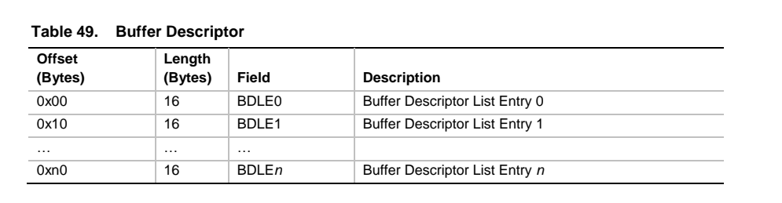

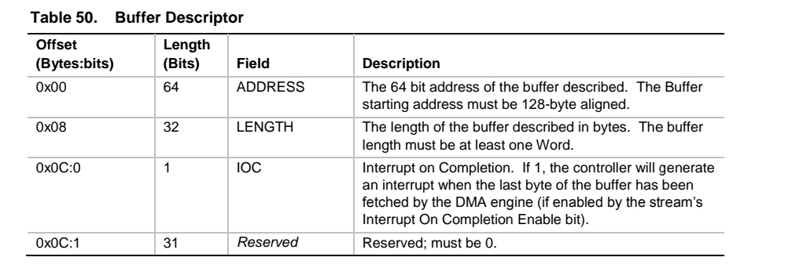


每个缓冲区描述符列表条目 (BDLE) 包含一个缓冲区描述，该缓冲区是整个循环流缓冲区的一部分。BDLE 包含指向包含缓冲区的物理内存的指针、缓冲区的长度以及一个标志，该标志指示缓冲区完成时是否应生成中断。BDLE 描述的缓冲区必须从 128 字节边界开始。

上面关于BDLE格式描述中最重要的是IOC,即完成时中断。这个标志位决定着DMA传输一定数据后触发中断，中断处理中会唤醒应用层阻塞式的写数据 线程。这个”一定数据量”其实就是在设置硬件参数(hw_params)时设置的period_bytes 值，period_bytes 也就是我们将一大块输出缓存进行了均分出来的的一片片小buffer。所以内核代码应该在每个periods的尾部设置这个IOC标志。函数**snd_hdac_stream_setup_periods**代码如下所示，此函数的主要作用是设置音频流的周期（periods）和对应的 BDL 条目，以便 DMA 能够正确地处理音频数据。它根据流的配置，计算每个周期的大小和数量，并确保 BDL 不会超出硬件限制。

```
int snd_hdac_stream_setup_periods(struct hdac_stream *azx_dev)
{
	struct hdac_bus *bus = azx_dev->bus;
	struct snd_pcm_substream *substream = azx_dev->substream;
	struct snd_pcm_runtime *runtime = substream->runtime;
	__le32 *bdl;
	int i, ofs, periods, period_bytes;
	int pos_adj, pos_align;

	/* reset BDL address */
	snd_hdac_stream_writel(azx_dev, SD_BDLPL, 0);       
	snd_hdac_stream_writel(azx_dev, SD_BDLPU, 0);      

	period_bytes = azx_dev->period_bytes;           //获取每个周期的字节数。
	periods = azx_dev->bufsize / period_bytes;      //计算周期数     

	/* program the initial BDL entries */
	bdl = (__le32 *)azx_dev->bdl.area;
	ofs = 0;
	azx_dev->frags = 0;                           //初始化 BDL 条目计数器为 0。

	pos_adj = bus->bdl_pos_adj;                   //获取 BDL 的位置调整值。
	if (!azx_dev->no_period_wakeup && pos_adj > 0) {
		pos_align = pos_adj;
		pos_adj = (pos_adj * runtime->rate + 47999) / 48000;
		if (!pos_adj)
			pos_adj = pos_align;
		else
			pos_adj = ((pos_adj + pos_align - 1) / pos_align) *
				pos_align;
		pos_adj = frames_to_bytes(runtime, pos_adj);
		if (pos_adj >= period_bytes) {
			dev_warn(bus->dev, "Too big adjustment %d\n",
				 pos_adj);
			pos_adj = 0;
		} else {
			ofs = setup_bdle(bus, snd_pcm_get_dma_buf(substream),
					 azx_dev,
					 &bdl, ofs, pos_adj, true);
			if (ofs < 0)
				goto error;
		}
	} else
		pos_adj = 0;

	for (i = 0; i < periods; i++) {                  //设置BDLE
		if (i == periods - 1 && pos_adj)
			ofs = setup_bdle(bus, snd_pcm_get_dma_buf(substream),
					 azx_dev, &bdl, ofs,
					 period_bytes - pos_adj, 0);
		else
			ofs = setup_bdle(bus, snd_pcm_get_dma_buf(substream),
					 azx_dev, &bdl, ofs,
					 period_bytes,
					 !azx_dev->no_period_wakeup);
		if (ofs < 0)
			goto error;
	}
	return 0;

 error:
	dev_err(bus->dev, "Too many BDL entries: buffer=%d, period=%d\n",
		azx_dev->bufsize, period_bytes);
	return -EINVAL;
}
```

在**snd_hdac_stream_setup_periods**函数的for循环正是为每个periods通过setup_bdle()函数设置一个BDLE，并设置IOC标志位1。该函数会根据音频流的需要来配置和分割音频缓冲区，使其适应硬件的要求。周期定义了在流中每次中断发生之前传输的数据量。该函数通常在设置音频流之前调用，用于初始化音频流传输的相关参数，例如当驱动程序为播放或录制音频数据准备音频缓冲区时。下面看一下setup_bdle()函数的具体实现：

```
static int setup_bdle(struct hdac_bus *bus,
		      struct snd_dma_buffer *dmab,
		      struct hdac_stream *azx_dev, __le32 **bdlp,
		      int ofs, int size, int with_ioc)
{
	__le32 *bdl = *bdlp;

	while (size > 0) {
		dma_addr_t addr;
		int chunk;

		if (azx_dev->frags >= AZX_MAX_BDL_ENTRIES)
			return -EINVAL;

		addr = snd_sgbuf_get_addr(dmab, ofs);
		/* program the address field of the BDL entry */
		bdl[0] = cpu_to_le32((u32)addr);
		bdl[1] = cpu_to_le32(upper_32_bits(addr));
		/* program the size field of the BDL entry */
		chunk = snd_sgbuf_get_chunk_size(dmab, ofs, size);
		/* one BDLE cannot cross 4K boundary on CTHDA chips */
		if (bus->align_bdle_4k) {
			u32 remain = 0x1000 - (ofs & 0xfff);

			if (chunk > remain)
				chunk = remain;
		}
		bdl[2] = cpu_to_le32(chunk);
		/* program the IOC to enable interrupt
		 * only when the whole fragment is processed
		 */
		size -= chunk;
		bdl[3] = (size || !with_ioc) ? 0 : cpu_to_le32(0x01);         //设置IOC
		bdl += 4;
		azx_dev->frags++;
		ofs += chunk;
	}
	*bdlp = bdl;
	return ofs;
}

```

### 3.3.2 数据流向

第二章已经介绍了用户空间的数据是怎么到pcm设备的buffer中的,那么在标准hda中，hda控制器和codec是怎么使用这些数据的呢。

snd_pcm_start函数执行一系列组函数，关键是调用snd_pcm_do_start，调用该子流的 `trigger` 操作来开始处理音频流

```
static int snd_pcm_do_start(struct snd_pcm_substream *substream, int state)
{
	if (substream->runtime->trigger_master != substream)
		return 0;
	return substream->ops->trigger(substream, SNDRV_PCM_TRIGGER_START);
}
```


由azx_pcm_ops可知trigger回调是azx_pcm_trigger,现在来介绍一下关键代码：

改变子流的状态

```
switch (cmd) {
case SNDRV_PCM_TRIGGER_START:
case SNDRV_PCM_TRIGGER_PAUSE_RELEASE:
case SNDRV_PCM_TRIGGER_RESUME:
    start = true;                     //改变状态
    break;
case SNDRV_PCM_TRIGGER_PAUSE_PUSH:
case SNDRV_PCM_TRIGGER_SUSPEND:
case SNDRV_PCM_TRIGGER_STOP:
    start = false;
    break;
default:
    return -EINVAL;
}
```

**启动或停止音频流**:

```
	snd_pcm_group_for_each_entry(s, substream) {
		if (s->pcm->card != substream->pcm->card)
			continue;
		azx_dev = get_azx_dev(s);
		if (start) {
			azx_dev->insufficient = 1;
			snd_hdac_stream_start(azx_stream(azx_dev), true);         //启动与 azx_dev 相关的音频流。
		} else {
			snd_hdac_stream_stop(azx_stream(azx_dev));
		}
	}
```


```
void snd_hdac_stream_start(struct hdac_stream *azx_dev, bool fresh_start)
{
	struct hdac_bus *bus = azx_dev->bus;

	trace_snd_hdac_stream_start(bus, azx_dev);

	azx_dev->start_wallclk = snd_hdac_chip_readl(bus, WALLCLK);
	if (!fresh_start)
		azx_dev->start_wallclk -= azx_dev->period_wallclk;

	/* enable SIE */
	snd_hdac_chip_updatel(bus, INTCTL, 0, 1 << azx_dev->index);
	/* set DMA start and interrupt mask */
	if (bus->hygon_dword_access)
		snd_hdac_stream_updatel(azx_dev, SD_CTL,
				0, SD_CTL_DMA_START | SD_INT_MASK);
	else
		snd_hdac_stream_updateb(azx_dev, SD_CTL,
				0, SD_CTL_DMA_START | SD_INT_MASK);                      //设置DMA启动和中断掩码
	azx_dev->running = true;
}
```

函数的主要作用是启动指定的音频流，并根据传入的参数进行适当的配置。该函数完成以下任务：

- 记录音频流的开始时间。
- 配置 DMA传输的控制寄存器。
- 启用相关的中断和控制机制。
- 更新流的状态，指示其正在运行。

```
	err = snd_hdac_stream_set_params(azx_stream(azx_dev), format_val);
	if (err < 0)
		goto unlock;

	snd_hdac_stream_setup(azx_stream(azx_dev));
```

snd_hdac_stream_setup是将 BDL 设置给硬件（HDA 控制器）

### 3.2.3  HDA的中断处理函数

在数据从缓冲区复制到音频控制器的过程中，通常会使用DMA, DMA对声卡而言非常重要。在介绍BDL的时候提到了IOC（完成时中断）

**中断在声卡中，表现为一个period的数据传输完毕会触发中断，然后更新 position**。

```
irqreturn_t azx_interrupt(int irq, void *dev_id)
{
	struct azx *chip = dev_id;
	struct hdac_bus *bus = azx_bus(chip);
	u32 status;                             //用于存储中断状态寄存器的值。
	bool active, handled = false;           //active：表示是否有活动的中断，handled：表示该中断是否被处理。
	int repeat = 0; /* count for avoiding endless loop */

#ifdef CONFIG_PM
	if (azx_has_pm_runtime(chip))
		if (!pm_runtime_active(chip->card->dev))
			return IRQ_NONE;
#endif

	spin_lock(&bus->reg_lock);

	if (chip->disabled)
		goto unlock;

	do {
		status = azx_readl(chip, INTSTS);
		if (status == 0 || status == 0xffffffff)
			break;

		handled = true;              
		active = false;
		if (snd_hdac_bus_handle_stream_irq(bus, status, stream_update))
			active = true;

		/* clear rirb int */
		status = azx_readb(chip, RIRBSTS);
		if (status & RIRB_INT_MASK) {
			active = true;
			if (status & RIRB_INT_RESPONSE) {
				if (chip->driver_caps & AZX_DCAPS_CTX_WORKAROUND)
					udelay(80);
				snd_hdac_bus_update_rirb(bus);
			}
			azx_writeb(chip, RIRBSTS, RIRB_INT_MASK);
		}
	} while (active && ++repeat < 10);

 unlock:
	spin_unlock(&bus->reg_lock);

	return IRQ_RETVAL(handled);
}
```


下面具体分析azx_interrupt函数:

- 首先进入循环，读取中断状态寄存器 `INTSTS` 的值。如果读取的状态为 0 或 0xFFFFFFFF，表示没有有效的中断，退出循环。

```c
status = azx_readl(chip, INTSTS);
```

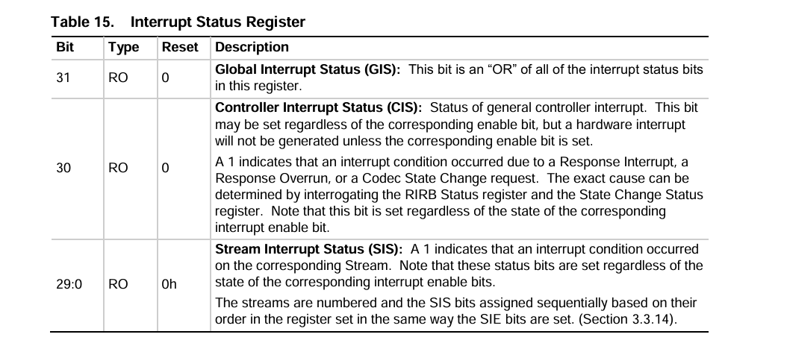

INTSTS 位于spec offset 24h，这是读取中断状态标志位。这个**interrupt status register** 是一个4byte的寄存器，具体有以下状态信息：

> bit31: 全局中断状态 (GIS)：该位是此寄存器中所有中断状态位的“或”。
>
> bit30: 控制器中断状态（CIS）：1表示由于响应中断、响应溢出或编解码器状态更改请求而发生了中断条件。具体原因可以通过查询 RIRB 状态寄存器和状态更改状态寄存器来确定。
>
> bit29-0: 流中断状态 (SIS)：1 表示相应流上发生了中断情况。请注意，这些状态位的设置与相应中断使能位的状态无关。流会进行编号，SIS 位会根据其在寄存器中的顺序依次分配，其设置方式与 SIE 位的设置方式相同。，这个SIS位就是根据stream的order来以此分配的。

- 调用 `snd_hdac_bus_handle_stream_irq` 函数处理与音频流相关的中断。如果成功处理，设置 `active` 为 `true`。

  ```
  if (snd_hdac_bus_handle_stream_irq(bus, status, stream_update))
  	active = true;
  ```

在这一步中有两个重要函数，先介绍一下`stream_update`函数

```
static void stream_update(struct hdac_bus *bus, struct hdac_stream *s)
{
	struct azx *chip = bus_to_azx(bus);
	struct azx_dev *azx_dev = stream_to_azx_dev(s);

	/* 检查中断是否可接受。 */
	if (!chip->ops->position_check ||
	    chip->ops->position_check(chip, azx_dev)) {
		spin_unlock(&bus->reg_lock);
		snd_pcm_period_elapsed(azx_stream(azx_dev)->substream);
		spin_lock(&bus->reg_lock);
	}
}
```

（1） 首先**检查位置**：如果 `chip->ops->position_check` 不存在，或其返回值为真，表示当前中断是可以接受的，进入条件语句。这通常是用来检查当前音频流的位置是否符合处理的条件。

```
if (!chip->ops->position_check ||
	    chip->ops->position_check(chip, azx_dev))
```

涉及到一个回调函数：position_check()，这是hda_controller_ops中的一个操作，用来检查当前的position是否是可接受的，具体的实现函数就是azx_position_check()函数。

```
/* called from IRQ */
static int azx_position_check(struct azx *chip, struct azx_dev *azx_dev)
{
	struct hda_intel *hda = container_of(chip, struct hda_intel, chip);
	int ok;

	ok = azx_position_ok(chip, azx_dev);
	if (ok == 1) {
		azx_dev->irq_pending = 0;
		return ok;
	} else if (ok == 0) {
		/* bogus IRQ, process it later */
		azx_dev->irq_pending = 1;
		schedule_work(&hda->irq_pending_work);
	}
	return 0;
}
```

在`azx_position_check`函数中首先就要调用`azx_position_ok`.

```
static int azx_position_ok(struct azx *chip, struct azx_dev *azx_dev)
{
	struct snd_pcm_substream *substream = azx_dev->core.substream;
	int stream = substream->stream;
	u32 wallclk;
	unsigned int pos;

	wallclk = azx_readl(chip, WALLCLK) - azx_dev->core.start_wallclk;
	if (wallclk < (azx_dev->core.period_wallclk * 2) / 3)
		return -1;	/* bogus (too early) interrupt */

	if (chip->get_position[stream])                          //关键回调函数
		pos = chip->get_position[stream](chip, azx_dev);
	else { /* use the position buffer as default */
			......
			......                //省略代码
			......
		}
	}

	if (pos >= azx_dev->core.bufsize)
		pos = 0;

	if (WARN_ONCE(!azx_dev->core.period_bytes,
		      "hda-intel: zero azx_dev->period_bytes"))
		return -1; /* this shouldn't happen! */
	if (wallclk < (azx_dev->core.period_wallclk * 5) / 4 &&
	    pos % azx_dev->core.period_bytes > azx_dev->core.period_bytes / 2)
		/* NG - it's below the first next period boundary */
		return chip->bdl_pos_adj ? 0 : -1;
	azx_dev->core.start_wallclk += wallclk;
	return 1; /* OK, it's fine */
}


```

这个函数主要就是确定这个当前的DMA position是否已经可以用于更新periods。关键是chip->get_position这个回调函数，那么如何找到这个HDA控制器具体是用的哪一个呢。

首先在azx_create中有如下行代码,其中position_fix[dev]为模块参数，这里不多做介绍。

```
	assign_position_fix(chip, check_position_fix(chip, position_fix[dev]));               
```

`check_position_fix`函数用于确定音频设备应使用的音频位置修复方法。

```
static int check_position_fix(struct azx *chip, int fix)
{
	................
	................      //省略代码
	................
	
	/* Check VIA/ATI HD Audio Controller exist */
	if (chip->driver_type == AZX_DRIVER_VIA ||
		chip->driver_type == AZX_DRIVER_ZHAOXIN) {                           //兆新使用POS_FIX_VIACOMBO
		dev_dbg(chip->card->dev, "Using VIACOMBO position fix\n");
		return POS_FIX_VIACOMBO;
	}
	if (chip->driver_caps & AZX_DCAPS_AMD_WORKAROUND) {
		dev_dbg(chip->card->dev, "Using FIFO position fix\n");
		return POS_FIX_FIFO;
	}

    if (chip->driver_type == AZX_DRIVER_ZHAOXIN ) {
		return POS_FIX_VIACOMBO;
	}

	if (chip->driver_caps & AZX_DCAPS_POSFIX_LPIB) {
		dev_dbg(chip->card->dev, "Using LPIB position fix\n");
		return POS_FIX_LPIB;
	}
	if (chip->driver_type == AZX_DRIVER_SKL) {
		dev_dbg(chip->card->dev, "Using SKL position fix\n");
		return POS_FIX_SKL;
	}

	return POS_FIX_AUTO;
}
```

这里以兆新的获取DMA_position方式是**POS_FIX_VIACOMBO**为例。

`assign_position_fix` 函数主要目的是根据音频硬件的特性和配置，为 `azx` 结构体中的回调函数指针配置合适的获取音频位置和延迟的方法。当fix传入的指为**POS_FIX_VIACOMBO**时，可以看到`chip->get_position`被设置为`azx_via_get_position`

```
static void assign_position_fix(struct azx *chip, int fix)
{
	static azx_get_pos_callback_t callbacks[] = {
		[POS_FIX_AUTO] = NULL,
		[POS_FIX_LPIB] = azx_get_pos_lpib,
		[POS_FIX_POSBUF] = azx_get_pos_posbuf,
		[POS_FIX_VIACOMBO] = azx_via_get_position,
		[POS_FIX_COMBO] = azx_get_pos_lpib,
		[POS_FIX_SKL] = azx_get_pos_skl,
		[POS_FIX_FIFO] = azx_get_pos_fifo,
	};

	chip->get_position[0] = chip->get_position[1] = callbacks[fix];

	/* combo mode uses LPIB only for playback */
	if (fix == POS_FIX_COMBO)
		chip->get_position[1] = NULL;

	if ((fix == POS_FIX_POSBUF || fix == POS_FIX_SKL) &&
	    (chip->driver_caps & AZX_DCAPS_COUNT_LPIB_DELAY)) {
		chip->get_delay[0] = chip->get_delay[1] =
			azx_get_delay_from_lpib;
	}

	if (fix == POS_FIX_FIFO)
		chip->get_delay[0] = chip->get_delay[1] =
			azx_get_delay_from_fifo;
}
```


```
static unsigned int azx_via_get_position(struct azx *chip,
					 struct azx_dev *azx_dev)
{
	unsigned int link_pos, mini_pos, bound_pos;
	unsigned int mod_link_pos, mod_dma_pos, mod_mini_pos;
	unsigned int fifo_size;

	link_pos = snd_hdac_stream_get_pos_lpib(azx_stream(azx_dev));
	if (azx_dev->core.substream->stream == SNDRV_PCM_STREAM_PLAYBACK) {
		/* Playback, no problem using link position */
		return link_pos;
	}
	.................
	.................             //省略代码
	.................

}
```

```
static inline unsigned int
snd_hdac_stream_get_pos_lpib(struct hdac_stream *stream)
{
	return snd_hdac_stream_readl(stream, SD_LPIB);
}
```

可以看到，在播放情况下，是通过LPIB方式返回 DMA position。通过读取**AZX_REG_SD_LPIB** 寄存器的值即可获得 DMA positio

现在我们还是回到`stream_update` 函数，如果 `chip->ops->position_check` 不存在，或其返回值为真，表示当前中断是可以接受的，进入条件语句。

```
     snd_pcm_period_elapsed(azx_stream(azx_dev)->substream);
```

`snd_pcm_period_elapsed`函数是用来更新pcm 状态的，这里面最重要的就是`snd_pcm_update_hw_ptr0`函数用于更新硬件指针等。

- 这个if语句的stream_update已经介绍完了，现在我们继续介绍`snd_hdac_bus_handle_stream_irq`函数

```
if (snd_hdac_bus_handle_stream_irq(bus, status, stream_update))
	active = true;
```

```
int snd_hdac_bus_handle_stream_irq(struct hdac_bus *bus, unsigned int status,
				    void (*ack)(struct hdac_bus *,
						struct hdac_stream *))
{
	struct hdac_stream *azx_dev;
	u8 sd_status;
	int handled = 0;

	list_for_each_entry(azx_dev, &bus->stream_list, list) {
		if (status & azx_dev->sd_int_sta_mask) {
			sd_status = snd_hdac_stream_readb(azx_dev, SD_STS);
			snd_hdac_stream_writeb(azx_dev, SD_STS, SD_INT_MASK);
			handled |= 1 << azx_dev->index;
			if (!azx_dev->substream || !azx_dev->running ||
			    !(sd_status & SD_INT_COMPLETE))
				continue;
			if (ack)
				ack(bus, azx_dev);
		}
	}
	return handled;
}
```


```c
sd_status = snd_hdac_stream_readb(azx_dev, SD_STS);
snd_hdac_stream_writeb(azx_dev, SD_STS, SD_INT_MASK);
```

上面是用来读取 **stream descriptors status**(SD_STS) 寄存器的值，向 `SD_STS` 寄存器写入 `SD_INT_MASK`，清除当前流的中断标志。 **stream descriptors status** 寄存器是用来控制DMA engine的，以SD_status寄存器为例，里面有关于DMA FIFO 的一些设置。

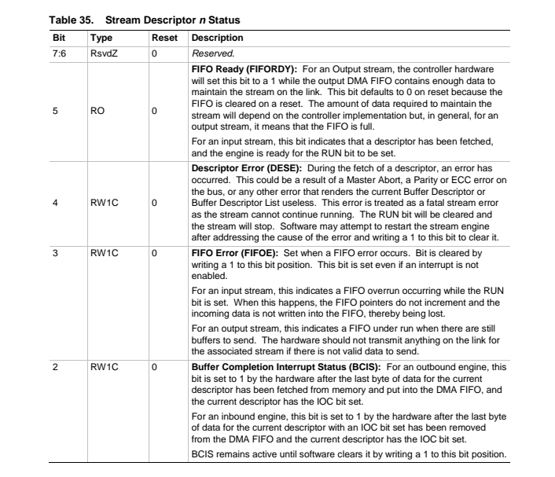

现在介绍一下这个寄存器的信息

>bit5： FIFO 就绪 (FIFORDY)：对于输出流，当输出 DMA FIFO 包含足够的数据来维持链路上的流时，控制器硬件会将此位设置为 1。复位时，此位默认为 0，因为 FIFO 在复位时会被清除。维持流所需的数据量取决于控制器的实现，但通常情况下，对于输出流，这意味着 FIFO 已满。对于输入流，此位表示已获取描述符，并且引擎已准备好设置 RUN 位。
>
>bit4：描述符错误 (DESE)：在获取描述符期间发生错误。这可能是由于主设备中止、总线上的奇偶校验或 ECC 错误，或任何其他导致当前缓冲区描述符或缓冲区描述符列表失效的错误造成的。此错误被视为致命的流错误，因为流无法继续运行。RUN 位将被清除，流将停止。软件可以在找到错误原因并向此位写入 1 以清除错误后，尝试重新启动流引擎。
>
>bit3：FIFO 错误 (FIFOE)：发生 FIFO 错误时置位。向此位写入 1 即可清除该位。即使未启用中断，此位也会置位。
>对于输入流，这表示在 RUN 位置位时发生了 FIFO 溢出。发生这种情况时，FIFO 指针不会递增，传入数据不会写入 FIFO，从而丢失。
>对于输出流，这表示在仍有缓冲区要发送时 FIFO 处于欠载状态。如果没有有效数据要发送，硬件不应在相关流的链路上传输任何数据。
>
>bit2: 缓冲区完成中断状态 (BCIS)：对于出站引擎，在当前描述符的最后一个数据字节已从内存中取出并放入 DMA FIFO，且当前描述符的 IOC 位已设置后，硬件会将此位设置为 1。
>对于入站引擎，在当前描述符的最后一个数据字节已设置 IOC 位后，从 DMA FIFO 中移除，且当前描述符的 IOC 位已设置后，硬件会将此位设置为 1。
>BCIS 会一直保持活动状态，直到软件通过向此位写入 1 来清除它。

读取状态信息以后，就根据mask的值来分析判断是什么错误，然后就是中断判断和处理,调用前面介绍过的`stream_update`.

```c
			if (!azx_dev->substream || !azx_dev->running ||
			    !(sd_status & SD_INT_COMPLETE))
				continue;
			if (ack)
				ack(bus, azx_dev);
		}
```


## 3.4、widgets和function group

在 HDA (High Definition Audio) 编解码器的架构中，`Widgets` 和 `Function Group` 是非常重要的概念，它们用于定义音频信号处理的功能单元和功能集合。具体来说：

### 3.4.1. **Widgets（小组件）**

Widgets 是 HDA 编解码器中处理音频信号的基本构建块。它们代表编解码器内部的特定功能或音频处理单元。每个小组件可能具有不同的类型和功能，如混音器、放大器、选择器、DAC（数字到模拟转换器）等。Widgets 负责执行特定的音频处理任务，它们通过节点表示，并通过命令（verbs）进行控制。

HDA 编解码器的架构通常由多个小组件组成，每个小组件都有一个唯一的 **Node ID**（节点 ID），该 ID 用于标识和控制该组件。

```
/*widget types*/
enum {
	AC_WID_AUD_OUT,		//表示音频输出节点
	AC_WID_AUD_IN,		//表示音频输入节点
	AC_WID_AUD_MIX,		//音频混音器节点，用于混合多个音频流，输出一个混合后的音频信号。
	AC_WID_AUD_SEL,		//音频选择器节点，能够在多个音频输入信号中选择一个作为输出。
	AC_WID_PIN,		    //Pin Complex 节点，表示音频信号的物理连接点，如音频插孔（耳机插口、麦克风插口）或内部信号路径的端点。
	AC_WID_POWER,		//电源节点，表示控制音频硬件电源状态的功能，用于管理和节省电源。
	AC_WID_VOL_KNB,		//音量旋钮节点，表示可调整音量的硬件控件。
	AC_WID_BEEP,		//蜂鸣生成器节点，用于产生蜂鸣音
	AC_WID_VENDOR = 0x0f	//厂商特定节点，用于表示厂商定义的特殊功能节点。这些节点的行为和属性取决于具体的硬件实现，通常是定制化的。
};
```

### 3.4.2. **Function Group（功能组）**

`Function Group` 是 HDA 编解码器中多个 widgets 的集合。它们将功能相近的 widgets 组合在一起，形成一个逻辑上的功能单元。例如，一个编解码器可能具有多个功能组，每个功能组处理不同的功能，如音频播放、音频录制或调制解调器信号处理等。

每个 `Function Group` 通过一个唯一的 **Function Group Node**（功能组节点）来表示，并且可能包括以下类型的功能：

```
/* function group types */
enum {
	AC_GRP_AUDIO_FUNCTION = 0x01,
	AC_GRP_MODEM_FUNCTION = 0x02,
};
```

- **音频功能组**（Audio Function Group）：负责处理音频的输入和输出。
- **调制解调器功能组**（Modem Function Group）：用于处理电话或调制解调器信号。

```
/* Audio Function Group Capabilities */
#define AC_AFG_OUT_DELAY		(0xf<<0)            //描述音频输出延迟
#define AC_AFG_IN_DELAY			(0xf<<8)			//描述音频输入延迟
#define AC_AFG_BEEP_GEN			(1<<16)				//标识是否支持蜂鸣器生成功能
```

```
/* Function Group Type */
#define AC_FGT_TYPE			(0xff<<0)               //表示功能组的类型
#define AC_FGT_TYPE_SHIFT		0                   //用于从功能组描述寄存器中提取类型值时的位移操作。
#define AC_FGT_UNSOL_CAP		(1<<8)				//标识功能组是否支持非请求事件
```

## 3.5 pincfg

HDA规范定义了一组硬件机制，驱动程序软件可以使用这些机制来识别音频编解码器中的功能。以下是高清音频设备建模为小部件的硬件子组件的示例：

- 数字音频转换器 (DAC)

- 模拟数字转换器 (ADC)

- 音频输入或输出连接

小部件可以物理连接以形成音频设备，驱动程序软件可以查询编解码器以查找编解码器中每个音频数据路径上的小部件。

引脚小部件是一种特殊的小部件，代表音频插孔或与集成扬声器或麦克风的固定连接。与每个引脚小部件相关联的是一个硬件寄存器，称为引脚配置寄存器，它提供有关插孔或固定连接的信息。寄存器包含以下信息：

- 引脚小部件是输入还是输出。

- 通过引脚小部件的信号是模拟信号还是数字信号。

- 连接到引脚小部件的外部音频设备（如扬声器）的类型。

- 与引脚小部件的物理连接类型（如 1/8 英寸立体声插孔）。

如果引脚小部件连接到音频插孔，引脚配置寄存器将提供以下附加信息：

- 插孔的位置（如系统机箱的前面板）。

- 插孔的颜色。

- 插孔和支持系统电路是否可以检测用户何时插入或拔出插头。

某些设备（如耳机）需要单个立体声插孔。其他设备可能需要多个插孔。例如，六声道音频渲染设备需要三个立体声扬声器插孔。引脚配置寄存器向HDA驱动程序告知引脚小部件组（称为“关联”），这些小部件共同作用以形成复合音频设备，以及每个设备中各个引脚小部件的角色（如将音频流中的通道分配给特定的引脚小部件）。

编解码器设备制造商为每个引脚小部件中的引脚配置寄存器分配默认值。但是，主板或系统设计人员在配置编解码器中的音频设备时可能有相当大的自由度。因此，默认寄存器值可能无法充分描述特定系统中设备的实际配置。因此，在启动时，系统 BIOS 通常会用更准确地描述音频插孔和固定连接的系统特定配置的信息(也就是**pincfg**)覆盖引脚配置寄存器中的默认值。

例如，特定的 HD 音频编解码器可能会实现四个连接到四个引脚小部件的 DAC 小部件；引脚小部件连接到扬声器或耳机。三个不同的主板或系统供应商可能会使用此小部件集合来形成以下设备：

- 第一个供应商可能选择将三个引脚小部件用于六声道播放设备，将第四个引脚小部件用作独立的耳机设备。

- 第二个供应商可能选择使用四个引脚小部件来实现没有耳机功能的八声道播放设备。

- 第三个供应商可能使用三个引脚小部件作为三个独立的立体声渲染设备，使用第四个引脚小部件作为独立的耳机设备。 

对于这三个系统中的每一个，系统集成商（OEM 或 ODM）都会对系统 BIOS 进行编程，以将值加载到编解码器的引脚配置寄存器中，这些寄存器描述了系统中的音频设备。hda编解码器的功能和所实现的音频设备类型可能有很大差异，但 hda驱动程序可以通过解析设备的拓扑并读取其引脚配置寄存器来获取控制设备所需的信息。

### 3.5.1 引脚配置寄存器

hda编解码器中的每个引脚小部件都包含一个 32 位引脚配置寄存器。驱动软件可以向编解码器查询每个引脚配置寄存器的内容。寄存器信息由多个字段组成，如下图所示。

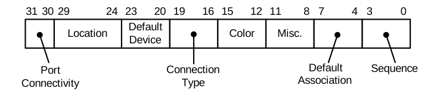

#### 3.5.1.1 Port Connectivity 端口连接

端口连接字段指示引脚小部件是否代表外部音频插孔、是否与内部设备（如集成扬声器）有固定连接或未连接。值 0x1 表示引脚小部件没有物理连接。

>仅当系统未将引脚小部件物理连接到任何设备时才使用无物理连接设置。
>
>为了实现编解码器灵活性，通常编解码器硬件供应商不应默认将引脚小部件的端口连接字段设置为 0x1。只有系统集成商（OEM 和 ODM）才应将该字段设置为此值（通过系统 BIOS）。
>
>如果端口连接字段包含 0x1，则切勿将默认关联字段设置为 0，因为这会导致 hda驱动程序认为引脚配置寄存器中的其他字段无效。
>
>如果系统集成商选择不使用特定引脚小部件，则将该引脚的端口连接字段设置为 0x1 是告知驱动程序软件不要使用该引脚小部件的唯一方法。

#### 3.5.1.2 Location

此字段表示音频插孔的物理位置（例如前面板）。请根据需要设置该字段以指示插孔在系统或设备上的位置

#### 3.5.1.3 Default Device

hda驱动程序支持英特尔高清晰度音频规范中定义的以下默认设备类型子集：

渲染设备：线路输出、扬声器、HP 输出和 SPDIF 输出。

捕获设备：线路输入、麦克风输入、AUX 和 SPDIF 输入。

#### 3.5.1.4 Connection Type

如前所述，两个或多个引脚小部件可以关联以形成多引脚设备。如果此类关联包含两个或多个设备类型为 Line Out 或 Speaker 的引脚，则这些引脚在其“连接类型”字段中必须具有相同的值。

如果引脚小部件的“默认设备”字段设置为 Line Out，则 hda驱动程序将使用“连接类型”字段来确定如何识别 Line Out 引脚小部件所属的单引脚或多引脚设备。如果连接类型为 RCA，则 hda将设备标识为线路连接器。线路连接器的 RCA 插孔适用于驱动外部设备，例如音频/视频接收器 (AVR)。对于除 RCA 以外的任何连接类型，**关联中的 Line Out 引脚通常驱动一组放大扬声器，而 hda将设备标识为扬声器**。对于不包含 Line Out 引脚的关联，连接类型在设备识别中不起作用。

#### 3.5.1.5 Color

此字段表示音频插孔的颜色。驱动程序使用颜色和位置字段中的信息来构建音频插孔的用户友好描述（例如“后面板上的橙色插孔”）。操作系统和应用程序使用这些描述来指示用户将外部音频设备插入适当的音频插孔。在这些字段中提供准确的信息至关重要。

特定位置（前面板、后面板等）的每个音频插孔都必须具有该位置独有的颜色。这些 准则确保hda音频类驱动程序可以为应用程序提供所需的信息，以明确指示用户将其外部设备插入适当的音频插孔

#### 3.5.1.6  Audio Jack Color Coding

| **Color** | **Jack description**                |
| --------- | ----------------------------------- |
| Pink      | Microphone input                    |
| Blue      | Line input                          |
| Green     | Front-left and front-right speakers |
| Orange    | Center speaker and subwoofer        |
| Black     | Back-left and back-right speakers   |
| Gray      | Side-left and side-right speakers   |
| White     | Pin connecting to analog RCA jacks  |
| Green     | Front panel headphones              |

为了统一，系统集成商应尽可能遵循推荐的颜色编码。但是，必须严格遵守每个关联和每个物理位置都有独特的颜色，即使这些指南与推荐的颜色编码相冲突。例如，如果系统机箱的后面板有两个线路输入插孔，则两个插孔中只有一个可以是蓝色，因为该位置的每个插孔都必须具有独特的颜色。

如果引脚小部件代表内部连接（例如与笔记本电脑中集成的麦克风或扬声器的连接），则将引脚小部件的颜色字段设置为颜色代码“未知”。

#### 3.5.1.7 Miscellaneous  

该信息指示引脚小部件的集成电路是否支持插孔存在检测。

**如果引脚小部件的集成电路支持插孔存在检测，但主板缺少支持插孔存在检测所需的外部电路，则 BIOS 应将插孔检测覆盖位设置为 1，以指示引脚小部件无法进行插孔存在检测。否则，BIOS 应将此位设置为 0。**

hda 的插孔存在检测指南如下：

- 具有外部连接（音频插孔）且默认设备类型为 HP Out、Line In 或 Mic In 的引脚小部件必须具有插孔存在检测功能。

- 如果具有外部连接且默认设备类型为扬声器或线路输出的引脚小部件播放音频流中的前两个声道，则必须具有插孔存在检测功能。如果流包含两个以上的声道，则播放剩余声道的扬声器或线路输出引脚小部件不需要插孔存在检测。

#### 3.5.1.8 Default Association    默认关联

此字段可与**序列字段**结合使用，以形成作为多引脚设备一起工作的引脚小部件的关联。关联中的所有引脚小部件都具有相同的默认关联编号，但每个引脚小部件都必须具有一个在该关联内唯一的序列号，但编号为 0xF 的关联除外。

多引脚设备可以使用 0x1 到 0xE 范围内的默认关联值。单引脚设备（由单个引脚小部件组成的“关联”）可以使用 0x1 到 0xF 范围内的默认关联值。请注意，默认关联值 0xF 专供单引脚设备使用。尽管多个引脚小部件可能使用默认关联值 0xF，但hda驱动程序仍将每个引脚小部件视为单引脚设备。

在检查默认关联和序列字段以识别 HD Audio 编解码器中的多引脚和单引脚设备时，hda驱动程序的行为如下：

> 如果引脚小部件的数量超过转换器小部件（DAC、ADC 和其他转换器）的数量，则设备可能必须竞争这些硬件资源。在这种资源限制下，hda会根据优先级分配资源：当两个关联需要相同的资源时，hda程序会将资源分配给具有更高资源分配优先级的关联。较低的默认关联值对应较高的优先级。默认关联值 0x1 具有最高优先级，而 0xF 具有最低优先级。
>
> hda程序启用关联中的所有小部件或不启用任何小部件。如果拓扑解析器找不到支持关联中特定引脚小部件所需的硬件资源，则解析器会拒绝整个关联（并且不会将设备暴露给系统）。 hda不会尝试在将设备暴露给系统之前从复合设备中删除有故障的引脚小部件，从而提供较少的功能。
> hda将默认关联值 0 视为无效。如果引脚小部件的默认关联字段为 0，则hda假定引脚小部件的引脚配置寄存器中的所有字段均无效并忽略它们。hda不会暴露任何由包含默认关联值为 0 的引脚小部件的关联定义的设备。

#### 3.5.1.9 Sequence   序列

序列字段中的数字标识关联中的各个引脚小部件。有效的引脚序列号范围从 0 到 0xF。关联中引脚小部件的序列号在该关联中的所有引脚小部件中必须是唯一的，关联 0xF 除外，但引脚序列号在关联之间不必是唯一的。如果关联号为 0xF，则该关联中每个引脚的每个序列号都必须为零。

对于单引脚设备，关联中的单个序列号必须始终为 0。

如果将相同的序列号分配给关联中的两个或更多引脚小部件，hda会将重复的序列号视为错误。当驱动程序在关联中检测到此类错误时，它会拒绝整个关联并且不会公开由关联中的引脚小部件形成的设备。

对于播放多通道流的渲染设备，关联的一组序列号中每个引脚小部件的相对位置意味着将通道分配给该小部件。例如，三个立体声（双声道）引脚小部件必须组成一个播放六声道音频流的渲染设备。如果通道编号为 0 到 5，则序列号最低的引脚播放通道 0 和 1，序列号最高的引脚播放通道 4 和 5，其余引脚小部件播放通道 2 和 3。

对于任何具有少于 16 个引脚小部件的复合音频设备，可以使用几组可能的引脚序列号来描述相同的关联。

### 3.5.2 Pin 小部件默认设备类型

如前所述，引脚小部件的引脚配置寄存器中的默认设备字段标识了引脚小部件的设备类型。hda规范定义了基本的引脚小部件设备类型。本节介绍了有关 hda驱动程序支持的设备类型。

#### 3.5.2.1 输出默认设备类型

Line Out、Speaker 和 HP Out 设备类型在功能上相似，但必须仔细区分以消除歧义。因此，定义了这些设备类型之间的以下差异：

- Line Out。线路输出插孔没有放大器。如果扬声器或其他外部设备（如音频/视频接收器）连接到线路输出插孔，则它们必须有自己的放大器。

- Speaker。扬声器插孔有一个位于主板上的放大器，可由编解码器控制（例如通过编解码器的外部放大器断电或 EAPD 引脚）。驱动程序在编解码器通电时打开板载放大器 (EAPD)，仅当编解码器断电时才将其关闭。

- HP Out。耳机插孔有一个集成在编解码器中的放大器，可以由 BIOS 或 hda驱动程序打开或关闭。如果片上放大器关闭，插孔的行为类似于具有“线路输出”默认设备类型的引脚小部件；也就是说，输出信号通过引脚小部件而不被放大。如果片上放大器打开，它可以驱动耳机但不能驱动扬声器（除非扬声器具有内置放大器）。系统集成商应仅在引脚小部件连接到用于驱动耳机的插孔时将其标记为 HP Out。

片上放大器集成在编解码器设备的电路中，可以驱动耳机，但可能缺乏足够的功率来驱动未放大的扬声器。板载放大器位于主板上并连接到编解码器上的模拟输出引脚，应该能够驱动未放大的扬声器。如果主板包含用于驱动耳机插孔的板载放大器，系统集成商（通过 BIOS）应将相应引脚小部件的设备类型设置为其所需的默认设备行为，即扬声器或 HP Out。

在实际应用中经常能看到line out作为speaker,现在具体解释一下为什么会有这种情况：

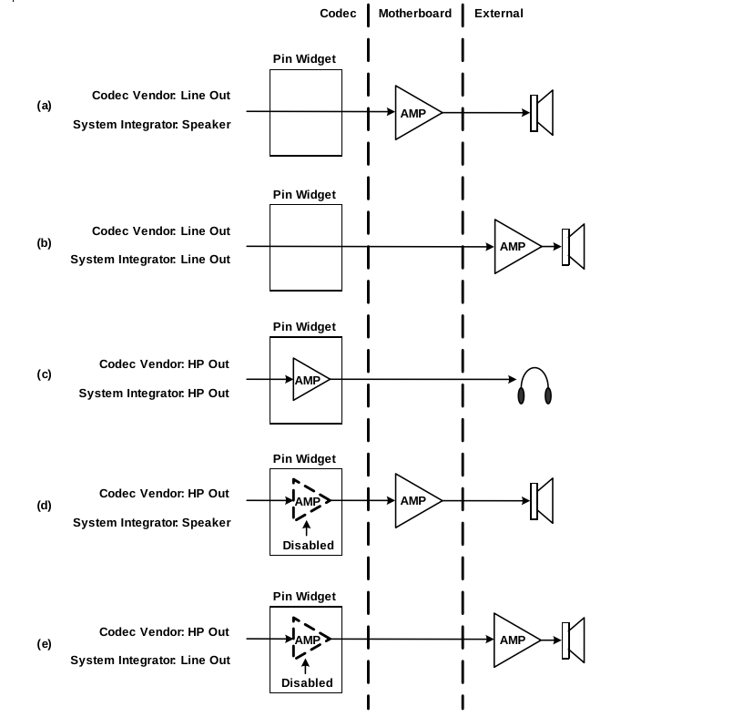

在图  (a) 中，引脚小部件没有片上放大器，因此编解码器供应商将引脚小部件的默认设备类型设置为 Line Out。主板设计人员在引脚小部件和插孔之间插入了一个板载放大器。系统集成商通过 BIOS 将默认设备类型设置为 Speaker 以指示板载放大器的存在。

在图  (b) 中，引脚小部件没有片上放大器，编解码器供应商将默认设备类型设置为 Line Out。主板设计人员将未放大的引脚小部件信号馈送到插孔，系统集成商将默认设备类型设置为 Line Out。扬声器需要外部放大。

在图  (c) 中，编解码器供应商在引脚小部件中实现了一个片上放大器，并将默认设备类型设置为 HP Out。主板设计人员将来自引脚小部件的放大信号馈送到插孔，系统集成商将默认设备类型设置为 HP Out。当发现默认设备类型为 HP Out 时，驱动程序会打开片上放大器。

在图  (d) 中，编解码器供应商在引脚小部件中实现了一个片上放大器，并将默认设备类型设置为 HP Out。主板设计人员在引脚小部件和插孔之间插入了一个板载放大器。系统集成商将默认设备类型设置为扬声器，以反映板载放大器的存在。当发现默认设备类型为扬声器时， 驱动程序会关闭片上放大器（将以直通模式运行）并打开板载放大器。

在图  (e) 中，编解码器供应商在引脚小部件中实现了一个片上放大器，并将默认设备类型设置为 HP Out。主板设计人员将信号从引脚小部件馈送到插孔，而无需插入板载放大器。系统集成商将默认设备类型设置为线路输出，以表明插孔处的信号未放大。当发现默认设备类型为线路输出时，驱动程序会关闭片上放大器（将以直通模式运行）。扬声器需要外部放大。 

#### 3.5.2.2 麦克风输入默认设备类型

麦克风设备由单个麦克风输入引脚小部件组成，可提供单声道（单通道）或立体声（双通道）捕获。每个麦克风输入引脚小部件都必须有一个专用的 ADC，除非在特殊情况下，单声道或立体声麦克风输入引脚小部件是输入引脚小部件关联的一部分，这些输入引脚小部件通过多路复用器或混频器共享单个 ADC。

如果 hda驱动程序在从麦克风输入引脚小部件到 ADC 的模拟信号路径上发现增益、增强或静音控制，它会向操作系统公开增益、增强或静音控制。

#### 3.5.2.3 Line In 输入默认设备类型

线路输入设备由单个线路输入引脚控件和专用 ADC 组成，可提供单声道（单通道）或立体声（双通道）捕获。此外，单声道或立体声线路输入引脚控件可以是输入引脚控件关联的一部分，这些输入引脚控件通过多路复用器或混频器共享单个 ADC。

hda驱动程序不要求线路输入引脚控件具有增益控制或静音控制。但是，如果线路输入引脚具有增益或静音控制，或两者兼有，则 驱动程序会将控件公开给操作系统。

**其他设备类型就不介绍了：AUX 、SPDIF Out、SPDIF In**

### 3.5.3 Pin Configuration Examples

本小节介绍三个引脚配置寄存器编程示例的详细信息，这样对默认关联和序列的作用就清楚了。

所有三个示例都使用来自 HD Audio 编解码器的同一组四个 DAC 小部件，但每个示例都以不同的方式配置相同的四个小部件，以形成不同的音频渲染设备组。每个 DAC 小部件都连接到代表立体声输出插孔的引脚小部件。主板或系统供应商通过为属于引脚小部件的引脚配置寄存器选择适当的设置来配置引脚小部件。

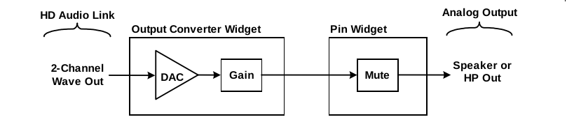

HD Audio 编解码器包含四个与上 中所示的相同的 DAC 小部件。该DAC 小部件具有增益控制，并连接到具有静音控制的引脚小部件。

三个不同的主板或系统供应商可以使用同一组四个小部件来形成以下设备：

- 示例 1：第一个供应商可以选择使用三个引脚小部件来形成六通道渲染设备（例如 5.1 环绕扬声器配置），并使用第四个引脚小部件作为独立的耳机设备。

- 示例 2：第二个供应商可以选择使用四个引脚小部件来实现没有耳机功能的八通道渲染设备（例如 7.1 家庭影院扬声器配置）。

- 示例 3：第三个供应商可以使用三个引脚小部件作为三个独立的双通道渲染设备（例如立体声扬声器），并使用第四个引脚小部件作为独立的耳机设备。

对于这三个系统中的每一个，系统集成商（OEM 或 ODM）都会对系统 BIOS 进行编程，以将值加载到编解码器的引脚配置寄存器中，这些寄存器描述了系统中的音频设备。以下部分将介绍这三个示例的详细信息。

#### 3.5.3.1 Example 1

| **Register field**           | **Pin A**                       | **Pin B**                       | **Pin C**                       | **Pin D**                       |
| ---------------------------- | ------------------------------- | ------------------------------- | ------------------------------- | ------------------------------- |
| **Port Connectivity**        | 0x0 (jack)                      | 0x0 (jack)                      | 0x0 (jack)                      | 0x0 (jack)                      |
| **Geometry Location**        | 0x1 (rear)                      | 0x1 (rear)                      | 0x1 (rear)                      | 0x2 (front)                     |
| **General (Gross) Location** | 0x0 External on primary chassis | 0x0 External on primary chassis | 0x0 External on primary chassis | 0x0 External on primary chassis |
| **Default Device**           | 0x0 (**Line Out**)              | 0x0 (**Line Out**)              | 0x0 (**Line Out**)              | 0x2 (**HP Out**)                |
| **Connection Type**          | 0x1 (1/8-inch)                  | 0x1 (1/8-inch)                  | 0x1 (1/8-inch)                  | 0x1 (1/8-inch)                  |
| **Color**                    | 0x4 (green)                     | 0x6 (orange)                    | 0x2 (gray)                      | 0x7 (green)                     |
| **Misc**                     | 0 (jack detect)                 | 0 (jack detect)                 | 0 (jack detect)                 | 0 (jack detect)                 |
| **Default Association**      | 0x5                             | 0x5                             | 0x5                             | 0xF                             |
| **Sequence**                 | 0 (FL, FR)                      | 0x1 (FC, LFE)                   | 0x4 (SL, SR)                    | 0                               |

引脚 A、B 和 C 驱动一组六个扬声器，引脚 D 驱动一组立体声耳机。

引脚 A 到 C 属于同一个引脚小部件关联。因此，它们作为单个设备一起运行。拓扑解析器将引脚 A 到 C 的序列号 (0、1、4) 识别为标识 5.1 环绕声扬声器配置，(扬声器配置这里不介绍)

耳机设备的默认关联编号为 0xF。按照惯例，驱动程序将所有具有默认关联编号 0xF 的引脚小部件视为单引脚设备。虽然这些引脚小部件在硬件资源冲突中的优先级最低，但本例中的引脚 D 具有专用的 DAC 小部件，并且没有与任何其他引脚小部件发生资源冲突。因此，低优先级不可能导致引脚 D 丢失任何硬件资源。但是，如果引脚 D 确实存在资源冲突，则需要为该引脚分配更高的优先级（即默认关联编号小于 0xF），以确保 UAA 驱动程序为该引脚分配其作为设备运行所需的资源。

根据前面描述的颜色编码建议，引脚 A、B 和 C 的插孔颜色如下

传输通道 0-1（FL 和 FR 扬声器）的引脚 A 为绿色。

传输通道 2-3（FC 和 LFE 扬声器）的引脚 B 为橙色。

传输通道 4-5（SL 和 SR 扬声器）的引脚 C 为灰色。

#### 3.5.3.2 Example 2

| **Register field**           | **Pin A**                       | **Pin B**                       | **Pin C**                       | **Pin D**                       |
| ---------------------------- | ------------------------------- | ------------------------------- | ------------------------------- | ------------------------------- |
| **Port Connectivity**        | 0 (jack)                        | 0 (jack)                        | 0 (jack)                        | 0 (jack)                        |
| **Geometry Location**        | 0x01 (rear)                     | 0x01 (rear)                     | 0x01 (rear)                     | 0x01 (rear)                     |
| **General (Gross) Location** | 0x0 External on primary chassis | 0x0 External on primary chassis | 0x0 External on primary chassis | 0x0 External on primary chassis |
| **Default Device**           | 0x0 (**Line Out**)              | 0x0 (**Line Out**)              | 0x0 (**Line Out**)              | 0x0 (**Line Out**)              |
| **Connection Type**          | 0x1 (1/8-inch)                  | 0x1 (1/8-inch)                  | 0x1 (1/8-inch)                  | 0x1 (1/8-inch)                  |
| **Color**                    | 0x4 (green)                     | 0x6 (orange)                    | 0x1 (black)                     | 0x2 (gray)                      |
| **Misc**                     | 0 (jack detect)                 | 0 (jack detect)                 | 0 (jack detect)                 | 0 (jack detect)                 |
| **Default Association**      | 0x2                             | 0x2                             | 0x2                             | 0x2                             |
| **Sequence**                 | 0 (FL, FR)                      | 0x1 (FC, LFE)                   | 0x2 (BL, BR)                    | 0x4 (SL, SR)                    |

引脚 A、B、C 和 D 组成一个多声道渲染设备，用于驱动一组八个扬声器。拓扑解析器将引脚 A 至 D 的序列号 (0、1、2、4) 识别为**7.1 家庭影院扬声器**配置，如上一节“扬声器配置”中所述。

根据前面描述的颜色编码建议，引脚 A 至 D 的插孔颜色如下：

- 引脚 A，传输通道 0 和 1（前扬声器和前扬声器），为绿色。


- 引脚 B，传输通道 2 和 3（前扬声器和后扬声器），为橙色。


- 引脚 C，传输通道 4 和 5（后扬声器和前扬声器），为黑色。


- 引脚 D，传输通道 6 和 7（后扬声器和前扬声器），为灰色。

#### 3.5.3.3 Example 3

| **Register field**           | **Pin A**           | **Pin B**                       | **Pin C**                       | **Pin D**                       |
| ---------------------------- | ------------------- | ------------------------------- | ------------------------------- | ------------------------------- |
| **Port Connectivity**        | 0x2 (fixed)         | 0 (jack)                        | 0 (jack)                        | 0 (jack)                        |
| **Geometry Location**        | 0x0 (not available) | 0x01 (rear)                     | 0x01 (rear)                     | 0x02 (front)                    |
| **General (Gross) Location** | 0x1 Internal        | 0x0 External on primary chassis | 0x0 External on primary chassis | 0x0 External on primary chassis |
| **Default Device**           | 0x1 (**Speaker**)   | 0x0 (**Line Out**)              | 0x0 (**Line Out**)              | 0x2 (**HP Out**)                |
| **Connection Type**          | 0x7 (other analog)  | 0x1 (1/8-inch)                  | 0x1 (1/8-inch)                  | 0x1 (1/8-inch)                  |
| **Color**                    | 0x0 (unknown)       | 0x4 (green)                     | 0x4 (green)                     | 0x4 (green)                     |
| **Misc**                     | 0x1 (override)      | 0 (jack detect)                 | 0 (jack detect)                 | 0 (jack detect)                 |
| **Default Association**      | 0x1                 | 0x2                             | 0x3                             | 0x4                             |
| **Sequence**                 | 0                   | 0                               | 0                               | 0                               |

引脚 A、B 和 C 分别驱动一组立体声扬声器，引脚 D 驱动一组立体声耳机。

引脚 B 到 D 的默认关联编号为 0xF，这意味着每个引脚都作为单引脚设备运行。此外，引脚 B 到 D 中的每一个都有专用的硬件资源，不与其他引脚共享。因此，这些引脚都不需要低于 0xF 的默认关联编号。

相反，此示例中的引脚 A 与某些其他引脚小部件（未在表 中显示）共享硬件资源（例如 DAC 小部件）。为确保 驱动程序将有争议的资源分配给引脚 A 而不是其他引脚小部件，BIOS 将引脚 A 的默认关联编号设置为 0x7，将其他引脚小部件的默认关联编号设置为 0xF。

引脚 A 与引脚 B 至 D 的另一个不同之处在于，引脚 A 具有固定的内部连接，可连接到集成在系统机箱中的一组立体声扬声器。相比之下，其他三个引脚具有音频插孔，可连接到外部扬声器（引脚 B 和 C）或耳机（引脚 D）。

### 3.5.4 如何解析pincfg呢

#### 3.5.4.1 解析引脚

`snd_hda_parse_pin_defcfg`函数用于解析音频设备的自动配置的函数。这个函数会根据端口的硬件信息（例如音频端口类型、连接方式、位置等）自动检测并分类音频输出和输入端口，并生成一个音频配置。可以简单理解为解析pincfg的。

怎么具体是怎么解析其实不用太关心，因为完全是根据pincfg规则来解析的。我们只需要关注这个函数的打印即可。

```
	codec_info(codec, "autoconfig for %s: line_outs=%d (0x%x/0x%x/0x%x/0x%x/0x%x) type:%s\n",
		   codec->core.chip_name, cfg->line_outs, cfg->line_out_pins[0],
		   cfg->line_out_pins[1], cfg->line_out_pins[2],
		   cfg->line_out_pins[3], cfg->line_out_pins[4],
		   cfg->line_out_type == AUTO_PIN_HP_OUT ? "hp" :
		   (cfg->line_out_type == AUTO_PIN_SPEAKER_OUT ?
		    "speaker" : "line"));
	codec_info(codec, "   speaker_outs=%d (0x%x/0x%x/0x%x/0x%x/0x%x)\n",
		   cfg->speaker_outs, cfg->speaker_pins[0],
		   cfg->speaker_pins[1], cfg->speaker_pins[2],
		   cfg->speaker_pins[3], cfg->speaker_pins[4]);
	codec_info(codec, "   hp_outs=%d (0x%x/0x%x/0x%x/0x%x/0x%x)\n",
		   cfg->hp_outs, cfg->hp_pins[0],
		   cfg->hp_pins[1], cfg->hp_pins[2],
		   cfg->hp_pins[3], cfg->hp_pins[4]);
	codec_info(codec, "   mono: mono_out=0x%x\n", cfg->mono_out_pin);
	if (cfg->dig_outs)
		codec_info(codec, "   dig-out=0x%x/0x%x\n",
			   cfg->dig_out_pins[0], cfg->dig_out_pins[1]);
	codec_info(codec, "   inputs:\n");
	for (i = 0; i < cfg->num_inputs; i++) {
		codec_info(codec, "     %s=0x%x\n",
			    hda_get_autocfg_input_label(codec, cfg, i),
			    cfg->inputs[i].pin);
	}
	if (cfg->dig_in_pin)
		codec_info(codec, "   dig-in=0x%x\n", cfg->dig_in_pin);
```

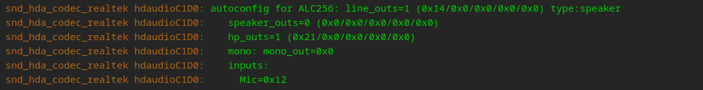

由上图可知道，该机器输入和输出的引脚以及板载的扬声器是line out类型的。

#### 3.5.4.2 解析音频路径

`snd_hda_gen_parse_auto_config`函数

该函数用于**自动解析并配置 HDA（High Definition Audio）编解码器的音频路径**。

- 主要涉及**输入、输出、多声道、自动静音、自动麦克风等功能**。
- 解析 BIOS 配置，并根据设备特性进行自动适配。
- **如果只检测到数字音频（如 HDMI），则禁用模拟输出。**

```
int snd_hda_gen_parse_auto_config(struct hda_codec *codec,
				  struct auto_pin_cfg *cfg)
{
	struct hda_gen_spec *spec = codec->spec;
	int err;

	parse_user_hints(codec);

	if (spec->mixer_nid && !spec->mixer_merge_nid)
		spec->mixer_merge_nid = spec->mixer_nid;

	if (cfg != &spec->autocfg) {
		spec->autocfg = *cfg;
		cfg = &spec->autocfg;
	}

	if (!spec->main_out_badness)
		spec->main_out_badness = &hda_main_out_badness;
	if (!spec->extra_out_badness)
		spec->extra_out_badness = &hda_extra_out_badness;

	fill_all_dac_nids(codec);                          //填充所有 DAC）节点

	if (!cfg->line_outs) {
		if (cfg->dig_outs || cfg->dig_in_pin) {
			spec->multiout.max_channels = 2;
			spec->no_analog = 1;
			goto dig_only;
		}
		if (!cfg->num_inputs && !cfg->dig_in_pin)
			return 0; /* can't find valid BIOS pin config */
	}

	if (!spec->no_primary_hp &&
	    cfg->line_out_type == AUTO_PIN_SPEAKER_OUT &&
	    cfg->line_outs <= cfg->hp_outs) {
		/* use HP as primary out */
		cfg->speaker_outs = cfg->line_outs;
		memcpy(cfg->speaker_pins, cfg->line_out_pins,
		       sizeof(cfg->speaker_pins));
		cfg->line_outs = cfg->hp_outs;
		memcpy(cfg->line_out_pins, cfg->hp_pins, sizeof(cfg->hp_pins));
		cfg->hp_outs = 0;
		memset(cfg->hp_pins, 0, sizeof(cfg->hp_pins));
		cfg->line_out_type = AUTO_PIN_HP_OUT;
	}

	err = parse_output_paths(codec);                     //根据 cfg 解析所有输出路径（包括 DAC 连接、功放等）。
	if (err < 0)
		return err;
	err = create_multi_channel_mode(codec);
	if (err < 0)
		return err;
	err = create_multi_out_ctls(codec, cfg);                //接下来创建音量调节、耳机输出、扬声器输出、独立耳机控制、麦克风输入等控制接口。
	if (err < 0)
		return err;
	err = create_hp_out_ctls(codec);
	if (err < 0)
		return err;
	err = create_speaker_out_ctls(codec);
	if (err < 0)
		return err;
	err = create_indep_hp_ctls(codec);
	if (err < 0)
		return err;
	err = create_loopback_mixing_ctl(codec);                
	if (err < 0)
		return err;
	err = create_hp_mic(codec);
	if (err < 0)
		return err;
	err = create_input_ctls(codec);
	if (err < 0)
		return err;

	/* add power-down pin callbacks at first */
	add_all_pin_power_ctls(codec, false);                    

	spec->const_channel_count = spec->ext_channel_count;
	/* check the multiple speaker and headphone pins */
	if (cfg->line_out_type != AUTO_PIN_SPEAKER_OUT)
		spec->const_channel_count = max(spec->const_channel_count,
						cfg->speaker_outs * 2);
	if (cfg->line_out_type != AUTO_PIN_HP_OUT)
		spec->const_channel_count = max(spec->const_channel_count,
						cfg->hp_outs * 2);
	spec->multiout.max_channels = max(spec->ext_channel_count,
					  spec->const_channel_count);

	err = check_auto_mute_availability(codec);              //自动静音：插入耳机时自动静音扬声器。
	if (err < 0)
		return err;

	err = check_dyn_adc_switch(codec);                      
	if (err < 0)
		return err;

	err = check_auto_mic_availability(codec);                    //自动麦克风：检测可用麦克风，并启用相关控制。
	if (err < 0)
		return err;

	/* add stereo mix if available and not enabled yet */
	if (!spec->auto_mic && spec->mixer_nid &&
	    spec->add_stereo_mix_input == HDA_HINT_STEREO_MIX_AUTO &&
	    spec->input_mux.num_items > 1) {
		err = parse_capture_source(codec, spec->mixer_nid,
					   CFG_IDX_MIX, spec->num_all_adcs,
					   "Stereo Mix", 0);
		if (err < 0)
			return err;
	}


	err = create_capture_mixers(codec);                 //创建控制录音的混音通道，使不同输入源（麦克风、立体声混音等）可用。


	if (err < 0)
		return err;

	err = parse_mic_boost(codec);                          //解析并创建 麦克风增益控制
	if (err < 0)
		return err;

	/* create "Headphone Mic Jack Mode" if no input selection is
	 * available (or user specifies add_jack_modes hint)
	 */
	if (spec->hp_mic_pin &&
	    (spec->auto_mic || spec->input_mux.num_items == 1 ||
	     spec->add_jack_modes)) {
		err = create_hp_mic_jack_mode(codec, spec->hp_mic_pin);             //
		if (err < 0)
			return err;
	}

	if (spec->add_jack_modes) {
		if (cfg->line_out_type != AUTO_PIN_SPEAKER_OUT) {
			err = create_out_jack_modes(codec, cfg->line_outs,
						    cfg->line_out_pins);
			if (err < 0)
				return err;
		}
		if (cfg->line_out_type != AUTO_PIN_HP_OUT) {
			err = create_out_jack_modes(codec, cfg->hp_outs,
						    cfg->hp_pins);
			if (err < 0)
				return err;
		}
	}

	/* add power-up pin callbacks at last */
	add_all_pin_power_ctls(codec, true);

	/* mute all aamix input initially */
	if (spec->mixer_nid)
		mute_all_mixer_nid(codec, spec->mixer_nid);

 dig_only:
	parse_digital(codec);

	if (spec->power_down_unused || codec->power_save_node) {
		if (!codec->power_filter)
			codec->power_filter = snd_hda_gen_path_power_filter;
		if (!codec->patch_ops.stream_pm)
			codec->patch_ops.stream_pm = snd_hda_gen_stream_pm;
	}

	if (!spec->no_analog && spec->beep_nid) {
		err = snd_hda_attach_beep_device(codec, spec->beep_nid);
		if (err < 0)
			return err;
		if (codec->beep && codec->power_save_node) {
			err = add_fake_beep_paths(codec);
			if (err < 0)
				return err;
			codec->beep->power_hook = beep_power_hook;
		}
	}

	return 1;
}
```

这个函数最关心的也是其输出内容，内核日志中可以打印所有输入和输出路径，这是最为简单得到hda音频拓扑的方法。

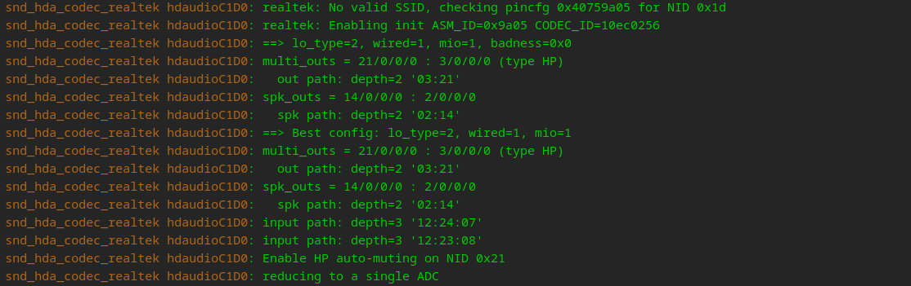

由上图可知，输出的路径有两条：

```
out path: depth=2 '03:21'               //解析出21为headphone，所以这条路径为headohone输出路径，03则为DAC
spk path: depth=2 '02:14'				//解析出14为line out类型speaker，所以这条路径为speaker输出路径，02则为DAC
```

输入路径有两条：

```
input path: depth=3 '12:24:07'
input path: depth=3 '12:23:08'
```

可以看到，两条路径的起点都为12,说明这两条路径是互斥的，同时只有一条路径工作。根据ADC的选择来判断是什么输入。

## 3.6 硬件修复

“**硬件修复**”这个词在音频驱动（如 ALSA 的 HDA 驱动）中，其实并不是真的“修复硬件”，而是指在驱动层面为某些**特定型号的声卡硬件**添加**特定的修正逻辑（如改动引脚设置、添加初始化动作为某个 Codec 芯片修复问题）**，以解决硬件行为不符合通用驱动预期的问题。

**为什么需要 Fixup？**

并不是所有声卡厂商都严格遵循 HDA 规范，有些声卡在 BIOS 中配置的引脚（Pin Config）不准确，或者行为有 bug，比如：

- 耳机插入检测不到
- 内置扬声器不工作
- 麦克风不能用

为了让这些硬件在 Linux 下也能用，就引入了 fixup 机制，在驱动中“补丁式地修复”它们。

`apply_fixup` 是一个用来应用音频硬件补丁（fixups）配置的函数。它根据不同类型的修复（fixup），例如针对音频端口的配置、音频功能的修改或音频语法的修复，来进行实际操作。它处理了多种修复类型，通过递归的方式逐个应用，处理复杂的修复链。

```
static void apply_fixup(struct hda_codec *codec, int id, int action, int depth)
{
	const char *modelname = codec->fixup_name;

	while (id >= 0) {
		const struct hda_fixup *fix = codec->fixup_list + id;

		if (++depth > 10)
			break;
		if (fix->chained_before)                                        //链式修复，递归
			apply_fixup(codec, fix->chain_id, action, depth + 1);

		switch (fix->type) {
		case HDA_FIXUP_PINS:                                             //pincfg修复
			if (action != HDA_FIXUP_ACT_PRE_PROBE || !fix->v.pins)
				break;
			codec_dbg(codec, "%s: Apply pincfg for %s\n",
				    codec->core.chip_name, modelname);
			snd_hda_apply_pincfgs(codec, fix->v.pins);
			break;
		case HDA_FIXUP_VERBS:                                            //verb修复
			if (action != HDA_FIXUP_ACT_PROBE || !fix->v.verbs)
				break;
			codec_dbg(codec, "%s: Apply fix-verbs for %s\n",
				    codec->core.chip_name, modelname);
			snd_hda_add_verbs(codec, fix->v.verbs);
			break;
		case HDA_FIXUP_FUNC:                                              //函数修复
			if (!fix->v.func)
				break;
			codec_dbg(codec, "%s: Apply fix-func for %s\n",
				    codec->core.chip_name, modelname);
			fix->v.func(codec, fix, action);
			break;
		case HDA_FIXUP_PINCTLS:                                            //pinctl修复
			if (action != HDA_FIXUP_ACT_PROBE || !fix->v.pins)
				break;
			codec_dbg(codec, "%s: Apply pinctl for %s\n",
				    codec->core.chip_name, modelname);
			set_pin_targets(codec, fix->v.pins);
			break;
		default:
			codec_err(codec, "%s: Invalid fixup type %d\n",
				   codec->core.chip_name, fix->type);
			break;
		}
		if (!fix->chained || fix->chained_before)
			break;
		id = fix->chain_id;
	}
}
```

### 3.6.1 fixup流程

接下来介绍一下**fixup**的标准流程

1. 新增或者使用已有的枚举，一般来说都是新增一项，因为很难复用已有的修复。

```
/*
* pin fix-up
*/
enum {
	PINCFG_DEBUG
};
```

2. 在**hda_fixup**表中新增一个修复内容

```
static const struct hda_fixup example_fixups[] = {
	[PINCFG_DEBUG] = {
		.type = HDA_FIXUP_PINS,
		........................
	},
};
```

3. 在**snd_pci_quirk**表中新增一个**quirk**

```
static const struct snd_pci_quirk sn6186_fixups[] = {
	SND_PCI_QUIRK(xxxx, xxxx, xxxxx, PINCFG_DEBUG),
};
```

4. 调用**snd_hda_pick_fixup**，用于选择并应用音频编解码器的修复配置的函数。它基于不同的硬件识别信息（如 `modelname`、`PCI quirks` 等）来决定是否需要应用特定的修复配置。
5. 调用**snd_hda_apply_fixup**函数，最后会调用**apply_fixup**函数真正去执行修复。

当然，不遵守标准流程也可以达到想要的效果，比如直接根据想要的修复调用**apply_fixup**最终的执行的函数，比如**snd_hda_apply_pincfgs**。但是提交代码的话还是要根据标准流程来写。另外还要主要**action**，我理解为修复时机，比如**HDA_FIXUP_ACT_PRE_PROBE**这些。

### 3.6.2 示例

#### 3.6.2.1 pin脚修复

**用于重新配置pincfg，用于覆盖bios的pincfg, 可以指定单个或多个端口的修复。**

```
	[CXT_FIXUP_TOSHIBA_P105] = {
		.type = HDA_FIXUP_PINS,
		.v.pins = (const struct hda_pintbl[]) {
			{ 0x10, 0x961701f0 }, /* speaker/hp */
			{ 0x12, 0x02a1901e }, /* ext mic */
			{ 0x14, 0x95a70110 }, /* int mic */
			{}
		},
	},
```

当然也可以在外部定义一个pincfg数组，而不是在内部。

#### 3.6.2.2 verb修复

verb修复可以理解为发送一些verb命令，通常可以用于设置input或output引脚的DAC选择

```
	[CXT_FIXUP_GPIO1] = {
		.type = HDA_FIXUP_VERBS,
		.v.verbs = (const struct hda_verb[]) {
			{ 0x01, AC_VERB_SET_GPIO_MASK, 0x01 },
			{ 0x01, AC_VERB_SET_GPIO_DIRECTION, 0x01 },
			{ 0x01, AC_VERB_SET_GPIO_DATA, 0x01 },
			{ }
		},
	},
```

#### 3.6.3.3  函数修复

函数修复就是执行某个函数，一般用于设置amp放大器相关。

```
	[CXT_FIXUP_CAP_MIX_AMP] = {
		.type = HDA_FIXUP_FUNC,
		.v.func = cxt_fixup_cap_mix_amp,
	},
```

#### 3.6.3.4 pinctl修复

pinctl修复就是单一的改变引脚的pinctl,一般使用较少

```
	[ALCS1200A_FIXUP_MIC_VREF] = {
		.type = HDA_FIXUP_PINCTLS,
		.v.pins = (const struct hda_pintbl[]) {
			{ 0x18, PIN_VREF50 }, /* rear mic */
			{ 0x19, PIN_VREF50 }, /* front mic */
			{}
		}
	},
```

#### 3.6.3.5  链式修复

链式修复就是将前面四种组合起来，按照顺序执行一个修复链。

```
	[CXT_FIXUP_HP_DOCK] = {
		.type = HDA_FIXUP_PINS,
		.v.pins = (const struct hda_pintbl[]) {
			{ 0x16, 0x21011020 }, /* line-out */
			{ 0x18, 0x2181103f }, /* line-in */
			{ }
		},
		.chained = true,
		.chain_id = CXT_FIXUP_MUTE_LED_GPIO,
	},
		[CXT_FIXUP_MUTE_LED_GPIO] = {
		.type = HDA_FIXUP_FUNC,
		.v.func = cxt_fixup_mute_led_gpio,
	},
```

这个链式修复就是先执行名为CXT_FIXUP_HP_DOCK的pincfg修复，再执行一个名为CXT_FIXUP_MUTE_LED_GPIO的函数修复。

## 3.7 插孔检测与自动切换

在 Linux 中，音频插孔的检测可以通过 **轮询** 或 **中断驱动的无请求通知（unsolicited events）** 两种方式进行，具体使用哪种方式取决于硬件的能力以及驱动的实现。

1. **中断驱动的无请求通知 (Unsolicited Events)**

大多数现代的音频硬件（尤其是带有 HDA (High Definition Audio) 规范的硬件）支持 **无请求通知 (Unsolicited Events)**，这是一种中断驱动的机制。通过这种方式，插孔检测是通过硬件自动触发的，不需要操作系统主动去轮询硬件状态。具体流程如下：

- 当音频插孔的状态发生变化时（如耳机插入或拔出），硬件生成一个中断信号，通知音频驱动器。
- 音频驱动收到这个中断后，执行插孔状态的检测和处理逻辑。
- 在 HDA 驱动中，这个中断通过 `snd_hda_jack_unsol_event` 函数来处理。

这种方式的优势是：

- **低功耗**：只有在状态变化时才会触发中断，节省了系统资源。
- **实时性高**：系统能够立即响应插孔的状态变化。

从我接触的过的hda声卡来说，在hda控制器支持的情况下，Unsolicited Events还需要该插孔有对应的控件。具体表现可以体现为，插入一个headphone插孔，amixer查看该声卡的控件时，需要对应的headphone jack存在。

2. **轮询 (Polling)**

某些音频硬件可能不支持无请求通知机制，或者硬件设计较为简单，无法生成中断信号。在这种情况下，Linux 会使用**轮询**的方式来检测插孔状态。具体流程如下：

- 系统周期性地查询插孔的状态，判断是否有设备插入或拔出。
- 在 HDA 驱动中，轮询的主要代码路径是通过 `snd_hda_jack_poll_all` 函数实现的，它会遍历所有插孔并调用 `jack_detect_update` 函数来更新每个插孔的状态。
- 轮询间隔通常由 `codec->jackpoll_interval` 设定，系统会在固定的时间间隔内检查插孔状态。

轮询方式的特点是：

- **实时性较差**：因为轮询是周期性的，所以插孔状态的变化不会被立即检测到，可能会有一些延迟，具体取决于轮询的频率。
- **功耗较高**：轮询需要定期检查状态，即使没有状态变化，也会消耗 CPU 资源，尤其在轮询频率较高的情况下。

**使用轮询方式的例子，目前接触到一个，龙芯的7A2000桥片。**

3. **结合使用**

一些系统可能会同时支持轮询和无请求通知。在这种情况下，如果硬件支持无请求通知，系统会优先使用中断驱动的方式进行插孔检测。如果不支持，则使用轮询方式作为后备机制。这通常是在驱动初始化时由驱动决定的，例如：

- 如果硬件支持无请求通知，驱动会调用相关函数来启用硬件中断机制。
- 如果硬件不支持，驱动会启动定时器并定期轮询插孔状态。

### 3.7.1 phantom_jack

`phantom_jack` 是一种 **虚拟的音频插孔（Jack）**，用于表示**没有物理接口的音频通道**。它的核心作用是：

1. **模拟物理插孔行为**
   即使设备没有实际的耳机/麦克风插孔（如某些 HDMI 声卡、USB 音频设备），系统仍可通过虚拟 `phantom_jack` 管理音频通道。
2. **支持音频路由**
   帮助 PulseAudio/PipeWire 等上层服务识别“虚拟插入”状态，确保音频流正确切换（如从扬声器切到“虚拟耳机”）。

`phantom_jack`在HDA中具体的表现为三点：1. 该jack状态始终为on，不受其他插孔的影响。2. 不支持任何插孔检测 3. 没有input device

下面我从代码解释为什么有这三个特性：

`add_jack_kctl` 是一个用于为驱动程序中的音频插孔添加控制器的函数。这个函数会根据插孔的特性（如类型和连接方式）创建合适的插孔控制器。

```
static int add_jack_kctl(struct hda_codec *codec, hda_nid_t nid,
			 const struct auto_pin_cfg *cfg,
			 const char *base_name)
{
	unsigned int def_conf, conn;
	char name[SNDRV_CTL_ELEM_ID_NAME_MAXLEN];
	int err;
	bool phantom_jack;

	if (!nid)
		return 0;
	def_conf = snd_hda_codec_get_pincfg(codec, nid);
	conn = get_defcfg_connect(def_conf);
	if (conn == AC_JACK_PORT_NONE)
		return 0;
	phantom_jack = (conn != AC_JACK_PORT_COMPLEX) ||
		       !is_jack_detectable(codec, nid);            //1. 具有不可检测性

	if (base_name)
		strlcpy(name, base_name, sizeof(name));
	else
		snd_hda_get_pin_label(codec, nid, cfg, name, sizeof(name), NULL);
	if (phantom_jack)
		/* Example final name: "Internal Mic Phantom Jack" */
		strncat(name, " Phantom", sizeof(name) - strlen(name) - 1);
	err = snd_hda_jack_add_kctl(codec, nid, name, phantom_jack);
	if (err < 0)
		return err;

	if (!phantom_jack)
		return snd_hda_jack_detect_enable(codec, nid);           //2. 如果插孔不是虚拟插孔，则调用 snd_hda_jack_detect_enable 启用插孔检测
	return 0;
}
```

ALSA框架中，`snd_jack_new`函数是中用于创建一个snd_jack，有如下代码，不会为`phantom_jack`创建input device。

```
	/* don't creat input device for phantom jack */
	if (!phantom_jack) {                       //3. 不会为`phantom_jack`创建input device。
#ifdef CONFIG_SND_JACK_INPUT_DEV
		int i;

		jack->input_dev = input_allocate_device();
		if (jack->input_dev == NULL) {
			err = -ENOMEM;
			goto fail_input;
		}

		jack->input_dev->phys = "ALSA";

		jack->type = type;

		for (i = 0; i < SND_JACK_SWITCH_TYPES; i++)
			if (type & (1 << i))
				input_set_capability(jack->input_dev, EV_SW,
						     jack_switch_types[i]);

#endif /* CONFIG_SND_JACK_INPUT_DEV */
	}
```

### 3.7.2 unsol_event

先来介绍插孔检测的功能函数`call_jack_callback` ，用于调用与插孔相关的回调函数。在hda音频编解码器（HDA codec）中，当插孔状态发生变化时，可能有多个回调需要执行。该函数会处理插孔及其相关联（gated）的插孔回调，gated目前没有接触到，可以不用太关注。

```
static void call_jack_callback(struct hda_codec *codec,
			       struct hda_jack_tbl *jack)
{
	struct hda_jack_callback *cb;

	for (cb = jack->callback; cb; cb = cb->next)
		cb->func(codec, cb);                                //回调函数headphone和mic的是不一样的
	if (jack->gated_jack) {
		struct hda_jack_tbl *gated =
			snd_hda_jack_tbl_get(codec, jack->gated_jack);
		if (gated) {
			for (cb = gated->callback; cb; cb = cb->next)
				cb->func(codec, cb);
		}
	}
}
```

```
void snd_hda_jack_unsol_event(struct hda_codec *codec, unsigned int res)
{
	struct hda_jack_tbl *event;
	int tag = (res >> AC_UNSOL_RES_TAG_SHIFT) & 0x7f;

	event = snd_hda_jack_tbl_get_from_tag(codec, tag);
	if (!event)
		return;
	event->jack_dirty = 1;                                   //将插孔标记为脏

	call_jack_callback(codec, event);                        
	snd_hda_jack_report_sync(codec);                         //插孔状态同步，用户控件才会知道更新了状态
}
```

需要关注的是`snd_hda_jack_report_sync`，具体实现就不介绍了，核心是调用2.2.2小节介绍的`snd_jack_report`函数

### 3.7.3  jack_poll

```
void snd_hda_jack_poll_all(struct hda_codec *codec)
{
	struct hda_jack_tbl *jack = codec->jacktbl.list;
	int i, changes = 0;

	for (i = 0; i < codec->jacktbl.used; i++, jack++) {
		unsigned int old_sense;
		if (!jack->nid || !jack->jack_dirty || jack->phantom_jack)
			continue;
		old_sense = get_jack_plug_state(jack->pin_sense);                    //读取老插孔状态
		jack_detect_update(codec, jack);                                     //更新插孔状态
		if (old_sense == get_jack_plug_state(jack->pin_sense))
			continue;
		changes = 1;
		call_jack_callback(codec, jack);
	}
	if (changes)
		snd_hda_jack_report_sync(codec);                                //上报状态
}
```

插孔检测轮询的方式有较多弊端，首先就是响应不够灵敏。另一个就是在codec下电后，插孔状态更新了，codec上电后可能无法正常感知到(声卡驱动的问题)。

### 3.7.4 自动切换条件

**本节所讨论的自动切换是两个端口使用相同ADC/DAC, 比如headphone和speaker使用相同的DAC, 所以这两个只有一个能工作在插入耳机时控制中心不能让speaker显示，MIC同理。如果使用的是不同的ADC/DAC那么就需要系统层的配置文件来控制对应端口的switch控件，否则就会有同时输入或输出的情况。**


在3.7.2节代码注释中可以看到headphone和mic对应的回调都是不一样的，也就是cb->func不一样。那么首先讨论一下是怎么设置这个回调的。

```
struct hda_jack_callback *
snd_hda_jack_detect_enable_callback(struct hda_codec *codec, hda_nid_t nid,
				    hda_jack_callback_fn func)
{
	struct hda_jack_tbl *jack;
	struct hda_jack_callback *callback = NULL;
	int err;

	jack = snd_hda_jack_tbl_new(codec, nid);
	if (!jack)
		return ERR_PTR(-ENOMEM);
检查 callback 是否已存在，
	callback = find_callback_from_list(jack, func);            //检查 callback 是否已存在，避免重复注册同一个 callback

	if (func && !callback) {
		callback = kzalloc(sizeof(*callback), GFP_KERNEL);
		if (!callback)
			return ERR_PTR(-ENOMEM);
		callback->func = func;										//设置回调
		callback->nid = jack->nid;
		callback->next = jack->callback;
		jack->callback = callback;
	}

	if (jack->jack_detect)
		return callback; /* already registered */
	jack->jack_detect = 1;
	if (codec->jackpoll_interval > 0)
		return callback; /* No unsol if we're polling instead */       //当前系统使用 polling 方式检测
	err = snd_hda_codec_write_cache(codec, nid, 0,                    //配置 unsolicited event
					 AC_VERB_SET_UNSOLICITED_ENABLE,
					 AC_USRSP_EN | jack->tag);
	if (err < 0)
		return ERR_PTR(err);
	return callback;
}
```

该函数的作用为 HDA codec 的某个 pin（nid）开启耳机/插孔检测（jack detect），并注册一个回调函数，在插拔时通知驱动。

#### 3.7.4.1 mic自动切换


```
static int check_auto_mic_availability(struct hda_codec *codec)
{
	struct hda_gen_spec *spec = codec->spec;
	struct auto_pin_cfg *cfg = &spec->autocfg;
	unsigned int types;
	int i, num_pins;

	if (spec->suppress_auto_mic)
		return 0;

	types = 0;
	num_pins = 0;
	for (i = 0; i < cfg->num_inputs; i++) {
		hda_nid_t nid = cfg->inputs[i].pin;
		unsigned int attr;
		attr = snd_hda_codec_get_pincfg(codec, nid);
		attr = snd_hda_get_input_pin_attr(attr);
		if (types & (1 << attr))                    //防止有同一个类型
			return 0; /* already occupied */
		switch (attr) {
		case INPUT_PIN_ATTR_INT:
			if (cfg->inputs[i].type != AUTO_PIN_MIC)
				return 0; /* invalid type */
			break;
		case INPUT_PIN_ATTR_UNUSED:
			return 0; /* invalid entry */
		default:
			if (cfg->inputs[i].type > AUTO_PIN_LINE_IN)
				return 0; /* invalid type */
			if (!spec->line_in_auto_switch &&
			    cfg->inputs[i].type != AUTO_PIN_MIC)
				return 0; /* only mic is allowed */
			if (!is_jack_detectable(codec, nid))
				return 0; /* no unsol support */
			break;
		}
		if (num_pins >= MAX_AUTO_MIC_PINS)
			return 0;
		types |= (1 << attr);
		spec->am_entry[num_pins].pin = nid;
		spec->am_entry[num_pins].attr = attr;
		num_pins++;
	}

	if (num_pins < 2)                                 //至少需要两个 mic
		return 0;

	spec->am_num_entries = num_pins;
	/* sort the am_entry in the order of attr so that the pin with a
	 * higher attr will be selected when the jack is plugged.
	 */
	sort(spec->am_entry, num_pins, sizeof(spec->am_entry[0]),
	     compare_attr, NULL);                          //排序，插入优先级高的设备时自动切换。

	if (!auto_mic_check_imux(codec))
		return 0;

	spec->auto_mic = 1;                             //启用 auto mic
	spec->num_adc_nids = 1;
	spec->cur_mux[0] = spec->am_entry[0].idx;
	codec_dbg(codec, "Enable auto-mic switch on NID 0x%x/0x%x/0x%x\n",
		    spec->am_entry[0].pin,
		    spec->am_entry[1].pin,
		    spec->am_entry[2].pin);

	return 0;
}
```

>函数遍历所有输入 pin，读取 pin 配置得到 **pin 属性**。属性可能是下面几种：
>
>```
>enum {
>	AC_JACK_LOC_EXTERNAL = 0x00,
>	AC_JACK_LOC_INTERNAL = 0x10,
>	AC_JACK_LOC_SEPARATE = 0x20,
>	AC_JACK_LOC_OTHER    = 0x30,
>};
>```
>
>**不能有两个相同类型的 mic，例如：两个 internal mic，否则 auto-switch 无法判断。即使能出发unsol_work也不能真正执行自动切换的回调函数**
>
>必须支持 jack detect。

在检查函数中又调用了auto_mic_check_imux，继续往下看：

```
static bool auto_mic_check_imux(struct hda_codec *codec)
{
	struct hda_gen_spec *spec = codec->spec;
	const struct hda_input_mux *imux;
	int i;

	imux = &spec->input_mux;
	for (i = 0; i < spec->am_num_entries; i++) {
		spec->am_entry[i].idx =
			find_idx_in_nid_list(spec->am_entry[i].pin,
					     spec->imux_pins, imux->num_items);
		if (spec->am_entry[i].idx < 0)
			return false; /* no corresponding imux */
	}

	/* we don't need the jack detection for the first pin */
	for (i = 1; i < spec->am_num_entries; i++)
		snd_hda_jack_detect_enable_callback(codec,
						    spec->am_entry[i].pin,
						    call_mic_autoswitch);
	return true;
}
```

>检查 auto-mic 的 pin 是否都能在 input mux 中找到，如果可以，就为外接 mic pin 启用 jack detect 回调，以便插拔时自动切换麦克风。

那么最后是在哪里切换的路径呢？从`call_mic_autoswitch`这个函数继续向下排查，可以发现有如下函数：

```
void snd_hda_activate_path(struct hda_codec *codec, struct nid_path *path,
			   bool enable, bool add_aamix)
{
	struct hda_gen_spec *spec = codec->spec;
	int i;

	path->active = enable;

	/* make sure the widget is powered up */
	if (enable && (spec->power_down_unused || codec->power_save_node))
		path_power_update(codec, path, codec->power_save_node);

	for (i = path->depth - 1; i >= 0; i--) {
		hda_nid_t nid = path->path[i];

		if (enable && path->multi[i])
			snd_hda_codec_write_cache(codec, nid, 0,
					    AC_VERB_SET_CONNECT_SEL,
					    path->idx[i]);
		if (has_amp_in(codec, path, i))
			activate_amp_in(codec, path, i, enable, add_aamix);
		if (has_amp_out(codec, path, i))
			activate_amp_out(codec, path, i, enable);
	}
}
```

>**该函数非常重要，是在更新路径时激活音频路径的函数。！！！！**
>
>在该函数中使用snd_hda_codec_write_cache将ADC新选择的端口写入，这样就切换了路径。

#### 3.7.4.2 输出自动切换

输出自动切换的检测条件在函数`check_auto_mute_availability`中，函数就不介绍了。里面也会根据解析的端口配置(pincfg)来设置回调。但是我要介绍插上耳机后扬声器或者line out的pin control会清0的情况。

需要关注一下do_automute这个函数，在spec没有设置auto_mute_via_amp字段的话，就会通过硬件的方式静音。会直接使用`update_pin_ctl`这个宏将扬声器的pin control清0。

```
/* standard HP/line-out auto-mute helper */
static void do_automute(struct hda_codec *codec, int num_pins, hda_nid_t *pins,
			int *paths, bool mute)
{
	struct hda_gen_spec *spec = codec->spec;
	int i;

	for (i = 0; i < num_pins; i++) {
		hda_nid_t nid = pins[i];
		unsigned int val, oldval;
		if (!nid)
			break;

		oldval = snd_hda_codec_get_pin_target(codec, nid);
		if (oldval & PIN_IN)
			continue; /* no mute for inputs */

		if (spec->auto_mute_via_amp) {
			struct nid_path *path;
			hda_nid_t mute_nid;

			path = snd_hda_get_path_from_idx(codec, paths[i]);
			if (!path)
				continue;
			mute_nid = get_amp_nid_(path->ctls[NID_PATH_MUTE_CTL]);
			if (!mute_nid)
				continue;
			if (mute)
				spec->mute_bits |= (1ULL << mute_nid);
			else
				spec->mute_bits &= ~(1ULL << mute_nid);
			continue;
		} else {
			/* don't reset VREF value in case it's controlling
			 * the amp (see alc861_fixup_asus_amp_vref_0f())
			 */
			if (spec->keep_vref_in_automute)
				val = oldval & ~PIN_HP;
			else
				val = 0;
			if (!mute)
				val |= oldval;
			/* here we call update_pin_ctl() so that the pinctl is
			 * changed without changing the pinctl target value;
			 * the original target value will be still referred at
			 * the init / resume again
			 */
			update_pin_ctl(codec, nid, val);
		}

		set_pin_eapd(codec, nid, !mute);
		if (codec->power_save_node) {
			bool on = !mute;
			if (on)
				on = detect_pin_state(codec, nid);
			set_path_power(codec, nid, on, -1);
		}
	}
}
```


## 3.8 HDA调试工具

### 3.8.1 hdajacksensetest

该工具用来查看codec的针脚pin value和状态。

例如：sudo hdajacksensetest -c 0 （0是声卡编号)

```
Pin 0x14 (Green Line Out, Rear side): present = No
Pin 0x18 (Pink Mic, Rear side): present = No
Pin 0x19 (Pink Mic, Front side): present = No
Pin 0x1a (Blue Line In, Rear side): present = No
Pin 0x1b (Green Headphone, Front side): present = yes         //该插孔是插入状态
```

### 3.8.2 hdajackretask

该工具有GUI界面主要用来重新配置pin config和也可用来查看输入输出的pin cfg。功能不止如此

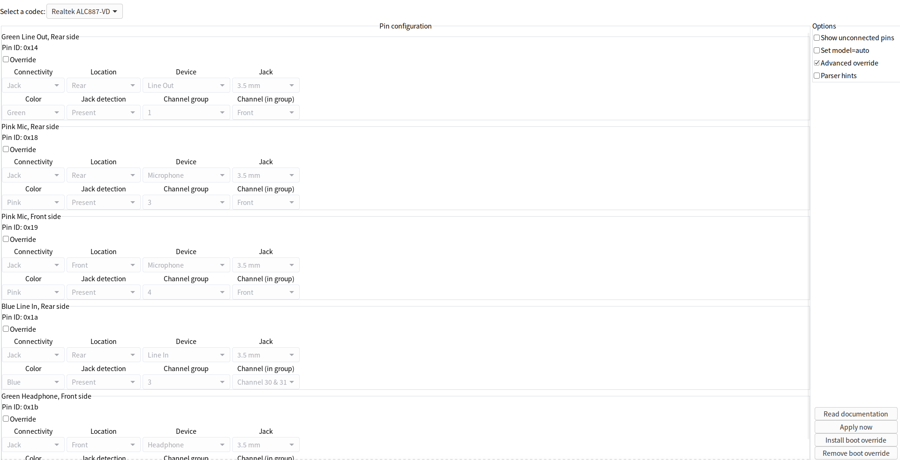

### 3.8.3 hda -verb

hda-verb命令的格式如下：

```
hda-verb dev nid verb parm
```

dev：  hda编解码器设备节点(/dev/snd/hwC0D0或者/dev/snd/hwC1D0)
nid：   要将verb发送到的codec的NID(节点ID)
verb： 要发送的verb(可以用数值，也可以用hda-verb -l命令的verbs中的字符串)
parm：verb的参数(可以用数值，也可以用hda-verb -l命令的parameters中的字符串)

#### 3.8.3.1 **示例** 

- 获取厂商ID

```
hda-verb /dev/snd/hwC0D0 0x00 0xf00 0x00
```

- 在音频硬件中检测插孔（如耳机插孔或麦克风插孔）当前的状态。这包括检测插孔是否插入了设备。

```
hda-verb /dev/snd/hwC0D0 nid 0xf09 0x00
```

- 用于获取与音频设备相关的系数索引。

```
hda-verb /dev/snd/hwC0D0 nid 0xd00 0x00
```

- 用于设置音频设备的系数索引。

```
hda-verb /dev/snd/hwC0D0 nid 0x500 [parm]
```

- **设置系数索引**：通过 `0x500` 命令码将系数索引设置为你感兴趣的值。这样，你告诉硬件你要读取哪个系数。

- **读取处理系数**：通过 `0xc00` 命令码读取当前设置的系数的值。这将返回你刚刚设置的系数索引的处理系数。

  ```
   先设置coeff index，verb 0x500
       hda-verb /dev/snd/hwC0D0 nid 0x500 [parm]
   再读取coeff寄存器值，verb 0xc00
       hda-verb /dev/snd/hwC0D0 nid 0xc00 0x00
  ```

#### 3.8.3.2 获取（GET）命令：

GET_STREAM_FORMAT (0x0a00)
获取当前音频流的格式。此命令用于查询特定音频节点当前正在使用的音频格式，如采样率、比特深度、声道数等。

**GET_AMP_GAIN_MUTE (0x0b00)**
获取放大器的增益和静音状态。此命令用于查询音频输出的音量和是否处于静音状态。

GET_PROC_COEF (0x0c00)
获取处理器系数。通常与音频处理相关，可能用于查询某些DSP（数字信号处理）操作的当前系数。

GET_COEF_INDEX (0x0d00)
获取处理器系数的索引。这个命令用于查询当前选择的DSP处理系数索引。

PARAMETERS (0x0f00)
获取节点的参数信息。通常用于查询设备支持的功能和参数。

**GET_CONNECT_SEL (0x0f01)**
获取连接选择信息。用于查询音频节点目前连接的其他节点（例如输入/输出的选择）。

GET_CONNECT_LIST (0x0f02)
获取连接列表。此命令返回特定节点可以连接的目标节点列表。

GET_PROC_STATE (0x0f03)
获取处理器状态。用于查询音频处理器的当前状态。

GET_SDI_SELECT (0x0f04)
获取SDI（串行数据接口）选择。此命令用于查询设备选择的串行数据通道。

GET_POWER_STATE (0x0f05)
获取电源状态。用于查询音频节点的当前电源状态（如待机、活动等）。

GET_CONV (0x0f06)
获取转换器状态。用于查询音频转换器的当前状态。

**GET_PIN_WIDGET_CONTROL (0x0f07)**
获取针脚（Pin Widget）控制状态。用于查询音频插孔（如耳机、麦克风等）的当前控制状态。

GET_UNSOLICITED_RESPONSE (0x0f08)
获取未经请求的响应设置。查询节点是否启用了未经请求的通知机制。

**GET_PIN_SENSE (0x0f09)**
获取针脚感知状态。用于检测插孔是否连接了设备，如耳机或麦克风。

GET_BEEP_CONTROL (0x0f0a)
获取蜂鸣器控制状态。查询音频蜂鸣器的当前状态或配置。

**GET_EAPD_BTLENABLE (0x0f0c)**
获取外部放大器使能状态（EAPD）。查询外部功率放大器是否启用。

GET_DIGI_CONVERT_1 (0x0f0d)
获取数字音频转换器 1 的状态。用于查询数字转换器的相关信息。

GET_DIGI_CONVERT_2 (0x0f0e)
获取数字音频转换器 2 的状态。类似于 GET_DIGI_CONVERT_1，但针对另一个数字转换器。

GET_VOLUME_KNOB_CONTROL (0x0f0f)
获取音量旋钮控制状态。查询硬件音量旋钮的当前控制值。

GET_GPIO_DATA (0x0f15)
获取GPIO（通用输入输出）数据。查询音频设备的GPIO引脚的状态。

GET_GPIO_MASK (0x0f16)
获取GPIO掩码。查询GPIO的使用掩码，通常用于筛选需要监视或操作的引脚。

GET_GPIO_DIRECTION (0x0f17)
获取GPIO方向。查询GPIO引脚的方向是输入还是输出。

GET_GPIO_WAKE_MASK (0x0f18)
获取GPIO唤醒掩码。查询哪些GPIO引脚可以唤醒设备。

GET_GPIO_UNSOLICITED_RSP_MASK (0x0f19)
获取GPIO未经请求的响应掩码。查询哪些GPIO引脚配置为未经请求的响应。

GET_GPIO_STICKY_MASK (0x0f1a)
获取GPIO粘性掩码。查询哪些GPIO引脚保持其状态（粘性引脚）。

GET_CONFIG_DEFAULT (0x0f1c)
获取默认配置。查询音频节点的默认配置参数。

GET_SUBSYSTEM_ID (0x0f20)
获取子系统ID。查询音频设备的子系统标识符。

#### 3.8.3.4 设置（SET）命令：

SET_STREAM_FORMAT (0x200)
设置音频流格式。指定音频节点的音频格式参数，如采样率、比特率等。

**SET_AMP_GAIN_MUTE (0x300)**
设置放大器增益和静音状态。用于调整音频输出的音量并启用或禁用静音。

SET_PROC_COEF (0x400)
设置处理器系数。通常用于修改音频处理器的DSP系数。

SET_COEF_INDEX (0x500)
设置处理器系数索引。用于选择DSP处理的系数索引。

**SET_CONNECT_SEL (0x701)**
设置连接选择。用于选择音频节点的输入或输出连接。

SET_PROC_STATE (0x703)
设置处理器状态。用于改变音频处理器的状态。

SET_SDI_SELECT (0x704)
设置SDI选择。配置设备使用的串行数据通道。

SET_POWER_STATE (0x705)
设置电源状态。调整音频设备的电源模式。

SET_CHANNEL_STREAMID (0x706)
设置通道和流ID。用于分配音频流和通道ID。

**SET_PIN_WIDGET_CONTROL (0x707)**
设置针脚控件。配置音频针脚的行为（如输入/输出等）。

SET_UNSOLICITED_ENABLE (0x708)
设置未经请求的响应。启用或禁用节点的未经请求响应通知。

SET_PIN_SENSE (0x709)
设置针脚感知。用于启用或配置针脚感知机制。

SET_BEEP_CONTROL (0x70a)
设置蜂鸣器控制。控制音频蜂鸣器的行为。

**SET_EAPD_BTLENABLE (0x70c)**
设置外部放大器使能。启用或禁用外部音频功放。

SET_DIGI_CONVERT_1 (0x70d)
设置数字音频转换器 1。配置数字音频的转换参数。

SET_DIGI_CONVERT_2 (0x70e)
设置数字音频转换器 2。类似于 SET_DIGI_CONVERT_1，但针对另一个转换器。

SET_VOLUME_KNOB_CONTROL (0x70f)
设置音量旋钮控制。调整硬件音量旋钮的行为。

SET_GPIO_DATA (0x715)
设置GPIO数据。改变GPIO引脚的输出状态。

SET_GPIO_MASK (0x716)
设置GPIO掩码。配置哪些GPIO引脚处于激活状态。

SET_GPIO_DIRECTION (0x717)
设置GPIO方向。配置GPIO引脚为输入或输出。

SET_GPIO_WAKE_MASK (0x718)
设置GPIO唤醒掩码。配置哪些GPIO引脚可以唤醒系统。

SET_GPIO_UNSOLICITED_RSP_MASK (0x719)
设置GPIO未经请求的响应掩码。配置哪些GPIO引脚会触发未经请求的响应。

SET_GPIO_STICKY_MASK (0x71a)
设置GPIO粘性掩码。定义哪些GPIO引脚保持其状态。

**SET_CONFIG_DEFAULT_BYTES_0 (0x71c)**                                     //这4个verb在verbtable用于设置pincfg。在用户空间中一个就可以设置pincfg
设置默认配置字节 0。配置音频节点的第一个默认配置字节。

**SET_CONFIG_DEFAULT_BYTES_1 (0x71d)**
设置默认配置字节 1。配置音频节点的第二个默认配置字节。

**SET_CONFIG_DEFAULT_BYTES_2 (0x71e)**
设置默认配置字节 2。配置音频节点的第三个默认配置字节。

**SET_CONFIG_DEFAULT_BYTES_3 (0x71f)**
设置默认配置字节 3。配置音频节点

#### 3.8.3.5 param

param需要和PARAMETERS (0x0f00)一起搭配使用

1. **VENDOR_ID (0x00)**
   - **功能**：读取或设置Codec的供应商ID。
   - **作用**：识别设备制造商及其唯一标识符。
   
2. **SUBSYSTEM_ID (0x01)**

   - **功能**：读取或设置Codec的子系统ID。
   - **作用**：识别子系统的制造商或附加设备的独特ID。

3. **REV_ID (0x02)**

   - **功能**：读取或设置Codec的修订版ID。
   - **作用**：获取Codec硬件或固件的修订版本信息。

4. **NODE_COUNT (0x04)**

   - **功能**：查询Codec中节点的数量。
   - **作用**：获取Codec内部的节点数量，帮助分析和操作多个音频节点。

5. **FUNCTION_TYPE (0x05)**

   - **功能**：识别功能组的类型。
   - **作用**：确定节点功能组的类型（例如音频功能组、调制解调器等）。

6. **AUDIO_FG_CAP (0x08)**

   - **功能**：查询音频功能组的能力。
   - **作用**：获取音频功能组的能力信息，如最大通道数、采样率支持等。

7. **AUDIO_WIDGET_CAP (0x09)**

   - **功能**：查询音频Widget的能力。
   - **作用**：获取有关音频小部件（如输出、输入、混音器等）的能力和特性。

8. **PCM (0x0a)**

   - **功能**：与PCM流相关的操作。
   - **作用**：设置或读取与Pulse Code Modulation (PCM)音频流相关的参数（如格式、比特率等）。

9. **STREAM (0x0b)**

   - **功能**：设置或读取流信息。
   - **作用**：处理音频数据流的相关配置，包括流ID和通道分配。

10. **PIN_CAP (0x0c)**

   - **功能**：查询针脚（Pin）的能力。
   - **作用**：获取与输入/输出针脚相关的能力信息，如支持哪些功能（如耳机检测、音量控制等）。

11. **AMP_IN_CAP (0x0d)**

   - **功能**：查询输入放大器的能力。
   - **作用**：获取输入音频放大器的相关参数，如最大增益、静音控制等。

12. **CONNLIST_LEN (0x0e)**

   - **功能**：查询连接列表的长度。
   - **作用**：获取节点连接列表的长度，以确定该节点能够连接到多少其他节点。

13. **POWER_STATE (0x0f)**

   - **功能**：查询或设置电源状态。
   - **作用**：控制Codec的电源状态以节省电量或实现功耗管理。

14. **PROC_CAP (0x10)**

   - **功能**：查询处理能力。
   - **作用**：获取处理器相关功能的信息，例如音频处理单元的能力。

15. **GPIO_CAP (0x11)**

   - **功能**：查询通用输入输出（GPIO）的能力。
   - **作用**：获取Codec中GPIO的配置能力，控制GPIO引脚的输入或输出功能。

16. **AMP_OUT_CAP (0x12)**

   - **功能**：查询输出放大器的能力。
   - **作用**：获取输出音频放大器的相关参数，如增益范围和静音支持。

17. **VOL_KNB_CAP (0x13)**

   - **功能**：查询音量旋钮的能力。
   - **作用**：获取与音量旋钮相关的功能，如是否支持硬件音量调节。

这些参数用于对音频硬件设备的各个部分进行查询或配置，通过读取这些寄存器的内容，可以了解音频设备的硬件配置与功能。

**注：更多的verb和parm全部定义在hda_verb.h文件中，介绍的仅是hda-verb -l所示。**

#### 3.8.3.6 拼接verb命令

所谓拼接命令，本质上是**verb**和**parm**拼接而成，由于并没有在**hda_verb.h**文件直接声明，但是最终通过代码拼接出一个命令。

下面举一个非常常用的例子：

```
hda-verb /dev/snd/hwC0D0 nid 0xb80 0x00              //查看DAC的右声道的增益(音量)
```

首先可以知道GET_AMP_GAIN_MUTE (0x0b00)是用于获取放大器的增益和静音状态的verb.

```
#define snd_hdac_regmap_encode_amp(nid, ch, dir, idx)			\
	(snd_hdac_regmap_encode_verb(nid, AC_VERB_GET_AMP_GAIN_MUTE) |	\
	 ((ch) ? AC_AMP_GET_RIGHT : AC_AMP_GET_LEFT) |			\
	 ((dir) == HDA_OUTPUT ? AC_AMP_GET_OUTPUT : AC_AMP_GET_INPUT) | \
	 (idx))
#define snd_hdac_regmap_encode_verb(nid, verb)		\
	(((verb) << 8) | 0x80000 | ((unsigned int)(nid) << 20))
```

可以根据如下代码拼接一个“新”的verb：

```
(0b00<<8) | AC_AMP_GET_RIGHT| AC_AMP_GET_OUTPUT | 0 = (0b00<<8) | 0 | (1<<15)| 0 =0xb80
```

**同理可得，查看DAC的左声道的增益为0xbA0,设置DAC左声道的增益为0x3A0，设置DAC右声道的增益为0x390**。

在代码中体现的比较直观一点。

```
snd_hda_codec_read(codec, nid, 0x0, 0xb00, 0x8000) = snd_hda_codec_read(codec, nid, 0x0, 0xb80, 0x0)
```

无非是在构建命令时的|运算时机的问题。

#### 3.8.3.7 示例-------verb修改pincfg且无需重启

以日常办公机清华同方为例。

首先确定需要修改的nid，可以根据内核日志或者hdajacksensetest,现在以`3.8.1`的结果为示例，比如我想修改`0x1b`为不配置功能

- 先查一下现在使用的cfg

  - ```
    sudo hda-verb /dev/snd/hwC0D0 0x1b 0xf1c 0         //结果为0x2214020
    ```

- 设置目标cfg，比如为0x411111f0并验证

  - ```
    sudo hda-verb /dev/snd/hwC0D0 0x1b 0x71c 0xf0       //先设置低位
    sudo hda-verb /dev/snd/hwC0D0 0x1b 0x71d 0x11
    sudo hda-verb /dev/snd/hwC0D0 0x1b 0x71e 0x11
    sudo hda-verb /dev/snd/hwC0D0 0x1b 0x71f 0x44
    sudo hda-verb /dev/snd/hwC0D0 0x1b 0xf1c 0xf0		//结果为0x411111f0
    ```

- 重新bind生效，因为不能重启

  - ```
    echo 0000:00:1f.3 > /sys/class/sound/card0/device/driver/unbind
    echo 0000:00:1f.3 > /sys/class/sound/card0/device/driver/bind
    ```

### 3.8.4 codecgraph

**codecgraph**工具将这个文件生成描述codec内部拓扑结构的svg图。

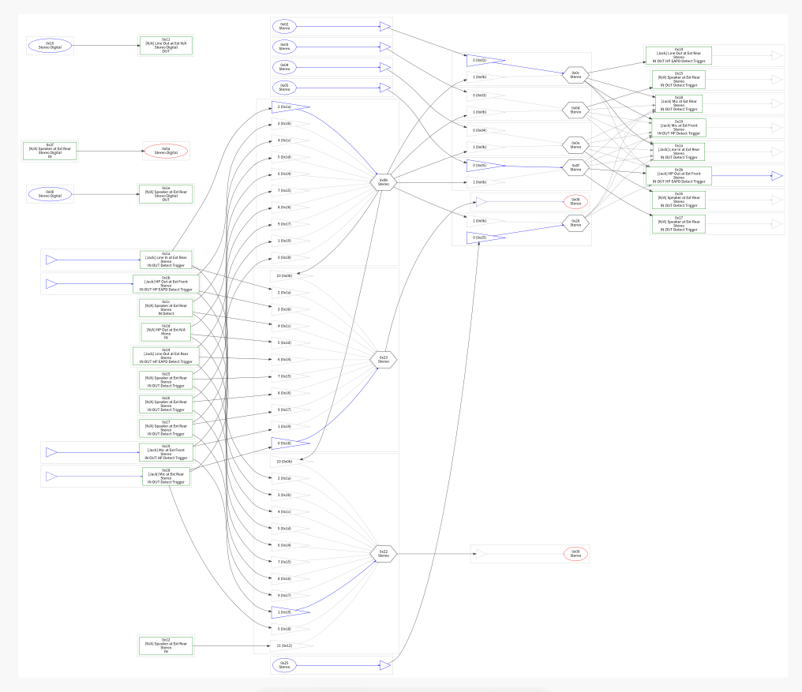

实际上这个工具用处不大，建议使用`Codec Proc-File`

### 3.8.4 **Codec Proc-File**

**codec**的proc file是调试HDA的宝箱，这个文件里面详细记录了codec内的所有widget信息。proc文件是/proc/asound/card/codec#, 每个codec对应一个proc文件。我们可以直接执行cat查看这个文件内的内容。

下面根据实际声卡codec来解释，在这个示例中只需关注这些节点即可：

```
Codec: Realtek ALC887-VD                                //声卡名
Address: 0  
AFG Function Id: 0x1 (unsol 1)
Vendor Id: 0x10ec0887                                   //声卡厂商，10ec代表是realtek,0887代表是alc887，定义在hda_device_id表中
Subsystem Id: 0x1849288a							    //ssid, 1849代表整机厂商，288a可以理解为编号
Revision Id: 0x100302                                   //很少用到，在R6xx HDMI声卡中需要根据这个字段区分是不是统一声卡
```

```
No Modem Function Group found
Default PCM:
    rates [0x5f0]: 32000 44100 48000 88200 96000 192000                     //支持采样率
    bits [0xe]: 16 20 24                                                    //位宽
    formats [0x1]: PCM                                                      //只支持PCM格式
Default Amp-In caps: N/A
Default Amp-Out caps: N/A
State of AFG node 0x01:                                                       //AFG节点
  Power states:  D0 D1 D2 D3 CLKSTOP EPSS
  Power: setting=D0, actual=D0
GPIO: io=2, o=0, i=0, unsolicited=1, wake=0
  IO[0]: enable=0, dir=0, wake=0, sticky=0, data=0, unsol=0
  IO[1]: enable=0, dir=0, wake=0, sticky=0, data=0, unsol=0 
```

```
Node 0x02 [Audio Output] wcaps 0x41d: Stereo Amp-Out                          //DAC节点
  Control: name="Front Playback Volume", index=0, device=0
    ControlAmp: chs=3, dir=Out, idx=0, ofs=0
  Device: name="ALC887-VD Analog", type="Audio", device=0
  Amp-Out caps: ofs=0x40, nsteps=0x40, stepsize=0x03, mute=0        
  //ofs=0x40: 偏移量/初始值为64(0x40)nsteps=0x40: 共有64级音量调节(0-63)    stepsize=0x03: 每步增益为0.375dB(3×0.125dB) mute=0: 不支持硬件静音
  Amp-Out vals:  [0x33 0x33]					        //当前左右声道的音量值都是0x33		
  Converter: stream=1, channel=0                      //音频转换器：stream是流的编号，只要使用了该DAC且建立播放流了就会为非0值。
  PCM:                                                                         //采样率和位宽
    rates [0x560]: 44100 48000 96000 192000
    bits [0xe]: 16 20 24
    formats [0x1]: PCM
  Power states:  D0 D1 D2 D3 EPSS
  Power: setting=D0, actual=D0

Node 0x05 [Audio Output] wcaps 0x41d: Stereo Amp-Out                     //DAC节点,立体声，输出方向
  Control: name="Headphone Playback Volume", index=0, device=0           //headphone音量控制
    ControlAmp: chs=3, dir=Out, idx=0, ofs=0
  Amp-Out caps: ofs=0x40, nsteps=0x40, stepsize=0x03, mute=0             
  //ofs=0x40: 偏移量  nsteps=0x40: 共有64级音量调节(0-63)    stepsize=0x03: 每步增益为0.375dB(3×0.125dB) mute=0: 不支持硬件静音
  Amp-Out vals:  [0x33 0x33]                                //当前左右声道的音量值都是0x33	
  Converter: stream=1, channel=0                            //音频转换器：stream是流的编号，只要使用了该DAC且建立播放流了就会为非0值
  PCM:
    rates [0x560]: 44100 48000 96000 192000
    bits [0xe]: 16 20 24
    formats [0x1]: PCM
  Power states:  D0 D1 D2 D3 EPSS
  Power: setting=D0, actual=D0

Node 0x07 [Vendor Defined Widget] wcaps 0xf00000: Mono
Node 0x08 [Audio Input] wcaps 0x10051b: Stereo Amp-In                 //ADC，音频输入节点
  Control: name="Capture Volume", index=0, device=0                   //两个控制项： 捕获音量控制，捕获开关控制
    ControlAmp: chs=3, dir=In, idx=0, ofs=0
  Control: name="Capture Switch", index=0, device=0
    ControlAmp: chs=3, dir=In, idx=0, ofs=0
  Device: name="ALC887-VD Analog", type="Audio", device=0
  Amp-In caps: ofs=0x10, nsteps=0x2e, stepsize=0x03, mute=1       //增益范围：0x10到0x3e，46级调节(0x2e)
  Amp-In vals:  [0x2e 0x2e]                                       //当前增益设置为最大值46(0x2e)
  Converter: stream=1, channel=0                                 //转换器信息：使用流1，通道0，SDI选择器设置为0
  SDI-Select: 0
  PCM:
    rates [0x560]: 44100 48000 96000 192000                        //支持的采样率：44.1kHz、48kHz、96kHz、192kHz
    bits [0xe]: 16 20 24                                           //支持的位深：16-bit、20-bit、24-bit
    formats [0x1]: PCM
  Power states:  D0 D1 D2 D3 EPSS
  Power: setting=D0, actual=D0
  Connection: 1
     0x23                                                        //连接到1个输入源：节点0x23
Node 0x09 [Audio Input] wcaps 0x10051b: Stereo Amp-In              //功能同0x08一样，但是这个声卡没使用
  Control: name="Capture Volume", index=1, device=0
    ControlAmp: chs=3, dir=In, idx=0, ofs=0
  Control: name="Capture Switch", index=1, device=0
    ControlAmp: chs=3, dir=In, idx=0, ofs=0
  Device: name="ALC887-VD Alt Analog", type="Audio", device=2                 //从这里可以看到这个device是ALT的，所以不用
  Amp-In caps: ofs=0x10, nsteps=0x2e, stepsize=0x03, mute=1
  Amp-In vals:  [0xad 0xac]
  Converter: stream=0, channel=0
  SDI-Select: 0
  PCM:
    rates [0x560]: 44100 48000 96000 192000
    bits [0xe]: 16 20 24
    formats [0x1]: PCM
  Power states:  D0 D1 D2 D3 EPSS
  Power: setting=D0, actual=D0
  Connection: 1
     0x22                                                            //那么这个也不用关注

Node 0x0b [Audio Mixer] wcaps 0x20010b: Stereo Amp-In
  Control: name="Front Mic Playback Volume", index=0, device=0
    ControlAmp: chs=3, dir=In, idx=1, ofs=0
  Control: name="Front Mic Playback Switch", index=0, device=0
    ControlAmp: chs=3, dir=In, idx=1, ofs=0
  Control: name="Rear Mic Playback Volume", index=0, device=0
    ControlAmp: chs=3, dir=In, idx=0, ofs=0
  Control: name="Rear Mic Playback Switch", index=0, device=0
    ControlAmp: chs=3, dir=In, idx=0, ofs=0
  Control: name="Line Playback Volume", index=0, device=0
    ControlAmp: chs=3, dir=In, idx=2, ofs=0
  Control: name="Line Playback Switch", index=0, device=0
    ControlAmp: chs=3, dir=In, idx=2, ofs=0
  Amp-In caps: ofs=0x17, nsteps=0x1f, stepsize=0x05, mute=1
  Amp-In vals:  [0x80 0x80] [0x87 0x87] [0x12 0x12] [0x80 0x80] [0x80 0x80] [0x80 0x80] [0x80 0x80] [0x80 0x80] [0x80 0x80] [0x80 0x80]
  Connection: 10
     0x18 0x19 0x1a 0x1b 0x1c 0x1d 0x14 0x15 0x16 0x17
Node 0x0c [Audio Mixer] wcaps 0x20010b: Stereo Amp-In           
  Amp-In caps: ofs=0x00, nsteps=0x00, stepsize=0x00, mute=1
  Amp-In vals:  [0x00 0x00] [0x80 0x80]                    //第一组为非静音状态，第二组为静音状态
  Connection: 2                                             //连接到2个节点
     0x02 0x0b

Node 0x0f [Audio Mixer] wcaps 0x20010b: Stereo Amp-In         //一个音频混音器节点，负责混合来自节点0x05和0x0b的音频信号
  Amp-In caps: ofs=0x00, nsteps=0x00, stepsize=0x00, mute=1              //支持静音功能
  Amp-In vals:  [0x00 0x00] [0x80 0x80]                         //第一组为非静音状态，第二组为静音状态
  Connection: 2                     //连接到2个节点
     0x05 0x0b                  

Node 0x14 [Pin Complex] wcaps 0x40058d: Stereo Amp-Out                   //引脚复合节点，代表物理线路输出接口
  Control: name="Front Playback Switch", index=0, device=0   //前置播放开关控制(尽管这是后置接口，可能命名有误)控制左右声道(立体声)的输出开关
    ControlAmp: chs=3, dir=Out, idx=0, ofs=0
  Amp-Out caps: ofs=0x00, nsteps=0x00, stepsize=0x00, mute=1            //这里没啥用，因为要看DAC的值
  Amp-Out vals:  [0x80 0x80]                                            //如果控制中心选择了line out,这里应该不为0x80
  Pincap 0x0001003e: IN OUT HP EAPD Detect Trigger
  EAPD 0x2: EAPD                                                         //支持并启用了EAPD
  Pin Default 0x01014010: [Jack] Line Out at Ext Rear //一个绿色的1/8英寸(3.5mm)后置线路输出插孔，默认关联到设备组0x1，序列号为0x0
    Conn = 1/8, Color = Green
    DefAssociation = 0x1, Sequence = 0x0
  Pin-ctls: 0x40: OUT                        //当前配置为输出模式(OUT)，没有启用耳机或Vref功能
  Unsolicited: tag=05, enabled=1             //支持非请求响应(插拔检测)，标签为05，已启用
  Power states:  D0 D1 D2 D3 EPSS
  Power: setting=D0, actual=D0
  Connection: 1
     0x0c                                        //仅连接到1个内部节点0x0c

Node 0x18 [Pin Complex] wcaps 0x40058f: Stereo Amp-In Amp-Out          //脚复合节点，代表物理音频接口
  Control: name="Center Playback Switch", index=0, device=0
    ControlAmp: chs=1, dir=Out, idx=0, ofs=0
  Control: name="LFE Playback Switch", index=0, device=0
    ControlAmp: chs=2, dir=Out, idx=0, ofs=0
  Control: name="Rear Mic Boost Volume", index=0, device=0                   //后置麦克风增益控制
    ControlAmp: chs=3, dir=In, idx=0, ofs=0
  Amp-In caps: ofs=0x00, nsteps=0x03, stepsize=0x27, mute=0            //3级增益调节(0-2)每步增益为4.875dB(0x27×0.125dB)
  Amp-In vals:  [0x00 0x00]                                              //当前设置为最低增益(0x00)
  Amp-Out caps: ofs=0x00, nsteps=0x00, stepsize=0x00, mute=1            
  Amp-Out vals:  [0x80 0x80]
  Pincap 0x00003736: IN OUT Detect Trigger
    Vref caps: HIZ 50 GRD 80 100
  Pin Default 0x01a19030: [Jack] Mic at Ext Rear            //一个粉色的1/8英寸(3.5mm)后置麦克风插孔，默认关联到设备组0x3，序列号为0x0
    Conn = 1/8, Color = Pink
    DefAssociation = 0x3, Sequence = 0x0
  Pin-ctls: 0x21: IN VREF_50                               //当前配置为输入模式(IN)，使用50%的Vref参考电压(VREF_50)
  Unsolicited: tag=03, enabled=1                           //支持非请求响应(插拔检测)，标签为03，已启用
  Power states:  D0 D1 D2 D3 EPSS
  Power: setting=D0, actual=D0
  Connection: 5
     0x0c* 0x0d 0x0e 0x0f 0x26                          //当前选择连接到0x0c(*表示)

Node 0x19 [Pin Complex] wcaps 0x40058f: Stereo Amp-In Amp-Out              //一个引脚复合节点，通常代表物理音频接口
  Control: name="Front Mic Boost Volume", index=0, device=0                //控制项名为(前置麦克风增益)
    ControlAmp: chs=3, dir=In, idx=0, ofs=0                                //控制左右声道(立体声)的麦克风输入增益
  Amp-In caps: ofs=0x00, nsteps=0x03, stepsize=0x27, mute=0            //3级增益调节(0-2)每步增益为4.875dB(0x27×0.125dB)
  Amp-In vals:  [0x02 0x02]                                           // 当前设置为第2级(0x02)
  Amp-Out caps: ofs=0x00, nsteps=0x00, stepsize=0x00, mute=1          //没啥用，因为被配置成输入
  Amp-Out vals:  [0x80 0x80]
  Pincap 0x0000373e: IN OUT HP Detect Trigger               
    Vref caps: HIZ 50 GRD 80 100                         //支持多种Vref(参考电压)设置：高阻抗(HIZ)、50%、地(GRD)、80%、100%
  Pin Default 0x02a19040: [Jack] Mic at Ext Front             //一个粉色的1/8英寸(3.5mm)前置麦克风插孔
    Conn = 1/8, Color = Pink
    DefAssociation = 0x4, Sequence = 0x0
  Pin-ctls: 0x24: IN VREF_80                             //pinctl为0x24
  Unsolicited: tag=02, enabled=1                         //支持非请求响应(插拔检测)
  Power states:  D0 D1 D2 D3 EPSS
  Power: setting=D0, actual=D0
  Connection: 5                                          //5个连接选项
     0x0c* 0x0d 0x0e 0x0f 0x26                                //连接列表，当前连在0x0c节点上

Node 0x1a [Pin Complex] wcaps 0x40058f: Stereo Amp-In Amp-Out           //引脚复合节点，代表物理音频接口
  Control: name="Surround Playback Switch", index=0, device=0          //没啥用，因为被配制成输入
    ControlAmp: chs=3, dir=Out, idx=0, ofs=0
  Control: name="Line Boost Volume", index=0, device=0                 //线路line in增益控制控制左右声道的输入增益
    ControlAmp: chs=3, dir=In, idx=0, ofs=0
  Amp-In caps: ofs=0x00, nsteps=0x03, stepsize=0x27, mute=0       //3级增益调节(0-2),每步增益为4.875dB(0x27×0.125dB)
  Amp-In vals:  [0x00 0x00]                     //当前设置为最低增益(0x00)
  Amp-Out caps: ofs=0x00, nsteps=0x00, stepsize=0x00, mute=1
  Amp-Out vals:  [0x80 0x80]
  Pincap 0x00003736: IN OUT Detect Trigger
    Vref caps: HIZ 50 GRD 80 100
  Pin Default 0x0181303f: [Jack] Line In at Ext Rear    //一个蓝色的1/8英寸(3.5mm)后置线路输入插孔,默认关联到设备组0x3,序列号为0xf
    Conn = 1/8, Color = Blue
    DefAssociation = 0x3, Sequence = 0xf
  Pin-ctls: 0x20: IN VREF_HIZ                         //pinctl为0x20
  Unsolicited: tag=04, enabled=1                      //支持非请求响应(插拔检测)，标签为04，已启用
  Power states:  D0 D1 D2 D3 EPSS
  Power: setting=D0, actual=D0
  Connection: 5                                     //5个连接选项
     0x0c* 0x0d 0x0e 0x0f 0x26                      //连接列表，当前连在0x0c节点上

Node 0x1b [Pin Complex] wcaps 0x40058f: Stereo Amp-In Amp-Out             //引脚复合节点，代表物理耳机接口
  Control: name="Headphone Playback Switch", index=0, device=0            //耳机播放开关控制,控制左右声道(立体声)的输出开关
    ControlAmp: chs=3, dir=Out, idx=0, ofs=0
  Amp-In caps: ofs=0x00, nsteps=0x03, stepsize=0x27, mute=0               //没啥用，被配制成输出了
  Amp-In vals:  [0x00 0x00]
  Amp-Out caps: ofs=0x00, nsteps=0x00, stepsize=0x00, mute=1              //这里也没啥用，因为需要看DAC的amp
  Amp-Out vals:  [0x00 0x00]
  Pincap 0x0001373e: IN OUT HP EAPD Detect Trigger
    Vref caps: HIZ 50 GRD 80 100
  EAPD 0x2: EAPD                                                         //外部放大器控制(EAPD)
  Pin Default 0x02214020: [Jack] HP Out at Ext Front          //1个绿色的1/8英寸(3.5mm)前置耳机输出插孔，默认关联到设备组0x2，序列号为0x0
    Conn = 1/8, Color = Green
    DefAssociation = 0x2, Sequence = 0x0
  Pin-ctls: 0xc0: OUT HP VREF_HIZ                       //当前配置为输出模式(OUT)，作为耳机输出(HP)
  Unsolicited: tag=01, enabled=1                          //支持非请求响应(插拔检测)，标签为01，已启用
  Power states:  D0 D1 D2 D3 EPSS
  Power: setting=D0, actual=D0
  Connection: 5                                              //5个连接选项
     0x0c 0x0d 0x0e 0x0f* 0x26                               //当前选择连接到0x0f(*表示)

Node 0x23 [Audio Mixer] wcaps 0x20010b: Stereo Amp-In                //一个多输入混音器节点
  Amp-In caps: ofs=0x00, nsteps=0x00, stepsize=0x00, mute=1
  Amp-In vals:  [0x80 0x80] [0x00 0x00] [0x80 0x80] [0x80 0x80] [0x80 0x80] [0x80 0x80] [0x80 0x80] [0x80 0x80] [0x80 0x80] [0x80 0x80] [0x80 0x80]               //11组输入控制，每组对应一个连接源：第2组[0x00 0x00]: 非静音状态(活动输入)，其他组[0x80 0x80]: 静音状态
  //当控制中心选择其他输出时，连接源的状态就会变化。
  Connection: 11    
     0x18 0x19 0x1a 0x1b 0x1c 0x1d 0x14 0x15 0x16 0x17 0x0b            //对应节点0x19处于活动状态
```

那么一张新的声卡都需要关注哪些信息呢

> 首先就是Vendor Id、ssid，这让我们知道用的是什么声卡，也是最准确的。通常使用aplay -l就能看到声卡型号，但是在一下“坏”的环境下就看不到或者只能匹配到generic驱动
>
> 之后需要找到这台机器使用的所有插孔的pin 脚信息，可以使用hdajacksensetest列出所有的插孔，继而找到对应的信息。
>
> 对于输出来说，我们需要关注其路径上的DAC状态，比如音量,转换器信息等；对于输入来说，我们需要关注其路径上的ADC状态，比如音量、boost等信息。
>
> codec的音频拓扑都是根据一些节点的connect list和connect select生成的。我们可以根据内核日志来查看(3.5.4.2已介绍过)，或者自己解析。

### 3.8.5 HDA Reconfiguration

通过/sys/class/sound/hwCxDy下的文件，我们可以查看和动态的修改HDA下codec的配置。该目录下主要有如下文件:

**afg** - 只读的AFG(audio function group) ID.  
**mfg** - 只读的MFG ID.  
**name - codec**的名称，可以直接写入新字符串进行修改。  
**init_verbs** - 初始化时需要额外执行的verbs，添加需要的verb到这个文件，可以在初始化时被执行。  
**hints** - 给codec的暗示，例如写入jack_detect = no 就会禁止掉codec的jack dectection功能。  
**init_pin_configs** - 记录BIOS设置的initial pin default config。  
**driver_pin_configs** - 记录codec修改掉pin default config值的部分。  
**user_pin_configs** - 写入自己设定的配置可以覆盖掉BIOS启动时的设置。  
**reconfig** - 触发codec重新配置，一旦往这个文件写入任意值，驱动就会re-initialize the codec tree again。  
**clear** - Resets the codec, removes the mixer elements and PCM stuff of the specified codec, and clear all init verbs and hints  
实例：当你想修改pin widget 0x14 值为0x00，并且让驱动重新配置,执行如下命令:

### 3.8.6 hda_analysis

**hda_analysis**可以说是hda最为全面的调试工具，包含了Code Proc-File、codecgraph、hda-verb的功能，同时拥有一个GUI界面，可以随时更改音量、DAC与输出引脚的连接路径、更改Widget Capabilities等功能。

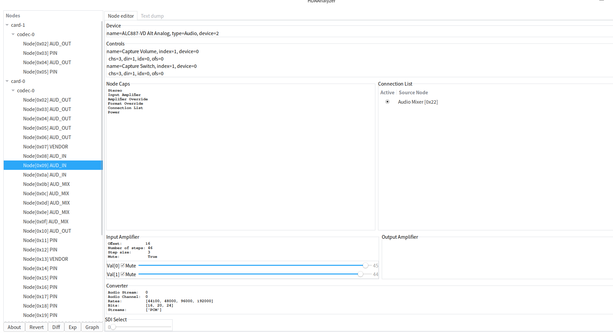

## 3.9 HDA框架 probe流程

由3.1章的HDA硬件框图可以看到，HDA控制器是挂在pci总线上的，而HDA codec又是通过hda总线与hda控制器进行连接。所以整个HDA的probe分为两步，分为先 probe hda控制器再probe codec。

### 3.9.1 hda控制器probe

HDA控制器驱动也就是pci driver定义在`sound/pci/hda/hda_intel.c`中(飞腾和龙芯有另外的驱动文件)

```
static struct pci_driver azx_driver = {
	.name = KBUILD_MODNAME,
	.id_table = azx_ids,
	.probe = azx_probe,
	.remove = azx_remove,
	.shutdown = azx_shutdown,
	.driver = {
		.pm = AZX_PM_OPS,
	},
};
```

需要关注的就是id_table了，包含着各个厂商的pciid。probe函数这里就不介绍了，可以理解为一个pci driver。

### 3.9.2 hda codec probe

接下来就是重点介绍codec的probe了。信创机器的hda codec驱动都在`sound/pci/hda/`目录下，源码文件以patch_XXX命名，主要是两家厂商**realtek(patch_realtek.c)和senarytech(patch_conexant.c和patch_senarytech.c)**。当然部分显卡音频驱动也在hda_hdmi.c中，这里不讨论显卡音频。

#### 3.9.2.1 codec实例创建

在`azx_probe`中会调用`azx_create`函数创建hda控制器实例,之后会通过一系列流程probe codec。

```
azx_probe()
      │
      ▼
azx_create() ——> INIT_WORK(&hda->probe_work, azx_probe_work);
      │
      ▼
schedule_work(&hda->probe_work);
      │
      ▼
azx_probe_work()
      │
      ▼
azx_probe_continue()
      │
      ▼
azx_probe_codecs()
```

下面来看看azx_probe_codecs函数干了什么

```
int azx_probe_codecs(struct azx *chip, unsigned int max_slots)
{
	struct hdac_bus *bus = azx_bus(chip);
	int c, codecs, err;

	codecs = 0;
	if (!max_slots)
		max_slots = AZX_DEFAULT_CODECS;

	/* First try to probe all given codec slots */
	for (c = 0; c < max_slots; c++) {
		if ((bus->codec_mask & (1 << c)) & chip->codec_probe_mask) {
			if (probe_codec(chip, c) < 0) {
				/* Some BIOSen give you wrong codec addresses
				 * that don't exist
				 */
				dev_warn(chip->card->dev,
					 "Codec #%d probe error; disabling it...\n", c);
				bus->codec_mask &= ~(1 << c);
				/* More badly, accessing to a non-existing
				 * codec often screws up the controller chip,
				 * and disturbs the further communications.
				 * Thus if an error occurs during probing,
				 * better to reset the controller chip to
				 * get back to the sanity state.
				 */
				azx_stop_chip(chip);
				azx_init_chip(chip, true);
			}
		}
	}

	/* Then create codec instances */
	for (c = 0; c < max_slots; c++) {
		if ((bus->codec_mask & (1 << c)) & chip->codec_probe_mask) {
			struct hda_codec *codec;
			err = snd_hda_codec_new(&chip->bus, chip->card, c, &codec);
			if (err < 0)
				continue;
			codec->jackpoll_interval = get_jackpoll_interval(chip);
			codec->beep_mode = chip->beep_mode;
			codecs++;
		}
	}
	if (!codecs) {
		dev_err(chip->card->dev, "no codecs initialized\n");
		return -ENXIO;
	}
	return 0;
}
```

**扫描 HDA controller 上的 codec slot → 探测是否有 codec → 为每个 codec 创建 `struct hda_codec` 设备对象。**

HDA 硬件结构是这样的：

```
HDA Controller
      │
      ├─ Codec Slot 0
      ├─ Codec Slot 1
      ├─ Codec Slot 2
      └─ Codec Slot N
```

每个 slot 上可能挂一个 **codec 芯片**（Realtek / Conexant / HDMI audio 等）。

这个函数分 **两个阶段**：探测 codec 是否存在 (probe)再创建 codec 设备对象。其中探测是通过发送verb命令并查看响应来决定的。具体函数如下：

```
static int probe_codec(struct azx *chip, int addr)
{
	unsigned int cmd = (addr << 28) | (AC_NODE_ROOT << 20) |
		(AC_VERB_PARAMETERS << 8) | AC_PAR_VENDOR_ID;
	struct hdac_bus *bus = azx_bus(chip);
	int err;
	unsigned int res = -1;

	mutex_lock(&bus->cmd_mutex);
	chip->probing = 1;
	azx_send_cmd(bus, cmd);
	err = azx_get_response(bus, addr, &res);
	chip->probing = 0;
	mutex_unlock(&bus->cmd_mutex);
	if (err < 0 || res == -1)
		return -EIO;
	dev_dbg(chip->card->dev, "codec #%d probed OK\n", addr);
	return 0;
}
```

#### 3.9.2.2 codec驱动匹配

在创建完codec实例后，肯定要和不同codec型号的驱动进行绑定。同样在`azx_probe_continue`函数中会调用如下函数

```
int snd_hda_codec_configure(struct hda_codec *codec)
{
	int err;

	if (is_generic_config(codec))
		codec->probe_id = HDA_CODEC_ID_GENERIC;
	else
		codec->probe_id = 0;

	err = snd_hdac_device_register(&codec->core);          //把 codec 注册为 Linux device model 的一个 device。
	if (err < 0)
		return err;

	if (!codec->preset)
		codec_bind_module(codec);  							//绑定目标codec的驱动
	if (!codec->preset) {
		err = codec_bind_generic(codec);                   //匹配generic驱动，也就是snd-hda-codec-generic驱动
		if (err < 0) {
			codec_err(codec, "Unable to bind the codec\n");
			goto error;
		}
	}

	return 0;

 error:
	snd_hdac_device_unregister(&codec->core);
	return err;
}
```

这个函数完成 **codec driver 的自动匹配 + 自动加载模块 + probe**，有兴趣可以看看内部的几个函数怎么实现的。反正就是先device_add再device_attach。最后就是讲讲驱动的probe了前面说的是codec实例的probe。

**这里强调一嘴，有些声卡使用generic驱动也基本能正常工作。使用codec的目标驱动无非是针对特殊的情况进行一些修复而已。**

- 首先关注一下hda codec驱动的注册

```
#define hda_codec_driver_register(drv) \
	__hda_codec_driver_register(drv, KBUILD_MODNAME, THIS_MODULE)
void hda_codec_driver_unregister(struct hda_codec_driver *drv);
#define hda_codec_driver_register(drv) \
	module_driver(drv, hda_codec_driver_register, \
		      hda_codec_driver_unregister)
```

由上述宏定义可知`hda_codec_driver_register`是注册hda codec驱动的，不过都用`hda_codec_driver_register`，示例如下

```
module_hda_codec_driver(realtek_driver);
module_hda_codec_driver(conexant_driver);
module_hda_codec_driver(senary_driver);
```

- 注册函数

```
int __hda_codec_driver_register(struct hda_codec_driver *drv, const char *name,
			       struct module *owner)
{
	drv->core.driver.name = name;
	drv->core.driver.owner = owner;
	drv->core.driver.bus = &snd_hda_bus_type;
	drv->core.driver.probe = hda_codec_driver_probe;
	drv->core.driver.remove = hda_codec_driver_remove;
	drv->core.driver.shutdown = hda_codec_driver_shutdown;
	drv->core.driver.pm = &hda_codec_driver_pm;
	drv->core.type = HDA_DEV_LEGACY;
	drv->core.match = hda_codec_match;
	drv->core.unsol_event = hda_codec_unsol_event;
	return driver_register(&drv->core.driver);
}
```

这个函数跟其他设备驱动没有本质区别，还是总线-设备-驱动那一套。

`snd_hda_bus_type`就是hda总线，定义如下

```
struct bus_type snd_hda_bus_type = {
	.name = "hdaudio",
	.match = hda_bus_match,       //用于匹配
	.uevent = hda_uevent,
};
```

`hda_codec_match`就是用于根据hda_device_id匹配codec型号的，hda_bus_match会调用它。比如我上面提到的三个文件中，每个文件都有hda_device_id表

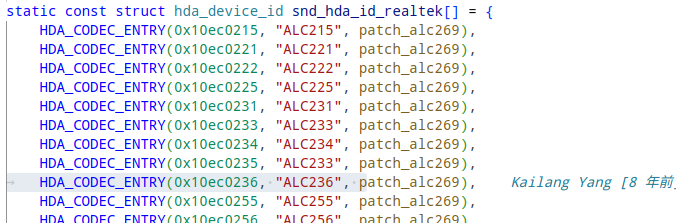

`hda_codec_unsol_event`就是响应codec的插拔事件、按键事件等，相关事件处理在3.7节中已经介绍过了。

`hda_codec_driver_probe`就是codec的probe函数，函数如下

```
static int hda_codec_driver_probe(struct device *dev)
{
	struct hda_codec *codec = dev_to_hda_codec(dev);
	struct module *owner = dev->driver->owner;
	hda_codec_patch_t patch;
	int err;

	if (WARN_ON(!codec->preset))
		return -EINVAL;

	err = snd_hda_codec_set_name(codec, codec->preset->name);
	if (err < 0)
		goto error;
	err = snd_hdac_regmap_init(&codec->core);
	if (err < 0)
		goto error;

	if (!try_module_get(owner)) {
		err = -EINVAL;
		goto error;
	}

	patch = (hda_codec_patch_t)codec->preset->driver_data;         //调用目标codec的probe
	if (patch) {
		err = patch(codec);
		if (err < 0)
			goto error_module_put;
	}

	err = snd_hda_codec_build_pcms(codec);                           //为codec创建pcm设备
	if (err < 0)
		goto error_module;
	err = snd_hda_codec_build_controls(codec);                        //为codec创建控件
	if (err < 0)
		goto error_module;
	/* only register after the bus probe finished; otherwise it's racy */
	if (!codec->bus->bus_probing && codec->card->registered) {
		err = snd_card_register(codec->card);
		if (err < 0)
			goto error_module;
		snd_hda_codec_register(codec);
	}

	codec->core.lazy_cache = true;
	return 0;

 error_module:
	if (codec->patch_ops.free)
		codec->patch_ops.free(codec);
 error_module_put:
	module_put(owner);

 error:
	snd_hda_codec_cleanup_for_unbind(codec);
	return err;
}
```

>probe中主要做了regmap初始化，hda也是支持regmap机制的。
>
>其次，最重要的是调用目标codec id的probe函数，比如上述hda_deviced_id表中alc233就要调用patch_alc269函数。
>
>然后为codec创建pcm设备和创建控件。

## 3.10 Smart PA

对于Smart PA(简称PA)我了解的也不多，只知道是一种喇叭，好像可以智能控制功率来达到节能的作用。正常应该单独作为一个大章节来写的，但是我只在HDA codec中遇到过，所以在这里提一嘴。

我在适配过程中遇到的PA场景较少，只有两种，且驱动我也没咋看过。。。

- 深蕾的sn6180 codec带艾为的PA(当然并不是所有的sn6180都有PA)，代表机器是联想X1。
- 华为hwe机器似乎也带PA,用的也是深蕾的codec。

PA中DSP，所以我觉得数据的传输和滤波什么的都是这个DSP完成的。

**写这小节的目的是让读者知道有这么个东西，有兴趣的话可以深入了解。**

------

# 四、USB Audio

usb audio这一块的代码并不多，出问题的概率也较少，通常情况下有无声或者卡顿的问题都是usb控制器的问题。

本章篇幅较短，具体还是以看代码为主，相关代码在`sound/usb/`目录下。

## 4.1 音频拓扑

USB Aduio的音频拓扑并没有非常直观的工具或者日志能看到，只能根据其USB音频控制接口描述符自己分析，不过分析起来也较为简单。

### 4.1.1 单元与终端

USB Aduio的音频拓扑由标准单元和终端组成

- 输入终端 - Input Terminal (IT)：**输入终端（IT）用于音频功能与“外部世界”的连接。其代表音频的数据源。**
- 输出终端 - Output Terminal (OT)： **输出终端（OT）用于音频功能内部单元与“外部世界”之间的接口。其代表音频数据的去向。**
- 混音器单元 - Mixer Unit (MU)： **混音单元（MU）将多个逻辑输入信道转换成多个逻辑输出信道。**
- 选择器单元 - Selector Unit (SU)：**选择器单元用于从多个集群(其中每个包含多个逻辑通道）选择其中一个路由到输出通道。**
- 特性单元 - Feature Unit (FU)：**特性单元 本质上是一个多通道处理单元，它提供多个传入逻辑通道上的单参数音频控制。对于每个逻辑通道，功能部件单元可选地为以下功能提供音频控制：**
  - **静音**
  - 音量
  - 音调控制（低音、中音、高音）
  - 图形均衡器
  - 自动增益控制
  - 延迟
  - 低音增强
  - 响度
  - 输入增益
  - 输入增益垫
  - 相逆变器
- 采样速率转换单元 - Sampling Rate Converter Unit (RU)：**采样速率转换单元作为一种可选的方式被包括在这里，以指示在音频功能中采样率转换发生的确切位置。**
- 特效单元 - Effect Unit (EU)：**特效单元一个多信道处理单元，它在每个信道的基础上对传入的逻辑信道提供多参数音频控制的高级操作。比如：混响，均衡器等。**
- 处理单元(PU) - Processing Unit (PU)：**处理单元（PU）表示音频功能内部的一个功能块，它将逻辑输入通道，分为一个或多个群集，并分成若干个逻辑输出通道一个集群。**
- 扩展单元(XU) - Extension Unit (XU)：**用于厂商用自定义。**

除了单元和终端外，还引入了时钟实体的概念。定义了三种类型的时钟实体

- 时钟源 - Clock Source (CS)
- 时钟选择器 - Clock Selector (CX)
- 时钟倍频器 - Clock Multiplier (CM)

### 4.1.2 示例

在**mixer_maps.c**中有许多类似注释，展示了较为复杂的音频拓扑。

```
/*
 * Topology of SB Extigy (see on the wide screen :)

USB_IN[1] --->FU[2]------------------------------+->MU[16]-->PU[17]-+->FU[18]--+->EU[27]--+->EU[21]-->FU[22]--+->FU[23] > Dig_OUT[24]
                                                 ^                  |          |          |                   |
USB_IN[3] -+->SU[5]-->FU[6]--+->MU[14] ->PU[15]->+                  |          |          |                   +->FU[25] > Dig_OUT[26]
           ^                 ^                   |                  |          |          |
Dig_IN[4] -+                 |                   |                  |          |          +->FU[28]---------------------> Spk_OUT[19]
                             |                   |                  |          |
Lin-IN[7] -+-->FU[8]---------+                   |                  |          +----------------------------------------> Hph_OUT[20]
           |                                     |                  |
Mic-IN[9] --+->FU[10]----------------------------+                  |
           ||                                                       |
           ||  +----------------------------------------------------+
           VV  V
           ++--+->SU[11]-->FU[12] --------------------------------------------------------------------------------------> USB_OUT[13]
*/

```

不过，目前我接触到的jUSB声卡较为简单，以USB ID为**31b2:0020**  的声卡为例

通过lsusb -v -d 31b2:0020或者usbview可以得到USB声卡设备信息

```
AudioControl Interface Descriptor:
    bLength                12
    bDescriptorType        36
    bDescriptorSubtype      2 (INPUT_TERMINAL)              //输入终端
    bTerminalID             2                               //终端ID
    wTerminalType      0x0201 Microphone                    //mic
    bAssocTerminal          0
    bNrChannels             2
    wChannelConfig     0x0003                               //左右声道
    Left Front (L)
    Right Front (R)
    iChannelNames           0 
    iTerminal               0 
AudioControl Interface Descriptor:
    bLength                 9
    bDescriptorType        36
    bDescriptorSubtype      3 (OUTPUT_TERMINAL)               //输出终端
    bTerminalID             4
    wTerminalType      0x0101 USB Streaming                  //代表主机
    bAssocTerminal          0
    bSourceID               3                                //源ID为3
    iTerminal               0 
AudioControl Interface Descriptor:
    bLength                10
    bDescriptorType        36
    bDescriptorSubtype      6 (FEATURE_UNIT)                   //特性单元
    bUnitID                 3                                  //单元ID为3,所以输出连接到这儿
    bSourceID               2                                  //源ID为2，可以看到输入终端的ID为2
    bControlSize            1
    bmaControls(0)       0x03
    Mute Control                                               //静音控制，也是switch控制
    Volume Control												//音量控制
    bmaControls(1)       0x00
    bmaControls(2)       0x00
    iFeature                0 
    
AudioControl Interface Descriptor:
    bLength                12
    bDescriptorType        36
    bDescriptorSubtype      2 (INPUT_TERMINAL)                //输入终端
    bTerminalID            17                                 //终端ID为17
    wTerminalType      0x0101 USB Streaming                   //代表主机
    bAssocTerminal          0
    bNrChannels             2
    wChannelConfig     0x0003                  
    Left Front (L)
    Right Front (R)
    iChannelNames           0 
    iTerminal               0 
AudioControl Interface Descriptor:              
    bLength                 9
    bDescriptorType        36
    bDescriptorSubtype      3 (OUTPUT_TERMINAL)                      //输出终端
    bTerminalID            19                                      //终端ID为19
    wTerminalType      0x0302 Headphones                       //类型为耳机
    bAssocTerminal          0
    bSourceID              18                                     //源ID为18
    iTerminal               0 
AudioControl Interface Descriptor:
    bLength                10
    bDescriptorType        36
    bDescriptorSubtype      6 (FEATURE_UNIT)                     //特性单元
    bUnitID                18                                   //单元ID为18,输出终端19的源ID
    bSourceID              17                                   //连接到输入终端17
    bControlSize            1
    bmaControls(0)       0x01
    Mute Control
    bmaControls(1)       0x02
    Volume Control
    bmaControls(2)       0x02
    Volume Control
    iFeature                0 
```


最后可得到两条路径

```
INPUT_TERMINAL(ID=2, 类型=麦克风)
  ↓
FEATURE_UNIT(ID=3, bSourceID=2)  // 麦克风信号经过特征单元
  ↓
OUTPUT_TERMINAL(ID=4, 类型=USB流)  // 输出到USB主机
```

```
INPUT_TERMINAL(ID=17, 类型=USB流)  // 来自USB主机的音频流
  ↓
FEATURE_UNIT(ID=18, bSourceID=17)  // 音频流经过特征单元
  ↓
OUTPUT_TERMINAL(ID=19, 类型=耳机)   // 输出到耳机
```

当然输入终端类型和输出终端类型有很多，单元类型这里也只有特性单元，是一个较为简单的声卡

## 4.2 数据流向

对比HDA驱动，USB就简单了非常多。

USB Audio中，数据到**pcm buffer**后还需要复制到**urb**的**dma buffer**中，和**HDA驱动相比，多了一次复制**

```
static void copy_to_urb(struct snd_usb_substream *subs, struct urb *urb,
			int offset, int stride, unsigned int bytes)
{
	struct snd_pcm_runtime *runtime = subs->pcm_substream->runtime;

	if (subs->hwptr_done + bytes > runtime->buffer_size * stride) {
		/* err, the transferred area goes over buffer boundary. */
		unsigned int bytes1 =
			runtime->buffer_size * stride - subs->hwptr_done;
		memcpy(urb->transfer_buffer + offset,                              //复制
		       runtime->dma_area + subs->hwptr_done, bytes1);
		memcpy(urb->transfer_buffer + offset + bytes1,
		       runtime->dma_area, bytes - bytes1);
	} else {
		memcpy(urb->transfer_buffer + offset,
		       runtime->dma_area + subs->hwptr_done, bytes);
	}
	subs->hwptr_done += bytes;
	if (subs->hwptr_done >= runtime->buffer_size * stride)
		subs->hwptr_done -= runtime->buffer_size * stride;
}
```


在**prepare_playback_urb**中调用**copy_to_urb**复制数据

```
	} else {
		/* usual PCM */
		if (!subs->tx_length_quirk)    
			copy_to_urb(subs, urb, 0, stride, bytes);                 
		else
			bytes = copy_to_urb_quirk(subs, urb, stride, bytes);
			/* bytes is now amount of outgoing data */
	}

```


最后由**start_endpoints**函数将urb包发给usb控制器后，当 USB 传输完成后触发`complete` 回调传输新一轮的urb包。

```
static int start_endpoints(struct snd_usb_substream *subs)
{
	int err;

	if (!subs->data_endpoint)
		return -EINVAL;

	if (!test_and_set_bit(SUBSTREAM_FLAG_DATA_EP_STARTED, &subs->flags)) {                //启动 data endpoint
		struct snd_usb_endpoint *ep = subs->data_endpoint;

		dev_dbg(&subs->dev->dev, "Starting data EP @%p\n", ep);

		ep->data_subs = subs;
		err = snd_usb_endpoint_start(ep);
		if (err < 0) {
			clear_bit(SUBSTREAM_FLAG_DATA_EP_STARTED, &subs->flags);
			return err;
		}
	}

	if (subs->sync_endpoint &&
	    !test_and_set_bit(SUBSTREAM_FLAG_SYNC_EP_STARTED, &subs->flags)) {             //启动 sync endpoint
		struct snd_usb_endpoint *ep = subs->sync_endpoint;

		if (subs->data_endpoint->iface != subs->sync_endpoint->iface ||
		    subs->data_endpoint->altsetting != subs->sync_endpoint->altsetting) {
			err = usb_set_interface(subs->dev,
						subs->sync_endpoint->iface,
						subs->sync_endpoint->altsetting);
			if (err < 0) {
				clear_bit(SUBSTREAM_FLAG_SYNC_EP_STARTED, &subs->flags);
				dev_err(&subs->dev->dev,
					   "%d:%d: cannot set interface (%d)\n",
					   subs->sync_endpoint->iface,
					   subs->sync_endpoint->altsetting, err);
				return -EIO;
			}
		}

		dev_dbg(&subs->dev->dev, "Starting sync EP @%p\n", ep);

		ep->sync_slave = subs->data_endpoint;
		err = snd_usb_endpoint_start(ep);
		if (err < 0) {
			clear_bit(SUBSTREAM_FLAG_SYNC_EP_STARTED, &subs->flags);
			return err;
		}
	}

	return 0;
}
```

由上面代码可知start关键函数是`snd_usb_endpoint_start`，截取一段核心代码如下：

```
	for (i = 0; i < ep->nurbs; i++) {
		struct urb *urb = ep->urb[i].urb;

		if (snd_BUG_ON(!urb))
			goto __error;

		if (usb_pipeout(ep->pipe)) {
			prepare_outbound_urb(ep, urb->context);
		} else {
			prepare_inbound_urb(ep, urb->context);
		}

		err = usb_submit_urb(urb, GFP_ATOMIC);
		if (err < 0) {
			usb_audio_err(ep->chip,
				"cannot submit urb %d, error %d: %s\n",
				i, err, usb_error_string(err));
			goto __error;
		}
		set_bit(i, &ep->active_mask);
	}
```

当 USB 传输完成后触发`complete` 回调传输新一轮的urb包，核心函数如下所示

```
static void snd_complete_urb(struct urb *urb)
{
	struct snd_urb_ctx *ctx = urb->context;
	struct snd_usb_endpoint *ep = ctx->ep;
	struct snd_pcm_substream *substream;
	unsigned long flags;
	int err;

	if (unlikely(urb->status == -ENOENT ||		/* unlinked */
		     urb->status == -ENODEV ||		/* device removed */
		     urb->status == -ECONNRESET ||	/* unlinked */
		     urb->status == -ESHUTDOWN))	/* device disabled */
		goto exit_clear;
	/* device disconnected */
	if (unlikely(atomic_read(&ep->chip->shutdown)))					//检测设备 shutdown
		goto exit_clear;

	if (unlikely(!test_bit(EP_FLAG_RUNNING, &ep->flags)))          //检查 endpoint 是否运行
		goto exit_clear;

	if (usb_pipeout(ep->pipe)) {									//判断数据方向
		retire_outbound_urb(ep, ctx);
		/* can be stopped during retire callback */
		if (unlikely(!test_bit(EP_FLAG_RUNNING, &ep->flags)))
			goto exit_clear;

		if (snd_usb_endpoint_implicit_feedback_sink(ep)) {
			spin_lock_irqsave(&ep->lock, flags);
			list_add_tail(&ctx->ready_list, &ep->ready_playback_urbs);
			spin_unlock_irqrestore(&ep->lock, flags);
			queue_pending_output_urbs(ep);

			goto exit_clear;
		}

		prepare_outbound_urb(ep, ctx);                               //准备新的 playback URB
		/* can be stopped during prepare callback */
		if (unlikely(!test_bit(EP_FLAG_RUNNING, &ep->flags)))
			goto exit_clear;
	} else {
		retire_inbound_urb(ep, ctx);
		/* can be stopped during retire callback */
		if (unlikely(!test_bit(EP_FLAG_RUNNING, &ep->flags)))
			goto exit_clear;

		prepare_inbound_urb(ep, ctx);
	}

	err = usb_submit_urb(urb, GFP_ATOMIC);                           //准备新的 playback URB
	if (err == 0)
		return;

	usb_audio_err(ep->chip, "cannot submit urb (err = %d)\n", err);
	if (ep->data_subs && ep->data_subs->pcm_substream) {
		substream = ep->data_subs->pcm_substream;
		snd_pcm_stop_xrun(substream);
	}

exit_clear:
	clear_bit(ctx->index, &ep->active_mask);
}
```

## 4.3 usb proc

对比HDA驱动多了**stream0、usbbus、usbid、usbmixer**四项

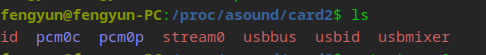


- **stream0     **

```
HP DHE-8008U HP DHE-8008U at usb-0000:00:14.0-10.3, full speed : USB Audio       //      
//USB 3.0 控制器 (0000:00:14.0) 下的端口 10.3, Full Speed 
Playback:                                                  //播放配置
  Status: Running                               
    Interface = 1                                           //使用接口1（音频流接口）
    Altset = 1                                             //当前配置的备用设置编号
    Packet Size = 192                                      //每个USB数据包大小（192字节）
    Momentary freq = 48000 Hz (0x30.0000)                     
  Interface 1
    Altset 1
    Format: S16_LE
    Channels: 2
    Endpoint: 0x03 (3 OUT) (ADAPTIVE)                       //端点地址：3 OUT（输出），同步模式为自适应
    Rates: 48000                                          //当前采样率：48kHz
    Bits: 16
    Channel map: FL FR

Capture:                                                      //录制配置
  Status: Running
    Interface = 2                                            //使用接口2（音频流接口）
    Altset = 1                                                //# 当前配置的备用设置编号
    Packet Size = 96                                       
    Momentary freq = 48000 Hz (0x30.0000)
  Interface 2
    Altset 1
    Format: S16_LE
    Channels: 1
    Endpoint: 0x83 (3 IN) (ASYNC)                 //# 端点地址：3 IN（输入），同步模式为异步
    Rates: 48000
    Bits: 16
    Channel map: MONO

```

这个USB声卡只有一个备用配置

端点格式

- 格式：`0x8X`（IN 端点，设备→主机）或 `0x0X`（OUT 端点，主机→设备），`X` 为端点编号。
- 例如：`0x84` = 端点4 IN，`0x03` = 端点3 OUT。

 **为什么播放和录制用同一个端点编号（3）？**

- USB允许IN和OUT端点共用编号（方向不同），例如：
  - `0x03` = 端点3 OUT（播放）。
  - `0x83` = 端点3 IN（录制）。

**包大小为何是192/96字节？**

- 由采样率、位深和声道数决定：
  - 播放：48kHz × 16bit × 2声道 ÷ 8 = 192000 B/s → 192 B/ms。
  - 录制：48kHz × 16bit × 1声道 ÷ 8 = 96000 B/s → 96 B/ms。

**为什么需要同步类型？**

- **自适应同步（Adaptive）**：
  - 主机主导时钟，声卡动态调整（适合播放，避免卡顿）。
- **异步同步（Async）**：
  - 声卡主导时钟，主机需缓冲（适合录音，保证稳定性）。

- **usbbus**

```
001/006
```

`Bus 001 Device 006` 表示设备位于 **总线 001，设备号 006**。

- **usbid**

```
12d1:3a07
```

USB ID

- **usbmixer **                        混音器信息

```
USB Mixer: usb_id=0x12d13a07, ctrlif=0, ctlerr=0
Card: HP DHE-8008U HP DHE-8008U at usb-0000:00:14.0-10.3, full speed
  Unit: 2                                                                  // Unit 2单元
    Control: name="PCM Playback Volume", index=0                          //立体声（2声道）播放音量控制
    Info: id=2, control=2, cmask=0x3, channels=2, type="S16"              
    Volume: min=-7264, max=-241, dBmin=-2837, dBmax=-94
  Unit: 2
    Control: name="PCM Playback Switch", index=0                         //播放开关（静音控制）
    Info: id=2, control=1, cmask=0x0, channels=1, type="INV_BOOLEAN"
    Volume: min=0, max=1, dBmin=0, dBmax=0           
  Unit: 5                                                                  //unit5单元
    Control: name="Auto Gain Control", index=0                                //自动增益控制开关
    Info: id=5, control=7, cmask=0x0, channels=1, type="BOOLEAN"
    Volume: min=0, max=1, dBmin=0, dBmax=0
  Unit: 5
    Control: name="Mic Capture Volume", index=0                                //麦克风输入音量控制
    Info: id=5, control=2, cmask=0x0, channels=1, type="S16"
    Volume: min=-7264, max=-241, dBmin=-2837, dBmax=-94
  Unit: 5
    Control: name="Mic Capture Switch", index=0                                    //麦克风开关（静音控制）
    Info: id=5, control=1, cmask=0x0, channels=1, type="INV_BOOLEAN"
    Volume: min=0, max=1, dBmin=0, dBmax=0
```

**这里需要重点关注的是Unit号，假如需要重映射端口时，就需要使用这个号。**

## 4.4 USB Audio插孔检测

**snd_usb_mixer_interrupt**处理来自 USB 音频设备混音器接口的中断（interrupt）数据的核心回调函数 `snd_usb_mixer_interrupt`。它根据设备使用的 USB Audio Class 版本（UAC1 或 UAC2）解析并处理中断数据，然后重新提交 URB（USB Request Block）以持续监听设备事件。

```
static void snd_usb_mixer_interrupt(struct urb *urb)
{
	struct usb_mixer_interface *mixer = urb->context;
	int len = urb->actual_length;
	int ustatus = urb->status;

	if (ustatus != 0)
		goto requeue;

	if (mixer->protocol == UAC_VERSION_1) {                   //UAC1规范
		struct uac1_status_word *status;

		for (status = urb->transfer_buffer;
		     len >= sizeof(*status);
		     len -= sizeof(*status), status++) {
			dev_dbg(&urb->dev->dev, "status interrupt: %02x %02x\n",
						status->bStatusType,
						status->bOriginator);

			/* ignore any notifications not from the control interface */             //忽略非控制接口的通知。
			if ((status->bStatusType & UAC1_STATUS_TYPE_ORIG_MASK) !=
				UAC1_STATUS_TYPE_ORIG_AUDIO_CONTROL_IF)
				continue;

			if (status->bStatusType & UAC1_STATUS_TYPE_MEM_CHANGED)
				snd_usb_mixer_rc_memory_change(mixer, status->bOriginator);
			else
				snd_usb_mixer_notify_id(mixer, status->bOriginator);                 //通知控件更新。
		}
	} else { /* UAC_VERSION_2 */                                //UAC2规范
		struct uac2_interrupt_data_msg *msg;

		for (msg = urb->transfer_buffer;
		     len >= sizeof(*msg);
		     len -= sizeof(*msg), msg++) {
			/* drop vendor specific and endpoint requests */
			if ((msg->bInfo & UAC2_INTERRUPT_DATA_MSG_VENDOR) ||
			    (msg->bInfo & UAC2_INTERRUPT_DATA_MSG_EP))
				continue;

			snd_usb_mixer_interrupt_v2(mixer, msg->bAttribute,
						   le16_to_cpu(msg->wValue),
						   le16_to_cpu(msg->wIndex));
		}
	}

requeue:
	if (ustatus != -ENOENT &&
	    ustatus != -ECONNRESET &&
	    ustatus != -ESHUTDOWN) {
		urb->dev = mixer->chip->dev;
		usb_submit_urb(urb, GFP_ATOMIC);
	}
}
```

鉴于USB这种工作方式，在一些场景下存在一些"bug"。

比如：同时插入或者headphone和mic插孔，只会上报一个事件，这是不可避免的。硬件就是如此

## 4.5 调试工具

USB Audio同样可以使用alsa-utils的工具，也有一些独特的调试工具。

### 4.5.1 wireshark+usbmon

`usbmon` 是 Linux 内核提供的 USB 抓包工具，它可以抓取 USB 层的通信数据（包括控制、批量、等时传输等），是调试 USB 音频设备（如声卡）非常实用的低层工具。

- 加载内核模块：

```
sudo modprobe usbmon
```

- `lsusb -t`查看USB声卡所在总线

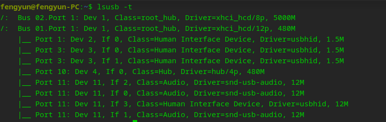

​	可知USB声卡所在总线为Bus 01

- 启动wireshark，选择usbmon1 (根据USB声卡总线选择)


过滤一下只看该声卡的包，`usb.device_address == 11`（device=11）

结合 URB 类型和端点方向进行过滤

```
usb.transfer_type == 0 && usb.endpoint_address == 0x03
```

解释：
	usb.transfer_type == 0：等于 URB_ISOCHRONOUS  (包括OUT和IN,可通过endpoint来过滤OUT或者IN)
	usb.endpoint_address == 0x03：端点 3，方向为 OUT（低7位为端点号，高位为方向）

### 4.5.2 lsusb -v -d  USB_ID

用于查看这个usb耳机的所有接口描述符、配置啥的。个人觉得比usbview更详细一些，已在4.1.2介绍过

------

# 五、ASOC

ALSA 是为桌面计算机设计的，没有考虑嵌入式世界的限制。这在处理嵌入式设备时会产生很多问题，举例如下。

- 编解码器和CPU代码之间的强耦合，导致移植和代码复制困难。

- 没有处理用户音频相关行为通知的标准方法。在移动场景中，用户的音频相关行为很频繁，因此需要一种特殊的机制。

- 在最初的 ALSA架构中，没有考虑电源效率。但是对于嵌入式设备（大多数情况下，嵌入式设备使用的是电池供电方式）来说，这是一个关键点，因此需要

有一个机制。

这就是ASoC 出现的原因。ALSA片上系统（ALSAsystem on chip，ASoC）层的目的是为嵌入式处理器和各种编解码器提供更好的ALSA支持。

ASoC是一种台在解决上述问题的新架构，它具有以下优势。

- 独立的编解码器驱动程序，以减少与CPU的耦合。

- 更方便地配置 CPU 和编解码器动态音频电源管理（dynamic audio power management，DAPM）之间的音频数据接口，动态控制功耗。

- 减少弹出和点击操作并增加与平台相关的控件。

为了实现上述功能，ASoC将嵌入式音频系统划分为3个可重用的组件驱动程序，即机器类（machine class）、平台类（platform class）和编解码器类（codec class）。其中，平台类和编解码器类是跨平台（cross-platform）的，而机器类是板级的（board-specific）。

下图描述了ASOC子系统元素及其关系

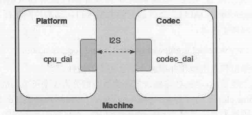

**注意ASOC章节中介绍的例子来自uos-6.6内核sof-es8336驱动和飞腾es8336驱动，这是两种不同的驱动！！！！！！！**

## 5.1 ASOC子元素介绍

### 5.1.1 Codec

编解码器（codec）：是一种具体的音频芯片，用来将模拟音频 ↔ 数字音频之间转换。顾名思义，编解码器的功能就是编码和解码，但其实此类芯片中的功能还有很多，常见的包括AIF、DAC、ADC、Mixer、PGA、Line-in和Line-out。一些高端编解码器芯片还具有回声消除器、噪声抑制和其他组件。编解码器负责将来自声源的模拟信号转换为处理器可以操作的数字信号（用于采集操作）或将来自声源（CPU）的数字信号转换为在回放时人类可以识别的模拟信号。如果需要，它会对音频信号进行相应的调整并控制音频信号之间的路径。因为芯片中每个音频信号可能有不同的流路。

在 ASoC 中：

- Codec 是一种 **BE 的实体**；
- 它包含多个 `snd_soc_dai_driver`（DAI）；

通常ASOC中的codec 驱动都在`sound/soc/codecs/`下

### 5.1.2 platfrom

- **platform** 通常负责音频数据的搬运，也就是平台DMA程序。

- 是 **SoC 一部分**，通常和 cpu_dai 配合使用。

  - 通常情况下使用snd_dma_dmaengine的就是`platform`驱动程序

- 为什么 Platform 可以是 dummy

  - 在很多例子里，platform都是指定为`snd-soc-dummy`，也就是说只有cpu_dai驱动程序。那是因为CPU DAI 自己做 DMA

    有些 SoC：

    ```
    I2S controller
       ├─ control
       └─ internal DMA
    ```

    所以 CPU DAI driver 直接处理 PCM。**所以我们需要关注的通常来说都是CPU DAI驱动程序**


### 5.1.3 Machine 是什么？

机器（machine）：这是系统级表示（实际上是板级），链接两个音频接口（cpu_dai和codec_dai）。该链接在内核中通过 `struct snd_soc_dai link `的实例抽象出来。配置好链接后，机器驱动程序将（通过devm_snd_soc_register_card）注册一个**struct snd_soc_card** 对象，它是Linux Kernel 对声卡的抽象。

虽然平台和编解码器驱动程序通常是可重用的，但机器类具有几乎不可重用的特定硬件功能。所谓硬件特性是指DAI之间的链编解码器和平台驱动程序不能单独工作。机器驱动程序负责将它们绑定在一起以完成音频信息处理。机器驱动程序类充当描述其他组件驱动程序并将其绑定在一起以形成ALSA 声卡设备的黏合剂。它管理任何特定于机器的控件和机器级音频事件（例如，在播放开始时打开功放）。

特点：

- 决定哪个 FE 可以连接到哪个 BE；
- **指定 Codec 是哪一个、I2S 接口在哪；**
- 定义平台拓扑结构（例如：播放走 Codec，录音走 DMIC）；
- **可以更改或者追加在编码器中定义的路由。例如，可以最终决定必须使用哪些编码器引脚**

### 5.1.4 component

`component`翻译过来就是组件的意思，在HDA中也有组件的概念，但是是完全跟显卡音频相关的。而在ASOC中组件是一个核心概念。

#### 5.1.4.1 核心结构体

##### 5.1.4.1.1 component实例

`struct snd_soc_component` 是 **ASoC 框架中最核心的对象之一**。

一句话理解：

```
snd_soc_component = ASoC 中一个音频功能模块的运行时实例
```

也就是说：

> **CPU DAI、Codec、Platform、DSP 等，在 ASoC 内部都会抽象为 component。**

```
struct snd_soc_component {
	const char *name;
	int id;
	const char *name_prefix;
	struct device *dev;
	struct snd_soc_card *card;

	unsigned int active;

	unsigned int suspended:1; /* is in suspend PM state */

	struct list_head list;
	struct list_head card_aux_list; /* for auxiliary bound components */
	struct list_head card_list;

	const struct snd_soc_component_driver *driver;

	struct list_head dai_list;
	int num_dai;

	struct regmap *regmap;
	int val_bytes;

	struct mutex io_mutex;

	/* attached dynamic objects */
	struct list_head dobj_list;

	/*
	 * DO NOT use any of the fields below in drivers, they are temporary and
	 * are going to be removed again soon. If you use them in driver code
	 * the driver will be marked as BROKEN when these fields are removed.
	 */

	/* Don't use these, use snd_soc_component_get_dapm() */
	struct snd_soc_dapm_context dapm;

	/* machine specific init */
	int (*init)(struct snd_soc_component *component);

	/* function mark */
	void *mark_module;
	struct snd_pcm_substream *mark_open;
	struct snd_pcm_substream *mark_hw_params;
	struct snd_pcm_substream *mark_trigger;
	struct snd_compr_stream  *mark_compr_open;
	void *mark_pm;

	struct dentry *debugfs_root;
	const char *debugfs_prefix;
};

```

下面来介绍一下重要的成员：

- const char *name：component 名字
- int id：component ID。用于区分多个实例

- unsigned int active：表示 component 当前是否在使用。
- unsigned int suspended:1：表示当前是否处于PM suspend 状态

- struct list_head list：全局 component 链表。

- const struct snd_soc_component_driver *driver：component 的 **驱动描述结构**。

- struct list_head dai_list：该component下的DAI链表
- int num_dai：表示DAI数量。

- struct regmap *regmap：寄存器访问抽象层。
- int val_bytes：寄存器 value 的字节数

- struct snd_soc_dapm_context dapm：component中的DAPM上下文

- struct dentry *debugfs_root：用于在/sys/kernel/debug/asoc/创建调试节点。

##### 5.1.4.1.2 component driver

`struct snd_soc_component_driver` 是 **ASoC 中 component 的“驱动描述结构”**。
 它不是运行时对象，而是 **driver 提供的一组回调函数 + 静态配置**。

当驱动调用：

```
int snd_soc_register_component(struct device *dev,
			const struct snd_soc_component_driver *component_driver,
			struct snd_soc_dai_driver *dai_drv,
			int num_dai)
```

ASoC 就会把这个 `component_driver` 绑定到运行时对象：


```
struct snd_soc_component_driver {
	const char *name;

	/* Default control and setup, added after probe() is run */
	const struct snd_kcontrol_new *controls;
	unsigned int num_controls;
	const struct snd_soc_dapm_widget *dapm_widgets;
	unsigned int num_dapm_widgets;
	const struct snd_soc_dapm_route *dapm_routes;
	unsigned int num_dapm_routes;

	int (*probe)(struct snd_soc_component *component);
	void (*remove)(struct snd_soc_component *component);
	int (*suspend)(struct snd_soc_component *component);
	int (*resume)(struct snd_soc_component *component);

	unsigned int (*read)(struct snd_soc_component *component,
			     unsigned int reg);
	int (*write)(struct snd_soc_component *component,
		     unsigned int reg, unsigned int val);

	/* pcm creation and destruction */
	int (*pcm_construct)(struct snd_soc_component *component,
			     struct snd_soc_pcm_runtime *rtd);
	void (*pcm_destruct)(struct snd_soc_component *component,
			     struct snd_pcm *pcm);

	/* component wide operations */
	int (*set_sysclk)(struct snd_soc_component *component,
			  int clk_id, int source, unsigned int freq, int dir);
	int (*set_pll)(struct snd_soc_component *component, int pll_id,
		       int source, unsigned int freq_in, unsigned int freq_out);
	int (*set_jack)(struct snd_soc_component *component,
			struct snd_soc_jack *jack,  void *data);
	int (*get_jack_type)(struct snd_soc_component *component);

	/* DT */
	int (*of_xlate_dai_name)(struct snd_soc_component *component,
				 const struct of_phandle_args *args,
				 const char **dai_name);
	int (*of_xlate_dai_id)(struct snd_soc_component *comment,
			       struct device_node *endpoint);
	void (*seq_notifier)(struct snd_soc_component *component,
			     enum snd_soc_dapm_type type, int subseq);
	int (*stream_event)(struct snd_soc_component *component, int event);
	int (*set_bias_level)(struct snd_soc_component *component,
			      enum snd_soc_bias_level level);

	int (*open)(struct snd_soc_component *component,
		    struct snd_pcm_substream *substream);
	int (*close)(struct snd_soc_component *component,
		     struct snd_pcm_substream *substream);
	int (*ioctl)(struct snd_soc_component *component,
		     struct snd_pcm_substream *substream,
		     unsigned int cmd, void *arg);
	int (*hw_params)(struct snd_soc_component *component,
			 struct snd_pcm_substream *substream,
			 struct snd_pcm_hw_params *params);
	int (*hw_free)(struct snd_soc_component *component,
		       struct snd_pcm_substream *substream);
	int (*prepare)(struct snd_soc_component *component,
		       struct snd_pcm_substream *substream);
	int (*trigger)(struct snd_soc_component *component,
		       struct snd_pcm_substream *substream, int cmd);
	int (*sync_stop)(struct snd_soc_component *component,
			 struct snd_pcm_substream *substream);
	snd_pcm_uframes_t (*pointer)(struct snd_soc_component *component,
				     struct snd_pcm_substream *substream);
	int (*get_time_info)(struct snd_soc_component *component,
		struct snd_pcm_substream *substream, struct timespec64 *system_ts,
		struct timespec64 *audio_ts,
		struct snd_pcm_audio_tstamp_config *audio_tstamp_config,
		struct snd_pcm_audio_tstamp_report *audio_tstamp_report);
	int (*copy)(struct snd_soc_component *component,
		    struct snd_pcm_substream *substream, int channel,
		    unsigned long pos, struct iov_iter *iter,
		    unsigned long bytes);
	struct page *(*page)(struct snd_soc_component *component,
			     struct snd_pcm_substream *substream,
			     unsigned long offset);
	int (*mmap)(struct snd_soc_component *component,
		    struct snd_pcm_substream *substream,
		    struct vm_area_struct *vma);
	int (*ack)(struct snd_soc_component *component,
		   struct snd_pcm_substream *substream);
	snd_pcm_sframes_t (*delay)(struct snd_soc_component *component,
				   struct snd_pcm_substream *substream);

	const struct snd_compress_ops *compress_ops;

	/* probe ordering - for components with runtime dependencies */
	int probe_order;
	int remove_order;

	enum snd_soc_trigger_order trigger_start;
	enum snd_soc_trigger_order trigger_stop;

	unsigned int module_get_upon_open:1;

	/* bits */
	unsigned int idle_bias_on:1;
	unsigned int suspend_bias_off:1;
	unsigned int use_pmdown_time:1; /* care pmdown_time at stop */

	unsigned int endianness:1;
	unsigned int legacy_dai_naming:1;

	/* this component uses topology and ignore machine driver FEs */
	const char *ignore_machine;
	const char *topology_name_prefix;
	int (*be_hw_params_fixup)(struct snd_soc_pcm_runtime *rtd,
				  struct snd_pcm_hw_params *params);
	bool use_dai_pcm_id;	/* use DAI link PCM ID as PCM device number */
	int be_pcm_base;	/* base device ID for all BE PCMs */

#ifdef CONFIG_DEBUG_FS
	const char *debugfs_prefix;
#endif
};
```

下面介绍一下关键成员：

- const char *name：component 名字。

- const struct snd_kcontrol_new *controls： 定义 **ALSA mixer controls**的模板。

- unsigned int num_controls：控件的数量

- const struct snd_soc_dapm_widget *dapm_widgets： 音频模块节点

- unsigned int num_dapm_widgets：widget数量

- const struct snd_soc_dapm_route *dapm_routes：**音频路径连接**：

- unsigned int num_dapm_routes：路径数量

- ```
  int (*probe)(struct snd_soc_component *component);
  void (*remove)(struct snd_soc_component *component);
  int (*suspend)(struct snd_soc_component *component);
  int (*resume)(struct snd_soc_component *component);
  ```

  component 生命周期

- ```
  int (*set_sysclk)(struct snd_soc_component *component,
  		int clk_id, int source, unsigned int freq, int dir);
  int (*set_pll)(struct snd_soc_component *component, int pll_id,
  		int source, unsigned int freq_in, unsigned int freq_out);
  int (*set_jack)(struct snd_soc_component *component,
  		struct snd_soc_jack *jack,  void *data);
  int (*get_jack_type)(struct snd_soc_component *component);
  ```

  这些函数一般由 **machine driver 调用**。

- ```
  
  	int (*open)(struct snd_soc_component *component,
  		    struct snd_pcm_substream *substream);
  	int (*close)(struct snd_soc_component *component,
  		     struct snd_pcm_substream *substream);
  	int (*ioctl)(struct snd_soc_component *component,
  		     struct snd_pcm_substream *substream,
  		     unsigned int cmd, void *arg);
  	int (*hw_params)(struct snd_soc_component *component,
  			 struct snd_pcm_substream *substream,
  			 struct snd_pcm_hw_params *params);
  	int (*hw_free)(struct snd_soc_component *component,
  		       struct snd_pcm_substream *substream);
  	int (*prepare)(struct snd_soc_component *component,
  		       struct snd_pcm_substream *substream);
  	int (*trigger)(struct snd_soc_component *component,
  		       struct snd_pcm_substream *substream, int cmd);
  	int (*sync_stop)(struct snd_soc_component *component,
  			 struct snd_pcm_substream *substream);
  	snd_pcm_uframes_t (*pointer)(struct snd_soc_component *component,
  				     struct snd_pcm_substream *substream);
  	int (*get_time_info)(struct snd_soc_component *component,
  		struct snd_pcm_substream *substream, struct timespec64 *system_ts,
  		struct timespec64 *audio_ts,
  		struct snd_pcm_audio_tstamp_config *audio_tstamp_config,
  		struct snd_pcm_audio_tstamp_report *audio_tstamp_report);
  	int (*copy)(struct snd_soc_component *component,
  		    struct snd_pcm_substream *substream, int channel,
  		    unsigned long pos, struct iov_iter *iter,
  		    unsigned long bytes);
  	struct page *(*page)(struct snd_soc_component *component,
  			     struct snd_pcm_substream *substream,
  			     unsigned long offset);
  	int (*mmap)(struct snd_soc_component *component,
  		    struct snd_pcm_substream *substream,
  		    struct vm_area_struct *vma);
  	int (*ack)(struct snd_soc_component *component,
  		   struct snd_pcm_substream *substream);
  	snd_pcm_sframes_t (*delay)(struct snd_soc_component *component,
  				   struct snd_pcm_substream *substream);
  ```

  这些和snd_pcm_ops差不多

#### 5.1.5.2 component 的创建

先介绍一下component的注册和创建流程，感兴趣的可以看看源码。

```
driver probe
      │
      ▼
snd_soc_register_component()
      │
      ▼
snd_soc_component_initialize()
      │
      ▼
snd_soc_add_component()
      │
      ▼
component 加入 component_list
```

下面以飞腾i2s驱动为例，sound/soc/phytium/phytium_i2s.c：

```
static const struct snd_soc_component_driver phytium_i2s_component = {
	.name		= "phytium-i2s",
	.pcm_construct	= phytium_pcm_new,
	.open		= phytium_pcm_open,
	.close		= phytium_pcm_close,
	.hw_params	= phytium_pcm_hw_params,
	.hw_free	= phytium_pcm_hw_free,
	.prepare	= phytium_pcm_prepare,
	.trigger	= phytium_pcm_trigger,
	.pointer	= phytium_pcm_pointer,
	.suspend	= phytium_i2s_suspend,
	.resume		= phytium_i2s_resume,
	.probe = phytium_i2s_component_probe,
	.legacy_dai_naming = 1,
};
```

在probe中调用`devm_snd_soc_register_component`

### 5.1.5 DAI （Digital Audio Interface）

#### 5.1.5.1 DAI基础

本来应该先介绍DAI相关概念的，但考虑到ASOC子系统的整体架构，DAI毕竟还是属于codec、platform、machine驱动里的一部分。所以还是后介绍了。

DAI（Digital Audio Interface）是连接 SoC（CPU）内部音频控制器和音频 CODEC（编解码器）的数字音频信号接口。它定义了音频数据和时钟信号的传输方式。ASoC 通过抽象 DAI，实现 SoC 与各种音频芯片之间灵活且高效的数据传输。

简单说：

> 🎯 **DAI 描述的是两个音频组件之间的数字音频连接接口。**

例如：

```
CPU I2S controller  <---->  Audio Codec
```

它们之间的 **I2S / PCM / TDM / PDM** 接口就是 DAI。

为什么需要 DAI呢？

>CPU 和 Codec 来自不同厂商：
>
>- SoC厂商（Mediatek / Qualcomm / NXP）
>- Codec厂商（Realtek / TI / Cirrus）
>
>内核需要一个**统一抽象层**。

常见的数字音频接口包括：

- I2S：最常见接口，很多 codec 都使用 I2S。

------

- PCM：另一种串行音频接口。常用于：蓝牙、modem

------

- TDM：时分服用，多通道音频：

```
8 / 16 / 32 channels
```

常见于：DSP、多麦阵列

------

- PDM：用于数字麦克风。

------

#### 5.1.5.2 cpu_dai和codec_dai

`cpu_dai`（CPU Digital Audio Interface）表示 **SoC（CPU）侧的数字音频接口**，比如：

- I2S controller（如 SSP、I2S、SAI 等）
- DMIC controller
- HDMI audio controller
- SDI/SDIO audio interface（少见）

它是 SoC 用来 **“搬运音频数据”** 到 codec 的硬件模块。

| 项目     | cpu_dai                         | codec_dai               |
| -------- | ------------------------------- | ----------------------- |
| 位置     | SoC（CPU 侧）                   | Codec（音频芯片侧）     |
| 功能     | 配置控制器、搬数据              | 编解码模拟信号          |
| 注册者   | SoC 驱动（如 SOF、SSP 驱动）    | Codec 驱动（如 ES8316） |
| 连接方式 | 和 codec_dai 通过 DAI link 配对 | 和 cpu_dai 一一对应     |

#### 5.1.5.3 相关结构体

##### 5.1.5.3.1 DAI Driver

**ASoC 中描述 DAI 能力的“静态描述结构”**。**一个数字音频接口支持什么能力、有哪些操作函数**。

`snd_soc_dai_driver`这个结构会被：

- CPU audio driver
- Codec driver

注册到 ALSA ASoC core

```
struct snd_soc_dai_driver {
	/* DAI description */
	const char *name;
	unsigned int id;
	unsigned int base;
	struct snd_soc_dobj dobj;
	struct of_phandle_args *dai_args;

	/* ops */
	const struct snd_soc_dai_ops *ops;
	const struct snd_soc_cdai_ops *cops;

	/* DAI capabilities */
	struct snd_soc_pcm_stream capture;
	struct snd_soc_pcm_stream playback;
	unsigned int symmetric_rate:1;
	unsigned int symmetric_channels:1;
	unsigned int symmetric_sample_bits:1;
};
```

- const char *name：DAI 的名字。

- unsigned int id：DAI 的编号。

- struct snd_soc_dobj dobj：这是 **ASoC 内部对象系统的一部分**。作用是：把 DAI driver 挂到 ASoC object tree

- struct of_phandle_args *dai_args：用于 **device tree DAI binding**。

- const struct snd_soc_dai_ops *ops：DAI 的控制函数，这是 **最重要的字段之一**。

- struct snd_soc_pcm_stream capture：描述 **录音能力**，也就是声道、采样率、位宽等参数

- struct snd_soc_pcm_stream playback：描述 **播放能力**。

##### 5.1.5.3.2 DAI实例

这个结构体是 **DAI 在运行时（runtime）的实例对象**。 也就是说：

> **每一个注册到系统的 DAI，在运行时都会有一个 `snd_soc_dai` 结构。**

CPU 或 Codec driver 在 probe 时调用`snd_soc_register_component`：

```
int snd_soc_register_component(struct device *dev,
			const struct snd_soc_component_driver *component_driver,
			struct snd_soc_dai_driver *dai_drv,
			int num_dai)
```

该函数会把 component 提供的所有 DAI driver 注册成真正的 snd_soc_dai 设备对象。：

```
snd_soc_register_component
        ↓
snd_soc_add_component
        ↓
snd_soc_register_dais
        ↓
snd_soc_register_dai   ← 真正创建 DAI
```


下面详细解释一下`snd_soc_dai`这个结构体

```
struct snd_soc_dai {
	const char *name;
	int id;
	struct device *dev;

	/* driver ops */
	struct snd_soc_dai_driver *driver;

	/* DAI runtime info */
	struct snd_soc_dai_stream stream[SNDRV_PCM_STREAM_LAST + 1];

	/* Symmetry data - only valid if symmetry is being enforced */
	unsigned int rate;
	unsigned int channels;
	unsigned int sample_bits;

	/* parent platform/codec */
	struct snd_soc_component *component;

	struct list_head list;

	/* function mark */
	struct snd_pcm_substream *mark_startup;
	struct snd_pcm_substream *mark_hw_params;
	struct snd_pcm_substream *mark_trigger;
	struct snd_compr_stream  *mark_compr_startup;

	/* bit field */
	unsigned int probed:1;
};
```

通常需要关心下面这些成员：

- const char *name：DAI 的名字，例如：

  - 例如：

    ```
    i2s0
    rt5650-aif1
    HDMI
    ```

    这个名字会在 machine driver 的：

    ```
    .cpu_dai_name
    .codec_dai_name
    ```

    中被引用。

- int id：DAI 的编号。

  - 很多 codec 有多个 DAI，例如：

    ```
    AIF1
    AIF2
    AIF3
    ```

​			就会通过 id 区分。

- struct device *dev：指向 Linux 设备模型里的 device。

- struct snd_soc_dai_driver *driver：这个结构体后面会单独介绍

------

- struct snd_soc_dai_stream stream[SNDRV_PCM_STREAM_LAST + 1]：DAI 的 **播放 / 录音能力信息**。

  - `SNDRV_PCM_STREAM_LAST + 1` 实际就是：2

    ```
    对应：
    stream[0] → playback
    stream[1] → capture
    ```

  - ```
    /* for Playback/Capture */
    struct snd_soc_dai_stream {
    	struct snd_soc_dapm_widget *widget;              //DAI 对应的 DAPM widget
    
    	unsigned int active;	/* usage count */        //当前 stream 的使用计数
    	unsigned int tdm_mask;							//用于 TDM（Time Division Multiplexing） 模式。
    
    	void *dma_data;		/* DAI DMA data */          //DMA 配置数据
    };
    ```

- struct snd_soc_component *component：DAI 属于某个 component。

- struct list_head list：把 DAI 挂在系统的 DAI 链表里。ASoC core 会维护dai_list用于：查找 DAI、遍历 DAI

### 5.1.5 DAI link

 **ASoC machine driver 中最核心的概念之一**。
 如果只用一句话概括它：

> **`snd_soc_dai_link` 描述了一条音频链路：CPU DAI ↔ Codec DAI（以及 platform）。**

换句话说，它定义了：

```
数字音频接口之间如何连接
```

这个结构由 **machine driver** 定义，例如：

```
static struct snd_soc_dai_link my_board_links[] = {
    {...},
};
```

ASOC core 会根据这些 link 创建音频路径。

#### 5.1.5.1 相关结构体

##### 5.1.5.1.1 DAI link实例

```
struct snd_soc_dai_link {
	/* config - must be set by machine driver */
	const char *name;			/* Codec name */
	const char *stream_name;		/* Stream name */

	/*
	 * You MAY specify the link's CPU-side device, either by device name,
	 * or by DT/OF node, but not both. If this information is omitted,
	 * the CPU-side DAI is matched using .cpu_dai_name only, which hence
	 * must be globally unique. These fields are currently typically used
	 * only for codec to codec links, or systems using device tree.
	 */
	/*
	 * You MAY specify the DAI name of the CPU DAI. If this information is
	 * omitted, the CPU-side DAI is matched using .cpu_name/.cpu_of_node
	 * only, which only works well when that device exposes a single DAI.
	 */
	struct snd_soc_dai_link_component *cpus;
	unsigned int num_cpus;

	/*
	 * You MUST specify the link's codec, either by device name, or by
	 * DT/OF node, but not both.
	 */
	/* You MUST specify the DAI name within the codec */
	struct snd_soc_dai_link_component *codecs;
	unsigned int num_codecs;

	struct snd_soc_dai_link_codec_ch_map *codec_ch_maps;
	/*
	 * You MAY specify the link's platform/PCM/DMA driver, either by
	 * device name, or by DT/OF node, but not both. Some forms of link
	 * do not need a platform. In such case, platforms are not mandatory.
	 */
	struct snd_soc_dai_link_component *platforms;
	unsigned int num_platforms;

	int id;	/* optional ID for machine driver link identification */

	/*
	 * for Codec2Codec
	 */
	const struct snd_soc_pcm_stream *c2c_params;
	unsigned int num_c2c_params;

	unsigned int dai_fmt;           /* format to set on init */

	enum snd_soc_dpcm_trigger trigger[2]; /* trigger type for DPCM */

	/* codec/machine specific init - e.g. add machine controls */
	int (*init)(struct snd_soc_pcm_runtime *rtd);

	/* codec/machine specific exit - dual of init() */
	void (*exit)(struct snd_soc_pcm_runtime *rtd);

	/* optional hw_params re-writing for BE and FE sync */
	int (*be_hw_params_fixup)(struct snd_soc_pcm_runtime *rtd,
			struct snd_pcm_hw_params *params);

	/* machine stream operations */
	const struct snd_soc_ops *ops;
	const struct snd_soc_compr_ops *compr_ops;

	/*
	 * soc_pcm_trigger() start/stop sequence.
	 * see also
	 *	snd_soc_component_driver
	 *	soc_pcm_trigger()
	 */
	enum snd_soc_trigger_order trigger_start;
	enum snd_soc_trigger_order trigger_stop;

	/* Mark this pcm with non atomic ops */
	unsigned int nonatomic:1;

	/* For unidirectional dai links */
	unsigned int playback_only:1;
	unsigned int capture_only:1;

	/* Keep DAI active over suspend */
	unsigned int ignore_suspend:1;

	/* Symmetry requirements */
	unsigned int symmetric_rate:1;
	unsigned int symmetric_channels:1;
	unsigned int symmetric_sample_bits:1;

	/* Do not create a PCM for this DAI link (Backend link) */
	unsigned int no_pcm:1;

	/* This DAI link can route to other DAI links at runtime (Frontend)*/
	unsigned int dynamic:1;

	/* DPCM capture and Playback support */
	unsigned int dpcm_capture:1;
	unsigned int dpcm_playback:1;

	/* DPCM used FE & BE merged format */
	unsigned int dpcm_merged_format:1;
	/* DPCM used FE & BE merged channel */
	unsigned int dpcm_merged_chan:1;
	/* DPCM used FE & BE merged rate */
	unsigned int dpcm_merged_rate:1;

	/* pmdown_time is ignored at stop */
	unsigned int ignore_pmdown_time:1;

	/* Do not create a PCM for this DAI link (Backend link) */
	unsigned int ignore:1;

#ifdef CONFIG_SND_SOC_TOPOLOGY
	struct snd_soc_dobj dobj; /* For topology */
#endif
};
```

下面介绍一下重要的字段：

- const char *name：DAI link 的名字。

- const char *stream_name：ALSA PCM stream 的名字，在建立链路的时候需要这个名字来匹配

- struct snd_soc_dai_link_component *cpus：CPU 侧的 DAI
- unsigned int num_cpus：表示数量。

- struct snd_soc_dai_link_component *codecs：codec 侧 DAI，ASoC 会用它找到 codec driver。
- unsigned int num_codecs;

- struct snd_soc_dai_link_component *platforms：platform driver。有些系统：platform = cpu component所以可以不单独指定。
- unsigned int num_platforms;

- int id：machine driver 可以用它区分不同 link。

- unsigned int dai_fmt：设置数字音频接口格式。

- enum snd_soc_dpcm_trigger trigger[2];

控制 **FE/BE trigger 顺序**。

常见：

```
SND_SOC_DPCM_TRIGGER_PRE
SND_SOC_DPCM_TRIGGER_POST
```

例如：

```
先启动 FE
再启动 BE
```

- int (*be_hw_params_fixup)(...)：用于 **DPCM BE参数修正**。

- const struct snd_soc_ops *ops：用于控制整个 link。

- unsigned int no_pcm:1：这个 link 不创建 PCM 设备，通常用于BE。

- unsigned int dynamic:1;表示支持动态路由，通常用于FE。

- unsigned int dpcm_playback:1：支持 DPCM playback 
- unsigned int dpcm_capture:1：支持 DPCM capture

##### 5.1.5.1.2 运行时实例---rtd

结构体 **`struct snd_soc_pcm_runtime`（通常简称 rtd）** 代表一个 PCM 设备的运行时上下文，是 **ASoC 运行时最核心的数据结构之一**。

```
snd_soc_pcm_runtime = 一条 DAI link 在运行时的实例
```

也就是说：

> **当 CPU DAI + Codec DAI + Platform 绑定后，ASoC 就创建一个 snd_soc_pcm_runtime。**

```
/* SoC machine DAI configuration, glues a codec and cpu DAI together */
struct snd_soc_pcm_runtime {
	struct device *dev;
	struct snd_soc_card *card;
	struct snd_soc_dai_link *dai_link;
	struct snd_pcm_ops ops;

	unsigned int c2c_params_select; /* currently selected c2c_param for dai link */

	/* Dynamic PCM BE runtime data */
	struct snd_soc_dpcm_runtime dpcm[SNDRV_PCM_STREAM_LAST + 1];
	struct snd_soc_dapm_widget *c2c_widget[SNDRV_PCM_STREAM_LAST + 1];

	long pmdown_time;

	/* runtime devices */
	struct snd_pcm *pcm;
	struct snd_compr *compr;

	/*
	 * dais = cpu_dai + codec_dai
	 * see
	 *	soc_new_pcm_runtime()
	 *	snd_soc_rtd_to_cpu()
	 *	snd_soc_rtd_to_codec()
	 */
	struct snd_soc_dai **dais;

	struct delayed_work delayed_work;
	void (*close_delayed_work_func)(struct snd_soc_pcm_runtime *rtd);
#ifdef CONFIG_DEBUG_FS
	struct dentry *debugfs_dpcm_root;
#endif

	unsigned int num; /* 0-based and monotonic increasing */
	struct list_head list; /* rtd list of the soc card */

	/* function mark */
	struct snd_pcm_substream *mark_startup;
	struct snd_pcm_substream *mark_hw_params;
	struct snd_pcm_substream *mark_trigger;
	struct snd_compr_stream  *mark_compr_startup;

	/* bit field */
	unsigned int pop_wait:1;
	unsigned int fe_compr:1; /* for Dynamic PCM */

	bool initialized;

	int num_components;
	struct snd_soc_component *components[]; /* CPU/Codec/Platform */
};
```

下面来介绍一下重要的成员：

- struct snd_soc_card *card: ASOC声卡
- struct snd_soc_dai_link *dai_link：对应的 dai_link

- struct snd_pcm_ops ops： pcm操作函数

- struct snd_soc_dpcm_runtime dpcm[SNDRV_PCM_STREAM_LAST + 1]：FE / BE 连接关系，用于 **DPCM（Dynamic PCM）**，之后会讲解DPCM。

- long pmdown_time：PCM close 后延迟关电，减少pop音

- struct snd_pcm *pcm： 对应 ALSA 设备/dev/snd/pcmCxDx

- struct snd_soc_dai **dais：DAI数组，cpu_dai + codec_dai

- unsigned int num: runtime 编号

- struct list_head list: runtime 链表

- int num_components：component数量
- struct snd_soc_component *components[]: runtime 上绑定的所有 component

#### 5.1.5.2 从DAI link绑定platform和codec驱动

##### 5.1.5.2.1 snd_soc_register_card

在所有的machine驱动中最终都会调用`snd_soc_register_card`或者`devm_snd_soc_register_card`函数，

以`sound/soc/phytium/phytium-machine-v2.c`驱动为例，有如下定义：

首先定义DAI link，一般都会利用一些快捷宏

```
SND_SOC_DAILINK_DEFS(phyt_machine,
	DAILINK_COMP_ARRAY(COMP_CPU("phytium-i2s-v2")),
	DAILINK_COMP_ARRAY(COMP_CODEC("PHYT1002:00", "phytium-hifi-v2")),
	DAILINK_COMP_ARRAY(COMP_PLATFORM("snd-soc-dummy")));

static struct snd_soc_dai_link phyt_machine_dai[] = {
	{
		.name = "PHYTIUM HIFI V2",
		.stream_name = "PHYTIUM HIFT V2",
		.dai_fmt = PMDK_DAI_FMT,
		SND_SOC_DAILINK_REG(phyt_machine),
	},
};

//下面介绍一下宏展开
static struct snd_soc_dai_link_component phyt_machine_cpus[] = {
	{ .dai_name = "phytium-i2s-v2" }
};

static struct snd_soc_dai_link_component phyt_machine_codecs[] = {
	{ .name = "PHYT1002:00", .dai_name = "phytium-hifi-v2" }
};

static struct snd_soc_dai_link_component phyt_machine_platforms[] = {
	{ .name = "snd-soc-dummy" }
};

static struct snd_soc_dai_link phyt_machine_dai[] = {
    {
        .name = "PHYTIUM HIFI V2",
        .stream_name = "PHYTIUM HIFT V2",
        .dai_fmt = PMDK_DAI_FMT,

        .cpus = phyt_machine_cpus,
        .num_cpus = ARRAY_SIZE(phyt_machine_cpus),

        .codecs = phyt_machine_codecs,
        .num_codecs = ARRAY_SIZE(phyt_machine_codecs),

        .platforms = phyt_machine_platforms,
        .num_platforms = ARRAY_SIZE(phyt_machine_platforms),
    }
};
```

上面创建的`snd_soc_dai_link_component`会在`snd_soc_add_pcm_runtime`函数中使用到

```
static struct snd_soc_card phyt_machine_card = {
	.name = "PHYT-MIE-V2",
	.owner = THIS_MODULE,
	.dai_link = phyt_machine_dai,
	.num_links = ARRAY_SIZE(phyt_machine_dai),

	.dapm_widgets = phyt_machine_dapm_widgets,
	.num_dapm_widgets = ARRAY_SIZE(phyt_machine_dapm_widgets),
	.controls = phyt_machine_controls,
	.num_controls = ARRAY_SIZE(phyt_machine_controls),
	.dapm_routes = phyt_machine_audio_map,
	.num_dapm_routes = ARRAY_SIZE(phyt_machine_audio_map),
};

static int phyt_machine_probe(struct platform_device *pdev)
{
	struct snd_soc_card *card = &phyt_machine_card;
	struct device *dev = &pdev->dev;

	card->dev = dev;

	return devm_snd_soc_register_card(&pdev->dev, card);
}
```

由上面可知DAI link已经定义好了，绑定到声卡上后在probe时直接注册声卡即可。那么就从`snd_soc_register_card`开始分析。因为函数太长了，下面结构展示了关键调用。

```
snd_soc_register_card
│
│
├─ snd_soc_bind_card
        ├─ snd_soc_dapm_init
        │		：初始化 DAPM context。
        │
        ├─ snd_soc_add_pcm_runtimes
        │		：调用snd_soc_add_pcm_runtime，把machine驱动的dai_link转换成rtd，并尝试找到对应的 CPU_DAI、Codec_DAI、platform component
        │
        ├─ snd_soc_dapm_new_controls
        │		：创建machine driver 的DAPM widget
        │		：相关函数会在5.2.4.3节介绍
        ├─ soc_probe_link_components
        │		：probe CPU/Codec driver，初始化每一个rtd中的component中的dapm等
        │
        ├─ soc_probe_link_dais
        │		：probe DAI，调用dai_driver
        │
        ├─ soc_init_pcm_runtime：     创建 PCM
        │ 		：在上面的流程中已经创建好rtd了，这一步是设置 DAI format，创建PCM设备，将PCM设备与DAI绑定
        │
        ├─ snd_soc_dapm_link_dai_widgets
        │		：在 DAPM 图中把 DAI widget 与同一 stream 的其他 widget 自动连接起来，从而构建完整的音频路径。会在5.2.4.2.1介绍该函数
        │
        ├─ snd_soc_dapm_connect_dai_link_widgets
        │		：根据 snd_soc_dai_link 的 CPU DAI 和 CODEC DAI，把两个 DAI widget 连接起来。
        │		：核心函数是dapm_connect_dai_pair，会在5.2.4.2.2节提到。
        ├─ snd_soc_dapm_new_widgets
        │		：该函数会在5.2.4.3节介绍
        │
        └─ snd_card_register：这个没啥可介绍的
```

## 5.2 DAPM --- ASOC核心

DAPM是**Dynamic Audio Power Managemen**t的缩写，直译过来就是动态音频电源管理的意思，DAPM是为了使基于linux的移动设备上的音频子系统，在任何时候都工作在最小功耗状态下。DAPM对用户空间的应用程序来说是透明的，所有与电源相关的开关都在ASoc core中完成。用户空间的应用程序无需对代码做出修改，也无需重新编译，DAPM根据当前激活的音频流（playback/capture）和声卡中的mixer等的配置来决定那些音频控件的电源开关被打开或关闭。

**本节的例子基本上都是用sof-es8336这个声卡为例的，但是说实话不该用这个例子因为涉及到sof了，使用飞腾提供的es8336系列驱动更合适一下（因为更符合嵌入式音频驱动，且代码写的更简单），但是都例子都写完了，所以最后也没改。**

### 5.2.1 Asoc/Dapm kcontrol

在2.1节简单的介绍了kcontrol,知道了是由snd_kcontrol_new作为模板创建的.对于Asoc框架已经为我们准备了大量的宏定义，用于定义常用的控件模板，这些宏定义位于include/sound/soc.h中。

比如:

```
define SOC_DOUBLE_VALUE(xreg, shift_left, shift_right, xmax, xinvert, xautodisable) \
	((unsigned long)&(struct soc_mixer_control) \
	{.reg = xreg, .rreg = xreg, .shift = shift_left, \
	.rshift = shift_right, .max = xmax, \
	.invert = xinvert, .autodisable = xautodisable})
#define SOC_SINGLE(xname, reg, shift, max, invert) \
{	.iface = SNDRV_CTL_ELEM_IFACE_MIXER, .name = xname, \
	.info = snd_soc_info_volsw, .get = snd_soc_get_volsw,\
	.put = snd_soc_put_volsw, \
	.private_value = SOC_SINGLE_VALUE(reg, shift, max, invert, 0) }
```

在Asoc声卡中大部分snd_kcontrol_new都是用这些宏创建的.下面我们以es8316声卡来举例:

```
static const struct snd_kcontrol_new es8316_snd_controls[] = {
	SOC_DOUBLE_TLV("Headphone Playback Volume", ES8316_CPHP_ICAL_VOL,
		       4, 0, 3, 1, hpout_vol_tlv),
	SOC_DOUBLE_TLV("Headphone Mixer Volume", ES8316_HPMIX_VOL,
		       4, 0, 11, 0, hpmixer_gain_tlv),

	SOC_ENUM("Playback Polarity", dacpol),
	SOC_DOUBLE_R_TLV("DAC Playback Volume", ES8316_DAC_VOLL,
			 ES8316_DAC_VOLR, 0, 0xc0, 1, dac_vol_tlv),
	SOC_SINGLE("DAC Soft Ramp Switch", ES8316_DAC_SET1, 4, 1, 1),
	SOC_SINGLE("DAC Soft Ramp Rate", ES8316_DAC_SET1, 2, 4, 0),
	SOC_SINGLE("DAC Notch Filter Switch", ES8316_DAC_SET2, 6, 1, 0),
	SOC_SINGLE("DAC Double Fs Switch", ES8316_DAC_SET2, 7, 1, 0),
	SOC_SINGLE("DAC Stereo Enhancement", ES8316_DAC_SET3, 0, 7, 0),
	SOC_SINGLE("DAC Mono Mix Switch", ES8316_DAC_SET3, 3, 1, 0),

	SOC_ENUM("Capture Polarity", adcpol),
	SOC_SINGLE("Mic Boost Switch", ES8316_ADC_D2SEPGA, 0, 1, 0),
	SOC_SINGLE_TLV("ADC Capture Volume", ES8316_ADC_VOLUME,
		       0, 0xc0, 1, adc_vol_tlv),
	SOC_SINGLE_TLV("ADC PGA Gain Volume", ES8316_ADC_PGAGAIN,
		       4, 10, 0, adc_pga_gain_tlv),
	SOC_SINGLE("ADC Soft Ramp Switch", ES8316_ADC_MUTE, 4, 1, 0),
	SOC_SINGLE("ADC Double Fs Switch", ES8316_ADC_DMIC, 4, 1, 0),

	SOC_SINGLE("ALC Capture Switch", ES8316_ADC_ALC1, 6, 1, 0),
	SOC_SINGLE_TLV("ALC Capture Max Volume", ES8316_ADC_ALC1, 0, 28, 0,
		       alc_max_gain_tlv),
	SOC_SINGLE_TLV("ALC Capture Min Volume", ES8316_ADC_ALC2, 0, 28, 0,
		       alc_min_gain_tlv),
	SOC_SINGLE_TLV("ALC Capture Target Volume", ES8316_ADC_ALC3, 4, 11, 0,
		       alc_target_tlv),
	SOC_SINGLE("ALC Capture Hold Time", ES8316_ADC_ALC3, 0, 10, 0),
	SOC_SINGLE("ALC Capture Decay Time", ES8316_ADC_ALC4, 4, 10, 0),
	SOC_SINGLE("ALC Capture Attack Time", ES8316_ADC_ALC4, 0, 10, 0),
	SOC_SINGLE("ALC Capture Noise Gate Switch", ES8316_ADC_ALC_NG,
		   5, 1, 0),
	SOC_SINGLE("ALC Capture Noise Gate Threshold", ES8316_ADC_ALC_NG,
		   0, 31, 0),
	SOC_ENUM("ALC Capture Noise Gate Type", ng_type),
};
```

每个宏定义是干嘛的, 这里就不介绍了。总之就是定义各种控件的模板。

### 5.2.2. DAPM Widget 

#### 5.2.2.1 snd_soc_dapm_widget

利用kcontrol，我们可以完成对音频系统中的mixer，mux,音量控制，以及各种开关量的控制，通过对各种kcontrol的控制，使得音频硬件能够按照我们预想的结果进行工作。

同时我们可以看到，kcontrol还是有以下几点不足：

- 只能描述自身，无法描述各个kcontrol之间的连接关系；
- 没有相应的电源管理机制；
- 没有相应的事件处理机制来响应播放、停止、上电、下电等音频事件；
- 为了防止pop音，需要用户程序关注各个kcontrol上电和下电的顺序，标准hda框架声卡就有非常多的pop音问题；

- 当一个音频路径不再有效时，不能自动关闭该路径上的所有的kcontrol；

为了解决这些问题，dapm widget这一概念，其实可以理解为是kcontrol的加强版，同样是指音频系统中的某个部件，比如mixer，mux，输入输出引脚，电源供应器supply等等。dapm widget把kcontrol和动态电源管理进行了结合，同时还具备音频路径的连结功能，一个widget可以与它相邻的widget有某种动态的连结关系。在DAPM框架中，widget用结构体**snd_soc_dapm_widget**来描述：

```
struct snd_soc_dapm_widget {
	enum snd_soc_dapm_type id;                              
	const char *name;							            
	const char *sname;	        
	struct list_head list;
	struct snd_soc_dapm_context *dapm;                         

	void *priv;				/* widget specific data */
	struct regulator *regulator;		/* attached regulator */
	struct pinctrl *pinctrl;		/* attached pinctrl */
	const struct snd_soc_pcm_stream *params; /* params for dai links */
	unsigned int num_params; /* number of params for dai links */
	unsigned int params_select; /* currently selected param for dai link */

	/* dapm control */
	int reg;				/* negative reg = no direct dapm */
	unsigned char shift;			/* bits to shift */
	unsigned int mask;			/* non-shifted mask */
	unsigned int on_val;			/* on state value */
	unsigned int off_val;			/* off state value */
	unsigned char power:1;			/* block power status */
	unsigned char active:1;			/* active stream on DAC, ADC's */
	unsigned char connected:1;		/* connected codec pin */
	unsigned char new:1;			/* cnew complete */
	unsigned char force:1;			/* force state */
	unsigned char ignore_suspend:1;         /* kept enabled over suspend */
	unsigned char new_power:1;		/* power from this run */
	unsigned char power_checked:1;		/* power checked this run */
	unsigned char is_supply:1;		/* Widget is a supply type widget */
	unsigned char is_ep:2;			/* Widget is a endpoint type widget */
	int subseq;				/* sort within widget type */

	int (*power_check)(struct snd_soc_dapm_widget *w);

	/* external events */
	unsigned short event_flags;		/* flags to specify event types */
	int (*event)(struct snd_soc_dapm_widget*, struct snd_kcontrol *, int);

	/* kcontrols that relate to this widget */
	int num_kcontrols;
	const struct snd_kcontrol_new *kcontrol_news;
	struct snd_kcontrol **kcontrols;
	struct snd_soc_dobj dobj;

	/* widget input and output edges */
	struct list_head edges[2];

	/* used during DAPM updates */
	struct list_head work_list;
	struct list_head power_list;
	struct list_head dirty;
	int endpoints[2];

	struct clk *clk;
};
```

下面介绍一下重要的字段：

- id    虽然叫id,实际代表widget的类型，比如snd_soc_dapm_output，snd_soc_dapm_mixer等等。


- *name    该widget的名字

- *sname    代表该widget所在stream的名字，个别类型控件会用到，比如对于snd_soc_dapm_dai_in类型的widget，会使用该字段。

- list    所有注册到系统中的widget都会通过该list，链接到代表声卡的snd_soc_card结构的widgets链表头字段中。


- *dapm    snd_soc_dapm_context结构指针，ASoc把系统划分为多个dapm域，每个widget属于某个dapm域，同一个域代表着同样的偏置电压供电策略，比如，同一个codec中的widget通常位于同一个dapm域，而平台上的widget可能又会位于另外一个platform域中。

- *priv    有些widget可能需要一些专有的数据，可以使用该字段来保存，像snd_soc_dapm_dai_in类型的widget，会使用该字段来记住与之相关联的snd_soc_dai结构指针。

- *params    目前对于snd_soc_dapm_dai_link类型的widget，指向该dai的配置信息的snd_soc_pcm_stream结构。

- active connected    分别表示该widget是否处于激活状态和连接状态，当和相邻的widget有连接关系时，connected位会被置1，否则置0。


- new   我们定义好的widget（snd_soc_dapm_widget结构），在注册到声卡中时需要进行实例化，该字段用来表示该widget是否已经被实例化。


- subseq    该widget目前在上电或下电队列中的排序编号，为了防止在上下电的过程中出现pop-pop声，DAPM会给每个widget分配合理的上下电顺序。
- char is_ep：表示该小部件是否是一个端点类型的小部件。

- *power_check    用于检查该widget是否应该上电或下电的回调函数指针。

- event_flags    该字段是一个位或字段，每个位代表该widget会关注某个DAPM事件通知。只有被关注的通知事件会被发送到widget的事件处理回调函数中。


- *event    DAPM事件处理回调函数指针。

- num_kcontrols：与该小部件相关的控制数量。
- *kcontrol_news：新的控制信息，用于创建或管理与小部件相关的控件。

- **kcontrols：小部件相关的控制数组。

-  struct list_head edges[2]：用于管理小部件输入和输出的链表。`edges[0]` 代表输入，`edges[1]` 代表输出。
- endpoints[2]：存储音频路径的端点数。
- struct list_head power_list：用于存储 DAPM 电源队列中的任务。
- struct list_head dirty：存储需要更新的 DAPM 路径或小部件的链表。

下面简单介绍一下比较重要的widget type

```
snd_soc_dapm_input                该widget对应一个输入引脚。
snd_soc_dapm_output               该widget对应一个输出引脚。
snd_soc_dapm_mux                  该widget对应一个mux控件。
snd_soc_dapm_value_mux            该widget对应一个value类型的mux控件。
snd_soc_dapm_mixer                该widget对应一个mixer控件。
snd_soc_dapm_mixer_named_ctl      该widget对应一个mixer控件，但是对应的kcontrol的名字不会加入widget的名字作为前缀。
snd_soc_dapm_out_drv              该widget对应一个输出驱动控件
snd_soc_dapm_adc                  该widget对应一个ADC 
snd_soc_dapm_dac                  该widget对应一个DAC 
snd_soc_dapm_micbias              该widget对应一个麦克风偏置电压控件
snd_soc_dapm_mic                  该widget对应一个麦克风。
snd_soc_dapm_hp                   该widget对应一个耳机。
snd_soc_dapm_spk                  该widget对应一个扬声器。
snd_soc_dapm_line                 该widget对应一个线路输入。
snd_soc_dapm_switch               该widget对应一个模拟开关。
snd_soc_dapm_supply               对应一个电源或是时钟源。
snd_soc_dapm_regulator_supply     对应一个外部regulator稳压器。
snd_soc_dapm_clock_supply         对应一个外部时钟源。
snd_soc_dapm_aif_in               对应一个数字音频输入接口，比如I2S接口的输入端。
snd_soc_dapm_aif_out              对应一个数字音频输出接口，比如I2S接口的输出端。
snd_soc_dapm_siggen               对应一个信号发生器。
snd_soc_dapm_dai_in               对应一个platform或codec域的输入DAI结构。
snd_soc_dapm_dai_out              对应一个platform或codec域的输出DAI结构。
snd_soc_dapm_dai_link             用于链接一对输入/输出DAI结构。
```

#### 5.2.2.2 根据电源域划分的widget

DAPM框架为我们提供了大量的辅助宏用来定义各种各样的widget控件，这些宏定义根据widget的类型，按照它们的电源所在的域，被分为了几个域，他们分别是：

- codec domin     比如VREF和VMID等提供参考电压的widget，这些widget通常在codec的probe/remove回调中进行控制，当然，在工作中如果没有音频流时，也可以适当地进行控制它们的开启与关闭。
- platform domin    位于该域上的widget通常是针对平台或板子的一些需要物理连接的输入/输出接口，例如耳机、扬声器、麦克风，因为这些接口在每块板子上都可能不一样，所以通常它们是在machine驱动中进行定义和控制，并且也可以由用户空间的应用程序通过某种方式来控制它们的打开和关闭。
- path domain   一般是指codec内部的mixer、mux等控制音频路径的widget，这些widget可以根据用户空间的设定连接关系，自动设定他们的电源状态。

- stream domain    是指那些需要处理音频数据流的widget，例如ADC、DAC等等。

##### 5.2.2.2.1 codec domin widget

```
#define SND_SOC_DAPM_VMID(wname) \
(struct snd_soc_dapm_widget) { \
	.id = snd_soc_dapm_vmid, .name = wname, .kcontrol_news = NULL, \
	.num_kcontrols = 0}
```

dapm目前只提供了一个codec domin的宏

##### 5.2.2.2.2 platform domin widget

```
#define SND_SOC_DAPM_SIGGEN(wname) \                                               
(struct snd_soc_dapm_widget) { \
	.id = snd_soc_dapm_siggen, .name = wname, .kcontrol_news = NULL, \
	.num_kcontrols = 0, .reg = SND_SOC_NOPM }
#define SND_SOC_DAPM_SINK(wname) \                                                
(struct snd_soc_dapm_widget) { \
	.id = snd_soc_dapm_sink, .name = wname, .kcontrol_news = NULL, \
	.num_kcontrols = 0, .reg = SND_SOC_NOPM }
#define SND_SOC_DAPM_INPUT(wname) \                                              
(struct snd_soc_dapm_widget) { \
	.id = snd_soc_dapm_input, .name = wname, .kcontrol_news = NULL, \
	.num_kcontrols = 0, .reg = SND_SOC_NOPM }
#define SND_SOC_DAPM_OUTPUT(wname) \                                    
(struct snd_soc_dapm_widget) { \
	.id = snd_soc_dapm_output, .name = wname, .kcontrol_news = NULL, \
	.num_kcontrols = 0, .reg = SND_SOC_NOPM }
#define SND_SOC_DAPM_MIC(wname, wevent) \
(struct snd_soc_dapm_widget) { \
	.id = snd_soc_dapm_mic, .name = wname, .kcontrol_news = NULL, \
	.num_kcontrols = 0, .reg = SND_SOC_NOPM, .event = wevent, \
	.event_flags = SND_SOC_DAPM_PRE_PMU | SND_SOC_DAPM_POST_PMD}
#define SND_SOC_DAPM_HP(wname, wevent) \
(struct snd_soc_dapm_widget) { \
	.id = snd_soc_dapm_hp, .name = wname, .kcontrol_news = NULL, \
	.num_kcontrols = 0, .reg = SND_SOC_NOPM, .event = wevent, \
	.event_flags = SND_SOC_DAPM_POST_PMU | SND_SOC_DAPM_PRE_PMD}
#define SND_SOC_DAPM_SPK(wname, wevent) \
(struct snd_soc_dapm_widget) { \
	.id = snd_soc_dapm_spk, .name = wname, .kcontrol_news = NULL, \
	.num_kcontrols = 0, .reg = SND_SOC_NOPM, .event = wevent, \
	.event_flags = SND_SOC_DAPM_POST_PMU | SND_SOC_DAPM_PRE_PMD}
#define SND_SOC_DAPM_LINE(wname, wevent) \
(struct snd_soc_dapm_widget) { \
	.id = snd_soc_dapm_line, .name = wname, .kcontrol_news = NULL, \
	.num_kcontrols = 0, .reg = SND_SOC_NOPM, .event = wevent, \
	.event_flags = SND_SOC_DAPM_POST_PMU | SND_SOC_DAPM_PRE_PMD}


#define SND_SOC_DAPM_INIT_REG_VAL(wreg, wshift, winvert) \
	.reg = wreg, .mask = 1, .shift = wshift, \
	.on_val = winvert ? 0 : 1, .off_val = winvert ? 1 : 0
```

> 通过宏的名字就能看出来dapm是干嘛的，这里就不介绍了
>
> 这些widget定义都有个共同点：reg字段被设置为SND_SOC_NOPM（-1），表明这些widget是没有寄存器控制位来控制widget的电源状态的。
>
> mic，hp，speaker，line这几种widget，还可以定义一个dapm事件回调函数wevent，从event_flags字段的设置可以看出，他们只会响应SND_SOC_DAPM_POST_PMU（上电后）和SND_SOC_DAPM_PMD（下电前）事件。
>
> 而SND_SOC_DAPM_INPUT和SND_SOC_DAPM_OUTPUT则用来定义codec芯片的输出输入脚，通常在codec驱动中定义，最后，在machine中定义相应的route，把mic和hp等widget与相应的codec输入输出引脚的widget连接起来。

##### 5.2.2.2.3 path domain widget的定义

```
#define SND_SOC_DAPM_PGA(wname, wreg, wshift, winvert,\
	 wcontrols, wncontrols) \
(struct snd_soc_dapm_widget) { \
	.id = snd_soc_dapm_pga, .name = wname, \
	SND_SOC_DAPM_INIT_REG_VAL(wreg, wshift, winvert), \
	.kcontrol_news = wcontrols, .num_kcontrols = wncontrols}
#define SND_SOC_DAPM_OUT_DRV(wname, wreg, wshift, winvert,\
	 wcontrols, wncontrols) \
(struct snd_soc_dapm_widget) { \
	.id = snd_soc_dapm_out_drv, .name = wname, \
	SND_SOC_DAPM_INIT_REG_VAL(wreg, wshift, winvert), \
	.kcontrol_news = wcontrols, .num_kcontrols = wncontrols}
#define SND_SOC_DAPM_MIXER(wname, wreg, wshift, winvert, \
	 wcontrols, wncontrols)\
(struct snd_soc_dapm_widget) { \
	.id = snd_soc_dapm_mixer, .name = wname, \
	SND_SOC_DAPM_INIT_REG_VAL(wreg, wshift, winvert), \
	.kcontrol_news = wcontrols, .num_kcontrols = wncontrols}
#define SND_SOC_DAPM_MIXER_NAMED_CTL(wname, wreg, wshift, winvert, \
	 wcontrols, wncontrols)\
(struct snd_soc_dapm_widget) { \
	.id = snd_soc_dapm_mixer_named_ctl, .name = wname, \
	SND_SOC_DAPM_INIT_REG_VAL(wreg, wshift, winvert), \
	.kcontrol_news = wcontrols, .num_kcontrols = wncontrols}
/* DEPRECATED: use SND_SOC_DAPM_SUPPLY */
#define SND_SOC_DAPM_MICBIAS(wname, wreg, wshift, winvert) \
(struct snd_soc_dapm_widget) { \
	.id = snd_soc_dapm_micbias, .name = wname, \
	SND_SOC_DAPM_INIT_REG_VAL(wreg, wshift, winvert), \
	.kcontrol_news = NULL, .num_kcontrols = 0}
#define SND_SOC_DAPM_SWITCH(wname, wreg, wshift, winvert, wcontrols) \
(struct snd_soc_dapm_widget) { \
	.id = snd_soc_dapm_switch, .name = wname, \
	SND_SOC_DAPM_INIT_REG_VAL(wreg, wshift, winvert), \
	.kcontrol_news = wcontrols, .num_kcontrols = 1}
#define SND_SOC_DAPM_MUX(wname, wreg, wshift, winvert, wcontrols) \
(struct snd_soc_dapm_widget) { \
	.id = snd_soc_dapm_mux, .name = wname, \
	SND_SOC_DAPM_INIT_REG_VAL(wreg, wshift, winvert), \
	.kcontrol_news = wcontrols, .num_kcontrols = 1}
#define SND_SOC_DAPM_DEMUX(wname, wreg, wshift, winvert, wcontrols) \
(struct snd_soc_dapm_widget) { \
	.id = snd_soc_dapm_demux, .name = wname, \
	SND_SOC_DAPM_INIT_REG_VAL(wreg, wshift, winvert), \
	.kcontrol_news = wcontrols, .num_kcontrols = 1}
```

> 实际上path domin widget的宏不止这么点，还有很多，这里只列举了一部分。所有的定义都在include/sound/soc-dapm.h中。
>
> 可以看出，这种域的widget的reg和shift字段是需要赋值的，说明这些widget是有相应的电源控制寄存器的，DAPM框架在扫描和更新音频路径时，会利用这些寄存器来控制widget的电源状态，使得它们的供电状态是按需分配的，在有效的音频路径上时上电，不再有效的音频路径上时下电。这些widget通过它们包含的kcontrol控件来使用控件的功能，这些kcontrol我们需要在定义widget前先定义好，然后通过wcontrols和num_kcontrols参数传递给这些辅助定义宏。
>
> 如果需要自定义这些widget的dapm事件处理回调函数，也可以使用下面带“_E”后缀的版本

这种widget通常是对普通kcontrol控件的再封装，增加音频路径和电源管理功能，所以这种widget会包含一个或多个kcontrol，需要使用dapm框架提供的定义宏来定义。如果按照普通的方法（5.2.1节介绍的宏）定义这些kcontrol，是无法达到这个目的的，因此，dapm为我们提供了另外一套定义宏，由它们完成这些被widget包含的kcontrol的定义。

```
/* dapm kcontrol types */
#define SOC_DAPM_DOUBLE(xname, reg, lshift, rshift, max, invert) \
{	.iface = SNDRV_CTL_ELEM_IFACE_MIXER, .name = xname, \
	.info = snd_soc_info_volsw, \
	.get = snd_soc_dapm_get_volsw, .put = snd_soc_dapm_put_volsw, \
	.private_value = SOC_DOUBLE_VALUE(reg, lshift, rshift, max, invert, 0) }
#define SOC_DAPM_DOUBLE_R(xname, lreg, rreg, shift, max, invert) \
{	.iface = SNDRV_CTL_ELEM_IFACE_MIXER, .name = xname, \
	.info = snd_soc_info_volsw, \
	.get = snd_soc_dapm_get_volsw, .put = snd_soc_dapm_put_volsw, \
	.private_value = SOC_DOUBLE_R_VALUE(lreg, rreg, shift, max, invert) }
#define SOC_DAPM_SINGLE(xname, reg, shift, max, invert) \
{	.iface = SNDRV_CTL_ELEM_IFACE_MIXER, .name = xname, \
	.info = snd_soc_info_volsw, \
	.get = snd_soc_dapm_get_volsw, .put = snd_soc_dapm_put_volsw, \
	.private_value = SOC_SINGLE_VALUE(reg, shift, max, invert, 0) }
#define SOC_DAPM_SINGLE_AUTODISABLE(xname, reg, shift, max, invert) \
{	.iface = SNDRV_CTL_ELEM_IFACE_MIXER, .name = xname, \
	.info = snd_soc_info_volsw, \
	.get = snd_soc_dapm_get_volsw, .put = snd_soc_dapm_put_volsw, \
	.private_value = SOC_SINGLE_VALUE(reg, shift, max, invert, 1) }
#define SOC_DAPM_SINGLE_VIRT(xname, max) \
	SOC_DAPM_SINGLE(xname, SND_SOC_NOPM, 0, max, 0)
#define SOC_DAPM_SINGLE_TLV(xname, reg, shift, max, invert, tlv_array) \
{	.iface = SNDRV_CTL_ELEM_IFACE_MIXER, .name = xname, \
	.info = snd_soc_info_volsw, \
	.access = SNDRV_CTL_ELEM_ACCESS_TLV_READ | SNDRV_CTL_ELEM_ACCESS_READWRITE,\
	.tlv.p = (tlv_array), \
	.get = snd_soc_dapm_get_volsw, .put = snd_soc_dapm_put_volsw, \
	.private_value = SOC_SINGLE_VALUE(reg, shift, max, invert, 0) }
#define SOC_DAPM_SINGLE_TLV_AUTODISABLE(xname, reg, shift, max, invert, tlv_array) \
{	.iface = SNDRV_CTL_ELEM_IFACE_MIXER, .name = xname, \
	.info = snd_soc_info_volsw, \
	.access = SNDRV_CTL_ELEM_ACCESS_TLV_READ | SNDRV_CTL_ELEM_ACCESS_READWRITE,\
	.tlv.p = (tlv_array), \
	.get = snd_soc_dapm_get_volsw, .put = snd_soc_dapm_put_volsw, \
	.private_value = SOC_SINGLE_VALUE(reg, shift, max, invert, 1) }
#define SOC_DAPM_SINGLE_TLV_VIRT(xname, max, tlv_array) \
	SOC_DAPM_SINGLE(xname, SND_SOC_NOPM, 0, max, 0, tlv_array)
#define SOC_DAPM_ENUM(xname, xenum) \
{	.iface = SNDRV_CTL_ELEM_IFACE_MIXER, .name = xname, \
	.info = snd_soc_info_enum_double, \
 	.get = snd_soc_dapm_get_enum_double, \
 	.put = snd_soc_dapm_put_enum_double, \
  	.private_value = (unsigned long)&xenum }
#define SOC_DAPM_ENUM_EXT(xname, xenum, xget, xput) \
{	.iface = SNDRV_CTL_ELEM_IFACE_MIXER, .name = xname, \
	.info = snd_soc_info_enum_double, \
	.get = xget, \
	.put = xput, \
	.private_value = (unsigned long)&xenum }
#define SOC_DAPM_PIN_SWITCH(xname) \
{	.iface = SNDRV_CTL_ELEM_IFACE_MIXER, .name = xname " Switch", \
	.info = snd_soc_dapm_info_pin_switch, \
	.get = snd_soc_dapm_get_pin_switch, \
	.put = snd_soc_dapm_put_pin_switch, \
	.private_value = (unsigned long)xname }
```

可以看出，SOC_DAPM_SINGLE对应与普通控件的SOC_SINGLE，SOC_DAPM_SINGLE_TLV对应SOC_SINGLE_TLV等等，相比普通的kcontrol控件，dapm的kcontrol控件只是把info，get，put回调函数换掉了。dapm kcontrol的put回调函数不仅仅会更新控件本身的状态，他还会把这种变化传递到相邻的dapm kcontrol，相邻的dapm kcontrol又会传递这个变化到他自己相邻的dapm kcontrol，直到音频路径的末端，通过这种机制，只要改变其中一个widget的连接状态，与之相关的所有widget都会被扫描并测试一下自身是否还在有效的音频路径中，从而可以动态地改变自身的电源状态，

##### 5.2.2.2.4 stream domin widget的定义

```
#define SND_SOC_DAPM_AIF_IN(wname, stname, wchan, wreg, wshift, winvert) \
(struct snd_soc_dapm_widget) { \
	.id = snd_soc_dapm_aif_in, .name = wname, .sname = stname, \
	.channel = wchan, SND_SOC_DAPM_INIT_REG_VAL(wreg, wshift, winvert), }
#define SND_SOC_DAPM_AIF_IN_E(wname, stname, wchan, wreg, wshift, winvert, \
			      wevent, wflags)				\
(struct snd_soc_dapm_widget) { \
	.id = snd_soc_dapm_aif_in, .name = wname, .sname = stname, \
	.channel = wchan, SND_SOC_DAPM_INIT_REG_VAL(wreg, wshift, winvert), \
	.event = wevent, .event_flags = wflags }
#define SND_SOC_DAPM_AIF_OUT(wname, stname, wchan, wreg, wshift, winvert) \
(struct snd_soc_dapm_widget) { \
	.id = snd_soc_dapm_aif_out, .name = wname, .sname = stname, \
	.channel = wchan, SND_SOC_DAPM_INIT_REG_VAL(wreg, wshift, winvert), }
#define SND_SOC_DAPM_AIF_OUT_E(wname, stname, wchan, wreg, wshift, winvert, \
			     wevent, wflags)				\
(struct snd_soc_dapm_widget) { \
	.id = snd_soc_dapm_aif_out, .name = wname, .sname = stname, \
	.channel = wchan, SND_SOC_DAPM_INIT_REG_VAL(wreg, wshift, winvert), \
	.event = wevent, .event_flags = wflags }
#define SND_SOC_DAPM_DAC(wname, stname, wreg, wshift, winvert) \
(struct snd_soc_dapm_widget) { \
	.id = snd_soc_dapm_dac, .name = wname, .sname = stname, \
	SND_SOC_DAPM_INIT_REG_VAL(wreg, wshift, winvert) }
#define SND_SOC_DAPM_DAC_E(wname, stname, wreg, wshift, winvert, \
			   wevent, wflags)				\
(struct snd_soc_dapm_widget) { \
	.id = snd_soc_dapm_dac, .name = wname, .sname = stname, \
	SND_SOC_DAPM_INIT_REG_VAL(wreg, wshift, winvert), \
	.event = wevent, .event_flags = wflags}

#define SND_SOC_DAPM_ADC(wname, stname, wreg, wshift, winvert) \
(struct snd_soc_dapm_widget) { \
	.id = snd_soc_dapm_adc, .name = wname, .sname = stname, \
	SND_SOC_DAPM_INIT_REG_VAL(wreg, wshift, winvert), }
#define SND_SOC_DAPM_ADC_E(wname, stname, wreg, wshift, winvert, \
			   wevent, wflags)				\
(struct snd_soc_dapm_widget) { \
	.id = snd_soc_dapm_adc, .name = wname, .sname = stname, \
	SND_SOC_DAPM_INIT_REG_VAL(wreg, wshift, winvert), \
	.event = wevent, .event_flags = wflags}
#define SND_SOC_DAPM_CLOCK_SUPPLY(wname) \
(struct snd_soc_dapm_widget) { \
	.id = snd_soc_dapm_clock_supply, .name = wname, \
	.reg = SND_SOC_NOPM, .event = dapm_clock_event, \
	.event_flags = SND_SOC_DAPM_PRE_PMU | SND_SOC_DAPM_POST_PMD }
```

这些widget主要包含音频输入/输出接口，ADC/DAC，没啥需要特殊介绍的

#### 5.2.2.3 Dai widget

另外，还有几种widget类型并没有宏定义，id如下：

```
snd_soc_dapm_dai_in
snd_soc_dapm_dai_out
snd_soc_dapm_dai_link
```

**为什么要把这几种单独拎出来说呢，dapm为啥不提供对应的宏呢？**

每个codec有多个dai，而cpu（可以理解为soc）可能也会有多个dai，dai注册时，dapm系统会为每个dai创建一个snd_soc_dapm_dai_in或snd_soc_dapm_dai_out类型的widget，通常，这两种widget会和codec中具有相同的stream name的widget进行连接。

另外一种情况，当系统中具有多个音频处理器（比如多个codec，codec_to_codec）时，可能会通过某两个codec dai进行连接，当machine驱动确认有这种配置时（通过判断dai_links结构中的param字段），会为他们建立一个dai link把他们绑定在一起，因为有连接关系，两个音频处理器之间的widget的电源状态就可以互相传递，这种情况我没见过，所以就不介绍了。

下面通过具体代码和例子来解释一下：

```
int snd_soc_dapm_new_dai_widgets(struct snd_soc_dapm_context *dapm,
				 struct snd_soc_dai *dai)
{
	struct snd_soc_dapm_widget template;               
	struct snd_soc_dapm_widget *w;         

	WARN_ON(dapm->dev != dai->dev);

	memset(&template, 0, sizeof(template));
	template.reg = SND_SOC_NOPM;

	if (dai->driver->playback.stream_name) {
		template.id = snd_soc_dapm_dai_in;
		template.name = dai->driver->playback.stream_name;
		template.sname = dai->driver->playback.stream_name;

		dev_dbg(dai->dev, "ASoC: adding %s widget\n",
			template.name);

		w = snd_soc_dapm_new_control_unlocked(dapm, &template);
		if (IS_ERR(w))
			return PTR_ERR(w);

		w->priv = dai;
		snd_soc_dai_set_widget_playback(dai, w);
	}

	if (dai->driver->capture.stream_name) {
		.......................                                //创建录音方向的dai widget
		.......................
	}

	return 0;
}
```

上面提到了是通过stream_name来进行匹配的，那么是怎么找到这个stream_name呢，下面以es8316(**codec dai**)声卡作为例子:

dai->driver就是**snd_soc_dai_driver**结构体，那么就需要在驱动找这个结构体的定义

```
static struct snd_soc_dai_driver es8316_dai = {
	.name = "ES8316 HiFi",
	.playback = {
		.stream_name = "Playback",
		.channels_min = 1,
		.channels_max = 2,
		.rates = SNDRV_PCM_RATE_8000_48000,
		.formats = ES8316_FORMATS,
	},
	.capture = {
		.stream_name = "Capture",
		.channels_min = 1,
		.channels_max = 2,
		.rates = SNDRV_PCM_RATE_8000_48000,
		.formats = ES8316_FORMATS,
	},
	.ops = &es8316_ops,
	.symmetric_rate = 1,
};
```

那么显而易见**dai->driver->playback.stream_name**的名字就是Playback。

**为什么要知道dai widget名字是在哪里来的呢，这对于理解整个音频拓扑是非常重要的，在之后的章节我会解释为什么要知道这个。**

另外，可以看到这个函数里面也是用了模板再创建真正的dai widget。模板会传入**snd_soc_dapm_new_control_unlocked**函数，进行真正的创建widget.

下面介绍一下**snd_soc_dapm_new_control_unlocked**函数

```
struct snd_soc_dapm_widget *
snd_soc_dapm_new_control_unlocked(struct snd_soc_dapm_context *dapm,
			 const struct snd_soc_dapm_widget *widget)
{
	enum snd_soc_dapm_direction dir;
	struct snd_soc_dapm_widget *w;
	const char *prefix;
	int ret = -ENOMEM;

	if ((w = dapm_cnew_widget(widget)) == NULL)                 //深拷贝
		goto cnew_failed;

	.............
	.............           //省略
	.............
	switch (w->id) {
    .............
	.............           //省略
	.............
	case snd_soc_dapm_dai_link:
	case snd_soc_dapm_dai_out:
	case snd_soc_dapm_dai_in:
		w->power_check = dapm_generic_check_power;
		break;
	case snd_soc_dapm_supply:
	case snd_soc_dapm_regulator_supply:
	case snd_soc_dapm_pinctrl:
	case snd_soc_dapm_clock_supply:
	case snd_soc_dapm_kcontrol:
		w->is_supply = 1;
		w->power_check = dapm_supply_check_power;
		break;
	default:
		w->power_check = dapm_always_on_check_power;
		break;
	}

	w->dapm = dapm;                                                   //初始化 widget 的内部链表字段。
	INIT_LIST_HEAD(&w->list);
	INIT_LIST_HEAD(&w->dirty);
	/* see for_each_card_widgets */
	list_add_tail(&w->list, &dapm->card->widgets);                    //将widget加入card列表

	snd_soc_dapm_for_each_direction(dir) {
		INIT_LIST_HEAD(&w->edges[dir]);
		w->endpoints[dir] = -1;
	}

	/* machine layer sets up unconnected pins and insertions */
	w->connected = 1;
	return w;

}
```

这个函数用于**创建并初始化一个 DAPM widget**(所有的widget都是通过这个函数)，模板widget,就是在这里通过**深拷贝**将内容复制到新的widget,将其加入 `DAPM` 图。 

中间省略了一部分，主要功能根据 widget 类型执行硬件资源获取，设置 widget 的 power_check 回调。当widget的状态改变后，dapm会遍历dapm_dirty链表，并通过power_check回调函数，决定该widget是否需要上电/下电。在**snd_soc_dapm_new_control_unlocked**函数中可以看到大多数的widget的power_check回调被设置为：dapm_generic_check_power

```
static int dapm_generic_check_power(struct snd_soc_dapm_widget *w)
{
	int in, out;

	DAPM_UPDATE_STAT(w, power_checks);

	in = is_connected_input_ep(w, NULL, NULL);
	out = is_connected_output_ep(w, NULL, NULL);
	return out != 0 && in != 0;
}
```

#### 5.2.2.4  端点widget

一条完整的dapm音频路径，必然有起点和终点，位于这些起点和终点的widget称之为端点widget。以下这些类型的widget可以成为端点widget：

```
codec的输入输出引脚：
snd_soc_dapm_output
snd_soc_dapm_input

外接的音频设备：
snd_soc_dapm_hp
snd_soc_dapm_spk
snd_soc_dapm_line

音频流（stream domain）：
snd_soc_dapm_adc
snd_soc_dapm_dac
snd_soc_dapm_aif_out
snd_soc_dapm_aif_in
snd_soc_dapm_dai_out
snd_soc_dapm_dai_in

电源、时钟和其它：
snd_soc_dapm_supply
snd_soc_dapm_regulator_supply
snd_soc_dapm_clock_supply
snd_soc_dapm_kcontrol
```

当声卡上的其中一个widget的状态发生改变时，从这个widget开始，dapm框架会向前和向后遍历路径上的所有widget，判断每个widget的状态是否需要跟着变更，到达这些端点widget（**widget结构体中有is_ep字段判断**）就会认为它是一条完整音频路径的开始和结束，从而结束一次扫描动作。

dapm要给一个widget上电的其中一个前提条件是：这个widget位于一条完整的音频路径上，而一条完整的音频路径的两头，必须是输入/输出引脚，或者是一个外部音频设备，又或者是一个处于激活状态的音频流widget，也就是上面中的前三项。上面中的最后的一项，它们可以位于路径的末端，但不是构成完成音频路径的必要条件，我们只用它来判断扫描一条路径的结束条件。dapm提供了两个函数，用来统计一个widget连接到输出引脚、输入引脚、激活的音频流widget的有效路径个数：

- is_connected_output_ep    返回连接至输出引脚或激活状态的输出音频流的路径数量

- is_connected_input_ep    返回连接至输入引脚或激活状态的输入音频流的路径数量

下面就只介绍一下**is_connected_output_ep**函数

```
static int is_connected_output_ep(struct snd_soc_dapm_widget *widget,
	struct list_head *list,
	bool (*custom_stop_condition)(struct snd_soc_dapm_widget *i,
				      enum snd_soc_dapm_direction))
{
	return is_connected_ep(widget, list, SND_SOC_DAPM_DIR_OUT,
			is_connected_output_ep, custom_stop_condition);
}
```

```
static __always_inline int is_connected_ep(struct snd_soc_dapm_widget *widget,
	struct list_head *list, enum snd_soc_dapm_direction dir,
	int (*fn)(struct snd_soc_dapm_widget *, struct list_head *,
		  bool (*custom_stop_condition)(struct snd_soc_dapm_widget *,
						enum snd_soc_dapm_direction)),
	bool (*custom_stop_condition)(struct snd_soc_dapm_widget *,
				      enum snd_soc_dapm_direction))
{
	enum snd_soc_dapm_direction rdir = SND_SOC_DAPM_DIR_REVERSE(dir);
	struct snd_soc_dapm_path *path;
	int con = 0;

	if (widget->endpoints[dir] >= 0)
		return widget->endpoints[dir];

	DAPM_UPDATE_STAT(widget, path_checks);

	/* do we need to add this widget to the list ? */
	if (list)
		list_add_tail(&widget->work_list, list);

	if (custom_stop_condition && custom_stop_condition(widget, dir)) {
		list = NULL;
		custom_stop_condition = NULL;
	}

	if ((widget->is_ep & SND_SOC_DAPM_DIR_TO_EP(dir)) && widget->connected) {
		widget->endpoints[dir] = snd_soc_dapm_suspend_check(widget);
		return widget->endpoints[dir];         //如果 widget 本身就是一个 endpoint（如耳机输出、ADC 等），并且是连接的，则判定为 true。这里												   //还调用 snd_soc_dapm_suspend_check()，考虑 suspend 时是否忽略。
	}

	snd_soc_dapm_widget_for_each_path(widget, rdir, path) {             //回溯算法遍历
		DAPM_UPDATE_STAT(widget, neighbour_checks);

		if (path->weak || path->is_supply)
			continue;

		if (path->walking)
			return 1;

		trace_snd_soc_dapm_path(widget, dir, path);                       //非常有用

		if (path->connect) {
			path->walking = 1;
			con += fn(path->node[dir], list, custom_stop_condition);       //递归
			path->walking = 0;
		}
	}

	widget->endpoints[dir] = con;

	return con;
}
```

举个例子

假设你有一条音频路径：

```
MIC → MICBIAS → ADC → I2S_OUT
```

当判断 `ADC` 是否应当供电时，会调用：

```
is_connected_output_ep(ADC, ..., dir = OUT, ...)
```

- 它会检查 `ADC → I2S_OUT` 是否连接
- 如果连接，会继续调用 `is_connected_output_ep(I2S_OUT, ...)`
- 如果 `I2S_OUT` 是 endpoint 并且 connected，就一路返回 true
- 否则返回 false，断电

那什么时候会用到呢？

1. snd_soc_dapm_dai_get_connected_widgets函数中 ：      根据 DAI 和流方向，获取该流方向上所有连接到 DAI 的 DAPM widget，一般用于建立或者销毁音频流的时候
2. dapm_generic_check_power函数中 ：如果 widget 同时有连通的输入和输出路径，则认为它处于使用状态，需要上电。

### 5.2.3 DAPM route/path

以我的经验来说，无论是HDA或是USB Audio、又或是Asoc声卡，最重要的就是明白每条音频路径是怎么设计的，也就是怎么连接的。一条路径其中一个节点出问题了，整个路径就不能正常工作，Asoc还有动态连接的特点，所以更应该明确整个声卡的音频拓扑。下面就会详细以代码和实例来具体讲解怎么找音频路径。

一个widget是有输入和输出的，而且widget之间是可以动态地进行连接的，那它们是用什么来连接两个widget的呢？DAPM为我们提出了path这一概念（HDA和USB Audio其实并没有明确指出path这个概念，只是我们把一条通路称为path，而且路径非常简单），它把一个widget的输出端和另一个widget的输入端连接在一起，path用snd_soc_dapm_path结构来描述：

```
struct snd_soc_dapm_path {
	const char *name;
	union {
		struct {
			struct snd_soc_dapm_widget *source;
			struct snd_soc_dapm_widget *sink;
		};
		struct snd_soc_dapm_widget *node[2];                 //node[0]代表source widget,node[1]代表sink widget
	};

	/* status */
	u32 connect:1;	/* source and sink widgets are connected */
	u32 walking:1;  /* path is in the process of being walked */
	u32 weak:1;	/* path ignored for power management */
	u32 is_supply:1;	/* At least one of the connected widgets is a supply */

	int (*connected)(struct snd_soc_dapm_widget *source,
			 struct snd_soc_dapm_widget *sink);              //用于处理源和目标控件之间的连接操作。当源和目标连接时，会调用该函数。

	struct list_head list_node[2];               //这两个链表头分别用于连接源和目标的小部件。`list_node[0]` 是源控件的链表，`list_node[1]` 是目标控件的链表
	struct list_head list_kcontrol;             //用于管理与路径相关的 kcontrol（控制）。每个路径可能会有一个或多个控制（例如音量、增益等）
	struct list_head list;
};
```

当widget之间发生连接关系时，snd_soc_dapm_path作为连接者（**通过snd_soc_dapm_add_path函数将两个音频单元（widget）连接起来**），它的source字段会指向该连接的输入端widget，而它的sink字段会指向该连接的输出端widget。在snd_soc_dapm_widget结构体中有 struct list_head edges[2]数组，widget的输入端和输出端可能连接着多个path，所有输入端的snd_soc_dapm_path结构挂在widget的edges[0]链表中，同样，所有输出端的snd_soc_dapm_path结构挂在widget的edges[1]链表中。

这么说可能有点绕，举个例子来描述一下就方便理解了

#### 5.2.3.1 widget-> `edges[2]` 是干什么用的？

ALSA DAPM 构建的是一个有向图（DAG），表示音频信号的流动路径。DAPM 会根据图中的连接关系动态判断：

- 哪些 widget 是 **活跃的**；
- 哪些 widget **需要上电**；
- 哪些部分可以关闭以节省功耗。

`edges[2]` 就是让每个 widget 可以知道：

- **自己和谁相连**
- **怎么走到下一个 widget（输出）**
- **谁会传入信号给我（输入）**

这个字段定义了一个 **双向链表数组**，长度为 2，用来表示：

| 索引 | 意义              | 方向       |
| ---- | ----------------- | ---------- |
| 0    | 输入边 (`input`)  | “谁连接我” |
| 1    | 输出边 (`output`) | “我连接谁” |

也就是说：

- `edges[0]`：列出所有连接到该 widget 的输入节点；
- `edges[1]`：列出该 widget 连接出去的所有输出节点。

音频路径并不是一一对应的，而是 **可能一对多、多对一** 的：

举个例子：

```
          +--> Speaker
DAC --> Mixer
          +--> Headphones
```

在这个例子中：

- `Mixer` 的输出连接了两个 widget（Speaker 和 Headphones）；
- `Speaker` 和 `Headphones` 的输入都来自同一个 `Mixer`；
- 这就是 **一个输出对应多个目标节点**。

假设你有如下音频路径：

```
Mic --> MICBIAS --> ADC --> I2S Out
```

这个路径中，每个 widget 都会建立如下连接关系：

- `MICBIAS.edges[1]` 连接 `ADC`
- `ADC.edges[0]` 来自 `MICBIAS`
- `ADC.edges[1]` 连接 `I2S Out`
- `I2S Out.edges[0]` 来自 `ADC`

这样，DAPM 就能追踪整个路径，判断什么时候该打开 MICBIAS、电源、时钟等。

#### 5.2.3.2 widget的连接关系

一个路径的连接至少包含以下几个元素：source widget，path，sink widget，在DAPM中，用snd_soc_dapm_route结构来描述这样一个连接关系：

```
struct snd_soc_dapm_route {
	const char *sink;
	const char *control;
	const char *source;

	/* Note: currently only supported for links where source is a supply */
	int (*connected)(struct snd_soc_dapm_widget *source,
			 struct snd_soc_dapm_widget *sink);
};
```

sink指向输出端widget的名字字符串，source指向输入端widget的名字字符串，control指向负责控制该连接所对应的kcontrol名字字符串，connected回调则定义了上一节所提到的snd_soc_dapm_path结构中自定义连接检查回调函数。该结构的意义很明显就是：source通过一个kcontrol，和sink连接在一起，现在是否处于连接状态，请调用connected回调函数检查。

直接使用名字来描述连接关系，所有定义好的route，最后都要注册到dapm系统中，dapm会根据这些名字找出相应的widget，并动态地生成所需要的snd_soc_dapm_path结构，正确地处理各个链表和指针的关系，实现两个widget之间的连接

### 5.2.4 如何创建并注册wiget和route？

#### 5.2.4.1 DAPM context

dapm context（dapm上下文），dapm把整个音频系统，按照功能和偏置电压级别，划分为若干个电源域，每个域包含各自的widget，每个域中的所有widget通常都处于同一个偏置电压级别上，而一个电源域就是一个dapm context，通常会有以下几种dapm context：

- 属于codec中的widget位于一个dapm context中
- 属于platform的widget位于一个dapm context中
- 属于machine(也可以说是card?)的widget位于一个dapm context中

对于音频系统的硬件来说，通常要提供合适的偏置电压才能正常地工作，有了dapm context，可以方便地对同一组widget进行统一的偏置电压管理，

snd_soc_dapm_context结构来表示一个dapm context：

```
struct snd_soc_dapm_context {
	enum snd_soc_bias_level bias_level;

	/* bit field */
	unsigned int idle_bias_off:1;		/* Use BIAS_OFF instead of STANDBY */
	unsigned int suspend_bias_off:1;	/* Use BIAS_OFF in suspend if the DAPM is idle */

	struct device *dev;			/* from parent - for debug */
	struct snd_soc_component *component;	/* parent component */
	struct snd_soc_card *card;		/* parent card */

	/* used during DAPM updates */
	enum snd_soc_bias_level target_bias_level;
	struct list_head list;

	struct snd_soc_dapm_widget *wcache_sink;
	struct snd_soc_dapm_widget *wcache_source;

#ifdef CONFIG_DEBUG_FS
	struct dentry *debugfs_dapm;
#endif
};
```

关于这个结构体其实没什么可以介绍的，只需要知道在component（包括codec、platform）、dai（cpu_dai,codec_dai)、card中都有这个

snd_soc_dapm_widget中有一个snd_soc_dapm_context指针，指向所属的component、card、或dai的dapm结构。同时，所有的widget，通过它的list字段，链接到代表声卡的snd_soc_card结构的dapm_list链表头字段。

#### 5.2.4.2 sof-essx8336示例

前面已经介绍了widget及route结构体，以及相关的宏定义。

对于一个Asoc声卡，怎么定义需要的widget？怎样定义widget的连接关系？下面先以sof-essx8336声卡的codec es8316为例子：

- 第一步，定义控件，普通控件和DAPM控件

```
........................
........................               //省略

static const struct snd_kcontrol_new es8316_snd_controls[] = {
	SOC_DOUBLE_TLV("Headphone Playback Volume", ES8316_CPHP_ICAL_VOL,
		       4, 0, 3, 1, hpout_vol_tlv),
	SOC_DOUBLE_TLV("Headphone Mixer Volume", ES8316_HPMIX_VOL,
		       4, 0, 11, 0, hpmixer_gain_tlv),

	SOC_ENUM("Playback Polarity", dacpol),
	SOC_DOUBLE_R_TLV("DAC Playback Volume", ES8316_DAC_VOLL,
			 ES8316_DAC_VOLR, 0, 0xc0, 1, dac_vol_tlv),
	SOC_SINGLE("DAC Soft Ramp Switch", ES8316_DAC_SET1, 4, 1, 1),
	SOC_SINGLE("DAC Soft Ramp Rate", ES8316_DAC_SET1, 2, 4, 0),
	SOC_SINGLE("DAC Notch Filter Switch", ES8316_DAC_SET2, 6, 1, 0),
	SOC_SINGLE("DAC Double Fs Switch", ES8316_DAC_SET2, 7, 1, 0),
	SOC_SINGLE("DAC Stereo Enhancement", ES8316_DAC_SET3, 0, 7, 0),
	SOC_SINGLE("DAC Mono Mix Switch", ES8316_DAC_SET3, 3, 1, 0),

	SOC_ENUM("Capture Polarity", adcpol),
	SOC_SINGLE("Mic Boost Switch", ES8316_ADC_D2SEPGA, 0, 1, 0),
	SOC_SINGLE_TLV("ADC Capture Volume", ES8316_ADC_VOLUME,
		       0, 0xc0, 1, adc_vol_tlv),
	SOC_SINGLE_TLV("ADC PGA Gain Volume", ES8316_ADC_PGAGAIN,
		       4, 10, 0, adc_pga_gain_tlv),
	SOC_SINGLE("ADC Soft Ramp Switch", ES8316_ADC_MUTE, 4, 1, 0),
	SOC_SINGLE("ADC Double Fs Switch", ES8316_ADC_DMIC, 4, 1, 0),

	SOC_SINGLE("ALC Capture Switch", ES8316_ADC_ALC1, 6, 1, 0),
	SOC_SINGLE_TLV("ALC Capture Max Volume", ES8316_ADC_ALC1, 0, 28, 0,
		       alc_max_gain_tlv),
	SOC_SINGLE_TLV("ALC Capture Min Volume", ES8316_ADC_ALC2, 0, 28, 0,
		       alc_min_gain_tlv),
	SOC_SINGLE_TLV("ALC Capture Target Volume", ES8316_ADC_ALC3, 4, 11, 0,
		       alc_target_tlv),
	SOC_SINGLE("ALC Capture Hold Time", ES8316_ADC_ALC3, 0, 10, 0),
	SOC_SINGLE("ALC Capture Decay Time", ES8316_ADC_ALC4, 4, 10, 0),
	SOC_SINGLE("ALC Capture Attack Time", ES8316_ADC_ALC4, 0, 10, 0),
	SOC_SINGLE("ALC Capture Noise Gate Switch", ES8316_ADC_ALC_NG,
		   5, 1, 0),
	SOC_SINGLE("ALC Capture Noise Gate Threshold", ES8316_ADC_ALC_NG,
		   0, 31, 0),
	SOC_ENUM("ALC Capture Noise Gate Type", ng_type),
};

/* Analog Input Mux */
static const char * const es8316_analog_in_txt[] = {
		"lin1-rin1",
		"lin2-rin2",
		"lin1-rin1 with 20db Boost",
		"lin2-rin2 with 20db Boost"
};
static const unsigned int es8316_analog_in_values[] = { 0, 1, 2, 3 };
static const struct soc_enum es8316_analog_input_enum =
	SOC_VALUE_ENUM_SINGLE(ES8316_ADC_PDN_LINSEL, 4, 3,
			      ARRAY_SIZE(es8316_analog_in_txt),
			      es8316_analog_in_txt,
			      es8316_analog_in_values);
static const struct snd_kcontrol_new es8316_analog_in_mux_controls =
	SOC_DAPM_ENUM("Route", es8316_analog_input_enum);
....................
....................                      //省略
```

这个codec中有大量的控件（普通控件和dapm 控件），包括mux、switch、tlv、volume、DAC等等，具体就不介绍了，详细可以看es8316.c

- 第二步，定义真正的widget，包含第一步定义好的dapm控件

```
static const struct snd_soc_dapm_widget es8316_dapm_widgets[] = {
	SND_SOC_DAPM_SUPPLY("Bias", ES8316_SYS_PDN, 3, 1, NULL, 0),
	SND_SOC_DAPM_SUPPLY("Analog power", ES8316_SYS_PDN, 4, 1, NULL, 0),
	SND_SOC_DAPM_SUPPLY("Mic Bias", ES8316_SYS_PDN, 5, 1, NULL, 0),

	SND_SOC_DAPM_INPUT("DMIC"),
	SND_SOC_DAPM_INPUT("MIC1"),
	SND_SOC_DAPM_INPUT("MIC2"),

	/* Input Mux */
	SND_SOC_DAPM_MUX("Differential Mux", SND_SOC_NOPM, 0, 0,
			 &es8316_analog_in_mux_controls),

	SND_SOC_DAPM_SUPPLY("ADC Vref", ES8316_SYS_PDN, 1, 1, NULL, 0),
	SND_SOC_DAPM_SUPPLY("ADC bias", ES8316_SYS_PDN, 2, 1, NULL, 0),
	SND_SOC_DAPM_SUPPLY("ADC Clock", ES8316_CLKMGR_CLKSW, 3, 0, NULL, 0),
	SND_SOC_DAPM_PGA("Line input PGA", ES8316_ADC_PDN_LINSEL,
			 7, 1, NULL, 0),
	SND_SOC_DAPM_ADC("Mono ADC", NULL, ES8316_ADC_PDN_LINSEL, 6, 1),
	SND_SOC_DAPM_MUX("Digital Mic Mux", SND_SOC_NOPM, 0, 0,
			 &es8316_dmic_src_controls),

	/* Digital Interface */
	SND_SOC_DAPM_AIF_OUT("I2S OUT", "I2S1 Capture",  1,
			     ES8316_SERDATA_ADC, 6, 1),
	SND_SOC_DAPM_AIF_IN("I2S IN", "I2S1 Playback", 0,
			    SND_SOC_NOPM, 0, 0),

	SND_SOC_DAPM_MUX("DAC Source Mux", SND_SOC_NOPM, 0, 0,
			 &es8316_dacsrc_mux_controls),

	SND_SOC_DAPM_SUPPLY("DAC Vref", ES8316_SYS_PDN, 0, 1, NULL, 0),
	SND_SOC_DAPM_SUPPLY("DAC Clock", ES8316_CLKMGR_CLKSW, 2, 0, NULL, 0),
	SND_SOC_DAPM_DAC("Right DAC", NULL, ES8316_DAC_PDN, 0, 1),
	SND_SOC_DAPM_DAC("Left DAC", NULL, ES8316_DAC_PDN, 4, 1),

	/* Headphone Output Side */
	SND_SOC_DAPM_MUX("Left Headphone Mux", SND_SOC_NOPM, 0, 0,
			 &es8316_left_hpmux_controls),
	SND_SOC_DAPM_MUX("Right Headphone Mux", SND_SOC_NOPM, 0, 0,
			 &es8316_right_hpmux_controls),
	SND_SOC_DAPM_MIXER("Left Headphone Mixer", ES8316_HPMIX_PDN,
			   5, 1, &es8316_out_left_mix[0],
			   ARRAY_SIZE(es8316_out_left_mix)),
	SND_SOC_DAPM_MIXER("Right Headphone Mixer", ES8316_HPMIX_PDN,
			   1, 1, &es8316_out_right_mix[0],
			   ARRAY_SIZE(es8316_out_right_mix)),
	SND_SOC_DAPM_PGA("Left Headphone Mixer Out", ES8316_HPMIX_PDN,
			 4, 1, NULL, 0),
	SND_SOC_DAPM_PGA("Right Headphone Mixer Out", ES8316_HPMIX_PDN,
			 0, 1, NULL, 0),

	SND_SOC_DAPM_OUT_DRV("Left Headphone Charge Pump", ES8316_CPHP_OUTEN,
			     6, 0, NULL, 0),
	SND_SOC_DAPM_OUT_DRV("Right Headphone Charge Pump", ES8316_CPHP_OUTEN,
			     2, 0, NULL, 0),
	SND_SOC_DAPM_SUPPLY("Headphone Charge Pump", ES8316_CPHP_PDN2,
			    5, 1, NULL, 0),
	SND_SOC_DAPM_SUPPLY("Headphone Charge Pump Clock", ES8316_CLKMGR_CLKSW,
			    4, 0, NULL, 0),

	SND_SOC_DAPM_OUT_DRV("Left Headphone Driver", ES8316_CPHP_OUTEN,
			     5, 0, NULL, 0),
	SND_SOC_DAPM_OUT_DRV("Right Headphone Driver", ES8316_CPHP_OUTEN,
			     1, 0, NULL, 0),
	SND_SOC_DAPM_SUPPLY("Headphone Out", ES8316_CPHP_PDN1, 2, 1, NULL, 0),

	/* pdn_Lical and pdn_Rical bits are documented as Reserved, but must
	 * be explicitly unset in order to enable HP output
	 */
	SND_SOC_DAPM_SUPPLY("Left Headphone ical", ES8316_CPHP_ICAL_VOL,
			    7, 1, NULL, 0),
	SND_SOC_DAPM_SUPPLY("Right Headphone ical", ES8316_CPHP_ICAL_VOL,
			    3, 1, NULL, 0),

	SND_SOC_DAPM_OUTPUT("HPOL"),
	SND_SOC_DAPM_OUTPUT("HPOR"),
};
```

- 第三步，定义这些widget的连接路径：

```
static const struct snd_soc_dapm_route es8316_dapm_routes[] = {
	/* Recording */
	{"MIC1", NULL, "Mic Bias"},
	{"MIC2", NULL, "Mic Bias"},
	{"MIC1", NULL, "Bias"},
	{"MIC2", NULL, "Bias"},
	{"MIC1", NULL, "Analog power"},
	{"MIC2", NULL, "Analog power"},

	{"Differential Mux", "lin1-rin1", "MIC1"},
	{"Differential Mux", "lin2-rin2", "MIC2"},
	{"Line input PGA", NULL, "Differential Mux"},

	{"Mono ADC", NULL, "ADC Clock"},
	{"Mono ADC", NULL, "ADC Vref"},
	{"Mono ADC", NULL, "ADC bias"},
	{"Mono ADC", NULL, "Line input PGA"},

	/* It's not clear why, but to avoid recording only silence,
	 * the DAC clock must be running for the ADC to work.
	 */
	{"Mono ADC", NULL, "DAC Clock"},

	{"Digital Mic Mux", "dmic disable", "Mono ADC"},

	{"I2S OUT", NULL, "Digital Mic Mux"},

	/* Playback */
	{"DAC Source Mux", "LDATA TO LDAC, RDATA TO RDAC", "I2S IN"},

	{"Left DAC", NULL, "DAC Clock"},
	{"Right DAC", NULL, "DAC Clock"},

	{"Left DAC", NULL, "DAC Vref"},
	{"Right DAC", NULL, "DAC Vref"},

	{"Left DAC", NULL, "DAC Source Mux"},
	{"Right DAC", NULL, "DAC Source Mux"},

	{"Left Headphone Mux", "lin-rin with Boost and PGA", "Line input PGA"},
	{"Right Headphone Mux", "lin-rin with Boost and PGA", "Line input PGA"},

	{"Left Headphone Mixer", "LLIN Switch", "Left Headphone Mux"},
	{"Left Headphone Mixer", "Left DAC Switch", "Left DAC"},

	{"Right Headphone Mixer", "RLIN Switch", "Right Headphone Mux"},
	{"Right Headphone Mixer", "Right DAC Switch", "Right DAC"},

	{"Left Headphone Mixer Out", NULL, "Left Headphone Mixer"},
	{"Right Headphone Mixer Out", NULL, "Right Headphone Mixer"},

	{"Left Headphone Charge Pump", NULL, "Left Headphone Mixer Out"},
	{"Right Headphone Charge Pump", NULL, "Right Headphone Mixer Out"},

	{"Left Headphone Charge Pump", NULL, "Headphone Charge Pump"},
	{"Right Headphone Charge Pump", NULL, "Headphone Charge Pump"},

	{"Left Headphone Charge Pump", NULL, "Headphone Charge Pump Clock"},
	{"Right Headphone Charge Pump", NULL, "Headphone Charge Pump Clock"},

	{"Left Headphone Driver", NULL, "Left Headphone Charge Pump"},
	{"Right Headphone Driver", NULL, "Right Headphone Charge Pump"},

	{"HPOL", NULL, "Left Headphone Driver"},
	{"HPOR", NULL, "Right Headphone Driver"},

	{"HPOL", NULL, "Left Headphone ical"},
	{"HPOR", NULL, "Right Headphone ical"},

	{"Headphone Out", NULL, "Bias"},
	{"Headphone Out", NULL, "Analog power"},
	{"HPOL", NULL, "Headphone Out"},
	{"HPOR", NULL, "Headphone Out"},
};
```

通过这些路径，我们很容易找到一条路径，这里以headphone输出路径为例：

```
I2S IN -> LDATA TO LDAC, RDATA TO RDAC -> DAC Source -> (direct) -> Right DAC -> Right DAC Switch -> Right Headphone Mixer -> (direct) -> Right Headphone Mixer Out -> (direct) -> Right Headphone Charge Pump -> (direct) -> Right Headphone Driver -> (direct) -> HPOR
```

>LDATA TO LDAC, RDATA TO RDAC代表一个控件
>
>direct代表直连，没有控件

这是一条右声道输出路径，可以明显的发现路径并不完整，I2S IN的输入哪里来的？HPOR又输出给谁呢？

**有一种更直观的方法查看一条完整的输出链路**，通过trace可以查看非常完整的输出路径，

```
##  在/sys/kernel/debug/tracing目录下
echo 1 > events/asoc/enable              //这里我单纯的图省事，可以只使能snd_soc_dapm_path
##  此时播放一下音乐
cat trace
```

就可以得到如下信息，两条完整的输出路径（左声道和右声道）

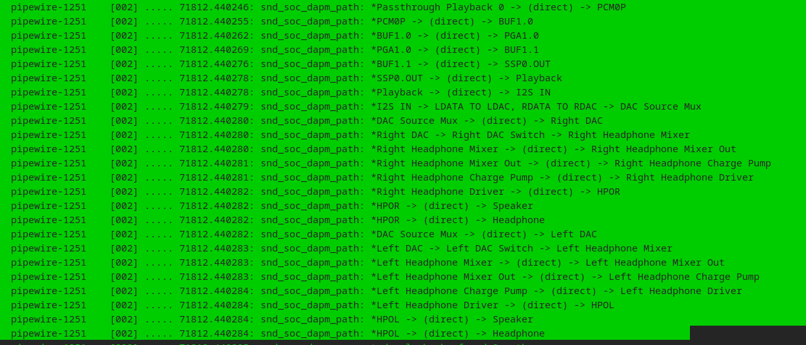

以右声道为例，路径从Passthrough Playback 0为起点，Speaker/Headphone为终点，一条完整的DAPM path。

这个时候就会有疑问了，codec中只定义了I2S IN到HPOR的，其余的DAPM哪里来的呢？这个问题对于刚接触asoc来说还是蛮复杂的。

> 首先解释一下Passthrough Playback 0到SSP0.OUT, 这一部分是从音频tplg文件中读取的，其实也就是platform widget,后面在解析tplg时会讲到，这里先不用关注
>
> 再就是Playback这个widget,前面在介绍dai widget时讲过怎么来的了，Playback作为codec dai widget放在这里。
>
> I2S IN到HPOR是codec驱动中定义的
>
> HPOR到speaker/headphone这里是machine驱动里定义的，流程和codec一样的，这里不再介绍

整个音频路径和DAPM恰好对应了5.2.4.1节介绍的不同DAPM上下文

##### 5.2.4.2.1 Dai widget和Stream widget怎么连接

**同时还有一个问题，Playback又是怎么和I2S IN连上的呢？**

现在再看一下I2S IN的定义，这是一个**stream domin widget**, stream_name是I2S1 Playback。

```
	SND_SOC_DAPM_AIF_IN("I2S IN", "I2S1 Playback", 0,
			    SND_SOC_NOPM, 0, 0),
```

默认情况下，驱动不会通过snd_soc_dapm_route来主动定义dai widget和stream widget之间的连接关系，两者之间的连接关系是由ASoc core负责的，在声卡的初始化函数中，使用snd_soc_dapm_link_dai_widgets函数来建立他们之间的连接关系：

```
int snd_soc_dapm_link_dai_widgets(struct snd_soc_card *card)
{
	struct snd_soc_dapm_widget *dai_w, *w;
	struct snd_soc_dapm_widget *src, *sink;
	struct snd_soc_dai *dai;

	/* For each DAI widget... */
	for_each_card_widgets(card, dai_w) {
		switch (dai_w->id) {
		case snd_soc_dapm_dai_in:
		case snd_soc_dapm_dai_out:
			break;
		default:
			continue;
		}

		/* let users know there is no DAI to link */
		if (!dai_w->priv) {
			dev_dbg(card->dev, "dai widget %s has no DAI\n",
				dai_w->name);
			continue;
		}

		dai = dai_w->priv;

		/* ...find all widgets with the same stream and link them */
		for_each_card_widgets(card, w) {
			if (w->dapm != dai_w->dapm)
				continue;

			switch (w->id) {
			case snd_soc_dapm_dai_in:
			case snd_soc_dapm_dai_out:
				continue;
			default:
				break;
			}

			if (!w->sname || !strstr(w->sname, dai_w->sname))           //通过名字查找
				continue;

			if (dai_w->id == snd_soc_dapm_dai_in) {
				src = dai_w;
				sink = w;
			} else {
				src = w;
				sink = dai_w;
			}
			dev_dbg(dai->dev, "%s -> %s\n", src->name, sink->name);
			snd_soc_dapm_add_path(w->dapm, src, sink, NULL, NULL);
		}
	}

	return 0;
}
```

匹配的原理很简单，通过名字。如果widget的stream name包含了dai的stream name，则匹配成功，连接这两个widget。也就是I2S1 Playback包含Playback。

##### 5.2.4.2.2 codec dai widget和cpu dai widget怎么连接呢

也就是SSP0.OUT和Playback怎么连接，这个问题我看了好久的代码才发现确切的位置。

解析tplg文件后，可以知道SSP0.OUT是dai_in类型，stream_name是SSP0-codec。而SSP0-codec是一个BE,也就是一个DAI Link。

**sof_connect_dai_widget**函数是来自soc/sof/topology.c文件中，我举的例子**sof-es8336**也是sof的声卡。所以**sof_connect_dai_widget**也只适用于sof声卡

```
static int sof_connect_dai_widget(struct snd_soc_component *scomp,
				  struct snd_soc_dapm_widget *w,
				  struct snd_soc_tplg_dapm_widget *tw,
				  struct snd_sof_dai *dai)
{
	struct snd_soc_card *card = scomp->card;
	struct snd_soc_pcm_runtime *rtd, *full, *partial;
	struct snd_soc_dai *cpu_dai;
	int stream;
	int i;

	if (!w->sname) {
		dev_err(scomp->dev, "Widget %s does not have stream\n", w->name);
		return -EINVAL;
	}

	if (w->id == snd_soc_dapm_dai_out)
		stream = SNDRV_PCM_STREAM_CAPTURE;
	else if (w->id == snd_soc_dapm_dai_in)                     //确定方向
		stream = SNDRV_PCM_STREAM_PLAYBACK;
	else
		goto end;

	full = NULL;
	partial = NULL;
	list_for_each_entry(rtd, &card->rtd_list, list) {
		/* does stream match DAI link ? */
		if (rtd->dai_link->stream_name) {
			if (!strcmp(rtd->dai_link->stream_name, w->sname)) {              //根据stream_name名匹配
				full = rtd;
				break;
			} else if (strstr(rtd->dai_link->stream_name, w->sname)) {
				partial = rtd;
			}
		}
	}

	rtd = full ? full : partial;
	if (rtd) {
		for_each_rtd_cpu_dais(rtd, i, cpu_dai) {                //遍历cpu_dai
			/*
			 * Please create DAI widget in the right order
			 * to ensure BE will connect to the right DAI
			 * widget.
			 */
			if (!snd_soc_dai_get_widget(cpu_dai, stream)) {
				snd_soc_dai_set_widget(cpu_dai, stream, w);            //设置好dai的widget
				break;
			}
		}
		if (i == rtd->dai_link->num_cpus) {
			dev_err(scomp->dev, "error: can't find BE for DAI %s\n", w->name);

			return -EINVAL;
		}

		dai->name = rtd->dai_link->name;               //设置dai name
		dev_dbg(scomp->dev, "tplg: connected widget %s -> DAI link %s\n",
			w->name, rtd->dai_link->name);
	}
end:
	/* check we have a connection */
	if (!dai->name) {
		dev_err(scomp->dev, "error: can't connect DAI %s stream %s\n",
			w->name, w->sname);
		return -EINVAL;
	}

	return 0;
}
```

再简单介绍一下dai_link的stream_name从哪来的，根据下面几个的代码片段：

下面代码来自sof-es8336 machine驱动，下面定义了一种BE类型dai_link，为什么是BE的在5.3节已经讲到。


根据下面代码可知，在没定义stream_name时，stream_name=name，所以stream_name也是SSP0-Codec。最后使用sof_connect_dai_widget函数就可以将某个拓扑中的 DAI Widget 绑定到实际的 DAI link 上，并记录这个绑定关系到 `snd_sof_dai` 中。

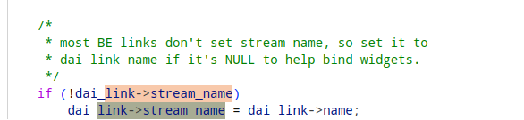

下面是对应的内核日志：

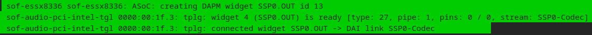

接下来就要进行cpu_dai和codec_dai配对了，也就是下面的流程：

```
static void dapm_connect_dai_pair(struct snd_soc_card *card,
				  struct snd_soc_pcm_runtime *rtd,
				  struct snd_soc_dai *codec_dai,
				  struct snd_soc_dai *cpu_dai)
{
	struct snd_soc_dai_link *dai_link = rtd->dai_link;
	struct snd_soc_dapm_widget *codec, *cpu;
	struct snd_soc_dai *src_dai[]		= { cpu_dai,	codec_dai };
	struct snd_soc_dai *sink_dai[]		= { codec_dai,	cpu_dai };
	struct snd_soc_dapm_widget **src[]	= { &cpu,	&codec };
	struct snd_soc_dapm_widget **sink[]	= { &codec,	&cpu };
	char *widget_name[]			= { "playback",	"capture" };
	int stream;

	for_each_pcm_streams(stream) {
		int stream_cpu, stream_codec;

		stream_cpu	= snd_soc_get_stream_cpu(dai_link, stream);
		stream_codec	= stream;

		/* connect BE DAI playback if widgets are valid */
		cpu	= snd_soc_dai_get_widget(cpu_dai,	stream_cpu);   //分别从 CPU 和 Codec DAI 中提取Playback/ Capture 对应的 DAI widget
		codec	= snd_soc_dai_get_widget(codec_dai,	stream_codec);

................... //省略
		dapm_connect_dai_routes(&card->dapm, src_dai[stream], *src[stream],
					rtd->c2c_widget[stream],
					sink_dai[stream], *sink[stream]);           //建立路径连接

	}
}

static void dapm_connect_dai_routes(struct snd_soc_dapm_context *dapm,
				    struct snd_soc_dai *src_dai,
				    struct snd_soc_dapm_widget *src,
				    struct snd_soc_dapm_widget *dai,
				    struct snd_soc_dai *sink_dai,
				    struct snd_soc_dapm_widget *sink)
{
	dev_dbg(dapm->dev, "connected DAI link %s:%s -> %s:%s\n",
		src_dai->component->name, src->name,
		sink_dai->component->name, sink->name);

	if (dai) {
		snd_soc_dapm_add_path(dapm, src, dai, NULL, NULL);
		src = dai;
	}

	snd_soc_dapm_add_path(dapm, src, sink, NULL, NULL);                         //建立dapm path路径了
}
```

为一个 DAI pair（CPU DAI 和 Codec DAI）在 DAPM 图中建立播放和采集方向的路径，必要时在中间插入一个 `snd_soc_dapm_dai_link` 类型的 widget（用于 Codec-to-Codec 配置）。

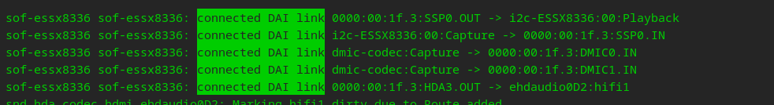

上面虽然是以SOF为例子，实际上飞腾ES8336驱动更简单，总体分析大差不差，只不过少了一个解析tplg的步骤。

#### 5.2.4.3 如何创建dapm widget

上一小节介绍了es8316 codec定义了大量的dapm widget和route，那么是怎么创建dapm widget呢？那就是通过**snd_soc_dapm_new_controls**函数

```
int snd_soc_dapm_new_controls(struct snd_soc_dapm_context *dapm,
	const struct snd_soc_dapm_widget *widget,
	int num)
{
	int i;
	int ret = 0;

	snd_soc_dapm_mutex_lock_root(dapm);
	for (i = 0; i < num; i++) {
		struct snd_soc_dapm_widget *w = snd_soc_dapm_new_control_unlocked(dapm, widget);
		if (IS_ERR(w)) {
			ret = PTR_ERR(w);
			break;
		}
		widget++;
	}
	snd_soc_dapm_mutex_unlock(dapm);
	return ret;
}
```

函数根据传入的dapm上下文和widget数组(比如es8316_dapm_widgets)调用**snd_soc_dapm_new_control_unlocked**（Dai widget节已经介绍过）创建widget。

实际上，这个函数只是创建widget的第一步，它为每个widget分配内存，初始化必要的字段，然后把这些widget挂在代表声卡的snd_soc_card的widgets链表字段中。要使widget之间具备连接能力，我们还需要第二个函数：snd_soc_dapm_new_widgets

这个函数会根据widget的信息，创建widget所需要的dapm kcontrol，这些dapm kcontol的状态变化，代表着音频路径的变化，从而影响着各个widget的电源状态。看到函数的名称可能会迷惑一下，实际上，snd_soc_dapm_new_controls的作用更多地是创建widget，而snd_soc_dapm_new_widget的作用则更多地是创建widget所包含的kcontrol，所以在我看来，这两个函数名称应该换过来叫更好。

```
int snd_soc_dapm_new_widgets(struct snd_soc_card *card)
{
	struct snd_soc_dapm_widget *w;
	unsigned int val;

	snd_soc_dapm_mutex_lock_root(card);

	for_each_card_widgets(card, w)                  
	{
		if (w->new)
			continue;

		if (w->num_kcontrols) {
			w->kcontrols = kcalloc(w->num_kcontrols,               //分配内存
						sizeof(struct snd_kcontrol *),
						GFP_KERNEL);
			if (!w->kcontrols) {
				snd_soc_dapm_mutex_unlock(card);
				return -ENOMEM;
			}
		}

		switch(w->id) {                                   //创建控件
		case snd_soc_dapm_switch:
		case snd_soc_dapm_mixer:
		case snd_soc_dapm_mixer_named_ctl:
			dapm_new_mixer(w);
			break;
		case snd_soc_dapm_mux:
		case snd_soc_dapm_demux:
			dapm_new_mux(w);
			break;
		case snd_soc_dapm_pga:
		case snd_soc_dapm_effect:
		case snd_soc_dapm_out_drv:
			dapm_new_pga(w);
			break;
		case snd_soc_dapm_dai_link:
			dapm_new_dai_link(w);
			break;
		default:
			break;
		}

		/* Read the initial power state from the device */
		if (w->reg >= 0) {
			val = soc_dapm_read(w->dapm, w->reg);
			val = val >> w->shift;
			val &= w->mask;
			if (val == w->on_val)
				w->power = 1;
		}

		w->new = 1;

		dapm_mark_dirty(w, "new widget");         //表明该widget的状态发生了变化
		dapm_debugfs_add_widget(w);               //debug信息
	}

	dapm_power_widgets(card, SND_SOC_DAPM_STREAM_NOP);            //处理所有位于dapm_dirty链表上的widget的状态改变
	snd_soc_dapm_mutex_unlock(card);
	return 0;
}
```

该函数通过声卡的widgets链表，遍历所有已经注册了的widget，其中的new字段用于判断该widget是否已经执行过**snd_soc_dapm_new_widgets**函数，如果num_kcontrols字段有数值，表明该widget包含有多个dapm kcontrol，那么就需要为这些kcontrol分配一个指针数组，并把数组的首地址赋值给widget的kcontrols字段，该数组存放着指向这些kcontrol的指针，根据dapm widegt->id调用对应的控件创建函数即可创建控件。

- dapm_new_mixer、dapm_new_mux、dapm_new_pga、dapm_new_dai_link这里就不介绍了，有兴趣可以自己看代码


#### 5.2.4.4 为widget建立连接关系

前面我们已经知道，widget之间是使用snd_soc_dapm_path结构进行连接的，驱动要做的是定义一个snd_soc_dapm_route结构数组，该数组的每个条目描述了目的widget的和源widget的名称，以及控制这个连接的kcontrol的名称，最终，驱动程序使用api函数**snd_soc_dapm_add_routes**来注册这些连接信息，接下来snd_soc_dapm_add_routes函数的具体实现：

```
int snd_soc_dapm_add_routes(struct snd_soc_dapm_context *dapm,
			    const struct snd_soc_dapm_route *route, int num)
{
	int i, ret = 0;

	snd_soc_dapm_mutex_lock(dapm);
	for (i = 0; i < num; i++) {
		int r = snd_soc_dapm_add_route(dapm, route);
		if (r < 0)
			ret = r;
		route++;
	}
	snd_soc_dapm_mutex_unlock(dapm);

	return ret;
}
```

函数根据传入的dapm上下文和widget数组(比如es8316_dapm_routes)调用**snd_soc_dapm_add_route**创建route。

```
static int snd_soc_dapm_add_route(struct snd_soc_dapm_context *dapm,
				  const struct snd_soc_dapm_route *route)
{
	struct snd_soc_dapm_widget *wsource = NULL, *wsink = NULL, *w;
	struct snd_soc_dapm_widget *wtsource = NULL, *wtsink = NULL;
	const char *sink;
	const char *source;
	char prefixed_sink[80];
	char prefixed_source[80];
	const char *prefix;
	unsigned int sink_ref = 0;
	unsigned int source_ref = 0;
	int ret;

	prefix = soc_dapm_prefix(dapm);
	if (prefix) {
		snprintf(prefixed_sink, sizeof(prefixed_sink), "%s %s",
			 prefix, route->sink);
		sink = prefixed_sink;
		snprintf(prefixed_source, sizeof(prefixed_source), "%s %s",
			 prefix, route->source);
		source = prefixed_source;
	} else {
		sink = route->sink;                                   //设置sink和source的名字
		source = route->source;
	}

	wsource	= dapm_wcache_lookup(dapm->wcache_source, source);//DAPM结构中维护了wcache_source/sink，用于上次查找的结果缓存，加快查找速度。
	wsink	= dapm_wcache_lookup(dapm->wcache_sink,   sink);

	if (wsink && wsource)
		goto skip_search;

	/*
	 * find src and dest widgets over all widgets but favor a widget from
	 * current DAPM context
	 */
	for_each_card_widgets(dapm->card, w) {                     //全局搜索 widgets 并优先使用当前 DAPM context 中的 widget
		if (!wsink && !(strcmp(w->name, sink))) {
			wtsink = w;
			if (w->dapm == dapm) {
				wsink = w;
				if (wsource)
					break;
			}
			sink_ref++;
			if (sink_ref > 1)
				dev_warn(dapm->dev,
					"ASoC: sink widget %s overwritten\n",
					w->name);
			continue;
		}
		if (!wsource && !(strcmp(w->name, source))) {
			wtsource = w;
			if (w->dapm == dapm) {
				wsource = w;
				if (wsink)
					break;
			}
			source_ref++;
			if (source_ref > 1)
				dev_warn(dapm->dev,
					"ASoC: source widget %s overwritten\n",
					w->name);
		}
	}
	/* use widget from another DAPM context if not found from this */
	if (!wsink)                                         //使用候补结果（如果当前 context 未找到）
		wsink = wtsink;
	if (!wsource)
		wsource = wtsource;

	ret = -ENODEV;
	if (!wsource)
		goto err;
	if (!wsink)
		goto err;

skip_search:
	/* update cache */
	dapm->wcache_sink	= wsink;                
	dapm->wcache_source	= wsource;

	ret = snd_soc_dapm_add_path(dapm, wsource, wsink, route->control,       
		route->connected);                            //添加路径
err:
	if (ret)
		dev_err(dapm->dev, "ASoC: Failed to add route %s%s -%s%s%s> %s%s\n",
			source, !wsource ? "(*)" : "",
			!route->control ? "" : "> [",
			!route->control ? "" : route->control,
			!route->control ? "" : "] -",
			sink,  !wsink ? "(*)" : "");
	return ret;
}
```

下面继续分析**snd_soc_dapm_add_path**函数

```
static int snd_soc_dapm_add_path(struct snd_soc_dapm_context *dapm,
	struct snd_soc_dapm_widget *wsource, struct snd_soc_dapm_widget *wsink,
	const char *control,
	int (*connected)(struct snd_soc_dapm_widget *source,
			 struct snd_soc_dapm_widget *sink))
{
	enum snd_soc_dapm_direction dir;
	struct snd_soc_dapm_path *path;
	int ret;

	...................
	....................
	...................             //省略

	ret = snd_soc_dapm_check_dynamic_path(dapm, wsource, wsink, control); //判断动态路径是否合法，比如是否为 mux/mixer之间非法连接。
	if (ret)
		return ret;

	path = kzalloc(sizeof(struct snd_soc_dapm_path), GFP_KERNEL);
	if (!path)
		return -ENOMEM;

	path->node[SND_SOC_DAPM_DIR_IN] = wsource;                //设置path两端的source和sink
	path->node[SND_SOC_DAPM_DIR_OUT] = wsink;

	path->connected = connected;                 
	INIT_LIST_HEAD(&path->list);
	INIT_LIST_HEAD(&path->list_kcontrol);

	if (wsource->is_supply || wsink->is_supply)
		path->is_supply = 1;

	/* connect static paths */
	if (control == NULL) {                                    
		path->connect = 1;
	} else {                                                     //处理两个widget之间有kcontrol的情况
		switch (wsource->id) {
		case snd_soc_dapm_demux:
			ret = dapm_connect_mux(dapm, path, control, wsource);
			if (ret)
				goto err;
			break;
		default:
			break;
		}

		switch (wsink->id) {
		case snd_soc_dapm_mux:
			ret = dapm_connect_mux(dapm, path, control, wsink);
			if (ret != 0)
				goto err;
			break;
		case snd_soc_dapm_switch:
		case snd_soc_dapm_mixer:
		case snd_soc_dapm_mixer_named_ctl:
			ret = dapm_connect_mixer(dapm, path, control);
			if (ret != 0)
				goto err;
			break;
		default:
			break;
		}
	}

	list_add(&path->list, &dapm->card->paths);                  //把路径插入到 card 的路径列表中。

	snd_soc_dapm_for_each_direction(dir)               //分别把路径插入到源、目标 widget 的边链表，方便路径遍历。
		list_add(&path->list_node[dir], &path->node[dir]->edges[dir]);

	snd_soc_dapm_for_each_direction(dir) {
		dapm_update_widget_flags(path->node[dir]);
		dapm_mark_dirty(path->node[dir], "Route added");
	}

	if (snd_soc_card_is_instantiated(dapm->card) && path->connect)
		dapm_path_invalidate(path);

	return 0;
err:
	kfree(path);
	return ret;
}
```

### 5.2.5 DAPM上下电

#### 5.2.5.1 上下电顺序

建立widget之间的连接关系中，我们知道，在创建widget的时候，widget的power_check回调函数会根据widget的类型，设置不同的回调函数。当widget的状态改变后，dapm会遍历dapm_dirty链表，并通过power_check回调函数，决定该widget是否需要上电。大多数的widget的power_check回调被设置为：dapm_generic_check_power（5.2.2.3介绍了相关内容）

dapm widget中有个power_list链表来保存需要上电和需要下电的widget,通过使用dapm_seq_insert函数把一个widget加入到链表中。

```
static void dapm_seq_insert(struct snd_soc_dapm_widget *new_widget,
			    struct list_head *list,
			    bool power_up)
{
	struct snd_soc_dapm_widget *w;

	list_for_each_entry(w, list, power_list)
		if (dapm_seq_compare(new_widget, w, power_up) < 0) {
			list_add_tail(&new_widget->power_list, &w->power_list);
			return;
		}

	list_add_tail(&new_widget->power_list, list);
}
```

上下电顺序在代码中由dapm_up_seq和dapm_down_seq数组定义。

#### 5.2.5.2 widget的上下电过程

当一个widget的状态改变后，该widget会被加入声卡全局的dirty链表，然后通过dapm_power_widgets函数来改变整个音频路径上的电源状态

```
static int dapm_power_widgets(struct snd_soc_card *card, int event)
{
	struct snd_soc_dapm_widget *w;
	struct snd_soc_dapm_context *d;
	LIST_HEAD(up_list);
	LIST_HEAD(down_list);
	ASYNC_DOMAIN_EXCLUSIVE(async_domain);
	enum snd_soc_bias_level bias;
	int ret;

	snd_soc_dapm_mutex_assert_held(card);

	trace_snd_soc_dapm_start(card);

	for_each_card_dapms(card, d) {                            //设置所有dapm上下文的 bias level
		if (dapm_idle_bias_off(d))
			d->target_bias_level = SND_SOC_BIAS_OFF;
		else
			d->target_bias_level = SND_SOC_BIAS_STANDBY;
	}

	dapm_reset(card);                        //重置声卡中所有 DAPM widgets 的状态,包括new_power和power_checked

	/* Check which widgets we need to power and store them in
	 * lists indicating if they should be powered up or down.  We
	 * only check widgets that have been flagged as dirty but note
	 * that new widgets may be added to the dirty list while we
	 * iterate.
	 */
	list_for_each_entry(w, &card->dapm_dirty, dirty) {            //遍历 dirty widget，判断谁要上下电
		dapm_power_one_widget(w, &up_list, &down_list);
	}

	for_each_card_widgets(card, w) {                             
		switch (w->id) {
		case snd_soc_dapm_pre:
		case snd_soc_dapm_post:
			/* These widgets always need to be powered */
			break;
		default:
			list_del_init(&w->dirty);
			break;
		}

		if (w->new_power) {                         //dapm_power_one_widget会更新new_power
			d = w->dapm;

			/* Supplies and micbiases only bring the
			 * context up to STANDBY as unless something
			 * else is active and passing audio they
			 * generally don't require full power.  Signal
			 * generators are virtual pins and have no
			 * power impact themselves.
			 */
			switch (w->id) {
			case snd_soc_dapm_siggen:
			case snd_soc_dapm_vmid:
				break;
			case snd_soc_dapm_supply:
			case snd_soc_dapm_regulator_supply:
			case snd_soc_dapm_pinctrl:
			case snd_soc_dapm_clock_supply:                //电源供应类 widget 仅需维持 STANDBY 就够了
			case snd_soc_dapm_micbias:
				if (d->target_bias_level < SND_SOC_BIAS_STANDBY)
					d->target_bias_level = SND_SOC_BIAS_STANDBY;
				break;
			default:
				d->target_bias_level = SND_SOC_BIAS_ON;        //虚拟/电源类型的 widget 会把上下文设置为 SND_SOC_BIAS_ON（全功率）
				break;
			}
		}

	}

	/* Force all contexts in the card to the same bias state if
	 * they're not ground referenced.
	 */
	bias = SND_SOC_BIAS_OFF;
	for_each_card_dapms(card, d)
		if (d->target_bias_level > bias)
			bias = d->target_bias_level;
	for_each_card_dapms(card, d)
		if (!dapm_idle_bias_off(d))
			d->target_bias_level = bias;

	trace_snd_soc_dapm_walk_done(card);

	/* Run card bias changes at first */
	dapm_pre_sequence_async(&card->dapm, 0);
	/* Run other bias changes in parallel */
	for_each_card_dapms(card, d) {
		if (d != &card->dapm && d->bias_level != d->target_bias_level)
			async_schedule_domain(dapm_pre_sequence_async, d,
						&async_domain);
	}
	async_synchronize_full_domain(&async_domain);

	list_for_each_entry(w, &down_list, power_list) {            //通知即将下电的 widget
		dapm_seq_check_event(card, w, SND_SOC_DAPM_WILL_PMD);
	}

	list_for_each_entry(w, &up_list, power_list) {                  //通知即将上电的 widget
		dapm_seq_check_event(card, w, SND_SOC_DAPM_WILL_PMU);
	}

	/* Power down widgets first; try to avoid amplifying pops. */
	dapm_seq_run(card, &down_list, event, false);              //先下电，再上电（防止 pop noise）
	dapm_widget_update(card);
	/* Now power up. */
	dapm_seq_run(card, &up_list, event, true);

	/* Run all the bias changes in parallel */
	for_each_card_dapms(card, d) {
		if (d != &card->dapm && d->bias_level != d->target_bias_level)
			async_schedule_domain(dapm_post_sequence_async, d,
						&async_domain);
	}
	async_synchronize_full_domain(&async_domain);
	/* Run card bias changes at last */
	dapm_post_sequence_async(&card->dapm, 0);

	/* do we need to notify any clients that DAPM event is complete */
	for_each_card_dapms(card, d) {
		if (!d->component)
			continue;

		ret = snd_soc_component_stream_event(d->component, event);               //通知所有组件流事件完成
		if (ret < 0)
			return ret;
	}

	pop_dbg(card->dev, card->pop_time,
		"DAPM sequencing finished, waiting %dms\n", card->pop_time);
	pop_wait(card->pop_time);

	trace_snd_soc_dapm_done(card);

	return 0;
}
```

> 这个函数我觉得还是较为难理解的。下面大概介绍一下流程
>
> 可见，该函数通过遍历dirty链表，对每个链表中的widget调用dapm_power_one_widget，dapm_power_one_widget函数除了处理自身的状态改变外，还把自身的变化传递到和它相连的邻居widget中，结果就是，所有需要上电的widget会被放在up_list链表中，而所有需要下电的widget会被放在down_list链表中，这个函数我们稍后再讨论。
> 遍历down_list链表，向其中的widget发出SND_SOC_DAPM_WILL_PMD事件，感兴趣该事件的widget的event回调会被调用。
>
> 遍历up_list链表，向其中的widget发出SND_SOC_DAPM_WILL_PMU事件，感兴趣该事件的widget的event回调会被调用。
> 通过dapm_seq_run函数，处理down_list中的widget，使它们按定义好的顺序依次下电。
> 通过dapm_widget_update函数，切换触发该次状态变化的widget的kcontrol中的寄存器值，对应的结果就是：改变音频路径。
>
> 通过dapm_seq_run函数，处理up_list中的widget，使它们按定义好的顺序依次上电。
> 对每个dapm context发出状态改变回调。
>
> 适当的延时，防止pop音。

```
static void dapm_power_one_widget(struct snd_soc_dapm_widget *w,
				  struct list_head *up_list,
				  struct list_head *down_list)
{
	struct snd_soc_dapm_path *path;
	int power;

	switch (w->id) {
	case snd_soc_dapm_pre:
		power = 0;
		goto end;
	case snd_soc_dapm_post:
		power = 1;
		goto end;
	default:
		break;
	}
	power = dapm_widget_power_check(w);             //根据 DAPM 路径是否有信号/供电判断该 widget 是否“应该”上电；
	if (w->power == power)
		return;
	trace_snd_soc_dapm_widget_power(w, power);
	/*
	 * If we changed our power state perhaps our neigbours
	 * changed also.
	 */
	snd_soc_dapm_widget_for_each_source_path(w, path)          //通知相邻 widget 状态变化       -----输入源
		dapm_widget_set_peer_power(path->source, power, path->connect);

	/*
	 * Supplies can't affect their outputs, only their inputs
	 */
	if (!w->is_supply)
		snd_soc_dapm_widget_for_each_sink_path(w, path)         ////通知相邻 widget 状态变化       -----输出
			dapm_widget_set_peer_power(path->sink, power, path->connect);
end:
if (power)   													//插入到上电 / 下电处理列表中
		dapm_seq_insert(w, up_list, true);
	else
		dapm_seq_insert(w, down_list, false);
}
```

> 通过dapm_widget_power_check，调用widget的power_check回调函数，获得该widget新的电源状态。
> 遍历source widget，通过dapm_widget_set_peer_power函数，把处于连接状态的source widget加入dapm_dirty链表中。
> 遍历sink widget，通过dapm_widget_set_peer_power函数，把处于连接状态的sink widget加入dapm_dirty链表中。
> 根据第一步得到的新的电源状态，把widget加入到up_list或down_list链表中。

可见通过该函数，就可以实现一个widget状态改变，就可以将该状态传递下去，所有受到影响的widget都会被加入到card->dirty链表的末尾。

当所有需要上电或下电的widget都被加入到dapm dirty链表后，接着会通过dapm_seq_run处理down_list链表上的widget，把该链表上的widget按顺序下电，然后通过dapm_widget_update更新widget中的kcontrol（这个kcontrol通常就是触发本次状态改变的触发源），接着又通过dapm_seq_run处理up_list链表上的widget，把该链表上的widget按顺序上电。最终的上电或下电操作需要通过codec的寄存器来实现，因为定义widget时，如果这是一个带电源控制的widget，我们必须提供reg/shift等字段的设置值，如果该widget无需寄存器控制电源状态，则reg字段必须赋值为：SND_SOC_NOPM (-1)。

#### 5.2.4.5.3 示例

以下几种情况可以触发dapm_power_widgets函数

- 声卡初始化阶段，snd_soc_dapm_new_widgets函数创建widget包含的kcontrol后，会触发一次扫描操作。
- 用户空间的应用程序修改了widget中包含的dapm kcontrol的配置值时，会触发一次扫描操作。
- pcm设备的打开或关闭，会通过音频流widget触发一次扫描操作。
- 驱动程序在改变了某个widget并把它加入到dapm_dirty链表后，主动调用snd_soc_dapm_sync函数触发扫描操作。

第一种和第四种已经在上面的章节见到过了，现在介绍一下第二种方式，也是最常用的方式。

下面以调节音量的动作为示例

```
int snd_soc_dapm_put_volsw(struct snd_kcontrol *kcontrol,
	struct snd_ctl_elem_value *ucontrol)
{
	.......................
	.......................
	.......................      //省略
	if (change || reg_change) {
		.......................
		.......................      //省略
		ret = soc_dapm_mixer_update_power(card, kcontrol, connect,
						  rconnect);
		card->update = NULL;
	}

	snd_soc_dapm_mutex_unlock(card);

	if (ret > 0)
		snd_soc_dpcm_runtime_update(card);

	return change;
}
```

这个函数省略的部分我们暂且不用太关心。当音量改变后，会触发soc_dapm_mixer_update_power函数

```
static int soc_dapm_mixer_update_power(struct snd_soc_card *card,
				       struct snd_kcontrol *kcontrol,
				       int connect, int rconnect)
{
	struct snd_soc_dapm_path *path;
	int found = 0;

	snd_soc_dapm_mutex_assert_held(card);

	/* find dapm widget path assoc with kcontrol */
	dapm_kcontrol_for_each_path(path, kcontrol) {
		if (found && rconnect >= 0)
			soc_dapm_connect_path(path, rconnect, "mixer update");
		else
			soc_dapm_connect_path(path, connect, "mixer update");
		found = 1;
	}

	if (found)
		dapm_power_widgets(card, SND_SOC_DAPM_STREAM_NOP);

	return found;
}
```

soc_dapm_mixer_update_power最终会调用dapm_power_widgets函数。通过dapm_power_widgets函数，触发整个音频路径的扫描过程，这个函数执行后，因为kcontrol的状态改变，被断开连接的音频路径上的所有widget被按顺序下电，而重新连上的音频路径上的所有widget被顺序地上电，所以，尽管我们只改变了kcontrol中的一个输入端的连接状态，所有相关的widget的电源状态都会被重新设定，这一切，都是自动完成的。

### 5.2.6 DAPM events

```
#define SND_SOC_DAPM_PRE_PMU		0x1	/* before widget power up */
#define SND_SOC_DAPM_POST_PMU		0x2	/* after  widget power up */
#define SND_SOC_DAPM_PRE_PMD		0x4	/* before widget power down */
#define SND_SOC_DAPM_POST_PMD		0x8	/* after  widget power down */
#define SND_SOC_DAPM_PRE_REG		0x10	/* before audio path setup */
#define SND_SOC_DAPM_POST_REG		0x20	/* after  audio path setup */
#define SND_SOC_DAPM_WILL_PMU		0x40	/* called at start of sequence */
#define SND_SOC_DAPM_WILL_PMD		0x80	/* called at start of sequence */
#define SND_SOC_DAPM_PRE_POST_PMD	(SND_SOC_DAPM_PRE_PMD | SND_SOC_DAPM_POST_PMD)
#define SND_SOC_DAPM_PRE_POST_PMU	(SND_SOC_DAPM_PRE_PMU | SND_SOC_DAPM_POST_PMU)
```

dapm目前为我们定义了10种dapm event，常使用的也就SND_SOC_DAPM_PRE_PMU和SND_SOC_DAPM_POST_PMD

前面已经介绍过代表widget的**snd_soc_dapm_widget**结构，在这个结构体中，有一个event字段用于保存该widget的事件回调函数，同时，event_flags字段用于保存该widget需要关心的dapm事件种类，只有event_flags字段中相应的事件位被设置了的事件才会发到event回调函数中进行处理。

使用以下这几种宏定义widget时，默认需要我们提供dapm event回调函数

```
#define SND_SOC_DAPM_MIC(wname, wevent) \
(struct snd_soc_dapm_widget) { \
	.id = snd_soc_dapm_mic, .name = wname, .kcontrol_news = NULL, \
	.num_kcontrols = 0, .reg = SND_SOC_NOPM, .event = wevent, \
	.event_flags = SND_SOC_DAPM_PRE_PMU | SND_SOC_DAPM_POST_PMD}
#define SND_SOC_DAPM_HP(wname, wevent) \
(struct snd_soc_dapm_widget) { \
	.id = snd_soc_dapm_hp, .name = wname, .kcontrol_news = NULL, \
	.num_kcontrols = 0, .reg = SND_SOC_NOPM, .event = wevent, \
	.event_flags = SND_SOC_DAPM_POST_PMU | SND_SOC_DAPM_PRE_PMD}
#define SND_SOC_DAPM_SPK(wname, wevent) \
(struct snd_soc_dapm_widget) { \
	.id = snd_soc_dapm_spk, .name = wname, .kcontrol_news = NULL, \
	.num_kcontrols = 0, .reg = SND_SOC_NOPM, .event = wevent, \
	.event_flags = SND_SOC_DAPM_POST_PMU | SND_SOC_DAPM_PRE_PMD}
#define SND_SOC_DAPM_LINE(wname, wevent) \
(struct snd_soc_dapm_widget) { \
	.id = snd_soc_dapm_line, .name = wname, .kcontrol_news = NULL, \
	.num_kcontrols = 0, .reg = SND_SOC_NOPM, .event = wevent, \
	.event_flags = SND_SOC_DAPM_POST_PMU | SND_SOC_DAPM_PRE_PMD}
	
	
#define SND_SOC_DAPM_PGA_E(wname, wreg, wshift, winvert, wcontrols, \
	wncontrols, wevent, wflags) \
(struct snd_soc_dapm_widget) { \
	.id = snd_soc_dapm_pga, .name = wname, \
	SND_SOC_DAPM_INIT_REG_VAL(wreg, wshift, winvert), \
	.kcontrol_news = wcontrols, .num_kcontrols = wncontrols, \
	.event = wevent, .event_flags = wflags}
#define SND_SOC_DAPM_OUT_DRV_E(wname, wreg, wshift, winvert, wcontrols, \
	wncontrols, wevent, wflags) \
(struct snd_soc_dapm_widget) { \
	.id = snd_soc_dapm_out_drv, .name = wname, \
	SND_SOC_DAPM_INIT_REG_VAL(wreg, wshift, winvert), \
	.kcontrol_news = wcontrols, .num_kcontrols = wncontrols, \
	.event = wevent, .event_flags = wflags}
#define SND_SOC_DAPM_MIXER_E(wname, wreg, wshift, winvert, wcontrols, \
	wncontrols, wevent, wflags) \
(struct snd_soc_dapm_widget) { \
	.id = snd_soc_dapm_mixer, .name = wname, \
	SND_SOC_DAPM_INIT_REG_VAL(wreg, wshift, winvert), \
	.kcontrol_news = wcontrols, .num_kcontrols = wncontrols, \
	.event = wevent, .event_flags = wflags}
#define SND_SOC_DAPM_MIXER_NAMED_CTL_E(wname, wreg, wshift, winvert, \
	wcontrols, wncontrols, wevent, wflags) \
(struct snd_soc_dapm_widget) { \
	.id = snd_soc_dapm_mixer, .name = wname, \
	SND_SOC_DAPM_INIT_REG_VAL(wreg, wshift, winvert), \
	.kcontrol_news = wcontrols, \
	.num_kcontrols = wncontrols, .event = wevent, .event_flags = wflags}
#define SND_SOC_DAPM_SWITCH_E(wname, wreg, wshift, winvert, wcontrols, \
	wevent, wflags) \
(struct snd_soc_dapm_widget) { \
	.id = snd_soc_dapm_switch, .name = wname, \
	SND_SOC_DAPM_INIT_REG_VAL(wreg, wshift, winvert), \
	.kcontrol_news = wcontrols, .num_kcontrols = 1, \
	.event = wevent, .event_flags = wflags}
#define SND_SOC_DAPM_MUX_E(wname, wreg, wshift, winvert, wcontrols, \
	wevent, wflags) \
(struct snd_soc_dapm_widget) { \
	.id = snd_soc_dapm_mux, .name = wname, \
	SND_SOC_DAPM_INIT_REG_VAL(wreg, wshift, winvert), \
	.kcontrol_news = wcontrols, .num_kcontrols = 1, \
	.event = wevent, .event_flags = wflags}
```

下面以华为flmx上的声卡作为示例

```
	SND_SOC_DAPM_SWITCH_E("Headset Playback",                             //前置headmic headphone
		SND_SOC_NOPM, 0, 0, &dapm_headset_playback_switch_controls,
		hwcxext_codec_v1_headset_playback_event,
		(SND_SOC_DAPM_PRE_PMU | SND_SOC_DAPM_POST_PMD)),
	SND_SOC_DAPM_SWITCH_E("Headset Mic Capture",                        //前置headset mic
		SND_SOC_NOPM, 0, 0, &dapm_headset_mic_capture_switch_controls,
		hwcxext_codec_v1_headset_mic_capture_event,
		(SND_SOC_DAPM_PRE_PMU | SND_SOC_DAPM_POST_PMD)),
	SND_SOC_DAPM_SWITCH_E("LineIn Capture",                              //line in
		SND_SOC_NOPM, 0, 0, &dapm_rear_linein_switch_controls,
		hwcxext_codec_v1_linein_capture_event,
		(SND_SOC_DAPM_PRE_PMU | SND_SOC_DAPM_POST_PMD)),
	SND_SOC_DAPM_SWITCH_E("Rear Mic Capture",                            //后置mic
		SND_SOC_NOPM, 0, 0, &dapm_rear_head_mic_switch_controls,
		hwcxext_codec_v1_rear_mic_capture_event,
		(SND_SOC_DAPM_PRE_PMU | SND_SOC_DAPM_POST_PMD)),
	SND_SOC_DAPM_SWITCH_E("Rear Headphone Playback",                     //后置耳机
		SND_SOC_NOPM, 0, 0, &dapm_rear_headphone_switch_controls,
		hwcxext_codec_v1_rear_headphone_playback_event,
		(SND_SOC_DAPM_PRE_PMU | SND_SOC_DAPM_POST_PMD)),
	SND_SOC_DAPM_SWITCH_E("Speaker Playback",                           //扬声器
		SND_SOC_NOPM, 0, 0, &dapm_speaker_playback_switch_controls,
		hwcxext_codec_v1_speaker_playback_event,
		(SND_SOC_DAPM_PRE_PMU | SND_SOC_DAPM_POST_PMD)),
```

已经定义好了带有event回调的widget，那么，在那里触发这些dapm event？

在dapm_power_widgets函数的处理过程中，dapm_power_widgets函数前面已经分析了，其中，在所有需要处理电源变化的widget被分别放入up_list和down_list链表后，会相应地发出各种dapm事件。

```

	list_for_each_entry(w, &down_list, power_list) {            //通知即将下电的 widget
		dapm_seq_check_event(card, w, SND_SOC_DAPM_WILL_PMD);
	}

	list_for_each_entry(w, &up_list, power_list) {                  //通知即将上电的 widget
		dapm_seq_check_event(card, w, SND_SOC_DAPM_WILL_PMU);
	}

	/* Power down widgets first; try to avoid amplifying pops. */
	dapm_seq_run(card, &down_list, event, false);              //先下电，再上电（防止 pop noise）
	dapm_widget_update(card);
	/* Now power up. */
	dapm_seq_run(card, &up_list, event, true);

```

在进行上电和下电之前，dapm向down_list链表中的每个widget发出SND_SOC_DAPM_WILL_PMD事件，而向up_list链表中的每个widget发出SND_SOC_DAPM_WILL_PMU事件。

在处理上下电的函数dapm_seq_run中，也会触发dapm事件。

另外，负责更新音频路径的dapm_widget_update函数中也会发出dapm事件。

## 5.3 DPCM

### 5.3.1 什么是DPCM

下面用内核文档的描述和例子来介绍一下什么是DPCM：

> 动态 PCM 允许 ALSA PCM 设备在 PCM 流运行时将其 PCM 音频数字路由到各种数字端点。例如，PCM0 可以将数字音频路由到 I2S DAI0、I2S DAI1 或 PDM DAI2。这对于公开多个 ALSA PCM 并能路由到多个 DAI 的片上系统 (SoC) DSP 驱动程序非常有用。
>
> DPCM 运行时路由由 ALSA 混音器设置决定，其方式与 ASoC 编解码器驱动程序中模拟信号的路由方式相同。DPCM 使用表示 DSP 内部音频路径的 DAPM 图，并使用混音器设置来确定每个 ALSA PCM 使用的路径。
>
> DPCM 无需任何修改即可重用所有现有组件的编解码器、平台和 DAI 驱动程序

示例：

```
| Front End PCMs    |  SoC DSP  | Back End DAIs | Audio devices |

                    *************
PCM0 <------------> *           * <----DAI0-----> Codec Headset
                    *           *
PCM1 <------------> *           * <----DAI1-----> Codec Speakers
                    *   DSP     *
PCM2 <------------> *           * <----DAI2-----> MODEM
                    *           *
PCM3 <------------> *           * <----DAI3-----> BT
                    *           *
                    *           * <----DAI4-----> DMIC
                    *           *
                    *           * <----DAI5-----> FM
                    *************
```

此图显示了一个简单的智能手机音频子系统。它支持蓝牙、FM 数字广播、扬声器、耳机插孔、数字麦克风和蜂窝调制解调器。此声卡公开 4 个 DSP 前端 (FE) ALSA PCM 设备并支持 6 个后端 (BE) DAI。每个 FE PCM 都可以将音频数据数字路由到任何 BE DAI。FE PCM 设备也可以将音频路由到多个 BE DAI。

通过这个机制，暴露给用户空间的PCM设备接口，就可以大大减少

#### 5.3.1.1  FE（Front-End）是什么？

**FE：Front-End DAI LINK（前端）**可以理解为**用户空间看到的 PCM 接口**，比如 `/dev/snd/pcmC0D0p`。

特点：

- 面向应用程序，比如音频播放器、语音通话、录音软件。
- 提供 `snd_pcm_open()`、`hw_params()`、`trigger()` 等 API 支持。
- 是一个抽象设备，不直接控制硬件。
- 通常与 CPU DAI 关联，即 SoC 上的 I2S/PCM 控制器。

------

#### 5.3.1.2 BE（Back-End）是什么？

**BE：Back-End DAI（后端）**面向硬件的音频链路，负责真正连接 codec / I2S / HDMI 等设备。

特点：

- 直接对应硬件资源：Codec、DSP、I2S 控制器等；
- 通过 FE 动态连接；
- 不直接暴露给用户空间；
- 通常是 Codec 或 DSP 接口的控制者。

#### 5.3.1.3 代码中如何区分 FE 和 BE？

**无论FE和BE都是DAI LINK**，在 `snd_soc_dai_link` 结构体中通过这些字段区分：

| 字段                       | 用法                          |
| -------------------------- | ----------------------------- |
| `dai_link->no_pcm = true`  | 说明是 BE，FE 是有 PCM 接口的 |
| `dai_link->dynamic = true` | 说明是 FE                     |

 **每个 FE 和 BE 都有自己的 DAI（snd_soc_dai）**：

| 角色 | cpu_dai                           | codec_dai                        |
| ---- | --------------------------------- | -------------------------------- |
| FE   | 一般就是 CPU DAI（如 I2S 控制器） | 通常为 `NULL`，FE 不直接连 codec |
| BE   | 代表 I2S、TDM、DSP 等硬件接口     | Codec DAI（外设的接口）          |

> ✅ FE 是“虚拟 PCM”，它**并不连接 codec_dai**，只描述“用户层的音频流”。

> ✅ BE 是“物理接口”，它**连接 codec_dai + cpu_dai**，完成实际数据搬运。

#### 5.3.1.4 关系图：FE 和 BE 之间的逻辑连接

```
User Space (aplay, arecord)
         │
     dai_link (FE)
     .dynamic = true
     .no_pcm = false
         │
   ┌─────▼───────┐
   │  FE CPU DAI │    ← 通常是 CPU 的 DMA/I2S 控制器
   └─────┬───────┘
         │ 通过 dpcm 路由
         ▼
     dai_link (BE)
     .dynamic = false
     .no_pcm = true
         │
   ┌─────▼───────┐
   │  BE CPU DAI │ → 物理接口（I2S、TDM）
   │  BE Codec DAI│→ Codec 芯片（ES8316, WM8994 等）
   └─────────────┘
```

### 5.3.2 FE和BE是怎么绑定的？

5.1.5.2.1节中介绍的`snd_soc_bind_card`函数中已经通过`snd_soc_add_pcm_runtimes`将DAI LINK创建了rtd，那么怎么将FE对应的rtd和BE对应的rtd绑定起来呢？

在`snd_soc_pcm_runtime`（rtd）结构体中有这样一个成员

```
	/* Dynamic PCM BE runtime data */
	struct snd_soc_dpcm_runtime dpcm[SNDRV_PCM_STREAM_LAST + 1];           //SNDRV_PCM_STREAM_LAST就是1
```

#### 5.3.2.1 FE与BE运行关系

`snd_soc_dpcm_runtime` 结构体用来管理 **FE (Front-End) 和 BE (Back-End) 之间的运行时关系和状态**。

```
struct snd_soc_dpcm_runtime {
	struct list_head be_clients;
	struct list_head fe_clients;

	int users;
	struct snd_pcm_hw_params hw_params;

	/* state and update */
	enum snd_soc_dpcm_update runtime_update;
	enum snd_soc_dpcm_state state;

	int trigger_pending; /* trigger cmd + 1 if pending, 0 if not */

	int be_start; /* refcount protected by BE stream pcm lock */
	int be_pause; /* refcount protected by BE stream pcm lock */
	bool fe_pause; /* used to track STOP after PAUSE */
};
```

下面介绍一下重点成员：

- struct list_head be_clients：FE → BE 的连接
- struct list_head fe_clients：BE 被哪些 FE 使用

- int users：表示 **BE 被多少 FE 使用**。

- struct snd_pcm_hw_params hw_params：保存 最终协商好的 PCM 参数，比如比特率、声道等

- enum snd_soc_dpcm_update runtime_update：表示 **runtime 更新状态**。

  - ```
    enum snd_soc_dpcm_update {
    	SND_SOC_DPCM_UPDATE_NO	= 0,
    	SND_SOC_DPCM_UPDATE_BE,				//BE（Back-End）触发的 runtime 更新
    	SND_SOC_DPCM_UPDATE_FE,				//BE（Back-End）触发的 runtime 更新
    };
    ```

- enum snd_soc_dpcm_state state：这是 **DPCM 的状态机**。

  - ```
    enum snd_soc_dpcm_state {
    	SND_SOC_DPCM_STATE_NEW	= 0,
    	SND_SOC_DPCM_STATE_OPEN,
    	SND_SOC_DPCM_STATE_HW_PARAMS,
    	SND_SOC_DPCM_STATE_PREPARE,
    	SND_SOC_DPCM_STATE_START,
    	SND_SOC_DPCM_STATE_STOP,
    	SND_SOC_DPCM_STATE_PAUSED,
    	SND_SOC_DPCM_STATE_SUSPEND,
    	SND_SOC_DPCM_STATE_HW_FREE,
    	SND_SOC_DPCM_STATE_CLOSE,
    }
    ```

- int trigger_pending：trigger 命令是否等待执行，保存的是trigger cmd + 1

- int be_start：BE stream 的 **start 引用计数**。

- int be_pause：多少 FE 请求 pause

- bool fe_pause：FE 是否处于 pause

#### 5.3.2.2 FE和BE运行时绑定

**先给出结论：FE和BE是在open阶段绑定的**。

我们在前面可以知道`soc_init_pcm_runtime`中是要创建PCM设备并将设备和DAI绑定的，BE又是no_pcm的且还有非DPCM的场景，那么就需要看一下创建PCM设备这个函数`soc_new_pcm`，下面给出这个重要函数的说明：

```
/* create a new pcm */
int soc_new_pcm(struct snd_soc_pcm_runtime *rtd, int num)
{
	struct snd_soc_component *component;
	struct snd_pcm *pcm;
	int ret = 0, playback = 0, capture = 0;
	int i;

	ret = soc_get_playback_capture(rtd, &playback, &capture);
	if (ret < 0)
		return ret;

	ret = soc_create_pcm(&pcm, rtd, playback, capture, num);
	if (ret < 0)
		return ret;

	if (!rtd->dai_link->c2c_params)
		rtd->close_delayed_work_func = snd_soc_close_delayed_work;

	rtd->pcm = pcm;
	pcm->nonatomic = rtd->dai_link->nonatomic;
	pcm->private_data = rtd;
	pcm->no_device_suspend = true;

	if (rtd->dai_link->no_pcm || rtd->dai_link->c2c_params) {
		if (playback)
			pcm->streams[SNDRV_PCM_STREAM_PLAYBACK].substream->private_data = rtd;
		if (capture)
			pcm->streams[SNDRV_PCM_STREAM_CAPTURE].substream->private_data = rtd;
		goto out;
	}

	/* ASoC PCM operations */
	if (rtd->dai_link->dynamic) {
		rtd->ops.open		= dpcm_fe_dai_open;
		rtd->ops.hw_params	= dpcm_fe_dai_hw_params;
		rtd->ops.prepare	= dpcm_fe_dai_prepare;
		rtd->ops.trigger	= dpcm_fe_dai_trigger;
		rtd->ops.hw_free	= dpcm_fe_dai_hw_free;
		rtd->ops.close		= dpcm_fe_dai_close;
		rtd->ops.pointer	= soc_pcm_pointer;
	} else {
		rtd->ops.open		= soc_pcm_open;
		rtd->ops.hw_params	= soc_pcm_hw_params;
		rtd->ops.prepare	= soc_pcm_prepare;
		rtd->ops.trigger	= soc_pcm_trigger;
		rtd->ops.hw_free	= soc_pcm_hw_free;
		rtd->ops.close		= soc_pcm_close;
		rtd->ops.pointer	= soc_pcm_pointer;
	}

	for_each_rtd_components(rtd, i, component) {
		const struct snd_soc_component_driver *drv = component->driver;

		if (drv->ioctl)
			rtd->ops.ioctl		= snd_soc_pcm_component_ioctl;
		if (drv->sync_stop)
			rtd->ops.sync_stop	= snd_soc_pcm_component_sync_stop;
		if (drv->copy)
			rtd->ops.copy		= snd_soc_pcm_component_copy;
		if (drv->page)
			rtd->ops.page		= snd_soc_pcm_component_page;
		if (drv->mmap)
			rtd->ops.mmap		= snd_soc_pcm_component_mmap;
		if (drv->ack)
			rtd->ops.ack            = snd_soc_pcm_component_ack;
	}

	if (playback)
		snd_pcm_set_ops(pcm, SNDRV_PCM_STREAM_PLAYBACK, &rtd->ops);

	if (capture)
		snd_pcm_set_ops(pcm, SNDRV_PCM_STREAM_CAPTURE, &rtd->ops);

	ret = snd_soc_pcm_component_new(rtd);
	if (ret < 0)
		return ret;
out:
	dev_dbg(rtd->card->dev, "%s <-> %s mapping ok\n",
		soc_codec_dai_name(rtd), soc_cpu_dai_name(rtd));
	return ret;
}
```

>首先会调用soc_get_playback_capture遍历 `rtd->dai_link` 的 FE/BE 类型，确定这个 PCM 是否有 **playback** 或 **capture** 流。
>
>根据BE/FE还是非DPCM创建PCM
>
>设置PCM的ops**动态 DAI (FE)** → 使用 `dpcm_fe_*` 系列函数**静态 DAI (BE)** → 使用 `soc_pcm_*` 系列函数
>
>绑定 PCM ops 到 ALSA PCM

由上面可知如果是DPCM,那么FE对应的open回调是`dpcm_fe_dai_open`，下面就继续看一下这个函数

```
static int dpcm_fe_dai_open(struct snd_pcm_substream *fe_substream)
{
	struct snd_soc_pcm_runtime *fe = snd_soc_substream_to_rtd(fe_substream);
	struct snd_soc_dapm_widget_list *list;
	int ret;
	int stream = fe_substream->stream;

	snd_soc_dpcm_mutex_lock(fe);

	ret = dpcm_path_get(fe, stream, &list);
	if (ret < 0)
		goto open_end;

	/* calculate valid and active FE <-> BE dpcms */
	dpcm_process_paths(fe, stream, &list, 1);

	ret = dpcm_fe_dai_startup(fe_substream);
	if (ret < 0)
		dpcm_fe_dai_cleanup(fe_substream);

	dpcm_clear_pending_state(fe, stream);
	dpcm_path_put(&list);
open_end:
	snd_soc_dpcm_mutex_unlock(fe);
	return ret;
}
```

>`snd_soc_substream_to_rtd()` 得到对应的 **FE runtime**（`snd_soc_pcm_runtime`）。
>
>dpcm_path_get查找当前 FE 可以连接的 **所有 BE widget**，保存在snd_soc_dapm_widget_list。
>
>dpcm_process_paths根据上一步 `list`，**新建FE-BE 绑定**
>
>最后准备 **前端 DAI 硬件的启动和相关 BE 链路**

- 现在看一下如何新建FE-BE 绑定的

```
int dpcm_process_paths(struct snd_soc_pcm_runtime *fe,
	int stream, struct snd_soc_dapm_widget_list **list, int new)
{
	if (new)
		return dpcm_add_paths(fe, stream, list);            //new=1,所以是新建
	else
		return dpcm_prune_paths(fe, stream, list);
}
```

```
static int dpcm_add_paths(struct snd_soc_pcm_runtime *fe, int stream,
	struct snd_soc_dapm_widget_list **list_)
{
	struct snd_soc_card *card = fe->card;
	struct snd_soc_dapm_widget_list *list = *list_;
	struct snd_soc_pcm_runtime *be;
	struct snd_soc_dapm_widget *widget;
	struct snd_pcm_substream *fe_substream = snd_soc_dpcm_get_substream(fe, stream);
	int i, new = 0, err;

	/* don't connect if FE is not running */
	if (!fe_substream->runtime && !fe->fe_compr)
		return new;

	/* Create any new FE <--> BE connections */
	for_each_dapm_widgets(list, i, widget) {

		switch (widget->id) {
		case snd_soc_dapm_dai_in:
			if (stream != SNDRV_PCM_STREAM_PLAYBACK)
				continue;
			break;
		case snd_soc_dapm_dai_out:
			if (stream != SNDRV_PCM_STREAM_CAPTURE)
				continue;
			break;
		default:
			continue;
		}

		/* is there a valid BE rtd for this widget */
		be = dpcm_get_be(card, widget, stream);
		if (!be) {
			dev_dbg(fe->dev, "ASoC: no BE found for %s\n",
				widget->name);
			continue;
		}

		/*
		 * Filter for systems with 'component_chaining' enabled.
		 * This helps to avoid unnecessary re-configuration of an
		 * already active BE on such systems and ensures the BE DAI
		 * widget is powered ON after hw_params() BE DAI callback.
		 */
		if (fe->card->component_chaining &&
		    (be->dpcm[stream].state != SND_SOC_DPCM_STATE_NEW) &&
		    (be->dpcm[stream].state != SND_SOC_DPCM_STATE_OPEN) &&
		    (be->dpcm[stream].state != SND_SOC_DPCM_STATE_HW_PARAMS) &&
		    (be->dpcm[stream].state != SND_SOC_DPCM_STATE_CLOSE))
			continue;

		/* newly connected FE and BE */
		err = dpcm_be_connect(fe, be, stream);
		if (err < 0) {
			dev_err(fe->dev, "ASoC: can't connect %s\n",
				widget->name);
			break;
		} else if (err == 0) /* already connected */
			continue;

		/* new */
		dpcm_set_be_update_state(be, stream, SND_SOC_DPCM_UPDATE_BE);
		new++;
	}

	dev_dbg(fe->dev, "ASoC: found %d new BE paths\n", new);
	return new;
}
```

>遍历这些 BE widget，找到当前 stream 可以绑定的 BE。遍历这些 BE widget，找到当前 stream 可以绑定的 BE。筛选正确方向的 widget。Playback FE 只关心 **dai_in BE，**Capture FE 只关心 **dai_out BE**
>
>`dpcm_get_be()` 根据 BE widget 找到 **BE runtime**
>
>dpcm_be_connect是真正绑定的函数：在 FE runtime 的 `be_clients` 链表中加入 BE、在 BE runtime 的 `fe_clients` 链表中加入 FE。
>
>最后标记 **BE 需要同步 FE** 的状态

最后我用一个图来表示这个流程吧

```
用户打开 FE PCM
        │
        ▼
dpcm_fe_dai_open(fe_substream)
        │
        ├─> snd_soc_dpcm_mutex_lock(fe)          // 上锁 FE DPCM 链表
        │
        ├─> dpcm_path_get(fe, stream, &list)   // 获取 FE -> BE 路径
        │
        ├─> dpcm_process_paths(fe, stream, &list, 1)
        │        // 标记有效/活动的 FE-BE DPCM 连接
        │
        └─> dpcm_fe_dai_startup(fe_substream)  // 启动 FE DAI
                    │
                    ▼
         dpcm_set_fe_update_state(fe, stream, SND_SOC_DPCM_UPDATE_FE)
                    │
                    ▼
         dpcm_be_dai_startup(fe, stream)   // 启动所有相关 BE DAI
                    │
        ┌──────────┴───────────┐
        │                      │
BE 已经打开？                BE 打开失败
        │                      │
        ▼                      ▼
打印 FE 调试信息          回滚 BE: dpcm_be_dai_startup_unwind()
        │
        ▼
__soc_pcm_open(fe, fe_substream)    // 打开 FE 硬件
        │
FE 硬件打开成功？          FE 打开失败
        │                      │
        ▼                      ▼
fe->dpcm[stream].state = OPEN   回滚 BE
        │
        ▼
dpcm_runtime_setup_fe(fe_substream)
        │
同步 BE 参数:
- dpcm_runtime_setup_be_format
- dpcm_runtime_setup_be_chan
- dpcm_runtime_setup_be_rate
        │
        ▼
dpcm_apply_symmetry(fe_substream, stream)  // 确保 FE-BE 参数对称
        │
        ▼
清理挂起状态: dpcm_clear_pending_state(fe, stream)
        │
        ▼
dpcm_path_put(&list)   // 释放 DAPM widget 列表
        │
        ▼
snd_soc_dpcm_mutex_unlock(fe)   // 解锁 FE DPCM 链表
        │
        ▼
FE PCM 打开完成 (返回结果)
```

## 5.4 SOF

```
本人对于这一块了解的并没那么多，sof主要应用用10代intel处理器和同时期amd CPU上。
sof代码量很大，我只看了五分之一不到，所以很难写出太多内容，本节主要是做介绍，希望之后的人补充
```

### 5.4.1 什么是SOF

**SOF = Sound Open Firmware**，是 Intel、AMD 等平台在 Linux 上实现现代 DSP 音频的开源框架。

- 目的是让 SoC 内的 **DSP（Digital Signal Processor）** 可以运行音频固件（firmware）。
- Linux 内核通过 SOF 驱动管理 DSP，实现低延迟、高性能的音频处理。
- SOF 提供统一的 **DSP 驱动接口**，支持：
  - 传统 I2S/PCM
  - HDAudio
  - 多通道数字麦克风
  - 蓝牙、音效、回声消除等 DSP 功能

### 5.4.2 SOF 在 Linux 音频架构中的位置

```
用户空间应用 (aplay/arecord/pipewire/pulseaudio)
             │
        ALSA API / PCM
             │
          ASoC 框架
             │
      +---------------+
      |  FE / BE DAI  |  <-- DPCM 支持动态连接
      +---------------+
             │
         SOF 驱动
             │
       +-------------+
       | DSP 固件 FW |
       +-------------+
             │
      实际硬件 I2S / HDA / DMIC / CODEC
```

- **FE（Front-End）**：用户可见 PCM，SOF 可以把 FE PCM 映射到 DSP。
- **BE（Back-End）**：可以是 DSP DAI 或传统 codec，SOF 负责控制 DSP BE。
- **DPCM**：SOF 支持动态 PCM 路由，可以在运行时选择不同 DSP 或外设作为后端。

### 5.4.3 SOF 的核心机制

```
此处是AI给出的，不过我个人感觉说的没什么问题
```

- Firmware Load

  - SOF 固件（`.ri` / `.bin`）存放在 `/lib/firmware/intel/` 或 SoC 专用路径。

  - 内核 probe 时，SOF 驱动会：
    1. 加载固件到 DSP
    2. 初始化 DSP 管道
    3. 注册 FE/BE PCM

- PCM 和 DAI 管理

  - **FE PCM**：
    - 用户打开 `aplay -D hw:0,0`
    - SOF 驱动通过 FE DAI 连接 DSP

  - **BE DAI（DSP）**：
    - DSP 本身作为后端
    - 支持 playback/capture

  - **DPCM**：
    - SOF 允许多个 FE 动态路由到一个 DSP BE, BE 在 DSP 内部

- DSP 控制

  - SOF 内核驱动通过 IPC 与 DSP 通信：
    - 配置 PCM 参数
    - 触发启动/停止
    - 传输音频 buffer

  - DSP 固件可以处理：
    - 音量/混音
    - EQ/滤波器
    - 回声消除/噪声抑制

### 5.4.4  topology 

```
注意：以下内容来自AI
```

**Topology（简称 tplg）** 在 SOF 中表示 **DSP 内部音频处理管线的描述**，包括：

- **音频组件（widgets）**：源、汇、效果处理单元（EQ、Mixer、Volume、Pipeline 等）
- **音频流（routes）**：组件之间的连接路径
- **参数配置**：采样率、通道数、buffer size、格式等

**作用**：

1. DSP 知道 FE/BE 音频数据如何在内部流动
2. DSP 知道要启动哪些音频处理模块
3. Linux 内核通过 topology 文件动态加载 DSP 配置

------

#### 5.4.4.1 topology 文件的位置和格式

- 位置：Linux 内核 `/lib/firmware/intel/sof/tplg/` 或 SoC 平台专用目录
- 格式：二进制 `.tplg` 文件
- 内容：描述 DSP pipeline，包括：

```
Component ID / Type / Name
Component Parameters (channels, rates, formats)
Connections Routes (source → sink)
Pipeline info (FE / BE)
```

------

#### 5.4.4.2 Linux 内核和 topology 的关系

```
用户空间应用
     │
     ▼
FE PCM 打开（aplay）
     │
     ▼
snd_sof 驱动
     │
     ├─ 加载 DSP 固件
     └─ 加载 topology（tplg）
           │
           ▼
 DSP pipeline / widget / route 配置
           │
           ▼
 DSP 内部音频流建立
```

- 内核不直接操作 DSP 内部 widget，而是通过 topology 文件告诉 DSP 要怎么连
- 当 FE PCM 打开时，内核通过 **IPC** 告诉 DSP 启动对应 pipeline
- DSP 内部根据 topology 管理 buffer 和数据流

#### 5.4.4.3 topology 的优势

1. **硬件抽象**：Linux 内核不用关心 DSP 内部细节，只操作 FE/BE PCM
2. **动态路由**：可以动态开启/关闭 pipeline，实现 DPCM 风格的多流音频
3. **音效处理**：DSP 内部可以做音效、混音、回声消除、采样率转换等
4. **可扩展**：不同硬件可以提供不同 topology 文件，不用改内核驱动

### 5.4.4.5 状态机管理 DSP 固件加载和启动流程

来自`sound/soc/sof/core.c`中，并不是我自己画的。

    /*
     *			FW Boot State Transition Diagram
     *
     *    +----------------------------------------------------------------------+
     *    |									     |
     * ------------------	     ------------------				     |
     * |		    |	     |		      |				     |
     * |   BOOT_FAILED  |<-------|  READY_FAILED  |				     |
     * |		    |<--+    |	              |	   ------------------	     |
     * ------------------	|    ------------------	   |		    |	     |
     *	^		|	    ^		   |	CRASHED	    |---+    |
     *	|		|	    |		   |		    |	|    |
     * (FW Boot Timeout)	|	(FW_READY FAIL)	   ------------------	|    |
     *	|		|	    |		     ^			|    |
     *	|		|	    |		     |(DSP Panic)	|    |
     * ------------------	|	    |		   ------------------	|    |
     * |		    |	|	    |		   |		    |	|    |
     * |   IN_PROGRESS  |---------------+------------->|    COMPLETE    |	|    |
     * |		    | (FW Boot OK)   (FW_READY OK) |		    |	|    |
     * ------------------	|			   ------------------	|    |
     *	^		|				|		|    |
     *	|		|				|		|    |
     * (FW Loading OK)	|			(System Suspend/Runtime Suspend)
     *	|		|				|		|    |
     *	|	(FW Loading Fail)			|		|    |
     * ------------------	|	------------------	|		|    |
     * |		    |	|	|		 |<-----+		|    |
     * |   PREPARE	    |---+	|   NOT_STARTED  |<---------------------+    |
     * |		    |		|		 |<--------------------------+
     * ------------------		------------------
     *    |	    ^			    |	   ^
     *    |	    |			    |	   |
     *    |	    +-----------------------+	   |
     *    |		(DSP Probe OK)		   |
     *    |					   |
     *    |					   |
     *    +------------------------------------+
     *	(System Suspend/Runtime Suspend)
     */

### 5.4.6 数据流动

**sof的代码太多了并且遇到的问题很少，所以这一小节写不全**

```
/* Create DMA buffer page table for DSP */
static int create_page_table(struct snd_soc_component *component,
			     struct snd_pcm_substream *substream,
			     unsigned char *dma_area, size_t size)
{
	struct snd_soc_pcm_runtime *rtd = snd_soc_substream_to_rtd(substream);
	struct snd_sof_pcm *spcm;
	struct snd_dma_buffer *dmab = snd_pcm_get_dma_buf(substream);
	int stream = substream->stream;

	spcm = snd_sof_find_spcm_dai(component, rtd);
	if (!spcm)
		return -EINVAL;

	return snd_sof_create_page_table(component->dev, dmab,
		spcm->stream[stream].page_table.area, size);
}
```

DSP 不能直接访问 CPU 的虚拟内存地址，它需要知道 DMA 缓冲区在物理内存中的分布（页表），这样它才能进行音频数据的读写。

### 5.4.7 sof-hda-dsp

在第二章介绍了标准**HDA**, 那么什么是**sof-hda-dsp**呢

`snd-hda-dsp` 不是传统意义上的 ASoC SoC 驱动，也不是最早的 `snd_hda_intel` 驱动，而是 **Intel SOF 音频架构中专为 HDA 控制器开发的一种“桥接驱动”**。

> 它的作用是：把 SoC 架构（ASoC）和传统的 Intel HDA 控制器连接起来，让它们可以配合使用。
>
> **`sof-hda-dsp` = SOF + HDA 总线 + DSP 音频架构**
>
> 它本质是：
>
> > 👉 **用 DSP（SOF 固件）接管 HDA 控制器的数据路径和音频处理**

也就是说：

- **不是传统的 `snd_hda_intel` 驱动**
- 而是 **SOF 音频驱动框架**下，用于支持 Intel 12代 CPU 这类平台的音频控制器
- 驱动模块是：`snd-sof-pci`, `snd-sof-intel-hda-common`, 以及 `snd-hda-dsp`等

这就是为什么在lsmod或者内核日志中，**会看到 SoC 风格的拓扑文件（.tplg）、firmware、machine 驱动等**，**但底层还是用的 HDA 总线的 codec。**

#### 5.4.7.1 SOF vs 传统 HDA 架构的关键区别

| 项目         | 传统 `snd_hda_intel` | SOF（如 `snd-hda-dsp`）       |
| ------------ | -------------------- | ----------------------------- |
| DSP 是否启用 | 否                   | 是（firmware 加载）           |
| 架构         | 传统 ALSA            | ASoC + DPCM                   |
| 音频处理     | CPU                  | BDSP                          |
| 拓扑管理     | 固定硬编码           | 使用 `.tplg` 文件灵活配置     |
| 功能扩展     | 较弱                 | 强（回声消除、AEC、功耗优化等 |


#### 5.4.7.2 ehdaudio和hdaudio

ehdaudio使用的是 **SOF + HDA 模式**，并且启用了 **HDaudio Enhanced (EHD Audio)** 支持。

这种情况下，内核中 **HDA codec 的设备节点前缀** 会变成：

```
ehdaudio0D0  ← Enhanced HDA codec #0
```

------

 来自哪里？内核驱动逻辑如下：

在内核的 `sound/soc/sof/intel/hda-codec.c`：

```
static struct hda_codec *hda_codec_device_init(struct hdac_bus *bus, int addr, int type)
{
	struct hda_codec *codec;

	codec = snd_hda_codec_device_init(to_hda_bus(bus), addr, "ehdaudio%dD%d", bus->idx, addr);
	if (IS_ERR(codec)) {
		dev_err(bus->dev, "device init failed for hdac device\n");
		return codec;
	}

	codec->core.type = type;

	return codec;
}
```

如果使用的是 SOF 框架的 HDA 驱动通路（通过 `snd-hda-dsp` machine 驱动），它就会用 `ehdaudio` 作为设备名前缀，而不是传统 `hdaudio`。

> `e` 代表 Enhanced，即“增强的 HDA 路径”，用以区分 legacy HDA 驱动。

------

对比一下两种命名：

| 使用场景                              | Codec 名称前缀 | 加载的主驱动                                  |
| ------------------------------------- | -------------- | --------------------------------------------- |
| 传统 HDA 驱动（`snd_hda_intel`）      | `hdaudio0D0`   | `snd_hda_intel`                               |
| SOF 驱动 + HDA codec（`snd-hda-dsp`） | `ehdaudio0D0`  | `snd-sof`, `snd-hda-dsp`, `snd-sof-intel-hda` |

 **总结**

- `snd-hda-dsp` 是 **ASoC 框架下的 machine 驱动**，配合 SOF 驱动使用；
- 虽然它使用 SoC 风格的 `.tplg` 拓扑，但底层走的是 **HDA 总线（High Definition Audio）**；
- `ehdaudio` 是 SOF 驱动中对传统 `hdaudio` 的增强版本；Codec（如 Conexant SN6140）依然由 HDA 总线探测，加载的是对应 `snd-hda-codec-*`，只是驱动控制方式不同；；
- 所以两个 codec（Conexant + HDMI）是通过 HDA 机制识别并加载的，但整个音频框架属于 **SOF + ASoC 架构**。

#### 5.4.7.3 为什么有的机器用 HDA codec 却走 SOF 路径？

Intel 近几代 CPU上的音频控制器虽然连接的是 HDA codec（比如 Realtek、HDMI），但它们：

> 🎯 **使用 SOF 来驱动 HDA controller**，也就是所谓的 `snd-hda-dsp` 模式。

在一台 12代 Intel CPU 上看到的是：

- 驱动：`snd-hda-dsp`
- codec：`ehdaudio0D0`, `ehdaudio0D2`
- 使用了 SOF firmware：`sof-adl.ri`
- 使用了 SOF topology：`sof-hda-generic.tplg`

总结：

Intel 为了统一驱动架构，将传统 HDA 控制器也接入 SOF DSP，由 DSP 控制 playback/capture、codec widget 等，提升节能与功能灵活性。

#### 5.4.7.4 SOF HDA  codec初始化完整流程

```
hda_dsp_probe()
│
├── [1] 创建 DMIC 设备
│       platform_device_register("dmic-codec")
│
├── [2] 配置 IPC position 模式
│       ├── DSP 上报 position
│       └── or 直接硬件读取
│
├── [3] 初始化 HDA 控制器（hda_init）
│       │
│       ├── 映射 HDA BAR
│       ├── 初始化 HDA bus
│       ├── 初始化 CORB / RIRB（verb 通道）
│       └── HDA controller ready
│
├── [4] DSP MMIO 映射（如果不是 dspless）
│       │
│       ├── pci_ioremap_bar(HDA_DSP_BAR)
│       ├── 设置 mmio_bar / mailbox_bar
│       └── CPU 可访问 DSP 寄存器
│
├── [5] DMA 能力配置
│       ├── 尝试 64-bit DMA
│       └── fallback 到 32-bit
│
├── [6] 初始化 HDA stream（hda_dsp_stream_init）
│       │
│       ├── 创建 playback/capture streams
│       ├── 初始化 DMA ring buffer
│       └── stream 准备完成
│
├── [7] 配置中断（IPC）
│       │
│       ├── 尝试 MSI 中断
│       │     └── 成功 → 使用 MSI
│       │
│       ├── fallback → legacy 中断
│       │
│       └── request_threaded_irq()
│             ├── top-half handler
│             └── threaded handler（处理 DSP IPC）
│
├── [8] PCI 配置
│       ├── pci_set_master()（允许 DMA）
│       └── 清 TCSEL（硬件 workaround）
│
├── [9] 初始化硬件能力（🔥关键）
│       hda_init_caps()
│       │
│       ├── [9.1] 初始化 HDA controller（ctrl_init_chip）
│       │
│       ├── [9.2] 初始化 Multi-Link（ML）
│       │
│       ├── [9.3] SoundWire 检测
│       │       │
│       │       ├── 检查 interface_mask
│       │       ├── ACPI scan（DSDT）
│       │       ├── 检查 link_mask
│       │       └── hda_sdw_probe()
│       │
│       ├── [9.4] 枚举 HDA codec（🔥核心）
│       │       hda_codec_probe_bus()
│       │       │
│       │       ├── for each codec slot
│       │       │
│       │       ├── 发送 HDA verb：
│       │       │     GET_PARAMETER(VENDOR_ID)
│       │       │
│       │       ├── 有响应？
│       │       │     ├── YES →
│       │       │     │     创建 hda_codec 设备
│       │       │     │     加载 codec driver（realtek/cirrus）
│       │       │     │
│       │       │     └── NO →
│       │       │           跳过
│       │       │
│       │       └── 更新 codec_mask
│       │
│       ├── [9.5] HDMI（i915）电源控制
│       │
│       └── [9.6] 释放 ML 资源
│
├── [10] 启用 DSP capability（ppcap）
│       ├── enable ppcap
│       └── enable interrupt
│
├── [11] 设置 mailbox（IPC 通信）
│       └── DSP ↔ CPU message 区域
│
├── [12] 初始化低功耗（D0i3）
│       └── INIT_DELAYED_WORK
│
├── [13] 初始化 waitqueue
│
├── [14] 解析 NHLT（ACPI 音频拓扑）
│       │
│       ├── DMIC 配置
│       ├── I2S 配置
│       ├── SoundWire 配置
│       └── 提供 topology 信息
│
└── end
```

我们其实更关注codec,也就是上图中[9.4]那一步骤，本质上跟HDA codec区别不大，机制都一样。

另外`hda-dsp-probe`是在哪里调用的呢？在`sound/soc/sof/intel/hda-common-ops.c`中定义了一个结构体，非常重要

```
struct snd_sof_dsp_ops sof_hda_common_ops = {
	/* probe/remove/shutdown */
	.probe_early	= hda_dsp_probe_early,
	.probe		= hda_dsp_probe,
	.remove		= hda_dsp_remove,

	/* Register IO uses direct mmio */

	/* Block IO */
	.block_read	= sof_block_read,
	.block_write	= sof_block_write,

	/* Mailbox IO */
	.mailbox_read	= sof_mailbox_read,
	.mailbox_write	= sof_mailbox_write,

	/* ipc */
	.get_mailbox_offset = hda_dsp_ipc_get_mailbox_offset,
	.get_window_offset = hda_dsp_ipc_get_window_offset,

	.ipc_msg_data	= hda_ipc_msg_data,
	.set_stream_data_offset = hda_set_stream_data_offset,

	/* machine driver */
	.machine_select = hda_machine_select,
	.machine_register = sof_machine_register,
	.machine_unregister = sof_machine_unregister,
	.set_mach_params = hda_set_mach_params,

	/* debug */
	.dbg_dump	= hda_dsp_dump,
	.debugfs_add_region_item = snd_sof_debugfs_add_region_item_iomem,

	/* stream callbacks */
	.pcm_open	= hda_dsp_pcm_open,
	.pcm_close	= hda_dsp_pcm_close,
	.pcm_hw_params	= hda_dsp_pcm_hw_params,
	.pcm_hw_free	= hda_dsp_stream_hw_free,
	.pcm_trigger	= hda_dsp_pcm_trigger,
	.pcm_pointer	= hda_dsp_pcm_pointer,
	.pcm_ack	= hda_dsp_pcm_ack,

	.get_dai_frame_counter = hda_dsp_get_stream_llp,
	.get_host_byte_counter = hda_dsp_get_stream_ldp,

	/* firmware loading */
	.load_firmware = snd_sof_load_firmware_raw,

	/* pre/post fw run */
	.pre_fw_run = hda_dsp_pre_fw_run,

	/* firmware run */
	.run = hda_dsp_cl_boot_firmware,

	/* parse platform specific extended manifest */
	.parse_platform_ext_manifest = hda_dsp_ext_man_get_cavs_config_data,

	/* dsp core get/put */

	/* trace callback */
	.trace_init = hda_dsp_trace_init,
	.trace_release = hda_dsp_trace_release,
	.trace_trigger = hda_dsp_trace_trigger,

	/* client ops */
	.register_ipc_clients = hda_register_clients,
	.unregister_ipc_clients = hda_unregister_clients,

	/* DAI drivers */
	.drv		= skl_dai,
	.num_drv	= SOF_SKL_NUM_DAIS,
	.is_chain_dma_supported	= hda_is_chain_dma_supported,

	/* PM */
	.suspend		= hda_dsp_suspend,
	.resume			= hda_dsp_resume,
	.runtime_suspend	= hda_dsp_runtime_suspend,
	.runtime_resume		= hda_dsp_runtime_resume,
	.runtime_idle		= hda_dsp_runtime_idle,
	.set_hw_params_upon_resume = hda_dsp_set_hw_params_upon_resume,

	/* ALSA HW info flags */
	.hw_info =	SNDRV_PCM_INFO_MMAP |
			SNDRV_PCM_INFO_MMAP_VALID |
			SNDRV_PCM_INFO_INTERLEAVED |
			SNDRV_PCM_INFO_PAUSE |
			SNDRV_PCM_INFO_NO_PERIOD_WAKEUP,

	.dsp_arch_ops = &sof_xtensa_arch_ops,
};

```

**再次强调上面结构体变量非常重要！！**！，对于每一代intel CPU都会根据CPU特性来更新上面的ops，就比如tgl

```
int sof_tgl_ops_init(struct snd_sof_dev *sdev)
{
	/* common defaults */
	memcpy(&sof_tgl_ops, &sof_hda_common_ops, sizeof(struct snd_sof_dsp_ops));

	/* probe/remove/shutdown */
	sof_tgl_ops.shutdown	= hda_dsp_shutdown_dma_flush;

	if (sdev->pdata->ipc_type == SOF_IPC_TYPE_3) {
		/* doorbell */
		sof_tgl_ops.irq_thread	= cnl_ipc_irq_thread;

		/* ipc */
		sof_tgl_ops.send_msg	= cnl_ipc_send_msg;

		/* debug */
		sof_tgl_ops.ipc_dump	= cnl_ipc_dump;

		sof_tgl_ops.set_power_state = hda_dsp_set_power_state_ipc3;
	}

	if (sdev->pdata->ipc_type == SOF_IPC_TYPE_4) {
		struct sof_ipc4_fw_data *ipc4_data;

		sdev->private = kzalloc(sizeof(*ipc4_data), GFP_KERNEL);
		if (!sdev->private)
			return -ENOMEM;

		ipc4_data = sdev->private;
		ipc4_data->manifest_fw_hdr_offset = SOF_MAN4_FW_HDR_OFFSET;

		ipc4_data->mtrace_type = SOF_IPC4_MTRACE_INTEL_CAVS_2;

		/* External library loading support */
		ipc4_data->load_library = hda_dsp_ipc4_load_library;

		/* doorbell */
		sof_tgl_ops.irq_thread	= cnl_ipc4_irq_thread;

		/* ipc */
		sof_tgl_ops.send_msg	= cnl_ipc4_send_msg;

		/* debug */
		sof_tgl_ops.ipc_dump	= cnl_ipc4_dump;
		sof_tgl_ops.dbg_dump	= hda_ipc4_dsp_dump;

		sof_tgl_ops.set_power_state = hda_dsp_set_power_state_ipc4;
	}

	/* set DAI driver ops */
	hda_set_dai_drv_ops(sdev, &sof_tgl_ops);

	/* debug */
	sof_tgl_ops.debug_map	= tgl_dsp_debugfs;
	sof_tgl_ops.debug_map_count	= ARRAY_SIZE(tgl_dsp_debugfs);

	/* pre/post fw run */
	sof_tgl_ops.post_fw_run = hda_dsp_post_fw_run;

	/* firmware run */
	sof_tgl_ops.run = hda_dsp_cl_boot_firmware_iccmax;

	/* dsp core get/put */
	sof_tgl_ops.core_get = tgl_dsp_core_get;
	sof_tgl_ops.core_put = tgl_dsp_core_put;

	return 0;
};
```

## 5.5 ASOC调试工具

### 5.5.1 debug_fs

相比于标准HDA，ASOC的debug_fs都是sysfs，当然sof-hda-dsp也支持/proc。下面以华为hwe机器MCLG为例（13代i5处理器）

- debug fs在`/sys/kernel/debug/asoc/目录下`，有如下文件

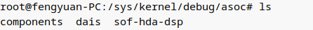

components和dais是文件，可以查看该声卡中所有的components和dais。`sof-hda-dsp`是一个文件夹

- sof-hda-dsp中有什么？

  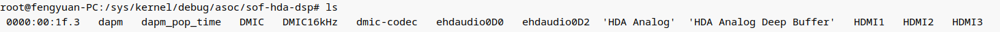

这个文件下及子目录下主要都是看dapm状态的，具体就不介绍了。

### 5.5.2 alsatplg

该工具主要是用来解析tplg文件的

```
alsatplg --decode=sof-hda-generic-2ch.tplg --output=-
```

### 5.5.3 i2C调试工具

由于codec控制总线一般都i2c，所以可以使用i2c-tools等一系列工具调试。

# 六、soundWire

待补充
